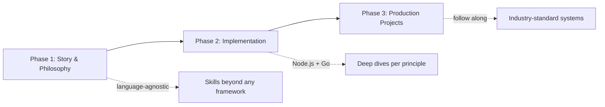

# Walk the Path of a True Backend Engineer
> Backend mastery is not memorizing frameworks — it is understanding the story, philosophy, and implementation layers that turn principles into production systems.

## The Three-Phase Learning Model

This playlist is deliberately split into three phases. Each phase answers a different question: *why* (story and philosophy), *how in code* (language-specific implementation), and *how at scale* (end-to-end projects).



**Phase 1 — Story and philosophy.** Narration over code. You learn how production backends are structured, how components collaborate across machines, and what frameworks abstract away. The goal is language-agnostic pattern recognition.

**Phase 2 — Implementation.** After foundations, you pick an ecosystem (planned: Node.js and Go). Each principle from Phase 1 gets a companion video in the implementation playlist — e.g., Postgres with `postgres.js` or `pgx`, migrations, drivers, and surrounding concepts.

**Phase 3 — Production-level projects.** Everything converges: philosophies, deep dives, and best practices applied to full projects you can build alongside the instructor.

> 💭 Think: If you only watched Phase 2 implementation videos, what critical context would you be missing when debugging a cross-service failure?

## What "True Backend Engineer" Means Here

By the end of this journey — if you internalize the material and build the projects — you should be able to:

- Build **real systems**, not tutorial CRUD demos
- Scale from **zero to millions of users**
- Ship code that teams can **maintain for years**

That bar is intentional. The playlist treats backend engineering as systems work: reliability, scalability, and long-term maintainability — not just API endpoints.

## Language Agnosticism as a Core Constraint

Skills taught here are **beyond any particular library or runtime**. HTTP, routing, persistence, auth, caching, observability — these repeat across stacks. Framework syntax changes; the underlying problems do not.

> ⚠️ Watch out: Treating "I know Express" as equivalent to "I know backend" leaves blind spots when you hit connection pooling, graceful shutdown, or distributed caching for the first time.

## How Videos Map Across Playlists

Most Phase 1 principle videos have a **paired implementation video** in the Node/Go playlist. Example: a databases-and-drivers episode in Phase 1 maps to a Postgres deep dive with the JavaScript or Go driver in Phase 2.

```ascii
Principle video (what & why)  ──►  Implementation video (how in Node/Go)
         │                                    │
         └──────────── both feed ─────────────┘
                         │
                  Production project
```

> 💭 Think: Which principle from the roadmap would you implement first in a new language you have never used — and why?

## Key Takeaways

- Learn **story before syntax** — frameworks hide the machinery; this playlist unhides it.
- Expect a **1:1 mapping** between conceptual videos and language-specific deep dives.
- The outcome is **employability across stacks**, not certification in one framework.
- Phase 3 projects are the proof — theory without building does not make you a backend engineer.

## Glossary

| Term | Meaning |
|------|---------|
| **First principles** | Foundational components (routing, HTTP, persistence) that every backend shares, independent of language |
| **Language-agnostic skills** | Abilities transferable across Node, Go, Rust, Python, etc. |
| **Production-grade** | Systems meeting industry standards for reliability, security, observability, and maintainability |
