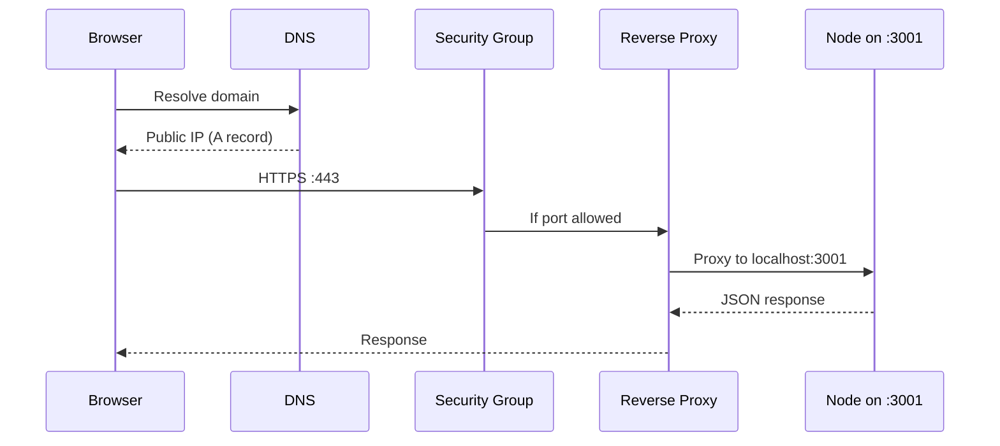

# What Is a Backend, How Does It Work, and Why Do We Need One?
> A backend exists to centralize data — fetching it, receiving it, and persisting it — on behalf of many untrusted clients that cannot safely or efficiently do that work themselves.

## The Traditional Definition

A backend is a computer **listening on an open port** (e.g., 80, 443) for HTTP, WebSocket, gRPC, or similar requests. Clients connect over the internet, send data, and receive data. We call it a **server** because it *serves* content — static files (HTML, JS, images) or dynamic payloads (JSON).

That definition is correct but incomplete. Production backends sit behind DNS, firewalls, reverse proxies, and process managers. Understanding the full hop chain is what separates "my API works on localhost" from "my API works in AWS."

## Request Journey: Browser to Your Code

Tracing a real deployment (e.g., `backend-demo` subdomain → AWS EC2):

1. **DNS** — A records map subdomain → instance IP; CNAME records point to another domain.
2. **Firewall (security group)** — Only allowed ports (SSH, 80, 443) reach the instance. Block 443 and HTTPS never arrives.
3. **Reverse proxy (Nginx)** — Sits in front of app servers; centralizes SSL (e.g., Certbot), redirects HTTP→HTTPS, routes by `server_name` to the correct local port.
4. **Process manager (PM2)** — Keeps Node processes alive; frontend on :3000, backend on :3001.
5. **Application** — Your actual handler logic.

On localhost you skip DNS and Nginx, but the **application behavior is identical** — same response from `localhost:3001/users` as from the public domain.

> 💭 Think: At which hop would you look first if the browser gets `connection refused` vs. a `502 Bad Gateway`?

## Why Backends Exist: The Instagram Like Example

When you like a post and your friend gets a notification:

1. App sends a request to the server
2. Server identifies *you* (user ID)
3. Server **persists** the like (usually in a database)
4. Server finds the post owner and **triggers a notification**

All of that requires a **centralized** system holding state for every user. Your app UI is personalized; the server holds the global truth.

Strip backend responsibility to one word: **data** — fetch, receive, persist, and act on it.

## Frontend vs Backend: Where Code Runs

| | Frontend | Backend |
|---|----------|---------|
| **Code delivery** | Server sends files; browser executes | Server executes; sends results |
| **Runtime** | Browser (sandboxed) | Server OS (full access) |
| **Processing location** | Client machine | Remote machine |

Frontend demo flow: browser fetches HTML → fetches JS/CSS/fonts → paints styles → hydrates event listeners. **All application logic runs on the client.**

Backend flow: client sends request → **server processes** → returns result. Processing happens remotely.

## Why You Cannot Put Backend Logic in the Frontend

### 1. Security (sandbox)

Browsers run code in **isolated sandboxes**. JavaScript can access DOM, browser APIs (localStorage, cookies), and external APIs only under strict rules. Remote code executing with full OS access would be catastrophic (filesystem theft, credential exfiltration).

**CORS** is the browser security policy restricting cross-origin API calls. A page on `frontend-demo.xyz` cannot freely call `api.other.com` unless the server sends appropriate `Access-Control-*` headers.

### 2. External API restrictions

Backends routinely call third-party services (payments, email, analytics). You cannot depend on every external API exposing CORS headers for browser calls.

### 3. Databases

Native drivers (e.g., `pg` for Postgres) use **socket connections, binary protocols, and connection pools**. Browsers cannot maintain persistent DB connections. Even if they could, *each user* would open their own connection — overwhelming the database.

> ⚠️ Watch out: Connection pooling exists because creating/destroying a DB connection per request does not scale to thousands of requests per second.

### 4. Computing power

Clients range from powerful desktops to 256MB-RAM phones. Heavy business logic on weak devices causes lag and crashes. A centralized server can be **scaled vertically** (more CPU/RAM) to handle load for all clients.

> 💭 Think: Which of the four constraints (security, external APIs, databases, compute) would break first if you moved "like + notify" logic entirely into a mobile app?

## Key Takeaways

- A backend is a **server that centralizes data operations** for many clients.
- Production requests traverse **DNS → firewall → reverse proxy → app process**.
- Frontends **execute** code locally; backends **process** remotely.
- Browser sandboxes, CORS, DB drivers, and compute limits make **client-side backends** a non-starter for real systems.

## Glossary

| Term | Meaning |
|------|---------|
| **Reverse proxy** | Server in front of app servers; handles routing, SSL, load distribution |
| **A record** | DNS record mapping hostname → IP address |
| **CORS** | Cross-Origin Resource Sharing — browser policy controlling cross-domain requests |
| **Connection pool** | Reused set of DB connections to avoid per-request connect/disconnect overhead |
| **Hydration** | Browser attaching JS event handlers after loading scripts |
