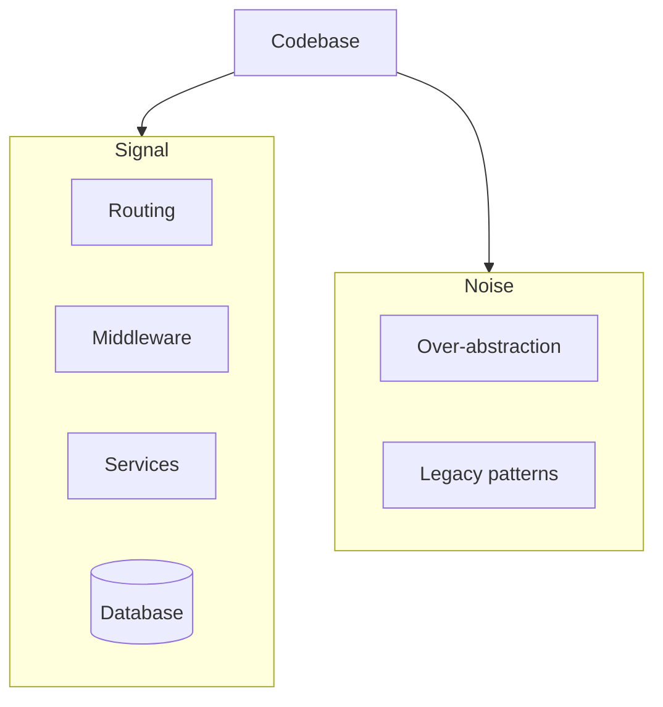

# Benefits of Learning Backend Engineering from First Principles
> Framework docs teach syntax; first principles teach you to recognize the same backend anatomy inside any unfamiliar codebase — in hours, not years.

## The Problem First Principles Solve

Common painful scenarios:

- **Frontend dev fixing a backend bug** — unfamiliar language, no mental map of where logic lives
- **Building an API from scratch** — unsure how to structure routes, validation, or error handling without breaking conventions
- **Switching stacks** — e.g., TypeScript/Go → Rust/Python, drowning in FastAPI/Pydantic, Axum, SQLAlchemy, Diesel docs

In each case, the bottleneck is not syntax. It is not knowing **which universal components** exist and how they connect.

## Benefit 1: See the Big Picture

When entering any codebase, you mentally partition:

- Core business logic
- Routing layer
- Database connections
- Over-engineered noise

Senior engineers do this subconsciously through pattern recognition. You can **practice deliberately from day one** and compress years of intuition into months.

> 💭 Think: Open any backend repo — can you label each top-level folder as routing, persistence, business logic, or infrastructure?

## Benefit 2: Faster Onboarding

Once you understand HTTP flow, middleware chains, auth, and DB interaction, **syntax becomes secondary**. You read Rust validation code the same way you read Node validation — different keywords, same gate.

You cut through framework noise and focus on **logic**, developing codebase familiarity faster than syntax-first learning.

## Benefit 3: 10× Speed on Greenfield Projects

First-principles knowledge lets you ship MVPs with **production-quality structure** without boilerplate tutorials:

- Route organization
- DB connection setup
- Caching, error handling, logging — from understanding, not copy-paste

## Benefit 4: Syntax Fatigue Reduction

Learning a new language without knowing *what problems to solve next* leads to burnout. With principles locked in, language switches become: "I need routing → find the community's router pattern → apply my known structure."

**Example — Node → Rust in days:**

1. Know the layers: routing, middleware, validation, services, repositories, auth, logging, error handling
2. Learn basic Rust syntax
3. **Target one component at a time** — implement production-quality validation module, then auth, then REST handlers
4. Repeat per module; full codebase in 2–3 days of focused work

> ⚠️ Watch out: Waiting for a 5-hour "production Rust backend" tutorial that does not exist will stall you longer than implementing one known pattern at a time.

## Benefit 5: Right Tool for the Job

Labels like "Node developer" trap you when requirements demand high concurrency or low latency. Understanding core problems — persistence, request handling, security, scaling — lets you reach for Redis, Postgres, MongoDB, or Kafka **based on the problem**, not your résumé.

## Benefit 6: Employability

Employers want engineers who **think critically**, join any team, and contribute quickly. Stack-agnostic backend fluency is versatility — especially as tech landscapes shift.

## What "Principles" Means Here

Not a rigid rulebook. **Foundational blocks** around which every codebase revolves — a generic map of backend territory:

- HTTP, routing, serialization
- Auth, validation, middleware, request context
- Controllers/services/repositories
- Databases, caching, task queues
- Error handling, config, observability, security, scaling

> 💭 Think: Which three principles would let you navigate a Python codebase if you only knew Go today?

## Key Takeaways

- First principles = **universal components**, not framework APIs.
- Deliberate pattern practice accelerates the "senior engineer glance" skill.
- New languages become **syntax mapping exercises** once structure is known.
- You graduate from framework developer to **problem-solving engineer**.

## Glossary

| Term | Meaning |
|------|---------|
| **First principles** | Foundational backend components invariant across languages and frameworks |
| **Syntax fatigue** | Burnout from learning language features without knowing how to apply them to real backend problems |
| **Mental map** | Internal model of how requests flow through layers in a typical backend |
