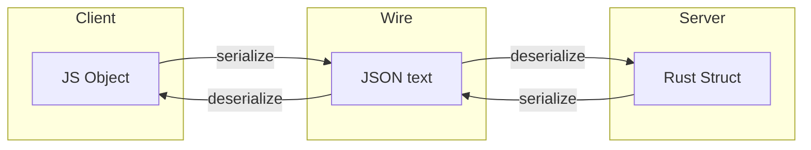

# Serialization and Deserialization
> Clients and servers speak different languages and runtimes — serialization is the agreed wire format that lets them exchange data without sharing a memory model.

## The Cross-Language Problem

A React client (JavaScript) POSTs `{ "name": "..." }` to a Rust server. JavaScript is dynamic; Rust is statically typed with structs. **How does the server interpret the bytes?**

Answer: both agree on a **common standard** on the wire. The client **serializes** native objects → standard format. The server **deserializes** standard format → native structs. Responses reverse the flow.



> **Sensei analogy (added):** Serialization is like agreeing everyone at an international conference speaks English for slides — your internal thoughts stay in your native language.

## OSI Model: What Backend Engineers Actually Own

Data traverses OSI layers: application → transport → network → physical. Lower layers convert JSON to frames, packets, bits. **As a backend engineer, your mental model stops at the application layer.**

You are responsible for: client sends JSON ↔ server reads JSON. What happens below (TCP, IP, voltage on fiber) is network engineering territory — useful context, not daily work.

> 💭 Think: If packet capture shows valid TCP but garbled JSON, which layer do you debug first?

## Serialization Standards Landscape

| Category | Formats | Typical use |
|----------|---------|-------------|
| **Text-based** | JSON, XML, YAML | HTTP APIs, config, logs |
| **Binary** | Protobuf, Avro, MessagePack | gRPC, high-performance internal services |

This series focuses on **HTTP + JSON** (~80% of client-server REST traffic). Postgres is the default DB for the same reason — popular, production-proven, transferable concepts.

> ⚠️ Watch out: Binary formats trade human readability for speed — choose them when performance or schema evolution matters, not by default.

## JSON Structure Rules

JSON (JavaScript Object Notation) is human-readable and language-independent despite the name.

```json
{
  "name": "Alice",
  "age": 30,
  "active": true,
  "tags": ["admin"],
  "address": {
    "country": "India",
    "phone": 9876543210
  }
}
```

**Rules:**
- Outer `{}` for objects; `[]` for arrays
- **Keys must be double-quoted strings**
- Values: string, number, boolean, array, nested object, or `null`
- No trailing commas (in strict parsers)
- No comments in standard JSON

## Request/Response Flow in Practice

**POST `/api/books`** — client sends JSON body with `id`, `title`, `author`. Server deserializes, persists, returns JSON array of books. Client deserializes and renders UI.

The entire round trip is **serialization ↔ deserialization** at both ends. No magic — just agreed format.

## Binding and Error Handling

In frameworks, deserializing request body into native types is often called **binding**. Failure (malformed JSON, type mismatch) → **400 Bad Request** and **terminate the request** — do not proceed to business logic.

Validation (separate topic) runs **after** successful deserialization into native structures.

## Performance and Security (Roadmap Extensions)

- **Compression** — reduce payload size on the wire
- **Schema validation** — JSON Schema before processing; prevents injection and type confusion
- **Custom serializers** — dates, enums, redacting sensitive fields
- **Protobuf vs JSON** — binary wins on size/speed; JSON wins on debuggability

> 💭 Think: Why is validating JSON *after* deserialization into a typed struct safer than only checking the raw string?

## Key Takeaways

- Serialization = convert to **language-agnostic wire format**; deserialization = convert back.
- JSON dominates REST APIs; know its syntax rules cold.
- Your responsibility is the **application layer** format, not TCP/IP internals.
- Failed deserialization should **fail fast** with 400, before validation or DB access.

## Glossary

| Term | Meaning |
|------|---------|
| **Serialization** | Converting in-memory data structures to a transmittable/storable format |
| **Deserialization** | Parsing wire format back into native types |
| **Binding** | Mapping HTTP request body to language-native objects (structs, classes) |
| **Protobuf** | Google's binary serialization format; common with gRPC |
| **Wire format** | The agreed representation of data on the network |
