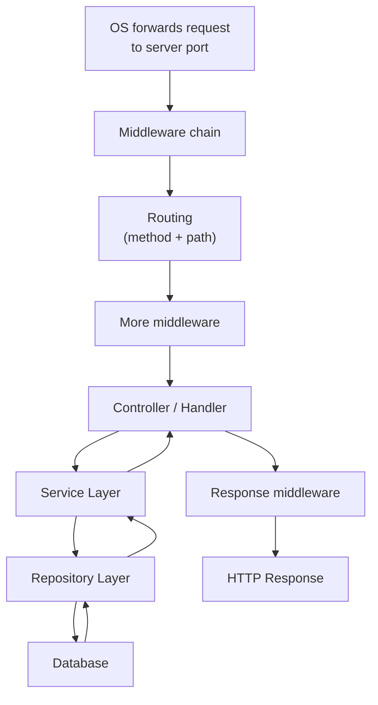
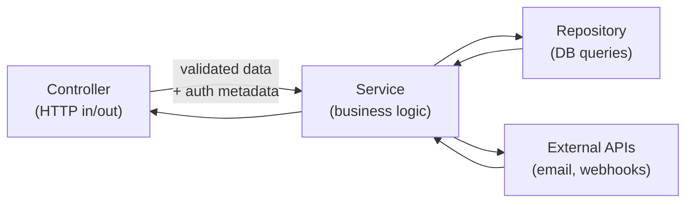
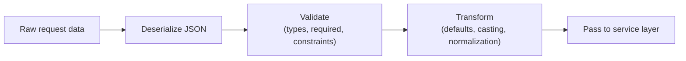
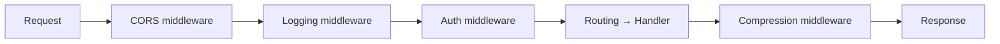
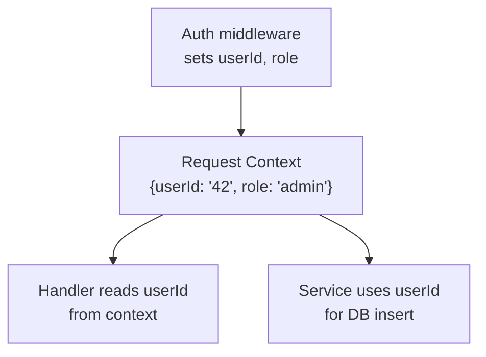

# Controllers, Services, Repositories, Middlewares & Request Context
> Separating request handling into layers keeps HTTP concerns at the edge, business logic in the middle, and database access at the bottom — making backends scalable, testable, and debuggable.

## The Request Lifecycle Inside the Server

When a request reaches your server, a sequence of steps executes before a response is sent. The OS forwards the HTTP request to your process on a listening port (entry point). Routing matches method + path to a handler. The handler extracts data, validates it, calls business logic, and formats the response.

This internal lifecycle is distinct from the external HTTP lifecycle (client sends request, server sends response) covered in earlier videos.

## Controller (Handler) Layer

The controller is the first code that runs after routing. It receives two objects from the runtime: a **request object** (incoming data) and a **response object** (outgoing data). Its responsibilities are strictly HTTP-facing:

1. **Extract data** from the request — body (POST/PUT/PATCH), query params (GET), path params (any method)
2. **Deserialize** JSON into native types (structs in Go, classes/dicts in Python; often handled upstream by middleware in Node.js via `express.json()`)
3. **Validate and transform** the extracted data
4. **Call the service layer** with clean, validated data
5. **Map results to HTTP** — choose status code (200, 201, 204, 400, 500) and serialize the response

> ⚠️ Watch out: If deserialization fails, return **400 Bad Request** immediately and terminate — do not proceed to business logic with malformed input.

The controller controls the full data flow between client and server. It is the HTTP boundary.

## Service Layer

The service layer contains the actual business logic. It should have **no knowledge of HTTP** — no request/response objects, no status codes, no headers. From reading a service method alone, you should not be able to tell it runs inside a web API.

Services orchestrate operations: call one or more repository methods, send emails, fire webhooks, merge data from multiple sources, enforce business rules. A service method takes data in, processes it, and returns data out.

> 💭 Think: Could you call this service method from a CLI script or a background job? If it references `req` or `res`, it belongs in the controller.

## Repository Layer

The repository layer has a single responsibility: **construct and execute database queries**. It takes data (filters, sort params, entity fields), builds the query, runs it, and returns the result. One repository method = one kind of data operation.

- `getAllBooks(sort)` → returns all books
- `getBookById(id)` → returns one book

Do not combine these into one method with an optional `id` parameter that sometimes returns a list and sometimes a single item. The service layer orchestrates multiple repository calls and merges their results.

## Validation and Transformation in the Controller

After deserialization, the controller runs a validation and transformation pipeline:

**Validation** confirms incoming data matches expected structure — required fields present, correct types, length constraints, no malicious payloads. Validate everything from external clients: path params, query params, request body, headers.

**Transformation** modifies validated data for downstream convenience. Example: a `sort` query parameter is optional; if the client omits it, the transformation pipeline sets a default (`sort=date`) so the service layer always receives a defined value.

> 💭 Think: Make all query parameters optional with sensible defaults. The service layer should never need `if sort is undefined, use date`.

## Middleware

Middleware functions execute **between** major lifecycle boundaries — before routing, between middleware and handler, or before the response is sent. They receive three arguments: `request`, `response`, and **`next`** (a function that passes control to the next middleware or handler).

Middleware exists to **eliminate code duplication** across hundreds of endpoints. Instead of writing authentication logic in every handler, you write it once as middleware.

**Middleware can short-circuit the pipeline** — if authentication fails, it sends a 401 response directly without ever reaching the handler. This saves server resources.

### Common Middleware Examples

| Middleware | Purpose | Short-circuit behavior |
|---|---|---|
| **CORS** | Check request origin, add `Access-Control-*` headers | Browser blocks if origin not allowed |
| **Security headers** | Set CSP, X-Frame-Options, etc. | No — always passes through |
| **Authentication** | Verify JWT/session token, extract user info | 401 if invalid |
| **Rate limiting** | Track requests per IP, enforce thresholds | 429 Too Many Requests if exceeded |
| **Logging** | Log path, method, query params, body | No — always passes through |
| **Global error handler** | Catch errors from any layer, format structured error response | Sends 400/500 with error message |
| **Compression** | Gzip large JSON responses | No — always passes through |
| **Body parser** | Deserialize JSON request bodies | 400 if malformed |

> ⚠️ Watch out: **Middleware order matters.** CORS and logging run first; global error handling runs last. An error handler placed in the middle cannot catch errors from handlers downstream.

Typical order: CORS → logging → authentication → routing → handler → compression → global error handler.

## Request Context

Request context is a **per-request key-value store** scoped to a single HTTP request. It is accessible across all middleware and handlers for that request without explicitly passing values through every function call.

### Why Context Exists

Without context, the authentication middleware would need to attach `userId` to the request object manually, and every downstream function would need it passed as an argument — tight coupling. Context decouples layers while sharing state.

### Critical Security Use Case

When inserting a book, the handler reads `userId` from the authenticated context — **never from the client payload**. A malicious client could send another user's ID in the request body. The context value comes from verified authentication, not user input.

### Other Context Uses

- **Request ID**: A middleware generates a UUID and stores it in context. All log entries and downstream microservice calls include `X-Request-ID` for distributed tracing.
- **Cancellation signals**: Context can carry deadlines and abort signals to downstream services, preventing hung requests.

> 💭 Think: If data was verified by upstream middleware (auth, permissions), store it in context. If data came from the client, validate it in the controller.

## Key Takeaways

- **Controller** handles HTTP — extract, deserialize, validate, transform, call service, return response with correct status code.
- **Service** handles business logic — orchestrates repositories and external calls, knows nothing about HTTP.
- **Repository** handles database queries — one method, one operation, no business logic.
- **Middleware** eliminates duplication for cross-cutting concerns (auth, logging, CORS, rate limiting, error handling).
- **Middleware order matters** — security/logging first, error handling last.
- **Request context** is per-request shared state for passing verified metadata (userId, role, requestId) without tight coupling.
- Never trust client-supplied identity fields — use context values set by authentication middleware.

## Glossary

| Term | Definition |
|---|---|
| **Controller / Handler** | The HTTP-facing function that receives request/response objects and orchestrates the response |
| **Service layer** | Business logic layer isolated from HTTP concerns |
| **Repository layer** | Database access layer responsible for query construction and execution |
| **Middleware** | A function that runs between lifecycle boundaries, receiving `req`, `res`, and `next` |
| **`next()`** | Function that passes execution to the next middleware or handler in the chain |
| **Request context** | Per-request scoped key-value store accessible across middleware and handlers |
| **Binding** | Deserializing request body JSON into native language types (structs, classes) |
| **Short-circuit** | When middleware sends a response and terminates the pipeline without calling `next()` |
| **Orchestration** | Service layer coordinating multiple repository calls and merging results |
| **Cross-cutting concern** | Logic needed across many endpoints (auth, logging, CORS) — ideal middleware candidates |

---
