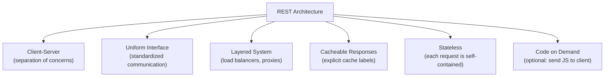
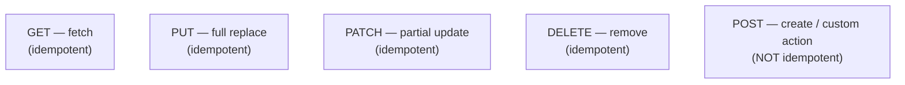
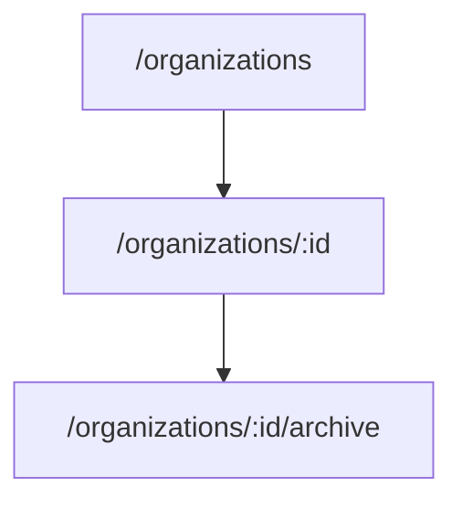

# Complete REST API Design
> REST gives you a shared vocabulary for designing APIs — follow its conventions and you eliminate guesswork for every engineer who integrates with your backend.

## Why REST API Design Matters

API design is one of the most important skills for a backend engineer. REST (Representational State Transfer) is the dominant standard, but engineers still debate plural vs. singular paths, PATCH vs. PUT, which status code to return, and how to handle non-CRUD actions. This confusion exists because REST was designed when the web was multi-page applications (MPAs) — today's SPAs and mobile clients have different needs, but the core constraints still apply.

The goal is not to invent new standards but to extract practical rules from existing ones so you can focus on business logic instead of debating whether your API is "RESTful enough."

## History and REST Constraints

Roy Fielding proposed REST constraints in his 2000 PhD dissertation to solve web scalability. Tim Berners-Lee invented URI, HTTP, HTML, and the first web server in ~1990; Fielding co-founded Apache HTTP Server and later co-authored HTTP/1.1.

REST's six architectural constraints:



| Constraint | What it means |
|---|---|
| **Client-Server** | Frontend handles UI/UX; backend handles data and logic. Each evolves independently. |
| **Uniform Interface** | Standardized way for components to communicate (resource identification, manipulation through representations, self-descriptive messages, HATEOAS). |
| **Layered System** | Architecture has hierarchical layers (load balancers, proxies) — each layer only sees the layer below. |
| **Cacheable** | Server labels responses as cacheable or not; clients cache to reduce load. |
| **Stateless** | Each request contains all information needed to process it. Server stores no client session between requests. |
| **Code on Demand** | (Optional) Server can send executable code (JavaScript) to extend client functionality. |

## What "REST" Means

**Representational** — Resources (data/objects) are represented in specific formats: JSON (most common), XML, or HTML. The same user resource can have different representations depending on the client (JSON for API clients, HTML for browsers).

**State** — The current condition/attributes of a resource (e.g., a shopping cart's items, quantities, total price).

**Transfer** — Movement of resource representations between client and server over HTTP using methods (GET, POST, PUT, PATCH, DELETE).

## URL Anatomy for APIs

```
https://api.example.com/v1/books?page=2&limit=20
└─┬─┘   └──────┬──────┘└┬┘└─┬─┘ └────────┬────────┘
scheme    subdomain   version resource  query params
          (api.)               (path)
```

Industry conventions:
- **Scheme**: `https` in production
- **Subdomain**: `api.example.com`
- **Versioning**: `/v1/`, `/v2/` in the path
- **Resource**: plural nouns (`/books`, not `/book`)
- **Path segments**: lowercase, no spaces or underscores — use hyphens for multi-word slugs (`harry-potter`)
- **Forward slash**: implies hierarchical parent-child relationship

> ⚠️ Watch out: Even when fetching a single book, the resource segment stays plural: `GET /books/123`, not `GET /book/123`.

## Idempotency and HTTP Methods

Idempotency means performing the same operation multiple times produces the same side effect as performing it once. From the client's perspective: what state change does this call cause, and does repeating it cause a different change?

| Method | Purpose | Idempotent? | Notes |
|---|---|---|---|
| **GET** | Retrieve data | Yes | No side effects — safe to repeat |
| **PUT** | Replace entire resource | Yes | Same payload → same final state |
| **PATCH** | Update partial resource | Yes | Same payload → same final state |
| **DELETE** | Remove resource | Yes | First call deletes; subsequent calls return 404 but cause no further change |
| **POST** | Create resource / custom action | **No** | Each call can create a new resource with a new ID |



**PATCH vs. PUT**: PATCH updates specific fields (send only `{ "name": "new" }`). PUT replaces the entire resource (send all fields). In SPAs with JSON-heavy payloads, PATCH is the practical default for updates.

**POST for custom actions**: When an operation doesn't fit CRUD (send email, archive organization, clone project), use POST. The REST spec made POST open-ended for exactly this reason.

> 💭 Think: "Archive organization" looks like a PATCH (update status field), but archiving triggers cascading side effects (delete projects, notify users) — that's a custom action, not a simple update.

## Designing APIs: The Workflow

1. **Start from UI designs** (Figma wireframes) — understand how end users interact with data
2. **Identify resources** (nouns from requirements): projects, users, organizations, tasks, tags
3. **Design database schema** (tables, relationships)
4. **Design the API interface** (routes, methods, payloads, responses) — **before writing any code**

Use tools like Insomnia or Postman to design and test the interface. Design first, code second.

## CRUD Endpoint Patterns

For each resource, define five standard actions:

```
POST   /organizations          → create (201 + created entity)
GET    /organizations          → list all (200 + paginated response)
GET    /organizations/:id      → get one (200 + entity, or 404)
PATCH  /organizations/:id      → partial update (200 + updated entity)
DELETE /organizations/:id      → delete (204 no content)
```

Create and list share the same path — differentiated by HTTP method. Get, update, and delete for a single resource share the same path with a dynamic `:id` — differentiated by method.

### Create (POST) — 201 Created

Exclude server-managed fields (`id`, `createdAt`, `updatedAt`) from the request payload. Return `201` with the newly created entity in the response body.

### List (GET) — Pagination, Sorting, Filtering

A paginated list response:

```json
{
  "data": [ /* portion of resources */ ],
  "total": 50,
  "page": 1,
  "totalPages": 5
}
```

**Pagination** — return a portion of data, not everything. Prevents heavy JSON serialization, reduces network load, and improves perceived client performance.

| Query Param | Purpose | Server Default |
|---|---|---|
| `page` | Which page of data | `1` |
| `limit` | Items per page | `10` or `20` |
| `sortBy` | Field to sort by | `createdAt` |
| `sortOrder` | `asc` or `desc` | `desc` |
| `status` (etc.) | Filter by field value | none (return all) |

> 💭 Think: Set sensible defaults for every optional parameter. Clients should get a useful response without sending any query params.

**Filtering** — `GET /organizations?status=archived` returns only matching entries. Empty filter results return `200` with `data: []`, not `404`.

### Get Single — 200 or 404

`GET /organizations/:id` returns the entity with `200`, or `404` if the ID doesn't exist. **404 is only for single-resource requests** — never for list endpoints, even when the list is empty.

### Update (PATCH) — 200 OK

Send only the fields to change in the body. Server returns `200` with the full updated entity. Use PATCH (not PUT) for partial updates in modern SPAs.

### Delete — 204 No Content

Successful delete returns `204` with an empty body. The resource no longer exists, so there's nothing to return.

## Custom Action Endpoints

For operations that don't fit CRUD, use POST with an action suffix:

```
POST /organizations/:id/archive    → archive organization
POST /projects/:id/clone           → clone project
```

Structure: `/{resource-plural}/{id}/{action-name}`



Custom actions may return `200` (no new resource created) or `201` (new resource created, like clone). **Do not assume POST always returns 201.**

## Response Status Codes

| Code | When to use |
|---|---|
| **200** | Successful GET, PATCH, or custom action with no new resource |
| **201** | Successful POST that created a new resource |
| **204** | Successful DELETE — no content to return |
| **400** | Client sent invalid data (validation failure) |
| **401** | Authentication failed |
| **404** | Client requested a specific resource that doesn't exist |
| **429** | Rate limit exceeded |
| **500** | Unexpected server error |

## Consistency and Best Practices

**JSON field naming**: Always use `camelCase` for JSON payloads and responses.

**Consistent payloads**: If create-organization uses `description`, create-project must also use `description` — not `desc` or `dsc`. Clients assume patterns from your first API.

**Consistent routes**: If organizations use `/organizations` (plural), projects must use `/projects` — not `/project`.

**Sane defaults**: Optional fields get server-side defaults. New organizations default to `status: "active"`. Clients can create an org with just `{ "name": "Acme" }`.

**No abbreviations**: Use `description`, not `desc`. Integrators don't have your internal context.

**Interactive documentation**: Use Swagger/OpenAPI from day one — serves as both documentation and a testing playground.

> ⚠️ Watch out: An API is **designed** before it is **coded**. Dedicate a separate session to interface design using Insomnia/Postman before touching your programming language.

## Key Takeaways

- REST constraints (client-server, stateless, uniform interface, cacheable, layered) exist to make the web scalable.
- **Plural resource names** in paths; forward slashes express hierarchy.
- **Idempotency** determines method choice: GET/PUT/PATCH/DELETE are idempotent; POST is not.
- **PATCH** for partial updates; **POST** for creates and custom actions.
- Standard CRUD pattern: same path for create/list, same path with `:id` for get/update/delete — differentiated by HTTP method.
- List APIs support **pagination**, **sorting**, and **filtering** with sensible defaults.
- **404** only for single-resource requests; empty lists return `200` with `[]`.
- **Consistency** across routes, payloads, and responses is the hallmark of a good API designer.
- Design the interface before writing code.

## Glossary

| Term | Definition |
|---|---|
| **REST** | Representational State Transfer — an architectural style for designing networked APIs |
| **Resource** | A noun representing a domain entity (user, book, organization) exposed via API |
| **Idempotency** | Property where repeating the same request produces the same side effect |
| **CRUD** | Create, Read, Update, Delete — the four basic data operations |
| **Custom action** | A non-CRUD server operation (archive, clone, send-email) implemented as POST |
| **Pagination** | Returning a subset of data with metadata (total, page, totalPages) |
| **Path parameter** | Dynamic URL segment identifying a specific resource (`:id`) |
| **Query parameter** | Key-value pair after `?` for filtering, sorting, pagination |
| **Status code** | Three-digit HTTP code indicating outcome (200, 201, 204, 400, 404, 500) |
| **Sane defaults** | Server-provided fallback values when the client omits optional parameters |
| **Slug** | Human-readable URL-safe identifier (lowercase, hyphens for spaces) |
| **HATEOAS** | Hypermedia As The Engine Of Application State — REST sub-constraint for self-describing APIs |
| **OpenAPI / Swagger** | Standard for interactive API documentation and testing playgrounds |

---
