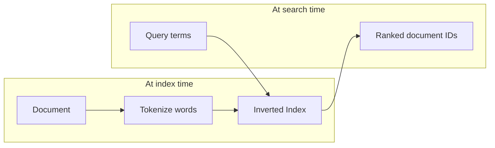
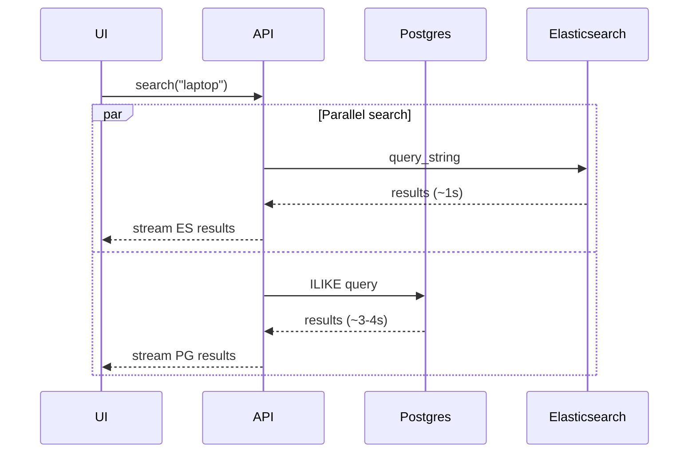

# Full-Text Search & Elasticsearch

> Relational `ILIKE` scans are fine at thousands of rows and catastrophic at millions — full-text search engines exist because speed, relevance, and typo tolerance are product requirements, not database optimizations.

---

## The Problem: Why `LIKE` Breaks at Scale

In 2005, searching 5,000 products with `SELECT * FROM products WHERE name ILIKE '%laptop%' OR description ILIKE '%laptop%'` returned results in ~50ms. At millions of products, the same query took 30 seconds.

Customers and product teams then demanded more:
- **Relevance** — show MacBook Pro before laptop bags
- **Typo tolerance** — `laptp` should still find `laptop`
- **Speed** — search must feel instant (milliseconds, not seconds)

The relational database cannot deliver all three with pattern matching alone.

```sql
SELECT * FROM products
WHERE name ILIKE '%laptop%'
   OR description ILIKE '%laptop%';
```

The `%` wildcards match any characters before/after the term. The database must scan every row, examine every text field, and perform character-by-character pattern matching. Thorough, but painfully slow — and it returns results in arbitrary order with no sense of importance.

> ⚠️ **Watch out:** Even 2 seconds of search latency is considered unacceptable today. At e-commerce scale, latency directly hits conversion.

> 💭 **Think:** At what row count does your current `ILIKE` approach become a user-visible problem?

---

## The Librarian Analogy: Forward vs. Inverted Search

Your Postgres database is like a librarian who knows exactly where every book is — but when you ask for "machine learning," they walk shelf by shelf, checking every title and page.

**Forward search (database `LIKE`):**
1. Find Harry Potter → no match
2. Find Game of Thrones → no match
3. Find Introduction to Machine Learning → match
4. Continue through the entire library...

Two fatal flaws:
1. **Time** — scales linearly with library size (minutes to hours at 10M–1B books)
2. **No relevance** — a book titled *Introduction to Machine Learning* and a book that mentions "machine learning" once on the last page are treated equally


> 💭 **Think:** Why does a full table scan get worse as your table grows, even with a B-tree index on `id`?

---

## The Inverted Index: Flip the Problem

Decades of information retrieval research (since the 1960s) produced a key insight: **don't search documents for terms — search terms for documents.**

Instead of scanning every book at query time, build an index **while storing** each book:

| Term | Documents (with positions) |
|------|------------------------------|
| machine | *Introduction to Machine Learning* (p. 1, 15, 23); *The Machine Age* (p. 5, 89); *Coffee Machine Manual* (p. 1) |
| learning | *Introduction to Machine Learning* (p. 1, 16, 24); *Learning to Cook* (p. 3, 7); *Deep Learning Fundamentals* (p. 2, 8, 12) |

Query "machine learning" → look up both terms → intersect document lists → rank by relevance.



This is the **inverted index** — the foundation of Apache Lucene and every serious full-text search tool.

> 💭 **Think:** What work moves from query time to index time when you adopt an inverted index?

---

## Relevance Scoring & BM25

An inverted index makes search fast. **Relevance scoring** makes it useful.

Elasticsearch ranks results using the **BM25 algorithm** (among others). You don't need to implement it — but you should know what it weighs:

| Factor | What it measures |
|--------|------------------|
| **Term frequency (TF)** | How often a term appears in a single document |
| **Document frequency (DF)** | How common a term is across all documents (rare terms score higher) |
| **Document length** | Shorter documents where the term appears are often more relevant |
| **Field boosting** | Term in `title` > `description` > `content` (configurable) |

Example ranking for query "machine":
1. *Introduction to Machine Learning* — term in title + high frequency throughout
2. *The Machine Age* — term in title, lower frequency
3. *Coffee Machine Manual* — term in title, very low frequency

**Field boosting** is heavily used in practice. Via Elasticsearch's JSON DSL, you can override defaults — e.g., boost matches in `content` over `title` if your use case demands it.

> ⚠️ **Watch out:** Treat Elasticsearch as a tool first. Master databases deeply; for most search use cases, docs + snippets are enough. Deep Lucene theory only matters if you're building search infrastructure.

---

## Elasticsearch, Lucene & Alternatives

**Apache Lucene** — the core inverted-index engine.

**Elasticsearch** — distributed search built on Lucene. Documents are JSON (like MongoDB entities). Not the only option:
- **Postgres full-text search** — built-in, good for moderate search needs
- **Solr, Meilisearch, Typesense** — other Lucene-based or purpose-built tools

**Elasticsearch is also used for log management** via the **ELK stack**:
- **E**lasticsearch — store and search logs
- **L**ogstash — ingest and transform logs
- **K**ibana — visualize

If your company already runs ELK for observability, reusing Elasticsearch for product search avoids adding another system.

---

## Features Beyond Basic Matching

### Typo tolerance
Tools like Elasticsearch can infer intended queries from context. Searching `what is treading today` can still surface results for `trending` — similar to Google's typeahead behavior.

### Typeahead / autocomplete
As the user types, partial queries return ranked suggestions. Amazon and Google both use this pattern.

### Field types in Elasticsearch mappings
- **`text`** — analyzed, tokenized, full-text searchable
- **`keyword`** — exact match only (e.g., sentiment: `positive` / `negative`)

---

## Postgres vs. Elasticsearch: A Real Benchmark

A demo compared both on **50,000 review records** (review text + sentiment), with Neon Postgres and Elastic Cloud both in **US-West** (fair latency).

**Setup:**
- Postgres: `reviews` table (`id`, `review` TEXT, `sentiment`)
- Elasticsearch: `reviews` index with `review` (text) and `sentiment` (keyword)
- API streams results from both in parallel so neither blocks the other

**Postgres query:**
```sql
SELECT id, review, sentiment FROM reviews
WHERE review ILIKE '%search_term%';
```

**Elasticsearch query:** `query_string` on the search term (lowercased, wildcard-friendly).

**Results (approximate):**

| Query | Elasticsearch | Postgres `ILIKE` |
|-------|---------------|------------------|
| `laptop` | ~1s | ~3–4s |
| `only` (8,000 hits) | ~500ms | ~7.5s |

Same result counts, dramatically different latency. At scale, the gap widens further.



> ⚠️ **Watch out:** This demo used `ILIKE` — Postgres full-text search (`tsvector`/`tsquery`) is faster than `ILIKE` but still differs from Elasticsearch for relevance, typo tolerance, and scale.

---

## When to Choose What

| Situation | Recommendation |
|-----------|----------------|
| Simple search, moderate data, already on Postgres | Postgres full-text search |
| Company already runs ELK stack | Elasticsearch for product search too |
| Typeahead, typo tolerance, relevance ranking at scale | Elasticsearch (or similar) |
| Building from scratch, small team | Start Postgres FTS; migrate when latency/relevance demands it |

**Skill priority as a backend engineer:**
1. **Databases** — master deeply (99% of your codebase touches data)
2. **Elasticsearch** — know when to reach for it; copy-paste from docs/LLMs for most use cases

---

## Key Takeaways

- `ILIKE '%term%'` is a full table scan with no relevance — it does not scale to millions of rows.
- The inverted index pre-computes term → document mappings at ingest time, making query-time lookup near-instant.
- Relevance scoring (BM25) ranks by term frequency, document frequency, document length, and field boosting.
- Elasticsearch runs on Lucene; Postgres has built-in FTS; choose based on scale, features, and existing infrastructure.
- Typo tolerance and typeahead are product features that justify dedicated search infrastructure.
- If ELK is already in your stack, Elasticsearch for app search is a natural extension.
- Database expertise is non-negotiable; search engine expertise is situational.

---

## Glossary

| Term | Definition |
|------|------------|
| **Inverted index** | Data structure mapping terms → list of documents (and positions) containing them |
| **Apache Lucene** | Low-level Java library implementing inverted-index search |
| **Elasticsearch** | Distributed search and analytics engine built on Lucene |
| **BM25** | Probabilistic relevance ranking algorithm used by Elasticsearch |
| **Field boosting** | Weighting matches in certain fields (title vs. description) higher than others |
| **ELK stack** | Elasticsearch + Logstash + Kibana for log management |
| **`text` vs `keyword`** | Elasticsearch field types: analyzed/tokenized vs. exact-match |
| **Typeahead** | Real-time search suggestions as the user types |
| **Connection draining** | (See graceful shutdown notes) — unrelated here; see file 19 |

---
