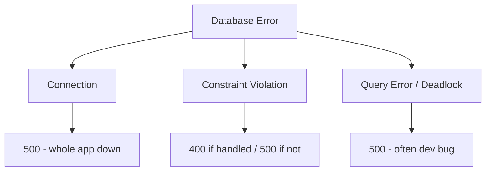
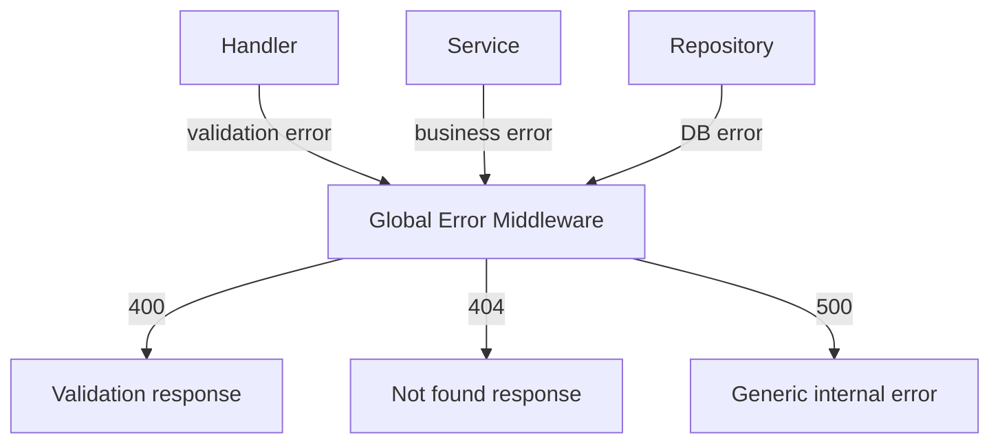

# Error Handling & Fault-Tolerant Systems

> Errors are not exceptions to plan for — they are the normal operating condition of distributed backends; the question is never *if* they happen but *how* you detect, contain, and recover.

---

## The Fault-Tolerant Mindset

This is a **mindset video**, not a tools tutorial. As a backend engineer responsible for business logic and every user transaction, you need a fault-tolerant mindset: know how bad things can get, what to watch for, and how production systems (startups to enterprises) prevent and detect failures.

**Reality check — these will happen:**
- Database queries fail
- External APIs time out
- Users send malformed data
- Business logic hits unexpected edge cases

> 💭 **Think:** Which of the five error categories below has caused you the most production pain?

---

## Type 1: Logic Errors (The Sneaky Ones)

Logic errors don't crash your app — they make it do the **wrong thing**.

**Example:** An e-commerce store accidentally applies a discount twice, producing negative shipping costs. The app runs fine. The platform loses money on every order. This can go unnoticed for weeks if monitoring and user reports don't catch it.

**Common causes:**
- Misunderstood requirements (confusing PM discussion → wrong implementation → production)
- Incorrect algorithm implementation (complex discount workflows with a slight miscalculation)
- Unhandled edge cases in payment or discount flows

**Why they're dangerous:** In payments, money, and security contexts, logic errors corrupt data and produce wrong business results over time — silently.

> ⚠️ **Watch out:** Logic errors are the most dangerous type because there's no stack trace screaming at you. Business metric monitoring (successful transactions dropping) is often the first signal.

---

## Type 2: Database Errors

Most backend apps depend heavily on the database. Database failures can bring the entire system down.

### Connection errors
App cannot talk to the database → 500 errors → empty screens everywhere.

**Causes:**
- Network down
- Database server overloaded
- **Connection pool exhausted** — pools hold open TCP connections to avoid repeated handshake costs; when all connections are in use, new requests fail

### Constraint violations
Operations that break database rules:
- **Unique constraint** — creating a user with an email that already exists
- **Foreign key violation** — inserting an order with a `customer_id` that doesn't exist in `customers`

**Root cause:** Usually weak validation. But unique constraints can only be fully enforced by the database — handle the error gracefully and return a user-friendly message (400), not a 500.

### Query errors
- Malformed SQL (typo in table name)
- Queries too complex → timeout
- **Deadlocks** — multiple operations waiting on each other in a circular dependency



> 💭 **Think:** For a unique constraint violation on email, what HTTP status and message should the user see?

---

## Type 3: External Service Errors

Modern SaaS apps depend on payment processors, email providers (Resend), object storage (S3), auth providers (Clerk, Auth0), AI APIs (OpenAI), etc. Each is a **point of failure you don't control**.

**Failure modes:**

| Mode | Example | Mitigation |
|------|---------|------------|
| **Network issues** | Timeouts, DNS failures, partitions | Retries with backoff |
| **Authentication errors** | Bad credentials, expired tokens, insufficient permissions | Token refresh, credential rotation |
| **Rate limiting (429)** | Hitting API too many times (bug or traffic spike) | Exponential backoff |
| **Service outage** | AWS/GCP incident, provider maintenance | Fallbacks, graceful degradation |

### Exponential backoff for rate limits
```
On 429:
  wait 1 min → retry
  still 429? wait 2 min → retry
  still 429? wait 4 min → retry
  continue until success
```

### Service outages
You cannot avoid external dependencies — rebuilding Stripe or Auth0 is impractical. Plan for outages:
- Redis down → in-memory cache or secondary Redis node
- Payment processor down → queue orders, notify users, retry later

> ⚠️ **Watch out:** Using Clerk/Auth0 doesn't make you secure by default. Your backend can still leak sensitive user info in logs or error messages.

---

## Type 4: Input Validation Errors

Users send bad data. Validation is your **first line of defense** at the backend entry point.

**Validation types:**
- **Format** — email looks like email, phone like phone, date is valid
- **Range** — numeric min/max, string length, array size (≥3 items, ≤100 items)
- **Required fields** — mandatory fields present for the operation

Return **400 Bad Request** with clear field-level errors. These are the easiest errors to expect and handle — enforce rules at the entry point.

> 💭 **Think:** Should validation live only in the frontend, only in the backend, or both? Why?

---

## Type 5: Configuration Errors

Missing or wrong config can prevent startup or cause runtime surprises — especially when moving between dev, staging, and production.

**Scenario:** You add `OPENAI_API_KEY` to `.env` locally, merge the PR, forget to add it to production Parameter Store.

| Startup validation? | What happens |
|---------------------|--------------|
| **Yes** — validate all required env vars before server starts | New deployment fails; old deployment keeps running (blue-green). **Best case.** |
| **No** | Deployment succeeds. First user hits the AI endpoint → 500 at runtime. **Worst case.** |

**Always prefer crashing at startup over failing at runtime.**

> ⚠️ **Watch out:** Runtime config failures are the worst — users see 500s, you see a "successful" deployment, and debugging requires correlating missing env vars with specific API routes.

---

## Prevention: Detect Errors Before They Spread

> The best error handling starts **before** errors happen.

### Health checks
Expose `/health` or `/status` endpoints. A **200** means running; **4xx/5xx** means something is wrong.

**Basic health check is not enough.** Also verify the system is actually doing its job:

| Check | What to verify |
|-------|----------------|
| **Database health** | Connectivity + run a representative query; compare latency to baseline (500ms → 4s = problem) |
| **External services** | Test transactions (payment), test emails (send to internal address), test auth tokens |
| **Core functionality** | Required config loaded, caches populated, internal data structures consistent |

This is **proactive error detection** — prepared for worst cases before they cause damage.

---

## Monitoring & Observability (High Level)

Covered deeply in the logging/observability video. Key points for error handling:

- Don't just track **error rates** — monitor **performance metrics** that predict failures (response time degradation often precedes outages)
- Track errors across: HTTP, database, external services, business logic
- Monitor: response times, resource usage, throughput
- **Business metrics:** sudden drop in successful transactions can indicate technical problems even when error rates look normal
- **Structured logging (JSON)** enables tools like Grafana/Loki to parse, search, and visualize

---

## Immediate Error Response Philosophy

Your immediate reaction determines whether an error becomes a minor issue or a major failure.

### Recoverable errors → retry
Examples: email send failed, temporary network error, connection pool temporarily exhausted.

**Strategies:** Retry mechanisms, exponential backoff.

> ⚠️ **Watch out:** Retries on an already-stressed system can make things worse. Backoff logic must not add more load to a failing service.

### Non-recoverable errors → containment & graceful degradation
Examples: Redis permanently down, critical service unavailable.

**Strategies:**
- Switch to cached data
- Disable non-essential features
- Provide alternative functionality
- Contain the blast radius

---

## Error Recovery Strategies

### Automatic recovery
- Restart unresponsive services (process managers, Kubernetes)
- Clean corrupted caches
- Switch to backup systems

Design carefully — automatic recovery can sometimes make problems worse. Test recovery strategies before you need them.

### Manual recovery
Some errors require human judgment. **Document runbooks** so the whole team (including new hires) knows what to do during incidents. Test runbooks under pressure.

### Data recovery
**Data is the most tangible asset.** Code and services are replaceable; user data is not.

- Backups at key moments
- Restore from backups
- Replay transaction logs
- Specialized recovery tools

**Data integrity is priority #1.**

---

## Propagation Control & Error Boundaries

Not all errors should be handled where they occur. Sometimes they must propagate up for more context.

### Exception handling hierarchy
Catch low-level exceptions → wrap with business context → bubble up. Enables meaningful logs, user-facing messages, and recovery triggers at the right level.

### Error boundaries in service architecture
Prevent errors in one service from killing others:
- Separate processes per service
- Timeouts on inter-service calls
- Message queues (RabbitMQ) for async decoupling — a bug in Service A doesn't crash Service B

---

## Global Error Handling: The Final Safety Net

The single most important error-handling pattern in backend apps. One-time setup effort that pays off immediately and forever.

### Architecture flow
```
Route → Handler (validation) → Service (orchestration) → Repository (DB queries)
                                                              ↓
                                                    errors bubble up
                                                              ↓
                                              Global Error Handler Middleware
```

### How it works
Regardless of where an error originates, bubble it up to a **central middleware** that:
1. Reads the error type
2. Maps it to the correct HTTP response
3. Returns a consistent error structure

**Languages:**
- JS/Python: `throw` in lower layers → `catch` in middleware
- Go: `return err` up the call chain → handle in middleware

### Example: Book management API

**Create book endpoint** — payload: `name` (required, max 500 chars), `description` (optional)

| Layer | Error | Global handler response |
|-------|-------|------------------------|
| Handler | Name exceeds 500 chars | **400** + validation field errors |
| Repository | Unique constraint — book name exists | **400** + `"Book already exists"` |
| Repository | Foreign key — author_id doesn't exist | **404** + `"Author ID does not exist"` |

**Get book by ID** — `GET /books/123`

| Layer | Error | Global handler response |
|-------|-------|------------------------|
| Repository | No rows returned | **404** + `"Book with ID 123 does not exist"` |

### Standard HTTP error structure
```json
{
  "code": 400,
  "message": "Book already exists",
  "errors": [
    { "field": "name", "message": "..." }
  ]
}
```

### Two major advantages

1. **Robustness** — no layer can "forget" to handle an error type; unhandled errors become generic 500s instead of leaking internals
2. **Reduces redundancy** — without centralization, every repository method needs duplicate constraint-violation handling



> 💭 **Think:** What happens in your app today when a repository throws an unhandled database error?

---

## Security in Error Handling

### Don't leak internal details
Never send raw database error messages to users. Messages containing table names, index names, or constraint names help attackers craft SQL injection and targeted attacks.

**Default 500 handler:** Always return a generic message — `"Something went wrong"` or `"Internal server error"` — when you've exhausted all known error type checks.

### Authentication error messages
On login, never reveal whether the email exists:

| ❌ Bad | ✅ Good |
|--------|---------|
| "User with this email does not exist" | "Invalid email or password" |
| "Password is incorrect" | "Invalid email or password" |

**Attack pattern without this:** Attacker tries many emails with one password → finds valid email from "user does not exist" vs "password incorrect" → brute-forces passwords on confirmed email.

Follow **OWASP Cheat Sheet** recommendations for auth workflows.

### Sensitive data in logs
Never log: emails, passwords, API keys, credit card numbers.

In auth errors, log **user ID** and **correlation ID** — enough context to debug without exposing PII.

> ⚠️ **Watch out:** Logs often leave your infrastructure (Datadog, Splunk, ELK). Major breaches frequently involve leaked logs containing credentials users typed into forms.

---

## Key Takeaways

- Errors are normal; fault tolerance is a mindset, not a library.
- Logic errors are the most dangerous — they don't crash, they silently lose money or corrupt data.
- Database errors range from connection failures (whole app down) to constraint violations (handle as 400, not 500).
- External services will fail — plan retries, backoff, fallbacks, and graceful degradation.
- Validation errors are the easiest — enforce at the entry point, return 400.
- Configuration errors: validate required config at startup; crash before serving users.
- Proactive detection (health checks beyond ping, monitoring performance + business metrics) catches problems early.
- Global error handling middleware is the highest-ROI error pattern — centralize, map error types to HTTP codes, never leak internals.
- Security: generic auth errors, generic 500 messages, no sensitive data in logs.

---

## Glossary

| Term | Definition |
|------|------------|
| **Fault tolerance** | System design that anticipates failures and continues operating (degraded if necessary) |
| **Connection pool** | Reusable set of open DB TCP connections to avoid per-request handshake cost |
| **Deadlock** | Circular wait between DB transactions, each holding a lock the other needs |
| **Exponential backoff** | Retry strategy doubling wait time after each failure (1m → 2m → 4m) |
| **Graceful degradation** | Reducing functionality rather than failing completely when dependencies are down |
| **Error boundary** | Architectural isolation preventing one service's failure from cascading |
| **Global error handler** | Central middleware catching all errors and mapping to consistent HTTP responses |
| **Propagation** | Intentionally bubbling errors up the call stack with added context |
| **Correlation ID** | Unique ID per request for tracing errors across logs and services |

---
