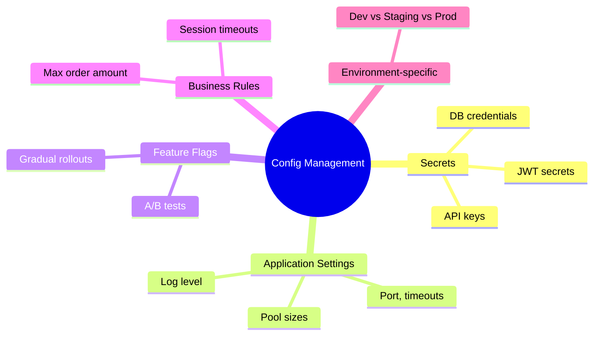
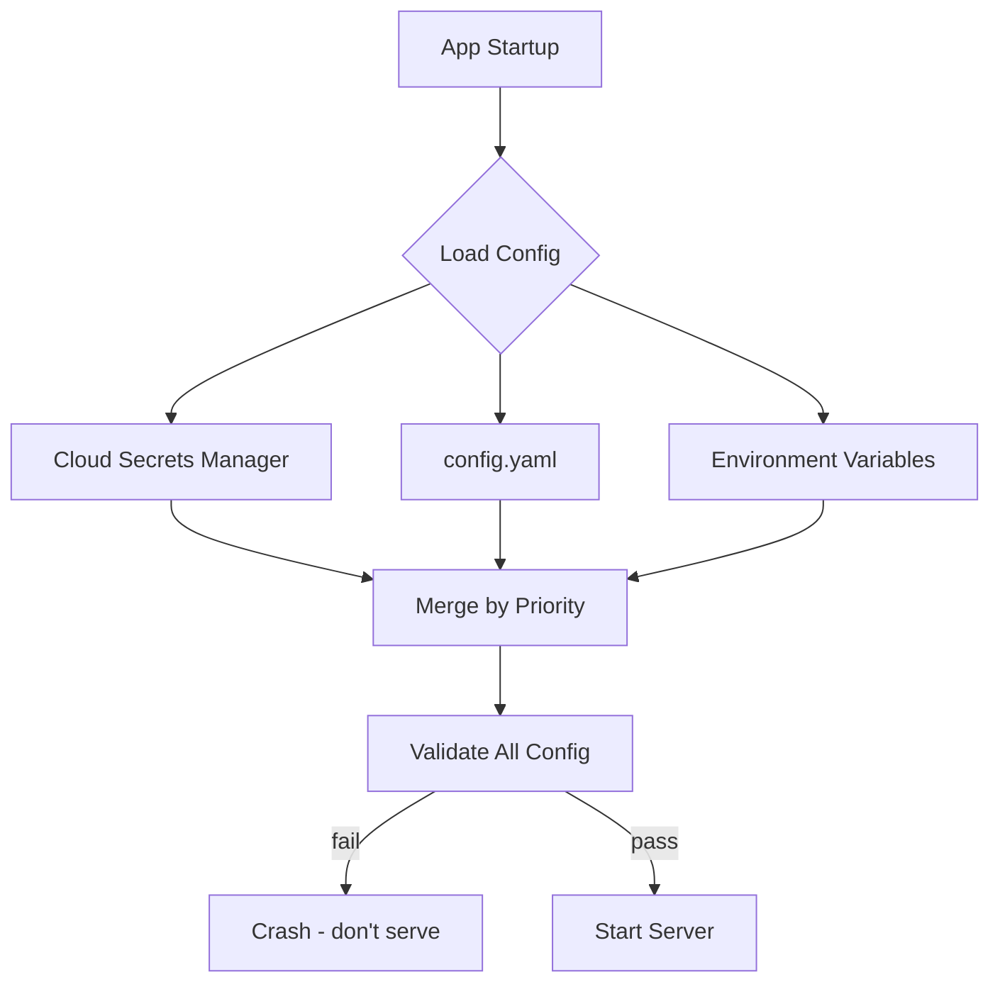

# Production-Grade Configuration Management

> Configuration is the DNA of your application — it decides how your code runs in every environment, and a misconfigured backend can expose data, misprocess payments, or take down your entire platform.

---

## What Configuration Management Really Is

The systematic approach to **organize, store, access, and maintain all settings** of your backend app.

Most engineers think config = secrets (DB passwords, JWT secrets, API keys). That's the engine of the car — important, but only ~10% of the picture.

**Full scope of configuration:**
- How the application starts up
- How it connects to external services
- Behavior per environment (dev, staging, production)
- What gets logged, where, and at what level
- Where metrics and business data are sent
- Feature flags — which features are enabled for which users/deployments



> 💭 **Think:** What config in your current project is hardcoded that should be externalized?

---

## Configuration Characteristics

Not all config is equal. Each type has different traits:

| Trait | Examples |
|-------|----------|
| **Sensitive** | DB passwords, Stripe keys, JWT secrets — must never leak |
| **Behavioral** | Pool sizes, timeouts, feature flags — control runtime behavior |
| **Change frequency** | Log level (often) vs. business rules (monthly/quarterly) |
| **Environment variance** | Same across all envs vs. different per environment |

---

## E-Commerce Config Example

| Category | Examples |
|----------|----------|
| Database | Host, port, username, password, connection URL |
| Payment | Stripe API keys |
| Feature flags | New checkout flow enabled for US users only |
| Performance | Connection pool size |
| Security | Session timeout (30s vs 60s) |
| Business rules | Maximum order amount per user |

---

## Why Config Management Matters in Distributed Systems

Modern backends are not isolated processes. They are nodes in a complex distributed system:

```
Backend ←→ Database
        ←→ Redis cache
        ←→ Message queues
        ←→ Auth provider (Clerk)
        ←→ Email (Resend)
        ←→ Object storage (S3)
        ←→ Payment (Stripe)
```

Every integration point requires configuration: how to connect, how to handle failures, how to optimize performance, how to maintain security — all varying by environment.

**Without systematic config management → configuration chaos:**
- Hardcoded values scattered across codebase
- Inconsistent behavior across environments
- Security vulnerabilities from exposed secrets
- Impossible to reproduce production bugs (you don't know what config caused the break)

> ⚠️ **Watch out:** A misconfigured frontend shows the wrong dialog. A misconfigured backend exposes customer data, processes payments incorrectly, or brings down the entire platform.

---

## Types of Configuration

### 1. Application settings
The most common config in every backend:
- **Log level** — `debug` in dev, `info` in production
- **Port** — `8080` locally, varies in K8s/VPS
- **Connection pool size** — max DB connections
- **Timeout values** — HTTP request timeout (60s server timeout + 80s AI image generation = 504 Gateway Timeout)

### 2. Database config
Host, port, username, password, database name → connection URL. Plus query timeouts.

### 3. External services
API keys for email (Resend), payments (Stripe), auth (Clerk), AI (OpenAI), etc.

### 4. Feature flags
Dynamically enable/disable features without code changes:
- New checkout flow rolled out to US users only (A/B test)
- Old checkout flow for India
- Gradual rollout, instant rollback

### 5. Other categories
- **Infra config** — DevOps-related settings
- **Security config** — JWT secret, session secret
- **Performance tuning** — `GOMAXPROCS` in Go, CPU limits
- **Business rules** — max order amount, rate limits enforced at app level

---

## Sources of Configuration (Storage)

### Environment variables (most common)
- Local: `.env` file → loaded via `dotenv` library into OS environment
- Containerized (K8s): env vars injected at deployment time
- Cloud: fetched from secrets manager at deploy stage, then loaded into environment

**Deploy flow:**
```
Deploy trigger → Fetch secrets from Vault/Parameter Store
              → Load into environment
              → App starts → Reads env vars
```

### Files
| Format | Notes |
|--------|-------|
| **YAML** | Most popular in open source; supports comments |
| **JSON** | Common but no comment support |
| **TOML** | Growing adoption |

Real-world example: Go auth projects use `config.yaml` with server, log level, storage, notifications, identity, session settings in one file.

### Key-value stores
Redis, Consul, etcd — lightweight, similar to env vars but dynamic and centrally managed.

### Cloud secrets managers
| Provider | Service |
|----------|---------|
| HashiCorp | Vault |
| AWS | Parameter Store / Secrets Manager |
| Azure | Key Vault |
| GCP | Secret Manager |

Essential for production at scale: encryption at rest, encryption in transit, access control, audit logs, rotation support.

### Hybrid strategies (common in practice)
```
Priority 1: AWS Parameter Store
Priority 2: config.yaml
Priority 3: Environment variables
→ Merge at startup based on priority + environment
```



---

## Environment-Specific Configuration

Each environment has different priorities:

| Environment | Priority | Config implications |
|-------------|----------|---------------------|
| **Development (local)** | Developer productivity, debugging | `LOG_LEVEL=debug`, small pool sizes, localhost URLs |
| **Test (CI)** | Automated validation, QA | Isolated DB, test API keys, fast timeouts |
| **Staging** | Mirror production behavior | Similar config to prod, but smaller resources to save cost |
| **Production** | Reliability, security, performance | `LOG_LEVEL=info`, larger pools, real secrets, strict timeouts |

### Example: Connection pool size

| Environment | Pool size | Rationale |
|-------------|-----------|-----------|
| Local dev | 10 | High-end laptop handles it fine |
| Staging | 2 | Few developers/testers; save cloud costs |
| Production | 50 | Handle traffic spikes |

**Key insight:** Same application code, different config → different behavior. No code changes needed.

> 💭 **Think:** Why might staging intentionally use a smaller pool than production even though it mirrors prod behavior?

---

## Security Best Practices

### 1. Never hardcode secrets
Production DB URLs, Clerk keys, Stripe keys — never in source code. Obvious, non-negotiable.

### 2. Use cloud secrets management
"Over-engineer" security. Cloud providers handle:
- Encryption at rest
- Encryption in transit (encrypted API response → decrypted with private key in infra)
- Access auditing

### 3. Access control (least privilege)
| Role | Access |
|------|--------|
| Frontend devs | Backend API URL, frontend integration keys only |
| Backend devs | DB, Redis, Elasticsearch configs |
| DevOps | Cloud instance credentials, EC2, K8s cluster admin |

### 4. Rotation
Periodically rotate API keys, JWT secrets, DB passwords — reduces blast radius of leaks.

### 5. Validation at startup (MOST IMPORTANT)
**The single most important takeaway from this video.**

Before your server starts, validate ALL configuration:
- Which vars are mandatory vs. optional?
- What are valid formats/ranges?
- Set defaults in code only for truly optional values

**Tools:**
- TypeScript → **Zod**
- Go → **go-playground/validator**

```
Load config from all sources
  → Validate with schema library
  → If any required config missing/invalid → CRASH with clear message
  → Only then start serving traffic
```

> ⚠️ **Watch out:** Accessing `process.env.SOME_KEY` without validation is a runtime time bomb. The missing key only explodes when a user hits the specific endpoint that needs it.

> 💭 **Think:** What required env vars does your app have? What happens today if one is missing in production?

---

## Configuration Chaos: How It Happens

1. Developer adds `OPENAI_API_KEY` to local `.env`
2. Code merged and deployed
3. Key not added to production secrets store
4. No startup validation
5. Deployment "succeeds"
6. Users hit AI endpoint → 500 errors
7. Debugging nightmare: which config is missing?

**Prevention:** Startup validation + blue-green deployment (new instance must pass health check before old instance stops).

---

## Key Takeaways

- Config management is far more than secrets — it controls startup, connections, logging, metrics, feature flags, and business rules.
- Distributed systems multiply config complexity; without a strategy, you get chaos.
- Store config in env vars (common), YAML files (structured), key-value stores (dynamic), or cloud secrets managers (production).
- Hybrid loading with priority rules is standard in real systems.
- Each environment (dev/test/staging/prod) has different priorities — tune config accordingly.
- Never hardcode secrets; use cloud secrets managers with encryption and access control.
- Apply least-privilege access to config across team roles.
- Rotate secrets periodically.
- **Validate all config at startup** — this one practice prevents the most painful production incidents.

---

## Glossary

| Term | Definition |
|------|------------|
| **Configuration management** | Systematic organization, storage, and access of all application settings |
| **Feature flag** | Runtime toggle to enable/disable features without code deployment |
| **Secrets manager** | Cloud service for encrypted storage and controlled access to sensitive config |
| **Hybrid config loading** | Merging config from multiple sources with defined priority |
| **Least privilege** | Granting minimum config access needed for each role |
| **Blue-green deployment** | Running new version alongside old; switch traffic only when new version is healthy |
| **Configuration chaos** | Scattered hardcoded values, inconsistent env behavior, no central source of truth |
| **dotenv** | Library loading `.env` file variables into OS environment |

---
