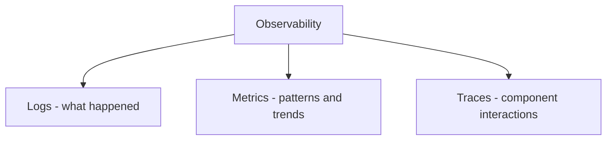
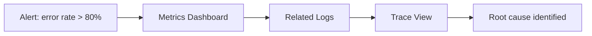
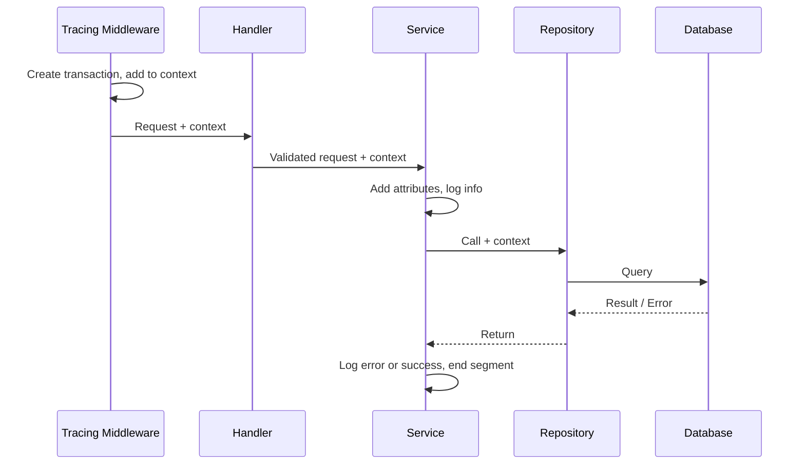

# Logging, Monitoring & Observability

> In distributed backends running across regions and servers, you cannot debug what you cannot see — logging, monitoring, and observability are how you know what your system is doing when you're not watching it.

---

## The Spectrum Mindset

There are no fixed rules. No company implements 100% of best practices. Logging, monitoring, and observability exist on a **spectrum** — implement what your team size, traffic, and incident history justify.

Don't be intimidated by the toolchain. Start with structured logs and basic health metrics; grow from there.

> 💭 **Think:** What would break in your system today if you had zero logs and zero metrics?

---

## Why Distributed Systems Need This

Modern backends run across:
- Multiple servers and regions
- Users worldwide
- Many interconnected services (DB, cache, queues, external APIs)

You need practices, tools, and methodologies to track what's happening everywhere.

**Three parameters to track:**

| Practice | What it answers |
|----------|----------------|
| **Logging** | What happened? (events with metadata) |
| **Monitoring** | What is the current state? (real-time system health) |
| **Observability** | Why is it broken? (internal state from external outputs) |

---

## Logging: Recording Events

Logging = recording important events across the request lifecycle and application execution.

**What to log:**
- User login
- Database query execution
- Errors (with timestamp, user ID, query, full context for debugging)

Think of logs as a **journal your backend maintains** — when something goes wrong, you can answer: what happened, when, and why.

**Metadata to attach:**
- User ID
- Request/correlation ID
- Latency
- Method/function triggered
- HTTP route, status code

---

## Monitoring: Real-Time System State

Monitoring = continuously checking health and performance, tracking patterns over time.

**What to monitor:**
- Server CPU and memory
- Requests per second
- Open database connections (pool utilization)
- Error rates
- Response times

**"Real-time"** in practice means ~10–15 second delay — constant per-millisecond reporting would overwhelm the observability system itself.

---

## Observability: The Three Pillars

A system is **observable** when you can determine its internal state from external outputs.

**Three pillars (all must be in place):**



| Pillar | Definition | Example |
|--------|------------|---------|
| **Logs** | Record of important events | `"Failed to create todo: DB connection timeout"` |
| **Metrics** | Numerical measurements over time | Error rate 80%, avg response time 250ms |
| **Traces** | End-to-end request path through components | Request → middleware → handler → service → repository → DB |

### Monitoring vs. observability
**A decade ago:** Monitoring told you *something is wrong* (alerts in Grafana).

**Observability movement:** Tells you *something is wrong* AND *exactly what and where* — if you've implemented all three pillars.

---

## How the Three Work Together: The Debug Workflow

```
1. Alert fires (Slack): "Error rate > 80%"
        ↓
2. Check metrics dashboard: confirm error rate spike, see throughput drop
        ↓
3. Drill into related logs: find the specific 500 errors
        ↓
4. Click log → jump to trace: see request path, where it failed
        ↓
5. Fix the exact function/layer that broke
```



| Source | Answers |
|--------|---------|
| Logs | **What** happened |
| Metrics | **Patterns** and trends over time |
| Traces | **Where** in the component chain it failed |

---

## Logging Deep Dive

### Log levels

| Level | When to use | Production? |
|-------|-------------|---------------|
| **debug** | Troubleshooting, verbose system behavior | ❌ Disabled |
| **info** | Normal operations, business events (todo created) | ✅ Primary level |
| **warn** | Suspicious but not critical (wrong password attempt) | ✅ Yes |
| **error** | Failures — validation, DB query, external API | ✅ Yes |
| **fatal** | Catastrophic — app shuts down and restarts | Rare |

**Dev:** `debug` level for maximum visibility.
**Production:** `info` and above — debug logs are too noisy and expensive to store.

### Structured vs. unstructured logging

| Environment | Format | Why |
|-------------|--------|-----|
| **Development** | Human-readable console (colors, plain text) | Easy to spot issues while coding |
| **Production** | JSON (structured logging) | Machine-parseable by log aggregation tools |

**Why JSON in production:**
Log tools (ELK, Loki, Grafana) need to extract `user_id`, `request_id`, `status_code` from each line. Parsing free-text logs is error-prone and inefficient.

```json
{
  "level": "error",
  "message": "Failed to create todo",
  "user_id": "usr_123",
  "request_id": "req_abc",
  "operation": "create_todo",
  "timestamp": "2025-06-23T10:00:00Z"
}
```

> ⚠️ **Watch out:** Shipping debug-level logs to production generates hundreds of GB/day at scale — expensive to store and noisy to search.

---

## Instrumentation & OpenTelemetry

**Instrumentation** — the practice of measuring attributes of your functions and requests so a system becomes observable.

**OpenTelemetry (OTel)** — open standard providing SDKs, APIs, and best practices for instrumentation across all major languages (Node, Go, Python, etc.). Works with both open-source and proprietary backends.

Even when using a proprietary tool (New Relic, Datadog), you can integrate an OTel collector for more control over how requests and components are instrumented.

---

## Traces & Request Context Propagation

A **trace** is a transaction tracking a request from origin through every component it touches.

**Implementation pattern (Go todo app example):**

1. **Middleware** creates a transaction at request entry
2. Attach metadata: service name, environment, IP, user agent, request ID, user ID, tenant ID
3. Store transaction in **request context**
4. **Service layer** retrieves transaction from context, adds attributes (todo title, priority)
5. **On error:** log at error level + attach error to trace
6. **On success:** log business event at info level
7. **On function return:** end the transaction segment



**Result in dashboard:** Click any log → see full trace → see exactly which layer failed and how long each segment took.

---

## Tools: Open Source vs. Proprietary

### Open-source stack (Grafana ecosystem)
| Tool | Role |
|------|------|
| **Prometheus** | Metrics collection and storage |
| **Grafana** | Dashboards and visualization |
| **Loki** | Log aggregation |
| **Jaeger** | Distributed tracing |

Powerful, flexible, but requires team expertise to configure and maintain.

### Proprietary (one-stop solutions)
| Tool | Role |
|------|------|
| **New Relic** | Logs + metrics + traces in one platform |
| **Datadog** | Same |

**When proprietary makes sense:** Small team, limited DevOps bandwidth, need to ship features instead of maintaining observability infrastructure.

**New Relic dashboard shows:**
- Error rates, transaction times, throughput
- Per-endpoint metrics (`GET /todos` response time, error rate)
- Runtime metrics (GC time, memory, goroutines in Go)
- Log → trace linking

---

## Metrics: What to Track

**System metrics:**
- Request count, error count, error rate (%)
- Average/p95/p99 response time
- Throughput (requests/sec)

**Failed request definition:** Any response with status code > 200 (in the demo; typically > 399 in practice).

**Business metrics:**
- Todos created / failed
- Successful transactions
- Successful authentications

**Why business metrics matter:** Error rate can look normal while successful transactions drop — indicating a silent logic bug.

---

## Collective Responsibility

Observability is a **team effort**:

| Role | Responsibility |
|------|----------------|
| **Developers** | Instrument code: log levels, structured JSON, trace context propagation, business event logging |
| **DevOps / Infra** | Deploy collectors, configure dashboards, set up alerts, ensure logs/metrics/traces are collected and retained |

Neither side alone is sufficient.

---

## Key Takeaways

- Logging, monitoring, and observability exist on a spectrum — implement progressively, don't aim for perfection on day one.
- **Logs** = what happened. **Metrics** = patterns over time. **Traces** = where in the request path things went wrong.
- All three pillars must be in place for true observability — monitoring alone only tells you something broke.
- Use `debug` logs in dev, JSON structured logs in production.
- Log levels: debug → info → warn → error → fatal; choose appropriately.
- Propagate trace/transaction context through middleware → handler → service → repository.
- OpenTelemetry is the open standard for instrumentation across languages.
- Open-source: Prometheus + Grafana + Loki + Jaeger. Proprietary: New Relic, Datadog.
- Debug workflow: alert → metrics → logs → traces → root cause.
- Business metrics catch silent failures that error rates miss.
- Developers instrument code; DevOps provides collection infrastructure.

---

## Glossary

| Term | Definition |
|------|------------|
| **Logging** | Recording timestamped events with metadata across the application lifecycle |
| **Monitoring** | Continuously tracking system health and performance metrics |
| **Observability** | Ability to infer internal system state from external outputs (logs, metrics, traces) |
| **Structured logging** | Logging in machine-parseable format (usually JSON) with consistent fields |
| **Instrumentation** | Adding measurement hooks to code so behavior becomes observable |
| **OpenTelemetry** | Open standard and SDK ecosystem for traces, metrics, and logs |
| **Trace** | End-to-end record of a request's path through all system components |
| **Span** | A single segment within a trace (e.g., one service method execution) |
| **Metrics** | Numerical measurements aggregated over time (error rate, latency, throughput) |
| **ELK stack** | Elasticsearch + Logstash + Kibana for log management |
| **Correlation / Request ID** | Unique identifier linking all logs and traces for a single request |

---
