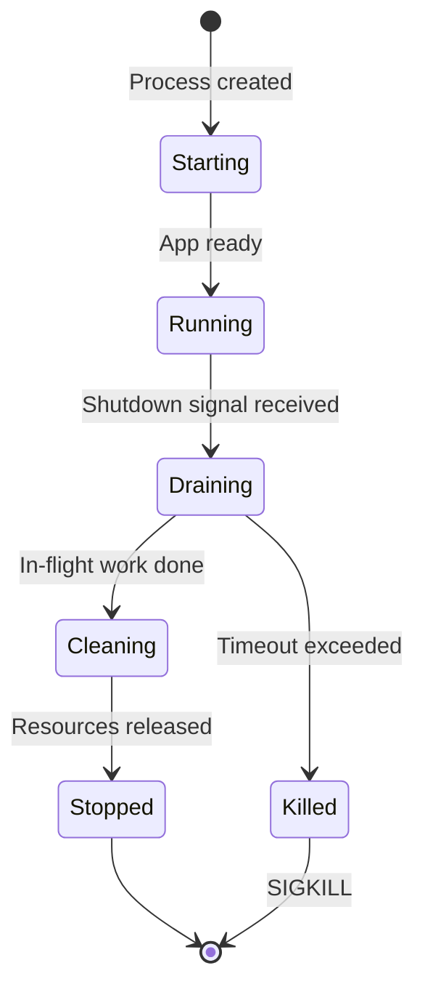
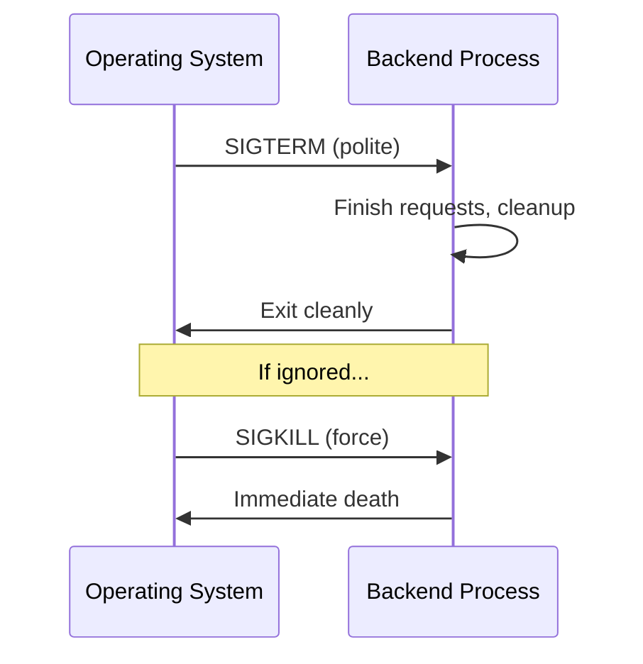
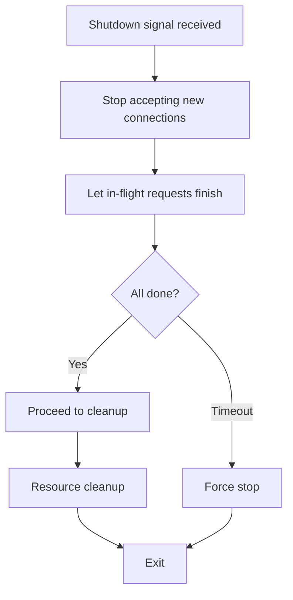
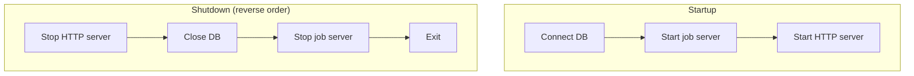

# Graceful Shutdown

> When a server must restart mid-deployment, in-flight payments and requests must not be lost, double-charged, or corrupted — graceful shutdown teaches your backend to finish its work before leaving.

---

## The Scenario

You're processing a critical payment. Someone pushes to production. Zero-downtime deployment brings up the new server, but the **old server must eventually stop**.

At that moment:
- Is the payment lost?
- Is the customer charged twice (race condition)?
- Is the transaction left in an inconsistent state?

This problem has existed since servers existed. The solution: **graceful shutdown**.

---

## What Graceful Shutdown Means

Oversimplified: teach your backend **good manners**.

When it's time to leave, your backend:
1. **Finishes** whatever it's doing
2. **Says goodbye** to ongoing conversations (completes in-flight requests)
3. **Cleans up** after itself (releases resources)
4. **Then** closes the door (exits the process)

Not: slam the door on guests mid-conversation (abrupt kill).

> 💭 **Think:** What happens to an in-flight HTTP request if you `kill -9` the process handling it?

---

## Process Lifecycle

Your backend runs as a **process** on a server (Linux in 99% of deployments).

Every process has a lifecycle:
```
Born (start) → Live (executing) → Die (terminated)
```

Graceful shutdown is about controlling the **Die** phase.



---

## Signals: How the OS Talks to Your Process

When the OS wants your application to stop, it doesn't pull the plug — it follows a **communication protocol** via **signals** (Unix IPC — inter-process communication).

Your application **registers handlers** that wait for specific signals and execute predefined shutdown steps.



---

## The Three Signals That Matter

### SIGTERM — polite shutdown request
- **Meaning:** "Please finish up and leave"
- **Catchable:** Yes — your handler can respond
- **Used by:** Kubernetes, systemd, PM2, deployment systems, orchestrators
- **Your app should:**
  1. Finish existing requests
  2. Clean up resources
  3. Exit

### SIGINT — user-initiated interrupt
- **Meaning:** "Stop now" (gentler than kill)
- **Triggered by:** `Ctrl+C` in terminal
- **Used in:** Development environments
- **Handle the same way as SIGTERM** — same shutdown logic for both

> ⚠️ **Watch out:** Register the same graceful shutdown handler for both SIGTERM and SIGINT. Whether a human (Ctrl+C) or a program (PM2/K8s) initiates shutdown, the cleanup must be identical.

### SIGKILL — nuclear option
- **Meaning:** Instant death, no cleanup
- **Catchable:** **No** — cannot be detected, cannot be ignored
- **Equivalent of:** Pulling the power plug
- **When sent:** After your app ignores SIGTERM for too long

**If you don't respect polite signals (SIGTERM/SIGINT), you will eventually receive SIGKILL** — and lose the chance to clean up.

| Signal | Polite? | Catchable? | Typical source |
|--------|---------|------------|----------------|
| SIGTERM | ✅ Yes | ✅ Yes | K8s, PM2, systemd |
| SIGINT | ✅ Yes | ✅ Yes | Ctrl+C (developer) |
| SIGKILL | ❌ No | ❌ No | OS timeout enforcement |

---

## Step 1: Connection Draining (Finish In-Flight Requests)

**Restaurant analogy:**

Closing time at a restaurant:
1. **Stop letting new customers in** (reception stops seating)
2. **Announce to existing diners:** "15–20 minutes to finish your meal"
3. **Let them finish, pay, leave**
4. **Then close**

**NOT:** Turn off all lights and throw everyone out.

### For HTTP backends
When shutdown signal received:
1. **Stop accepting new HTTP connections/requests**
2. **Let in-flight requests complete**
3. **Then close**

### For databases
1. Finish existing queries/transactions
2. Stop accepting new queries
3. Close connections

### For WebSockets
1. Notify clients that connection is closing
2. Then close the socket (don't drop abruptly)



### Timeout mechanism
You cannot wait forever. Production systems implement a **hard timeout** (commonly **30 seconds**, sometimes 60s):

- Give in-flight requests up to 30s to complete
- If not done → force stop
- Without timeout, shutdown blocks deployments indefinitely

**Choosing timeout is a design tradeoff:**

| Too short | Too long |
|-----------|----------|
| Interrupts legitimate long operations | Sluggish deployments, slow rollouts |

Base timeout on your app's typical request duration. Standard REST backends: 30s is usually sufficient. WebSockets or long-polling: tune accordingly.

### Coordination with infrastructure
Connection draining must work with:
- **Load balancers** — stop routing new traffic to draining instance
- **Health checks** — failing health check removes instance from rotation
- **Service discovery** — deregister instance so other services don't call it

---

## Step 2: Resource Cleanup

Like cleaning your desk before leaving — release everything your process acquired.

**Resources to clean up:**
- **File handles** — OS provides handles to filesystem; unreleased handles leak memory
- **Network connections** — OS limits open connections per process; unreleased connections cause performance issues
- **Database connections** — commit or rollback in-flight transactions explicitly; otherwise inconsistent state, deadlocks, corruption
- **Temporary files**
- **Caches**

### Reverse-order cleanup
Clean up resources in the **reverse order** they were acquired:

```
Acquired: Redis → DB → HTTP server
Cleanup:  HTTP server → DB → Redis
```

**Why:** Prevents cleaning up a resource that another pending operation still depends on.

### Database connection cleanup
Backend connects to DB via **TCP connections** (pooled for efficiency). On shutdown:
1. Stop accepting new queries on each connection
2. Finish in-flight queries/transactions
3. Close each TCP connection in the pool one by one

---

## Implementation Pattern (Go Example)

**High-level flow (frameworks in Node, Rust, Python provide similar APIs):**

```go
// 1. Register signal handler
signal.Notify(sigChan, syscall.SIGINT, syscall.SIGTERM)

// 2. On signal → call gracefulShutdown()
func gracefulShutdown() {
    // Step 1: Stop HTTP server (stop new connections, finish existing)
    httpServer.Shutdown(ctx)

    // Step 2: Close database (finish queries, release connections)
    db.Close()

    // Step 3: Stop background job processor (e.g., Asynq/Redis)
    jobServer.Shutdown()

    // Step 4: Log "server exited properly"
}
```

**Observed shutdown log sequence:**
```
[INFO] Connected to database
[INFO] Started background job server
[INFO] Server started
--- Ctrl+C pressed ---
[INFO] Received interrupt signal
[INFO] Closing database connection
[INFO] Stopping background job server (graceful shutdown, waiting for workers...)
[INFO] All workers finished
[INFO] Server exited properly
```

Even with zero in-flight requests, graceful shutdown takes ~1 second — that's normal (cleanup has real work to do).



---

## Zero-Downtime Deployment Context

Graceful shutdown is the **old server's half** of a zero-downtime deployment:

```
1. New server starts → passes health checks → receives traffic
2. Load balancer stops sending new requests to old server
3. Old server receives SIGTERM → connection draining begins
4. Old server finishes in-flight work → cleanup → exits
```

Without graceful shutdown at step 3–4: payments lost, double charges, corrupted transactions, angry users.

> ⚠️ **Watch out:** Zero-downtime deployment only works if BOTH sides cooperate — the new server must be healthy AND the old server must drain gracefully.

---

## What You Don't Need to Memorize

You don't need to write signal handling from scratch. Every major framework provides shutdown APIs:

| Framework | Shutdown API |
|-----------|-------------|
| Go (`net/http`) | `server.Shutdown(ctx)` |
| Node (Express) | `server.close()` |
| Python (Uvicorn/FastAPI) | Lifespan events / signal handlers |

Copy the pattern from framework docs. **Understanding why** matters more than memorizing code.

---

## Key Takeaways

- Graceful shutdown prevents lost transactions, double charges, and data corruption during deployments.
- Your backend runs as a process with a lifecycle — shutdown is a phase you must design for.
- **SIGTERM** (from orchestrators) and **SIGINT** (from Ctrl+C) are polite — handle both identically.
- **SIGKILL** is uncatchable — if you ignore SIGTERM long enough, the OS sends SIGKILL and you get no cleanup.
- **Connection draining:** stop new requests → finish in-flight → timeout (typically 30s) → force stop.
- **Resource cleanup:** release file handles, network connections, DB connections; commit/rollback transactions.
- Clean up resources in **reverse acquisition order**.
- Coordinate with load balancers, health checks, and service discovery.
- Frameworks provide shutdown primitives — understand the protocol, copy the implementation.
- Graceful shutdown is essential for good UX and data integrity during every deployment.

---

## Glossary

| Term | Definition |
|------|------------|
| **Graceful shutdown** | Controlled process termination: finish work, release resources, then exit |
| **Process** | OS-level execution unit; your backend runs inside one |
| **Signal** | Unix IPC mechanism for OS-to-process communication |
| **SIGTERM** | Polite termination signal from orchestrators/deployment systems |
| **SIGINT** | Interrupt signal, typically from Ctrl+C |
| **SIGKILL** | Force-kill signal; uncatchable and unignorable |
| **Connection draining** | Stopping new connections while allowing in-flight ones to complete |
| **In-flight request** | HTTP request currently being processed when shutdown begins |
| **Handler** | Code registered to respond to specific OS signals |
| **Service discovery** | Mechanism for services to find and communicate with each other after deployment |
| **Blue-green deployment** | Running new version alongside old; switch traffic when new version is healthy |

[REDACTED]
