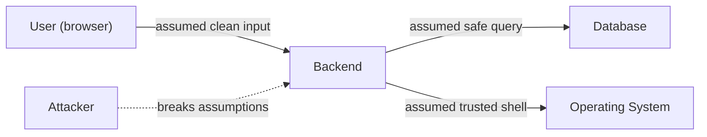
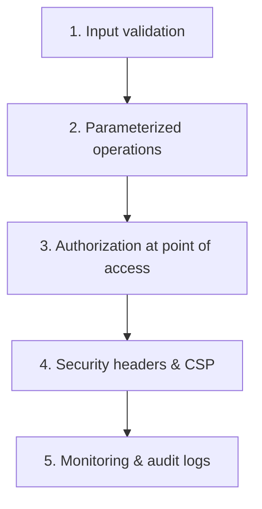

# Backend Security

> Security failures are financial failures — the backend is the trust boundary where input becomes data, money moves, and secrets live.

## Scope and Goal

Backend security spans your **application code and process** — distinct from browser security (XSS, cookies), network security (TLS), and OS/server security, though you must integrate with all of them.

**Goal of this topic**: not to teach every fancy technique in one sitting, but to make you **paranoid about your code** — always keep security in the back of your head when building anything.

No application is ever truly secure. Technology, libraries, and languages evolve; new vulnerabilities emerge. You try your best.

## Think Like an Attacker

Attackers don't care about your framework, library, or language. They ask one question:

> **Where did the developer make an assumption?**

Every vulnerability comes down to a developer assumption:
- Input from the frontend would be clean
- The user is who they say they are
- The request came from our own frontend
- No one would open the network tab and modify parameters

These feel reasonable under startup deadlines and happy-path thinking. Attackers poke every boundary, modify every input, and guess every assumption.

**Mental model that sticks regardless of language/framework**:
1. Where is data crossing a boundary?
2. What assumptions am I making about the data?
3. What if those assumptions are wrong?



## Injection Attacks — Root Cause

Your backend speaks **multiple languages** in multiple contexts:
- **SQL** when querying databases
- **HTML/CSS/JS** when serving static assets
- **Shell** when calling OS functions or CLI tools

Each language has its own grammar and special characters. Vulnerabilities arise when a user speaking one language crosses into another — user input in one language becomes special commands in another.

**Essence of all injection attacks**: confusion between **code and data** — treating data as code or code as data.

### SQL Injection

Classic login flow: server concatenates user email into SQL template:

```sql
SELECT * FROM users WHERE email = '<user_input>'
```

**Happy path**: `alice@gmail.com` → works fine.

**Attack input** in email field:
```
' OR '1'='1' --
```

Constructed query becomes:
```sql
SELECT * FROM users WHERE email = '' OR '1'='1' --'
```

- First `'` closes the string → email = empty string (false)
- `OR '1'='1'` → always true
- `--` comments out trailing quote → no syntax error
- Result: **all users returned** — attacker bypasses login

**Worse attack** — table deletion:
```
'; DROP TABLE users; --
```

**Mitigations**:
1. **Parameterized queries / prepared statements** — separate query structure from data; DB treats slot contents purely as data, never as SQL syntax
2. **Least-privilege DB credentials** — app user gets DML (INSERT/UPDATE/DELETE) only, not DDL (DROP/ALTER)
3. Modern drivers block multi-statement queries by default

> 💭 Think: Why does `' OR '1'='1' --` work with string concatenation but fail completely with parameterized queries?

**Parameterized query pattern**:
```javascript
// Structure (no user data)
const statement = "SELECT * FROM users WHERE email = $1";
// Data passed separately
await db.execute(statement, [userInput]);
```

Even malicious input `' OR '1'='1' --` becomes a garbage string that matches no email — no harm possible.

> ⚠️ Watch out: ORMs use parameterized queries by default. You're only vulnerable if you deliberately build raw concatenated strings.

### NoSQL Injection

MongoDB queries are JSON-like objects with operators (`$ne`, `$gt`, `$exists`) specified as nested keys starting with `$`.

If your app takes user JSON and passes it directly to the query builder, attackers inject operators to bypass filters.

**Fix**: validate types strictly; never pass raw user objects as query structure.

### Command Injection

Same code/data confusion, but target is the **operating system**.

Example: image resize via FFmpeg CLI:
```bash
ffmpeg -height 120 -width 220 -o <user_filename>
```

Attacker input: `output.jpg; rm -rf /`

Semicolon ends first command; `rm -rf /` executes.

**Fix**: separate command from arguments using language-provided APIs (argument arrays) — pass user data directly to process without shell interpreter.

| Attack | Target | Fix |
|--------|--------|-----|
| SQL injection | Database query language | Parameterized queries |
| NoSQL injection | Query operators | Validate types, no raw object passthrough |
| Command injection | OS shell | Argument arrays, no shell concatenation |

### Injection Summary Rule

> ⚠️ Watch out: Whenever you're building a string that will be **interpreted by another system** and includes user input — stop. Find the parameterized alternative. It almost always exists.

Never use string concatenation or template strings mixing user input with control syntax for sensitive operations.

## Authentication

Authentication = verifying which database row corresponds to the current user.

Get authentication wrong → account takeover, private data access, actions on behalf of users, stolen money.

### Use an Auth Provider When Possible

For production, prefer **Auth0, Clerk, etc.** over rolling your own full auth flow:
- Saves weeks of engineering (OAuth, social login, session revocation, RBAC)
- Dedicated security team handles edge cases
- Worth the cost until bills reach $10K–20K/month at scale

Even with a provider, you must understand how auth works and integrate securely.

### Password Storage Evolution

| Stage | Method | Problem |
|-------|--------|---------|
| 1 | Plain text | DB breach = all passwords leaked; employees can read passwords; 70%+ users reuse passwords across sites |
| 2 | Hashing (SHA-256, MD5) | One-way, but **rainbow tables** map common passwords → hashes |
| 3 | Salting | Random per-user salt concatenated before hash → rainbow tables useless |
| 4 | Slow hashing (bcrypt, Argon2id) | **Cost/work factor** makes brute force take decades instead of days |

**Current standard**: **Argon2id** (recent industry standard); bcrypt has been default for years.

**Why slow hashing matters**: GPUs compute billions of SHA-256 hashes/second. bcrypt/Argon2id with cost factor ~400ms per hash → attacker gets ~2–5 attempts/second instead of billions. Imperceptible to genuine login; devastating to brute force.

**Never use** MD5 or SHA-256 for password storage — they're general-purpose hashes, too fast for passwords.

### Sessions (Stateful Authentication)

After successful login, server:
1. Generates **cryptographically secure random session ID** (128–256 bits — more possibilities than atoms in the universe)
2. Stores session metadata in Redis or DB (user ID, created_at, expiry, IP, user agent)
3. Sends session ID to browser in a **cookie**

Every subsequent request: extract session ID from cookie → lookup in store → identify user.

**Prefer stateful sessions** over JWTs unless you have specific scaling requirements (even then, use Redis for distributed sessions).

### Cookie Security Flags

| Flag | Purpose |
|------|---------|
| **HttpOnly** | JavaScript cannot read cookie — prevents XSS from stealing session |
| **Secure** | Cookie only sent over HTTPS — prevents interception on public Wi-Fi |
| **SameSite=Strict/Lax** | Controls cross-origin cookie sending — prevents CSRF |

- **Strict**: cookie only sent from your own site
- **Lax**: sent for top-level navigation links, not img/iframe triggers
- **None**: sent everywhere (requires Secure flag) — avoid for auth cookies

> ⚠️ Watch out: Never store session IDs or JWTs in localStorage — accessible to any JavaScript, including XSS-injected scripts.

### JWTs (Stateless Authentication)

JWT = header.payload.signature — session data sent to client, not stored server-side.

**Structure**:
- **Header**: algorithm used
- **Payload (claims)**: `sub` (user ID), `iat` (issued at), custom claims (name, isAdmin)
- **Signature**: HMAC of header+payload with server secret

Signature prevents tampering — modified payload fails verification.

**Advantages**: no DB lookup per request; easier horizontal scaling.

**Problems**:
1. **Revocation is hard** — can't instantly log out all devices; workarounds: token blacklists, short-lived access tokens + refresh tokens
2. **Payload is base64, not encrypted** — don't store sensitive data in claims
3. **Storage dilemma** — localStorage vulnerable to XSS; HttpOnly cookies bring you back to cookie-based sessions

**If using JWTs**:
- Short expiration (minutes to hours, not days)
- Refresh token flow with server-side storage
- HttpOnly cookies, not localStorage

### Rate Limiting on Auth Endpoints

Without rate limiting, attackers brute-force passwords at thousands of requests/second — account takeover or server crash.

**Layered approach** (each layer catches what the previous misses):

| Layer | Config example | Stops | Bypassed by |
|-------|---------------|-------|-------------|
| **Per IP** | 10 attempts/min | Automated scripts | Botnets, rotating IPs, shared org IPs |
| **Per account** | 5 failures → 24h lock | IP rotation targeting one account | One password across many accounts |
| **Global** | 100 failed attempts/min system-wide | Password-spray attacks | — triggers alerts, CAPTCHA, IP blocks |

Be **more restrictive** on auth endpoints than general API endpoints.

## Authorization

Authentication = who is this user?
Authorization = what can this user do?

### The False Sense of Security

Common pattern:
```
Router → auth middleware (requireAuth) → permission middleware (read:books) → handler → service → repository
```

Problem: passing auth at routing layer creates false confidence. User has `read:books` permission but that doesn't mean access to **all** books.

**Example**: `GET /books?id=5` runs:
```sql
SELECT * FROM books WHERE id = 5
```

Book 5 belongs to another user. Missing check:
```sql
SELECT * FROM books WHERE id = 5 AND user_id = <context.user_id>
```

Attacker scripts through all IDs → downloads every invoice, payment record, financial data.

### BOLA / IDOR (Broken Object Level Authorization)

System checks auth at routing layer but **not at repository/database level**.

**Fix**: always filter by user ownership at the point of access:
```sql
SELECT * FROM invoices WHERE id = $1 AND user_id = $2
```

Apply to **all** query types: SELECT, UPDATE, DELETE, INSERT.

### 403 vs 404 — Information Leakage

**Wrong pattern**:
1. Fetch invoice by ID
2. Check if `context.user_id == invoice.user_id`
3. If not → return **403 Forbidden**

403 confirms the invoice **exists** — attacker enumerates valid IDs for social engineering attacks.

**Right pattern**: single query with ownership filter → no rows → return **404 Not Found**.

Attacker cannot distinguish "doesn't exist" from "exists but not yours."

### BFLA (Broken Function Level Authorization)

Admin endpoint `/admin/invoices` lists all invoices — no user_id filter needed (admin sees everything).

Vulnerability: **security through obscurity** — hiding admin URL without role checks. Any authenticated user who discovers the URL gets all data.

**Fix**: role middleware at routing layer — verify `user.role === 'admin'` before admin functions.

### Horizontal vs Vertical Authorization

| Type | Direction | Example | Vulnerability |
|------|-----------|---------|---------------|
| **Horizontal** | User A → User B's resources | Access another user's invoices | BOLA/IDOR |
| **Vertical** | Regular user → admin functions | Member calls admin API | BFLA |

### Authorization Best Practices

1. **Centralize** authorization logic — don't scatter checks that get forgotten
2. **Default deny** — if not explicitly allowed, deny; new endpoints protected by default
3. **Test authorization specifically** — automated tests: user A can't access user B's data; member can't access admin functions; unauthenticated can't access protected resources
4. **Audit logs** — log admin endpoint access and failed authorization attempts
5. **Use UUIDs** instead of sequential IDs to reduce enumeration (with performance trade-offs)

## XSS (Cross-Site Scripting)

Attacker gets their JavaScript to execute in a genuine user's browser **in the context of your platform**.

**Why dangerous** — injected JS can:
- Read page content including sensitive data
- Make API requests impersonating the logged-in user (access cookies/localStorage)
- Redirect to phishing pages
- Alter page content to trick users

**Root cause**: same as injection — user content treated as **code** instead of **data**, but in the browser (HTML/JS context).

### Types

| Type | Mechanism |
|------|-----------|
| **Stored XSS** | Malicious script saved in DB (e.g., comment with `<script>`) → executes for every viewer |
| **Reflected XSS** | Script in URL parameters reflected back in response |
| **DOM-based XSS** | Client-side injection via `innerHTML` / `dangerouslySetInnerHTML` |

**Stored XSS example**: comment system renders markdown → HTML → injects into DOM. Attacker embeds `<script>` tag → every viewer's session cookies sent to attacker's server.

### Prevention

1. **Sanitize** user-provided markup server-side before storing — strip `<script>` tags and dangerous elements
2. **CSP (Content Security Policy)** — HTTP header telling browser which script sources to trust, block inline scripts
   - CSP is **defense in depth**, not primary prevention — fix sanitization first
3. Use modern libraries (Remark/Rehype) with built-in safety; avoid raw HTML injection

> ⚠️ Watch out: React's `dangerouslySetInnerHTML` is named intentionally — you're on your own for XSS when using it.

## CSRF (Cross-Site Request Forgery)

Attacker tricks user's browser into making authenticated requests to your site from a malicious site (evil.com → bank.com with user's cookies attached).

**Modern mitigations** (CSRF is less of a threat today):
- **SameSite=Lax** cookies (browser default)
- **CORS** configuration blocking cross-origin requests
- CSRF tokens for legacy systems

Configure SameSite=Strict or Lax; never SameSite=None for auth cookies unless absolutely necessary.

## Misconfiguration

### Secrets Management

Secrets = API keys, DB passwords, JWT signing keys, encryption keys.

| Mistake | Consequence |
|---------|-------------|
| Secrets in source code / git | Everyone with repo access gets full system access; persists in commit history even after deletion |
| Debug logging in production | Stack traces reveal code structure; SQL queries and user data in logs |

**Rules**:
- Secrets in environment variables or vault (AWS Parameter Store, HashiCorp Vault)
- If secret committed → **rotate immediately** (deleting from git isn't enough)
- Production log level = **info**, not debug

### Security Headers

| Header | Purpose |
|--------|---------|
| **CSP** | Restrict script/style sources |
| **X-Frame-Options** | Prevent embedding in iframes (clickjacking) |
| **HSTS** | Force HTTPS |
| **X-Content-Type-Options** | Prevent MIME sniffing |

Modern frameworks (Express Helmet, Django security middleware) configure these with one line.

## Defense in Depth

No single defense is perfect. Layer them:



1. **Input validation** — first line; data leaving validation layer must match expected structure exactly
2. **Parameterized operations** — DB queries, OS commands, never string concatenation
3. **Authorization at point of access** — not just routing layer
4. **Security headers** — limit damage when something fails
5. **Monitoring** — log suspicious activity, raise alerts

Attacker must bypass **all layers** simultaneously — exponentially harder.

## The Boundary Framework

Every vulnerability is about **boundaries**:
- SQL injection: user input → database query language
- XSS: user markdown → HTML execution context
- BOLA: request → another user's data boundary
- CSRF: cross-site → authenticated cookie boundary

**Three questions every time data crosses a boundary**:
1. Where is data crossing a boundary?
2. What assumptions am I making?
3. What if those assumptions are wrong?

## Learning Resources

| Resource | What it covers |
|----------|---------------|
| **PortSwigger Academy** | Free practical labs — SQL injection, XSS, CSRF, SSRF, OAuth, JWT attacks |
| **OWASP Top 10** | Current critical vulnerability categories (broken access control, injection, misconfiguration) |
| **OWASP Cheat Sheets** | Best practices per domain (authentication, session management, etc.) |
| **Lucia auth docs** | Industry-standard authentication guidance (now guidance, not a library) |

## Key Takeaways

- Think like an attacker: **find developer assumptions**, not framework-specific tricks
- All injection attacks = **code vs data confusion** — fix with parameterized queries and argument arrays
- Password storage: **Argon2id/bcrypt + salt + slow cost factor** — never plain text or fast hashes
- Prefer **stateful sessions in Redis** over JWTs; if JWTs, use short expiry + refresh tokens + HttpOnly cookies
- **Rate limit auth endpoints** in layers: per IP, per account, global
- Authorization checks at the **repository layer**, not just routing — return 404 not 403 to prevent enumeration
- **BOLA/IDOR** = horizontal; **BFLA** = vertical privilege escalation
- XSS = user content as code in browser — sanitize + CSP as backup
- Secrets in env/vault, never git; production logs at info level
- **Defense in depth** — validation, parameterization, authorization, headers, monitoring
- Security is a **mindset**, not a checklist — always question boundaries and assumptions

## Glossary

| Term | Definition |
|------|------------|
| **Injection** | User input interpreted as commands in another language context |
| **Parameterized query** | SQL with placeholders; data passed separately from structure |
| **Rainbow table** | Precomputed hash lookup for common passwords |
| **Salt** | Random per-user string added before hashing |
| **Argon2id / bcrypt** | Slow password hashing algorithms with configurable cost |
| **Session** | Server-stored auth state referenced by cookie ID |
| **JWT** | Self-contained signed token with claims in payload |
| **HttpOnly / Secure / SameSite** | Cookie security flags |
| **Rate limiting** | Restricting request frequency to prevent brute force |
| **BOLA / IDOR** | Broken Object Level Authorization — accessing others' resources |
| **BFLA** | Broken Function Level Authorization — accessing admin functions |
| **XSS** | Cross-Site Scripting — attacker JS in victim's browser |
| **CSP** | Content Security Policy — browser resource allow-list header |
| **CSRF** | Cross-Site Request Forgery — forged authenticated requests |
| **Default deny** | Block unless explicitly permitted in authorization logic |
| **Defense in depth** | Multiple independent security layers |
| **OWASP** | Open Web Application Security Project |
| **Security through obscurity** | Hiding URLs/secrets instead of real access controls |
