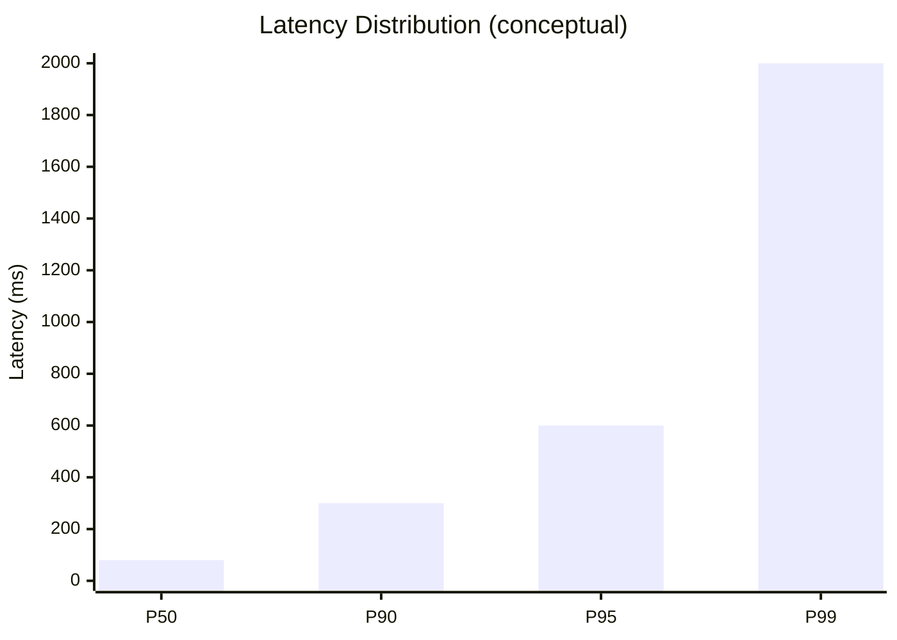

# Backend Scaling and Performance Engineering (Part 1)

> Performance is not a buzzword — it is measurable behavior under load, and the engineers who survive traffic spikes are the ones who speak its language before reaching for solutions.

## What "Fast" Actually Means

A user clicks a button → browser sends HTTP request → server processes → database/API calls → JSON response → browser renders.

The total elapsed time = **latency**. When users say "slow" or "fast," they mean latency — even if they don't know the word.

Latency is **not one number**. It varies per request due to cache hits, server load, network conditions, query complexity, etc.

## Latency Metrics — Why Averages Lie

**Average latency is misleading for performance.**

Example: 1000 requests, average 100ms — but 99% complete in 50ms while 1% take 5 seconds.

At 1M requests/day: **10,000 users wait 5+ seconds** while averages look fine.

### Percentiles (P50, P90, P99)

| Metric | Meaning |
|--------|---------|
| **P50** | 50% of users experience ≤ this latency |
| **P90** | 10% of users experience ≥ this latency |
| **P99** | 1% of users experience ≥ this latency |

Alternative reading: P99 = 2s means 99% of users get < 2s.



**Focus on P95 and P99** because:
- Slow tail requests often contain the most complex business logic (payments, multi-service orchestration)
- P99 users are often your most valuable customers (paying, purchasing)

> 💭 Think: Optimizing average latency while ignoring P99 is optimizing for the wrong users.

## Throughput

**Latency** = how long one request takes (origin → response).

**Throughput** = how many requests the system handles per unit time (requests/second, requests/minute).

They are connected but non-intuitive: a system fast at 10 RPS may collapse at 1000 RPS (150ms → 2s latency).

Throughput answers: Can we handle Black Friday? A viral blog post? An email campaign spike?

## Utilization and the Latency Cliff

**Utilization** = percentage of system capacity currently in use.
- 0% = idle
- 100% = maxed out, on brink of collapse

### Ice Cream Shop Analogy

| State | Utilization | Experience |
|-------|-------------|------------|
| Empty shop | Low | Instant service |
| Lunch rush, same worker speed | High | Long wait despite same prep time |
| Packed | ~100% | Queue, unpredictable waits |

Backend servers behave identically: requests queue when utilization is high. Worker execution rate unchanged — **wait time increases**.

### Highway Analogy

- **50% capacity**: smooth flow
- **80%**: slowdowns, lane changes harder
- **90%**: unpredictable jams, ripple effects
- **100%**: gridlock

### The Exponential Curve

```
Latency
  |                    *
  |                  *
  |               *
  |            *
  |__________*________ Utilization
  0%        70%   100%
```

As utilization approaches 100%, latency grows **exponentially**, not linearly.

> ⚠️ Watch out: Never run production systems at 100% utilization. Reserve **20–40% headroom** for traffic bursts.

Traffic arrives in **bursts**, not metronome-steady intervals. Even 50% average utilization can spike past 100% during bursts without buffer.

## Bottlenecks — Measure Before Fixing

When a system is slow, something specific causes it. Finding that component = **identifying the bottleneck**.

**Anti-pattern**: Jumping to solutions without measurement:
- "Database is always the problem" → add Redis cache
- Upgrade Postgres 16 → 18
- Add more servers (horizontal scaling)

Sometimes these work by luck. Often you spend weeks fixing the wrong problem.

### Case Study: Slow PATCH /products/:id

Assumption: database is slow → implement Redis caching (1 week).

After adding timing logs:
- Database query: **10ms**
- Redis cache: **5ms**
- **Synchronous remote logging to Elasticsearch: 500ms** ← actual culprit

> ⚠️ Watch out: The actual bottleneck is often unintuitive — synchronous logging, JSON serialization, huge response payloads causing network latency.

**Rule: Never guess. Always measure.**

### Profiling

Profilers attach to running applications, sampling function execution times. Output visualized as **flame graphs** — wider bars = more time spent.

Surprises: bottleneck is often JSON serialization or external API calls in a loop, not "complex business logic."

**Limitation**: CPU profilers excel at CPU-bound work; most backend bottlenecks are **IO-bound** (DB, network, files).

### Distributed Tracing

Follow one request through every component with timestamps:
- 2ms in business logic
- 800ms in database query ← focus here

Essential for IO-bound latency debugging. Part of observability stack.

## Database Performance — Common Issues

### N+1 Query Problem

Frontend needs 20 blog posts + author names:
- 1 query for posts
- 20 queries for authors (one per post)
- **21 total queries** — grows linearly with items

At 1000 items → 1001 queries. Even 5ms/query = 5 seconds.

**Root cause at server/ORM level**:
```python
posts = db.select(Post).all()
for post in posts:
    author = db.select(Author).where(id=post.author_id)  # N queries!
```

**Fix**: Bulk fetch with joins or ORM primitives:
- Django: `select_related`, `prefetch_related`
- Rails: `includes`
- Prisma/Drizzle: joins, `leftJoin`
- Raw SQL: JOINs

Two queries total regardless of item count.

> ⚠️ Watch out: ORM code looks like normal loops — enable SQL query logging in development to catch N+1.

### Indexes

**Without index**: full table scan — examine every row (library with no catalog, search every book).

**With index**: B-tree (typically) maintains sorted copy of column values with pointers to rows — direct lookup.

Example: 1M rows, 4s full scan → **40ms with index** on `author_id`.

**Indexes are not free**:
1. **Storage cost** — index data structures consume disk/memory
2. **Write overhead** — every INSERT/UPDATE/DELETE must update all indexes on that table

Over-indexing slows writes dramatically.

**When to index**:
- Obvious at schema time: foreign keys, frequently filtered columns (`author_id`)
- Data-driven: use `EXPLAIN ANALYZE` on slow queries identified via distributed tracing

**Composite index**: `(user_id, created_at)` — order matters; helps queries filtering by `user_id` alone, but not `created_at` alone.

**Covering index**: index includes all columns needed by query — DB serves from index without touching table.

**EXPLAIN ANALYZE**: shows query plan, which indexes used, where sequential scans occur.

### Connection Overhead and Pooling

Each new DB connection requires:
- TCP 3-way handshake
- Authentication, encryption negotiation
- Session state allocation (~MBs memory per connection)

Creating/destroying per query = repeated expensive setup.

Postgres typical limit: **~500 connections**.

**Connection pooling**: maintain open connections, borrow/return instead of create/destroy.

| Type | Description | Problem at scale |
|------|-------------|-----------------|
| **Internal pool** | Per-server pool in app driver | 3 servers × 150 connections = 450; can exhaust DB limit on traffic spike |
| **External pooler** (PgBouncer) | Shared pool all instances use | Centralized limit management |

Use external poolers (PgBouncer) in horizontally scaled production.

## Caching

Store results of expensive operations (usually DB queries) in fast storage (Redis).

Cache hit: 800ms DB query → **50ms** from Redis.

### Cache Invalidation

> "There are only two hard things in computer science: naming things and cache invalidation."

When underlying data changes, stale cache must be invalidated.

**Time-based (TTL)**: expire after N minutes. Simple but stale data window; optimal TTL varies per endpoint.

**Event-based**: on UPDATE, explicitly delete cache entry. Precise but must remember at every write path — miss one → stale data served.

### Local vs Distributed Cache

| Type | Pros | Cons |
|------|------|------|
| **Local (in-memory map)** | ~2-3ms, instant | 10 server instances = 10 inconsistent caches |
| **Distributed (Redis)** | Single source of truth | Network roundtrip ~50ms |

**Tiered caching**: hot data in local cache, upstream Redis for shared consistency.

### Caching Patterns

| Pattern | Behavior | Trade-off |
|---------|----------|-----------|
| **Cache-aside (lazy load)** | Read: check cache → miss → DB → store. Write: update DB → invalidate cache | Most common; invalidation responsibility on app |
| **Write-through** | Write updates cache AND DB simultaneously | No cache miss on read; slower writes |
| **Write-behind** | Write cache immediately, async DB update | Fast writes; cache/DB inconsistency if DB write fails |

> ⚠️ Watch out: Don't cache write/update endpoints — cache-aside only makes sense for read-heavy GET operations.

### Cache Hit Rate

Percentage of requests served from cache vs falling through to source.

- 90% hit rate = excellent
- 20% hit rate = algorithm/pattern/TTL problem

Factors: TTL length, cache size, understanding user access patterns.

## Vertical vs Horizontal Scaling (Introduction)

As traffic grows, servers become insufficient. Two approaches:

### Vertical Scaling (Scale Up)

Replace server with bigger machine: more CPU cores, RAM, storage, faster network.

**Pros**: Simple, no code changes, often cheaper than N half-size servers, no distributed complexity.

**Cons**:
- **Hard ceiling** — largest cloud instance is the limit
- **Single point of failure** — one crash = total outage
- **No geo-distribution** — India users latency to US-only server

### Horizontal Scaling (Scale Out)

Add more medium-sized server instances behind a load balancer.

**Pros**:
- Linear capacity: 5 servers × 1000 RPS each = 5000 RPS
- **Redundancy** — one failure, others continue
- **Geographic distribution** — instances in multiple regions

**Cons**: Complexity — load balancing, statelessness, distributed coordination.

Distributed systems don't eliminate problems — they **transform** one set into another.

Part 2 covers statelessness, load balancers, database scaling, CDNs, async processing, microservices, and serverless.

## Key Takeaways

- Measure **P95/P99 latency**, not averages — tail latency reveals real user pain
- **Throughput and latency** rise together under load; plan for both
- Never run at **100% utilization** — keep 20–40% headroom for bursts
- **Identify bottlenecks by measuring** — don't assume the database is always at fault
- Use **distributed tracing** for IO-bound latency; **profilers** for CPU-bound
- Fix **N+1 queries** with joins/bulk fetch; watch ORM query logs
- Add **indexes** based on data (EXPLAIN ANALYZE), not speculation — indexes cost write performance
- Use **connection pooling**; prefer external poolers (PgBouncer) when horizontally scaled
- **Cache** read-heavy endpoints with deliberate invalidation strategy
- **Vertical scaling** is simple but hits limits; **horizontal scaling** scales further but requires architectural planning

## Glossary

| Term | Definition |
|------|------------|
| **Latency** | Time from request initiation to response completion |
| **Throughput** | Requests handled per unit time (RPS) |
| **P50/P90/P99** | Latency percentiles — tail of distribution |
| **Utilization** | Percentage of system capacity in active use |
| **Bottleneck** | Component limiting overall system speed |
| **Flame graph** | Visual profiler output showing time per function |
| **Distributed tracing** | End-to-end request timing across components |
| **N+1 query** | 1 query for N items + N queries for related data |
| **Sequential/full table scan** | Reading every row without index |
| **B-tree index** | Sorted index structure for fast column lookups |
| **Composite index** | Index spanning multiple columns (order matters) |
| **Covering index** | Index containing all query-needed columns |
| **EXPLAIN ANALYZE** | Postgres tool showing query execution plan |
| **Connection pool** | Reused DB connections to avoid setup overhead |
| **PgBouncer** | External Postgres connection pooler |
| **Cache hit rate** | % of requests served from cache |
| **TTL** | Time-to-live for automatic cache expiration |
| **Vertical scaling** | Bigger single machine |
| **Horizontal scaling** | More machines of same capacity |
