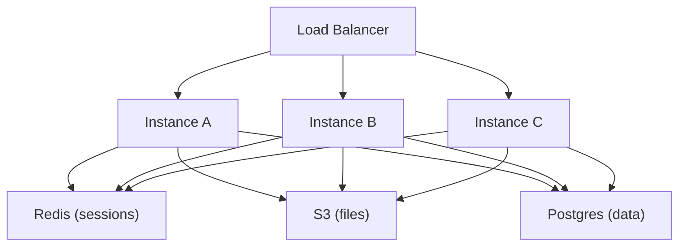

# Backend Scaling and Performance Engineering (Part 2)

> Horizontal scaling only works when every instance is interchangeable — statelessness is not an optimization, it is the prerequisite for surviving real traffic.

## Statelessness — Key to Horizontal Scaling

Horizontal scaling = multiple server instances running the same code, requests distributed among them.

**Stateless**: no instance holds data exclusive to itself. Any request to any instance produces the same result. Remove instance B — A+C+D behave identically.

**Stateful**: instance holds user-specific data in local memory/storage — breaks horizontal scaling.

### Failure Example: In-Memory Sessions

User authenticates on instance A → session stored in A's memory.
Next request → load balancer sends to instance B → B has no session → **401 Unauthorized**.

**Fix**: Externalize session storage to **Redis** (or DB) accessible by all instances.

### Externalize All State

| Data type | Wrong (stateful) | Right (stateless) |
|-----------|-----------------|-------------------|
| Sessions | In-memory on one server | Redis / shared DB |
| Uploaded files | Local disk on one server | S3 / Cloudflare R2 / blob storage |
| Database | SQLite file on server | Postgres / RDS / centralized DB |
| Cache | Local-only without sync | Redis (distributed) |

> ⚠️ Watch out: Horizontal scaling requires planning from ground up — it affects code, infrastructure, and every persistence decision.



## Load Balancers

Without a load balancer: which instance receives which request?

**Load balancer (LB)**: all client requests → LB → forwards to server instance → returns response.

### Algorithms

| Algorithm | Behavior | Best for |
|-----------|----------|----------|
| **Round-robin** | Rotate A→B→C→A→B→C | Uniform request cost, equal server capacity |
| **Weighted round-robin** | More requests to higher-capacity servers (8GB/4-core gets 2× traffic) | Mixed server sizes |
| **Least connections** | Send to instance with fewest active HTTP connections | Mixed light/heavy requests (2s external API vs 200ms DB read) |
| **Weighted least connections** | Least connections + capacity weighting | Mixed capacity + mixed request weight |
| **Least response time** | Favor faster-responding servers | Heterogeneous performance |
| **Resource-based** | Route away from high CPU/RAM usage | Resource-aware routing |

**Least connections** handles expensive requests better than round-robin (which mindlessly alternates, potentially overloading one server with slow requests).

### Health Checks

Problem: instance A crashes but round-robin still sends requests → 502/503 for every third user.

**Health checks**: LB sends test GET every N seconds to each instance.
- 200 response → healthy, receive traffic
- Error → **blacklist** — no user traffic until healthy again
- Continue health checks on blacklisted instances; restore when 200 returns

## Database Scaling

Backend code scales by adding instances. **Database is the stateful bottleneck** — can't simply duplicate; data must stay consistent.

### Read Replicas

```
         ┌── Replica (reads) ── India
Primary ─┼── Replica (reads) ── China
(writes) └── Replica (reads) ── Japan
```

- **Primary/master**: handles all writes (INSERT, UPDATE, DELETE)
- **Replicas**: handle reads (SELECT) only; copies of primary data

Benefits:
- Primary handles ~30% of traffic (writes only) vs 100%
- Geographic replicas reduce read latency for regional users

**~70–90% of SaaS requests are reads** — replicas provide massive relief.

#### Replication Lag / Consistency Problem

1. User in India updates name (write → primary in US) ✓
2. Client immediately GETs profile (read → India replica)
3. Replication hasn't completed (200ms lag) → **returns old name**

User sees: "Update successful" then stale data.

**Mitigations**:
- Route reads-after-write to primary (not replica) for that entity
- Track replication lag; delay reads until caught up
- Frontend: delay refresh 300ms after successful write

> ⚠️ Watch out: Distributed database solutions always involve consistency trade-offs. Physics limits replication speed across regions.

Managed providers (RDS, Cloud SQL) simplify replica setup but you must still handle consistency in application logic.

### Sharding (Partitioning)

When a single table has billions of rows (e.g., orders), even indexed queries slow down.

**Sharding**: physically split table across multiple DB instances.

Example: orders table split by date:
- Instance 1: Jan–Jun orders
- Instance 2: Jul–Dec orders

**Sharding key**: the criterion for division (order_date, user_id, region).

Benefits:
- Each shard has fewer rows → faster queries
- Multiple instances → higher total RPS capacity

Challenge: choosing the right sharding key; cross-shard queries are complex.

Can shard by month for extreme volume.

### Modern Distributed Databases

PlanetScale (MySQL), Neon (Postgres), CockroachDB, Yugabyte handle replication, sharding, distributed transactions internally.

**Recommendation**: Don't roll your own DB infrastructure unless you have deep DBA expertise. Use managed providers; understand concepts to configure backups, replicas, and sharding policies.

## CDNs (Content Delivery Networks)

### The Physics Constraint

Light in fiber: ~200,000 km/s. Tokyo → Virginia round trip ≈ **100ms minimum** — unbreakable physics cap.

That 100ms is before routing, deserialization, DB queries (50–100ms), external APIs (200ms+) → total **500–800ms+** for distant users.

### How CDNs Help

Place **edge nodes (PoPs — Points of Presence)** near users.

Tokyo user → Tokyo CDN edge (2–3ms) instead of Virginia (100ms).

### What to Cache on CDN

| Content type | Examples | Notes |
|-------------|----------|-------|
| **Static assets** | JS/CSS/HTML bundles, images, fonts, videos | Deploy SPAs/static sites via CDN |
| **API responses** | Product catalogs that change infrequently | With cache tags/purge on update |
| **Security** | DDoS protection | Cloudflare absorbs and distributes attack traffic |

**CDN benefits**:
1. **Latency** — content served from nearest edge
2. **Load reduction** — primary server receives ~50% less traffic

**Cache purging**: tag-based invalidation (e.g., purge all blogs by user_id when user uploads new post).

### Edge Computing

Traditional CDN: request file → return file (no processing).

**Edge computing**: request → **processing at edge** → response.

Examples:
- **Auth validation at edge**: reject 401 in 2–3ms instead of round-tripping to primary server
- **Localization**: detect browser language header → serve Japanese version from Tokyo edge

**Constraints**: edge nodes have limited RAM/CPU (ISP-collaborated infrastructure, not full data centers). Runtimes restricted (Cloudflare Workers uses V8 isolates — no filesystem, limited TCP).

Edge computing complements primary servers — cannot replace them for heavy processing.

## Asynchronous Processing

Reduce **perceived latency** by not making users wait for non-critical work.

### Synchronous vs Async Behavior

**Must be synchronous**: update user profile → must confirm DB write before telling user "saved."

**Can be async**: invite team member → user expects email eventually, not instantly.

### Pattern: Queue-Based Async

```
User clicks invite → validate + save to DB (80ms) → push "send email" job to queue → return 200 immediately (100ms total)
                                                      ↓
                                              Worker picks up job → calls SendGrid (300ms, user doesn't wait)
```

Without async: 80ms + 300ms = **400ms** user wait.
With async: **100ms** user wait.

**Implementation**: Redis Queue, BullMQ (Node), RabbitMQ, Kafka.

Producer (API server) pushes jobs; consumer (worker) processes them. Workers can scale independently.

### Good Async Candidates

- Sending emails / notifications
- Video/image processing (YouTube upload → background encoding/thumbnails)
- Account deletion (delete 8 tables with millions of rows — return 200 in 100ms, delete in background over 30s)

> 💭 Think: Identify operations where users don't expect instant completion — offload those first.

## Microservices

### Monolith

Single deployable unit: auth, orders, payments, notifications = different files, same codebase, same process.

**Pros**: Simple to develop, test, deploy, refactor.

### Why Consider Microservices?

Microservices are primarily about **scaling teams**, not machines.

| Driver | Example |
|--------|---------|
| **Deployment dependency** | Payment team ready to ship; notification team has WIP on main branch |
| **Independent scaling** | Payment module needs 10× resources; notifications need minimal |
| **Tech stack diversity** | Markdown parsing needs Node.js npm ecosystem; image processing needs Go/Rust performance |

Threshold: typically **100–200+ developers** before microservices justify complexity.

### Microservices Trade-offs

1. **Network latency**: function call → HTTP/gRPC call between services
2. **Failure handling**: retries, timeouts, circuit breakers required
3. **Debugging**: one request spans 4 services' logs — needs distributed tracing
4. **Data consistency**: each service may have own DB; replication lag across services

> ⚠️ Watch out: Microservices are NOT the default architecture. Monolith + horizontal scaling handles most startups. Only split when team size, scaling needs, or tech requirements clearly demand it.

## Serverless

### Traditional (Serverful) Model

Provision VM → install OS → configure nginx/Docker → deploy app → manage 24/7.

You know exactly what you have: 4GB RAM, 2 CPU cores, 30GB disk.

**Problems**:
- **Capacity planning**: under-provision → crashes/slowness; over-provision → wasted money
- **Autoscaling delays**: boot OS + build app = seconds to minutes; reactive (scales after overload, not before)
- **Always-on cost**: pay 24/7 even at zero requests

### Serverless Model

You provide **functions** + **events**. Provider handles machines, OS, scaling.

Request arrives → provider spins up instance → runs function → returns response → instance dies or pools briefly.

**Pay per execution** (CPU-ms + memory-ms), not 24/7.

### Cold Starts

First request (or after idle): must boot runtime → **cold start latency**.

Mitigations:
- Keep-warm pings (partially defeats serverless cost model)
- Fast runtimes: Firecracker microVMs (Lambda), V8 isolates (Cloudflare Workers, ~0–5ms)
- Interpreted languages (JS, Python) start faster than JVM

Cold starts never fully eliminated — fundamental to on-demand execution.

### Serverless Limits

- Max execution time (Lambda: 15 min)
- **Statelessness required**: no persistent TCP connections, websockets, or local file state
- Not for latency-sensitive (banking/payments) or connection-heavy workloads

**Good use cases**: image/video processing triggers, event-driven pipelines, sporadic workloads.

Serverless is powerful for specific cases — not a universal server replacement.

## Summary Principles

### 1. Start With the Problem

All techniques are solutions. Before applying them:
- Is the system actually slow? Measure with observability (traces, metrics, logs)
- Where exactly is the bottleneck? Which component? Why?

**Premature optimization** = fixing the wrong bottleneck confidently.

Tools: Prometheus/Grafana (self-hosted), New Relic (managed).

### 2. Prefer Simple Solutions

| Complex | Simple alternative |
|---------|-------------------|
| Microservices | Monolith + horizontal scaling |
| Kubernetes early | Large vertical server first |
| Redis in front of everything | Proper DB indexes |
| Cache everything | Fix the actual slow component |

Complexity is a cost — every component can fail, must be monitored, must be understood.

Only accept complexity when simplicity is genuinely insufficient.

### 3. Scale for Problems You Have

Don't build for 1M users on day one. Build for current scale + reasonable headroom.

Your app's characteristics differ from Netflix/Google — learn from **your measurements**, not their blog posts.

### 4. Observability From Day One

Exception to "keep it simple": implement production-grade logging, metrics, and tracing from the start.

Prevents random crashes, eliminates guessing, provides heads-up before problems become outages.

### 5. Performance Is a Mindset

Built through experience: build → watch struggle → optimize → learn what works. No single tutorial covers your specific system.

Your job: build systems that **handle problems gracefully** and develop skills to **measure, diagnose, and resolve quickly**.

## Key Takeaways

- **Statelessness** enables horizontal scaling — externalize sessions, files, and all persistent state
- **Load balancers** distribute traffic; use least-connections for mixed workloads; health checks prevent routing to dead instances
- **Read replicas** offload reads (~70–90% of traffic) but introduce **replication lag** consistency challenges
- **Sharding** splits large tables across DB instances for query speed and write capacity
- **CDNs** defeat geographic latency for static content and some API responses; edge computing adds lightweight processing at PoPs
- **Async processing** via queues dramatically reduces perceived latency for emails, notifications, heavy deletes, media processing
- **Microservices** scale teams, not primarily machines — only at large org scale with clear boundaries
- **Serverless** eliminates capacity planning for sporadic workloads but has cold starts and statelessness constraints
- **Measure first**, prefer simple solutions, scale for actual problems, observe from day one

## Glossary

| Term | Definition |
|------|------------|
| **Statelessness** | No server instance holds exclusive data |
| **Load balancer** | Distributes requests across server instances |
| **Round-robin** | Rotate requests sequentially across instances |
| **Least connections** | Route to instance with fewest active connections |
| **Health check** | Periodic test request to detect dead instances |
| **Read replica** | DB copy serving SELECT queries only |
| **Replication lag** | Delay before replica reflects primary writes |
| **Sharding** | Horizontal partition of table across DB instances |
| **Sharding key** | Column/criterion determining partition assignment |
| **CDN / PoP** | Geographically distributed cache nodes |
| **Edge computing** | Processing at CDN nodes, not just file serving |
| **Async processing** | Return response before completing background work |
| **Job queue** | Buffer for deferred tasks (Redis Queue, BullMQ) |
| **Monolith** | Single deployable application unit |
| **Microservices** | Independently deployed services with own databases |
| **Serverless** | Event-triggered functions; provider manages infrastructure |
| **Cold start** | Latency booting new serverless instance on first request |
| **Premature optimization** | Applying solutions before identifying real bottleneck |
