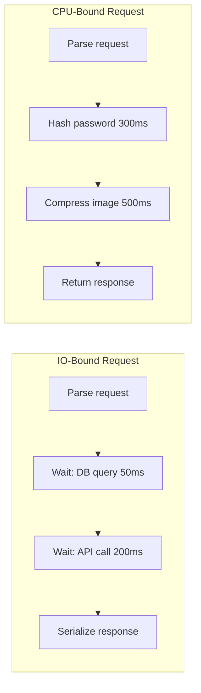

# Concurrency, Parallelism, IO-Bound vs CPU-Bound

> Most backend performance problems are not about raw CPU power — they are about how efficiently your server waits for things that take time.

## Concurrency vs Parallelism

These terms are often used interchangeably but mean different things.

| Concept | Definition | Analogy |
|---------|------------|---------|
| **Concurrency** | Managing multiple tasks in overlapping time periods — asingle chef juggling multiple orders — switches between them |
| **Parallelism** | Executing multiple tasks simultaneously | three chefs each cooking one order at the same time |

**Concurrency** = structure and scheduling of work.
**Parallelism** = actual simultaneous execution (requires multiple CPU cores).

You can have concurrency without parallelism (single-core event loop juggling IO waits).
You can have parallelism without much concurrency (one task per core, no switching).

> 💭 Think: Concurrency is about dealing with lots of things at once. Parallelism is about doing lots of things at once.

## IO-Bound vs CPU-Bound Work

Every backend request involves two types of work:

### IO-Bound (Input/Output Bound)

The server spends most time **waiting** for external resources:
- Database queries (Postgres, MongoDB)
- HTTP calls to other APIs (Stripe, SendGrid)
- File reads/writes (S3, local disk)
- Network socket operations

During IO waits, the CPU is **idle** — not doing computation, just waiting for data.

**Typical backend ratio**: 80–95% of request time is IO-bound waiting.

### CPU-Bound

The server spends time **computing**:
- JSON serialization/deserialization of large payloads
- Image/video encoding and compression
- Cryptographic operations (bcrypt password hashing)
- Complex algorithm execution (ML inference, data aggregation)

CPU is actively working — adding more IO capacity doesn't help.

### Why the Distinction Matters

| Work type | Best strategy |
|-----------|---------------|
| **IO-bound** | Constrategies that overlap waits (async, threads, goroutines) |
| **CPU-bound** | More CPU cores, parallel workers, offload to background jobs |

Optimizing the wrong dimension wastes effort: adding async to CPU-bound hashing won't help; adding cores to IO-bound API calls without concurrency won't either.



## Threads — OS-Level Concurrency

A **thread** is an execution unit managed by the operating system scheduler.

### How Threads Work

1. OS creates threads (typically 1 per CPU core for max parallelism, or more for IO overlap)
2. OS **scheduler** preemptively switches between threads (time slices ~10ms)
3. Threads share process memory (heap, globals) but have own stack

### Preemptive Scheduling

OS forcibly pauses a thread mid-execution and switches to another — you don't control when.

When thread A waits for DB response, scheduler runs thread B → **IO overlap achieved**.

### Thread Overhead

Each thread costs:
- **~1–8 MB stack memory** per thread
- Context switch overhead (save/restore CPU registers, cache invalidation)
- Synchronization complexity (shared memory → race conditions)

**Practical limit**: ~1000–10,000 threads per process before overhead dominates.

### Thread Model for Backend

Traditional approach (Java, Ruby, Python with threads):
- Thread pool of N workers (often N = 2× CPU cores for IO-bound)
- Each incoming HTTP request assigned to one thread
- Thread blocks on IO → scheduler runs other threads

**Problem at scale**: 10,000 concurrent requests = 10,000 threads = massive memory + context switch overhead.

## Event Loops — Async/Await Model

Popularized by Node.js; also in Python (asyncio), Rust (tokio), JavaScript everywhere.

### Core Idea

**Single thread** handles all requests. When IO starts, **don't block** — register a callback and handle other requests.

```javascript
// Pseudocode — event loop pattern
async function handleRequest(req) {
  const user = await db.query("SELECT ...");  // yields control while waiting
  const orders = await api.fetch(user.id);     // yields again
  return json({ user, orders });
}
```

`await` = "I'm waiting for IO; run other requests meanwhile."

### How It Works Under the Hood

1. **Event loop** runs on single thread
2. IO operations delegated to OS (epoll on Linux, kqueue on macOS, IOCP on Windows)
3. OS notifies event loop when IO completes → callback resumes

**epoll/kqueue**: efficient OS primitives that monitor thousands of sockets with minimal overhead — event loop asks "which sockets have data ready?" in one syscall instead of polling each.

### The Golden Rule

> ⚠️ Watch out: **Never block the event loop.** Any synchronous CPU-heavy work (bcrypt, large JSON parse, image processing) freezes ALL concurrent requests.

Offload CPU-bound work to:
- Worker threads (Node.js `worker_threads`)
- Background job queue
- Separate service

### Event Loop Strengths and Limits

| Strength | Limit |
|----------|-------|
| Handles 10,000+ concurrent IO-bound connections on one thread | Single thread = one CPU core for JS execution |
| Minimal memory per connection | CPU-bound work blocks everything |
| No thread synchronization issues | Complex async code (callback hell, error handling) |

## Goroutines — Go's Lightweight Concurrency

Go combines thread-like ergonomics with event-loop efficiency via its **M:N scheduler**.

### Goroutines vs OS Threads

| | OS Thread | Goroutine |
|-|-----------|-----------|
| Memory | ~1–8 MB stack | ~2 KB initial stack (grows as needed) |
| Creation cost | Expensive (OS syscall) | Cheap (Go runtime) |
| Scheduling | OS kernel | Go runtime (user-space) |
| Practical limit | ~1000s | **Millions** |

### M:N Scheduling Model

- **M** goroutines mapped to **N** OS threads
- Go runtime scheduler multiplexes many goroutines onto fewer threads
- When goroutine blocks on IO, runtime switches another goroutine on same thread
- When goroutine does CPU work, runtime may move it to another thread

```go
// Launch 10,000 concurrent IO operations trivially
for _, id := range userIDs {
    go func(uid int) {
        user, _ := db.GetUser(uid)       // blocks goroutine, not thread
        processUser(user)
    }(id)
}
```

### Go's Sweet Spot

Go excels at IO-bound backend services where you want:
- Simple synchronous-looking code (`go` keyword, no async/await)
- Massive concurrency without thread overhead
- Built-in parallelism across CPU cores for CPU-bound sections

> 💭 Think: Goroutines give you "write sequential code, get concurrent execution" for IO-bound work.

## Practical Request Handling — Putting It Together

### Typical IO-Bound API Request Flow

```
HTTP request arrives
  → Parse/decode request body (CPU, ~1ms)
  → Validate input (CPU, ~1ms)
  → Query database (IO, ~50ms) ← most time here
  → Call external API (IO, ~200ms) ← and here
  → Serialize response (CPU, ~2ms)
  → Send HTTP response
```

Total: ~254ms, of which ~250ms is IO waiting.

**Goal**: While waiting 50ms for DB, handle other requests.

### Strategy by Language/Framework

| Stack | Concurrency model | IO overlap mechanism |
|-------|-------------------|---------------------|
| **Node.js** | Single-threaded event loop | async/await + epoll |
| **Go** | Goroutines (M:N) | Runtime scheduler + netpoller |
| **Python (FastAPI/Starlette)** | async event loop | asyncio + await |
| **Python (Django/Flask)** | Thread/process per request | OS thread pool |
| **Java (Spring)** | Thread per request | Servlet thread pool |
| **Ruby (Rails)** | Thread/process (Puma/Unicorn) | Thread pool or multi-process |

### When to Use What

```
Is the work mostly waiting (DB, API, files)?
  YES → IO-bound
    → Prefer async/event loop OR goroutines OR thread pool
    → Overlap waits; one thread can handle thousands of connections

Is the work mostly computing (hashing, encoding, ML)?
  YES → CPU-bound
    → Use all CPU cores (parallel workers, process pool)
    → Offload to background job queue for long tasks
    → Don't run on event loop thread
```

## Race Conditions

When multiple concurrent executions access **shared mutable state**, unpredictable results occur.

### Classic Example

Two goroutines/threads increment a counter:

```
counter = 0

Thread A: read counter (0) → add 1 → write 1
Thread B: read counter (0) → add 1 → write 1  (simultaneously)

Expected: counter = 2
Actual: counter = 1  (lost update)
```

Both read 0 before either writes — one increment lost.

### Where This Happens in Backends

- In-memory counters/rate limiters (without atomic operations)
- Shared cache maps (concurrent read + write)
- Session stores in local memory
- Database without proper transaction isolation

> ⚠️ Watch out: Race conditions are non-deterministic — they appear under load, not in development. Use race detectors (Go: `-race` flag) and load testing.

## Synchronization Primitives

Tools to safely coordinate concurrent access:

### Mutex (Mutual Exclusion Lock)

Only one thread/goroutine holds the lock at a time.

```go
var mu sync.Mutex
var counter int

func increment() {
    mu.Lock()
    counter++  // safe — only one accessor at a time
    mu.Unlock()
}
```

**Trade-off**: Correctness guaranteed, but serializes access → reduces concurrency benefit.

### Channels (Go)

Pass data between goroutines without shared memory:

```go
results := make(chan Result)
go func() { results <- fetchFromDB() }()
result := <-results  // blocks until value arrives
```

"Don't communicate by sharing memory; share memory by communicating."

### Database-Level

Transactions with proper isolation levels (READ COMMITTED, SERIALIZABLE) prevent race conditions at the data layer — often the most important synchronization in backends.

## Key Takeaways

- **Concurrency** manages overlapping tasks; **parallelism** executes simultaneously on multiple cores
- Most backend requests are **IO-bound** (80–95% waiting) — optimize for overlapping waits, not raw CPU
- **CPU-bound** work (hashing, encoding) needs cores and parallel workers, not more async
- **Threads** provide IO overlap via OS scheduling but have memory/context-switch overhead at scale
- **Event loops** (Node.js, asyncio) handle massive IO concurrency on one thread — never block the loop
- **Goroutines** (Go) combine thread-like code with lightweight M:N scheduling — ideal for IO-heavy backends
- Identify IO vs CPU bottlenecks before choosing a concurrency strategy
- **Race conditions** emerge under concurrent access to shared state — use locks, channels, or DB transactions
- Match your concurrency model to your workload: async for IO-heavy APIs, worker pools for CPU-heavy processing

## Glossary

| Term | Definition |
|------|------------|
| **Concurrency** | Structuring program to handle multiple tasks in overlapping periods |
| **Parallelism** | Simultaneous execution on multiple CPU cores |
| **IO-bound** | Work dominated by waiting for external resources (DB, network, disk) |
| **CPU-bound** | Work dominated by computation (hashing, encoding, parsing) |
| **Thread** | OS-managed execution unit with own stack, shared memory |
| **Preemptive scheduling** | OS forcibly switches between threads on time slices |
| **Event loop** | Single-threaded loop delegating IO to OS and resuming on completion |
| **async/await** | Syntax for non-blocking IO — yields control during waits |
| **epoll/kqueue** | OS primitives for efficient monitoring of many sockets |
| **Goroutine** | Go's lightweight concurrent execution unit (~2KB stack) |
| **M:N scheduling** | Many goroutines multiplexed onto fewer OS threads |
| **Race condition** | Unpredictable outcome from unsynchronized concurrent access |
| **Mutex** | Lock ensuring only one thread accesses critical section at a time |
| **Channel** | Go primitive for passing data between goroutines safely |
| **Context switch** | OS saving one thread's state and loading another's |
