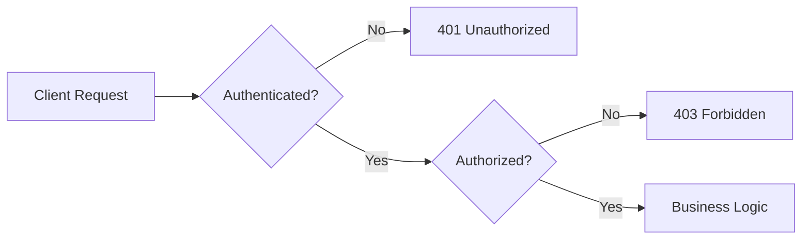
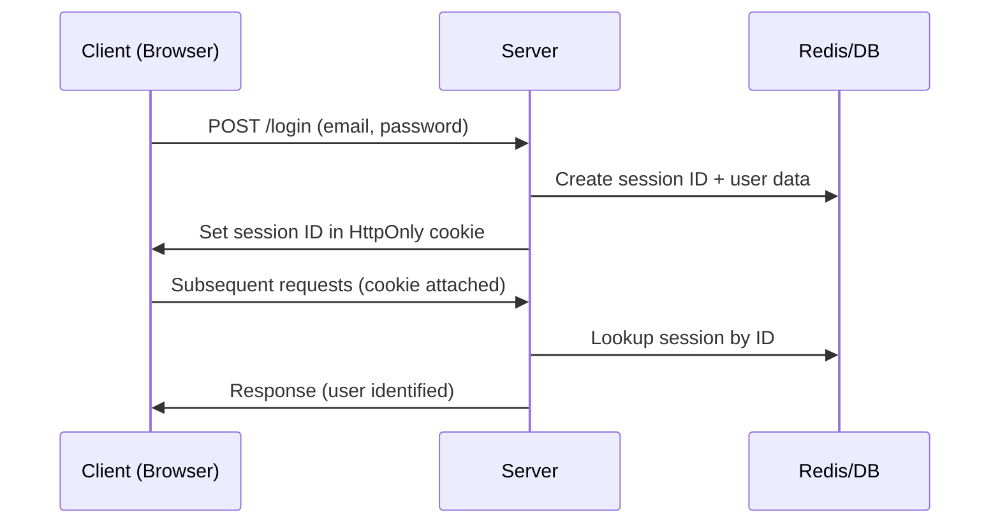
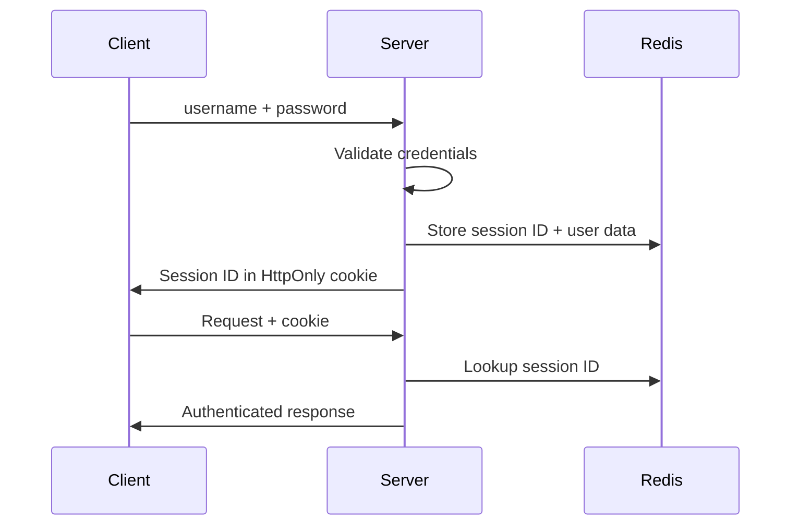
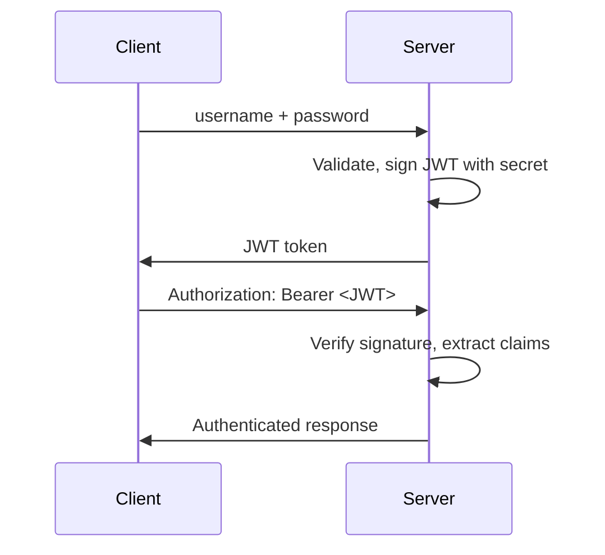
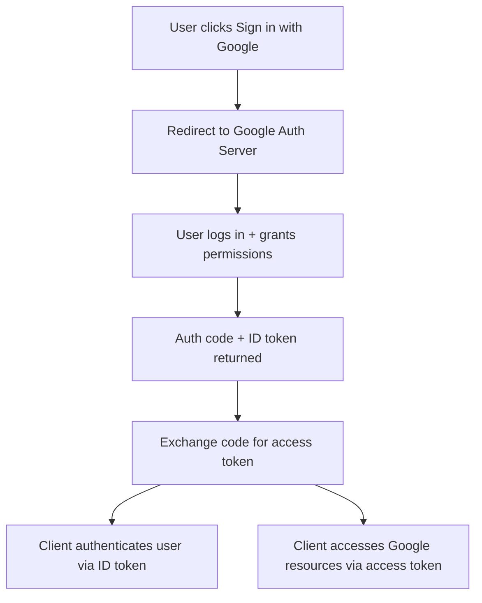
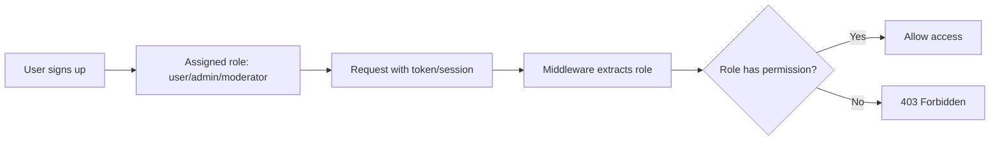

> **Motivation:** Every backend system must answer two questions on every request — *who are you?* and *what can you do?* — and getting those wrong is how breaches, broken UX, and production incidents start.

---

## 1. Authentication vs Authorization

| Concept | Question | Example |
|---------|----------|---------|
| **Authentication (AuthN)** | Who are you? | Login with email/password |
| **Authorization (AuthZ)** | What can you do? | Admin can access "dead zone" notes; regular user cannot |

These are distinct layers. A user can be authenticated (identity proven) but not authorized (lacks permission for a specific action → HTTP **403 Forbidden**).



---

## 2. Historical Evolution of Authentication

Understanding history explains *why* modern systems look the way they do.

### 2.1 Pre-industrial → Implicit Trust
- Identity = personal recognition (village elder vouches for you)
- Deals sealed with handshakes
- **Problem:** Does not scale beyond familiar communities

### 2.2 Medieval → Explicit Proof (Something You Have)
- **Wax seals** = first widely adopted authentication tokens
- Physical possession proves identity
- **Vulnerability:** Forgery = first recorded **authentication bypass attacks**

### 2.3 Industrial Revolution → Shared Secrets (Something You Know)
- Telegraph operators used pre-agreed **passphrases** (static passwords)
- Principle shifted from possession → knowledge

### 2.4 Digital Era (1960s+)
- **1961 MIT CTSS:** First password-based multi-user system
- Passwords stored in **plain text** → someone printed the password file → birth of **secure password storage** (hashing)
- **1970s:** Diffie-Hellman key exchange → **asymmetric cryptography** → backbone of modern protocols (PKI)
- **Kerberos:** Ticket-based auth → precursor to token-based systems

### 2.5 1990s → MFA
Combines three factors:
1. **Something you know** — password, PIN
2. **Something you have** — smart card, OTP generator
3. **Something you are** — biometrics (fingerprints, retina)

Biometrics introduce false positives/negatives and template security challenges.

### 2.6 21st Century → Modern Frameworks
- OAuth 2.0, OpenID Connect (OIDC), JWTs
- Zero Trust Architecture
- Passwordless (WebAuthn — public/private keys in hardware)
- **Future candidates:** Decentralized identity (blockchain), behavioral biometrics, **post-quantum cryptography** (current RSA/ECC algorithms break under quantum computers)

---

## 3. Core Building Blocks

### 3.1 Sessions (Stateful over Stateless HTTP)

HTTP is **stateless** — each request is isolated. Sessions add server-side memory.

**How sessions work:**



| Phase | What Happens |
|-------|--------------|
| **Creation** | Server generates unique session ID, stores user data (role, cart, auth state) in persistent store |
| **Delivery** | Session ID sent to client as **cookie** |
| **Validation** | Every request includes cookie; server fetches session data |
| **Expiry** | Sessions are short-lived (e.g., 15 min); expired → new session created |

**Storage evolution:**
1. File-based sessions (early, scalability issues)
2. Database-backed sessions (persistent across restarts)
3. **Redis/Memcached** (in-memory, fast lookups — current standard)

### 3.2 JWTs (JSON Web Tokens)

Formalized ~2015. **Stateless** mechanism for transferring **claims** between parties.

**Why JWTs emerged (mid-2000s):**
- Session data for millions of users = costly memory
- Distributed architectures: synchronizing sessions across regions = latency + consistency challenges

**JWT structure (3 parts, Base64-encoded):**

```
header.payload.signature
```

| Part | Contents |
|------|----------|
| **Header** | Metadata (signing algorithm) |
| **Payload** | Claims: `sub` (user ID), `iat` (issued at), `name`, `role`, etc. |
| **Signature** | Cryptographic verification using secret key |

**Advantages:**
1. **Statelessness** — no server-side session store
2. **Scalability** — any server with shared secret can verify
3. **Portability** — URL-friendly, passable between systems (headers, cookies, local storage)

**Disadvantages:**
1. **No server-side invalidation** — stolen JWT = impersonation until expiry
2. **Revocation is hard** — changing secret invalidates ALL users
3. **Hybrid approach** (JWT + blacklist in Redis) reintroduces statefulness — raises the question: why not use sessions?

> **Think:** JWT blacklist lookups defeat the purpose of statelessness. Industry advice: use an auth provider (Auth0, Clerk) for production; build your own only for learning.

### 3.3 Cookies

- Server stores a piece of information in the client's browser
- Cookie is **only accessible to the server that set it** (browser security)
- Automatically sent with every subsequent request to that server
- Used to automate token transport (session ID or JWT)
- **HttpOnly cookies** — JavaScript cannot access (prevents XSS token theft)

---

## 4. Authentication Types

### 4.1 Stateful Authentication (Sessions)



| Pros | Cons |
|------|------|
| Centralized control over all sessions | Scalability overhead in distributed systems |
| Real-time session visibility | Higher operational complexity |
| Easy revocation (logout, ban) | Replication latency across regions |
| Well-suited for web apps with strict session requirements | |

**Recommendation:** Most applications should prefer stateful auth for security and revocation convenience.

### 4.2 Stateless Authentication (JWT)



| Pros | Cons |
|------|------|
| Scalable, no session store | Token revocation is complex |
| Ideal for distributed/microservice architectures | Compromised token valid until expiry |
| Mobile-friendly (no cookies needed) | Changing secret logs out everyone |

**Hybrid recommendation:**
- **Web apps (browser):** Stateful (sessions)
- **Mobile apps / third-party API integrations:** Stateless (JWT)

### 4.3 API Key Authentication

**Use case:** Machine-to-machine (M2M) communication, programmatic server access.

**How it works:**
1. User generates cryptographically random API key in platform UI
2. Key stored in environment variables / secure storage
3. Attached to every request (typically in headers)
4. Server identifies caller, checks permissions, quotas, expiry

**Example:** OpenAI ChatGPT UI vs OpenAI API — same backend, different access paths.

| Ideal For | Not Ideal For |
|-----------|---------------|
| M2M communication | Human login flows |
| Third-party programmatic access | Visual/client interactions requiring login forms |
| Confined, permission-based, expiry-based access | |

**Why not sessions/JWT for M2M?** Login flows require human triggers (forms, token storage). API keys are set once and reused programmatically.

### 4.4 OAuth 2.0 + OpenID Connect (OIDC)

**Problem OAuth solved:** The **delegation problem**.

Early disastrous solution: users shared passwords with third-party apps → full account access, no permission scoping, impossible to revoke without changing password everywhere.

**OAuth 2.0 (2007→2010):** Share **tokens with specific permissions** instead of passwords.

**Four components:**

| Role | Description | Example |
|------|-------------|---------|
| **Resource Owner** | User who owns the data | You |
| **Client** | App requesting access | Facebook wanting your Google contacts |
| **Resource Server** | Server holding the data | Google servers |
| **Authorization Server** | Issues tokens after auth | Google OAuth server |

**OAuth 1.0 flow:**
1. Client redirects user to authorization server
2. User authenticates and grants permissions
3. Authorization server sends token to client
4. Client uses token to access resources

**OAuth 2.0 improvements (2010):**
- **Bearer tokens** (simpler, more vulnerable but easier to implement)
- Multiple **flows** for different app types:
  - **Authorization Code Flow** — server-side apps
  - **Implicit Flow** — browser apps (now discouraged, security risks)
  - **Client Credentials Flow** — M2M (no user/browser)
  - **Device Code Flow** — limited input devices (Smart TV)

**OpenID Connect (2014):** Built on OAuth 2.0 to fill the **authentication gap**.

OAuth = authorization (what can you do). OIDC adds **identity** (who are you) via **ID Token** (typically a JWT with user ID, name, email, issuing authority).

**"Sign in with Google" flow:**
1. Client redirects to Google authorization server
2. User logs in, grants permissions
3. Authorization server returns authorization code + ID token
4. Client exchanges code for access token (+ ID token if not received)
5. ID token (JWT) contains user identity; access token enables API operations on behalf of user



---

## 5. When to Use Which Authentication Type

| Type | Use When |
|------|----------|
| **Stateful (Sessions)** | Web apps, SaaS, strict session requirements, need revocation |
| **Stateless (JWT)** | APIs, distributed systems, mobile apps, microservices |
| **OAuth/OIDC** | Third-party integrations, "Login with X" providers |
| **API Keys** | Server-to-server, M2M, single-purpose programmatic API access |

**Day-to-day reality:** You'll use stateful + stateless most often. Use auth providers in production.

---

## 6. Authorization — RBAC

**Authorization** = assigning specific permissions to specific users. Not all users have the same capabilities.

**Example:** Note-taking platform with a "dead zone" (soft-deleted notes). Only admins should access it via admin UI.

**Bad approach:** Hardcoded "god mode" string in API calls → interceptable, not scalable for multiple admins.

**RBAC (Role-Based Access Control):**



| Role | Permissions (example) |
|------|----------------------|
| **User** | Read, write, delete own notes |
| **Moderator** | Read, write |
| **Admin** | Read, write + access dead zone |

Roles can be custom per resource (e.g., notes: read/write/delete; dead zone: admin only).

**Workflow:**
1. User registers → server assigns role
2. Subsequent requests carry token/session
3. Early in request cycle, server deduces role (from token or DB lookup)
4. Role attached to request context → passed to middleware chain
5. Business logic checks role before allowing action

---

## 7. Security Essentials for Backend Engineers

### 7.1 Generic Error Messages

| Bad (Information Leak) | Good (Generic) |
|------------------------|----------------|
| "User not found" | "Authentication failed" |
| "Incorrect password" | "Authentication failed" |
| "Account locked" | "Authentication failed" |

**Why:** Specific messages help attackers enumerate valid usernames and narrow attack surface (brute force only passwords).

> **Watch out:** Helpful error messages for legitimate users become attack clues for adversaries. Always use generic auth failure messages.

### 7.2 Timing Attacks

Authentication steps have different execution times:

```
Step 1: Find user by email     → fast (user not found → early exit)
Step 2: Check if account locked
Step 3: Hash password + compare → slow (hashing takes time)
```

**Attack:** Attacker measures response time differences to determine if username exists.

**Defenses:**
1. **Constant-time comparison** for password hashes (cryptographically secure comparison functions)
2. **Simulated response delay** — add fixed delay (e.g., 200ms) even when username doesn't exist, equalizing response times

---

## Key Takeaways

1. **Authentication ≠ Authorization.** AuthN proves identity; AuthZ checks permissions.
2. **Sessions** add state to stateless HTTP — best for web apps needing revocation and control.
3. **JWTs** trade revocation for scalability — ideal for distributed APIs and mobile.
4. **OAuth/OIDC** solved password-sharing chaos with scoped token delegation.
5. **API keys** are for M2M — not a replacement for user login flows.
6. **RBAC** is the standard authorization pattern — roles mapped to permissions, checked in middleware.
7. **Use auth providers in production** (Auth0, Clerk) — authentication is their headache, not yours.
8. **Never leak auth details** in error messages or response timing.
9. **Hybrid approaches** (sessions for web + JWT for mobile/API) beat trying to force one solution everywhere.

---

## Glossary

| Term | Definition |
|------|------------|
| **Authentication (AuthN)** | Process of verifying identity ("who are you?") |
| **Authorization (AuthZ)** | Process of verifying permissions ("what can you do?") |
| **Session** | Server-side stored context keyed by session ID in a cookie |
| **JWT** | Self-contained, signed, stateless token carrying user claims |
| **Cookie** | Browser storage mechanism; server sets, browser auto-sends on requests |
| **HttpOnly Cookie** | Cookie inaccessible to JavaScript (XSS mitigation) |
| **OAuth 2.0** | Authorization framework for delegated, scoped access via tokens |
| **OIDC** | Identity layer on OAuth 2.0; adds ID token for authentication |
| **Bearer Token** | Token sent in Authorization header; possessor can use it |
| **RBAC** | Role-Based Access Control — permissions assigned via roles |
| **MFA** | Multi-Factor Authentication — combines 2+ auth factors |
| **PKI** | Public Key Infrastructure — asymmetric crypto key management |
| **Hashing** | One-way cryptographic transform for password storage |
| **Bypass Attack** | Skipping authentication with malicious intent (e.g., seal forgery) |
| **Delegation** | Granting one platform scoped access to another platform's resources |
| **Timing Attack** | Inferring auth step failures by measuring response time differences |
| **403 Forbidden** | Authenticated but lacks permission |
| **401 Unauthorized** | Not authenticated |

---
