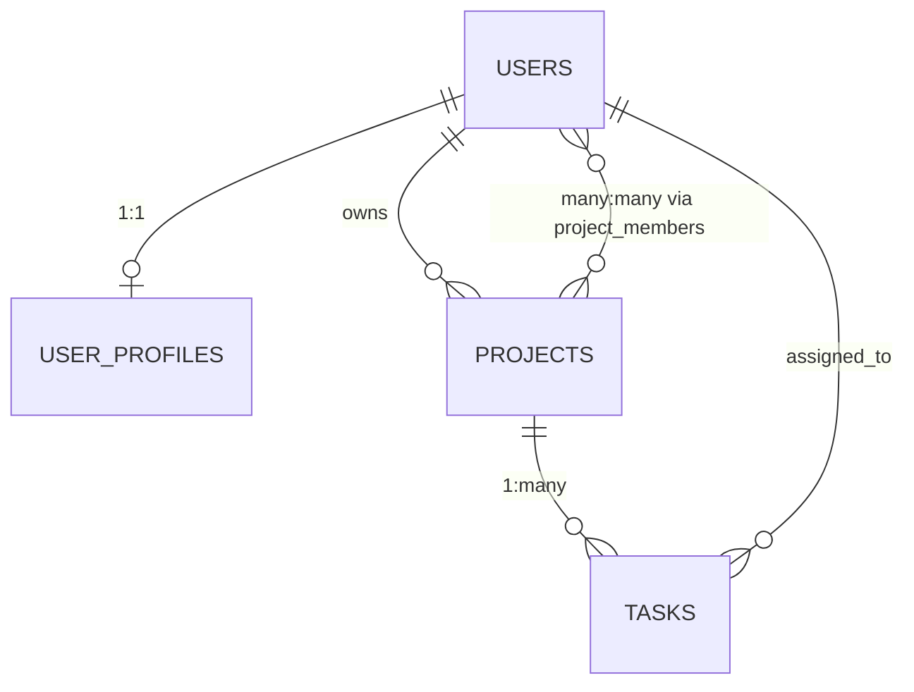
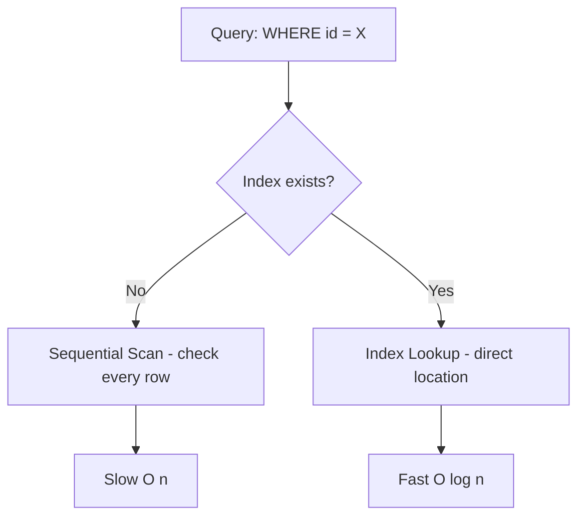

> **Motivation:** Databases are the persistence backbone of every backend — if you don't understand how they store, retrieve, and protect data, you're building on sand.

---

## 1. Why Databases?

**Persistence** = data survives after the program stops, across sessions and locations.

Without persistence: close your to-do app → lose all tasks.

**Database (generic):** Any structured storage supporting **CRUD** (Create, Read, Update, Delete).

Examples at the broadest level: contact lists, browser localStorage, text files.

**Database (backend context):** **Disk-based** databases — HDD/SSD storage.

### Why Disk Over RAM?

| | RAM (Primary Memory) | Disk (Secondary Storage) |
|--|---------------------|------------------------|
| **Speed** | Very fast | Relatively slow |
| **Cost** | Expensive | Cheap |
| **Capacity** | Limited (8–128 GB typical) | Large (512 GB–2 TB+ typical) |
| **Volatility** | Volatile (clears on power off) | Persistent |

**Trade-off:** Databases need capacity + persistence; speed sacrificed for cost. Caching (Redis) uses RAM for hot data.

---

## 2. DBMS — Database Management System

Software that efficiently manages disk-based data storage and operations.

**Core responsibilities:**

| Responsibility | Meaning |
|----------------|---------|
| **Data organization** | Efficient storage for fast CRUD |
| **Access** | Methods for create, read, update, delete |
| **Integrity** | Data accuracy and validity (e.g., payment field rejects strings) |
| **Security** | Protect from unauthorized access (users, roles) |

### Why Not Plain Text Files?

| Problem | Impact |
|---------|--------|
| **Parsing** | Must read entire file, split lines, compare fields — slow and error-prone |
| **No structure** | Cannot enforce types (number field accepts any string) |
| **Concurrency** | Two simultaneous updates → last write wins, data corruption (e.g., amount 40 → one adds 20, one subtracts 20 → unpredictable result) |

DBMS provides concurrency mechanisms for consistent concurrent access.

---

## 3. Relational vs Non-Relational

### 3.1 Relational Databases (SQL)

- Data in **tables** (rows + columns)
- **Predefined schema** — strict, must define columns and types upfront
- Relationships via **foreign keys**
- Queried with **SQL**
- Examples: PostgreSQL, MySQL, SQL Server

**Strengths:** Data integrity, complex queries, relationships, consistency.

**Good for:** CRM systems, e-commerce, anything needing accurate relational data.

### 3.2 Non-Relational Databases (NoSQL)

- **Flexible schema** — documents can have different structures
- MongoDB: tables → **collections**, rows → **documents**
- Examples: MongoDB, Redis

**Strengths:** Fast prototyping, flexible/dynamic data.

**Weaknesses:** Integrity enforced at application level (more bugs, more complexity).

**Good for:** CMS (varied content: images, code blocks, embeds), rapid prototyping.

### 3.3 Why PostgreSQL?

| Reason | Detail |
|--------|--------|
| **Open source** | Free, inspectable, self-hostable |
| **SQL standard compliant** | Easy migration to/from MySQL, SQL Server |
| **Extensible** | ~1400 pages of docs, extension system |
| **Reliable & scalable** | Production-proven |
| **JSON/JSONB support** | Handles dynamic data without switching to MongoDB |

**Rule of thumb:** PostgreSQL should be your first choice for almost all projects. Only optimize to MySQL etc. at massive scale with specific bottlenecks.

---

## 4. PostgreSQL Data Types (Backend Essentials)

### 4.1 Integers

| Type | Notes |
|------|-------|
| `serial` / `bigserial` | Auto-incrementing integer; use `bigserial` for production primary keys |
| `smallint`, `integer`, `bigint` | Increasing capacity |

### 4.2 Decimals vs Floats

| Type | Use When |
|------|----------|
| `decimal(10,2)` / `numeric` | **Accuracy matters** — prices, financial calculations |
| `real`, `double precision`, `float` | Approximate values OK — scientific computation, area measurements |

> **Watch out:** Floating point representation varies across systems. Never store money in floats.

### 4.3 Strings

| Type | Behavior | Recommendation |
|------|----------|----------------|
| `char(n)` | Pads with spaces to fixed length | **Never use** (legacy) |
| `varchar(n)` | Variable length, max n | OK but unnecessary in Postgres |
| `text` | Any length, no limit enforced | **Always prefer `text`** in PostgreSQL |

> **Think:** `varchar(255)` is a MySQL convention with no meaning in Postgres. Enforce length in application code, not DB schema. Avoids painful migrations later.

### 4.4 Other Important Types

| Type | Use |
|------|-----|
| `boolean` | true/false |
| `date`, `time`, `timestamp`, `timestamptz` | Date/time with optional timezone |
| `interval` | Durations ("10 days", "1 week") |
| `uuid` | Primary keys — URL-friendly, unique |
| `json` | Plain text JSON storage |
| `jsonb` | Binary JSON — **prefer over json** (faster queries, indexing) |
| Arrays | `integer[]`, `text[]`, etc. |

---

## 5. Database Migrations

**Problem:** Can't manually run SQL in a GUI — no version tracking, no rollback, no team coordination.

**Solution:** Sequential migration files managed by CLI tools (dbmate, golang-migrate, Alembic).

```
db/
  migrations/
    001_create_users.sql
    002_create_projects.sql
    003_add_indexes.sql
```

### Up vs Down Migrations

| Type | Purpose |
|------|---------|
| **Up** | Apply changes (CREATE TABLE, CREATE INDEX, etc.) |
| **Down** | Revert changes (DROP TABLE, etc.) for rollback |

Migration tool maintains a `schema_migrations` table tracking current version.

**Advantages:**
1. Track all schema changes over time (committed to Git)
2. Rollback on production failures
3. Team coordination — everyone applies same migrations

---

## 6. Schema Design — Project Management Platform

### 6.1 Naming Conventions

- **Tables:** plural, lowercase, snake_case (`users`, `user_profiles`, `project_members`)
- **Columns:** lowercase, snake_case (`full_name`, `password_hash`, `created_at`)
- **Never camelCase** in Postgres — case-insensitive by default, requires double quotes

### 6.2 Standard Metadata Fields

Every table should have:
- `id` — primary key (UUID with `gen_random_uuid()` default)
- `created_at` — `timestamptz`, default `now()`
- `updated_at` — `timestamptz`, auto-updated via triggers

### 6.3 Enums

```sql
CREATE TYPE project_status AS ENUM ('active', 'completed', 'archived');
```

**Why enums over text:**
1. **Data integrity** — DB rejects invalid values
2. **Documentation** — migration files self-document allowed values

### 6.4 Constraints

| Constraint | Effect |
|------------|--------|
| `PRIMARY KEY` | Unique + NOT NULL |
| `NOT NULL` | Field cannot be null (>70% of fields should have this) |
| `UNIQUE` | No duplicate values (e.g., email) |
| `CHECK` | Custom condition (e.g., `priority BETWEEN 1 AND 5`) |
| `FOREIGN KEY` | Value must exist in referenced table |
| `REFERENCES users(id) ON DELETE RESTRICT` | Cannot delete user while projects exist |
| `REFERENCES projects(id) ON DELETE CASCADE` | Deleting project deletes associated tasks |
| `ON DELETE SET NULL` | Sets FK to null when referenced row deleted |

### 6.5 Relationships



| Relationship | Implementation |
|--------------|----------------|
| **One-to-One** | Primary key of main table = primary key of related table (e.g., `user_id` PK in `user_profiles`) |
| **One-to-Many** | FK in child table referencing parent PK (e.g., `project_id` in `tasks`) |
| **Many-to-Many** | **Linking/junction table** with composite primary key of both FKs (e.g., `project_members(project_id, user_id)`) |

**Why separate `user_profiles` table?** Profile data grows/changes frequently; isolating it avoids constant migrations to the core `users` table.

### 6.6 Seeding

Test data inserted via separate migration files for development/testing environments. Uses CTEs (Common Table Expressions) for readable multi-table inserts.

---

## 7. SQL Queries for APIs

### 7.1 JOINs

```sql
-- Get all users with embedded profile JSON
SELECT u.*, to_jsonb(up.*) AS profile
FROM users u
LEFT JOIN user_profiles up ON u.id = up.user_id
ORDER BY u.created_at DESC;
```

| Join Type | Use When |
|-----------|----------|
| **INNER JOIN** | Both tables must have matching entries |
| **LEFT JOIN** | Want all rows from left table even if no match on right (e.g., user without profile) |

### 7.2 Parameterized Queries (SQL Injection Prevention)

```sql
SELECT u.*, to_jsonb(up.*) AS profile
FROM users u
LEFT JOIN user_profiles up ON u.id = up.user_id
WHERE u.id = :user_id;
```

Values in parameter slots are **always treated as strings** — even `DELETE FROM users` passed as a parameter won't execute as SQL.

> **Watch out:** Never concatenate user input into SQL strings. Always use parameterized queries via your driver/ORM.

### 7.3 Dynamic Filtering, Sorting, Pagination

```sql
-- Filter by first letter of name
WHERE u.full_name ILIKE :letter || '%'

-- Dynamic sort
ORDER BY :sort_by :sort_order

-- Pagination (page 1 = offset 0 in DB)
LIMIT :limit OFFSET :page * :limit
```

**API query params:** `page`, `limit`, `letter` (filter), `sort_by`, `sort_order`

- Whitelist allowed `sort_by` fields (don't let users sort by arbitrary columns)
- Default: `sort_by=created_at`, `sort_order=desc`, `page=1`, `limit=10`

### 7.4 CRUD Operations

| Operation | SQL Pattern |
|-----------|-------------|
| **Create** | `INSERT INTO users (email, full_name, password_hash) VALUES (:email, :name, :hash) RETURNING *` |
| **Read** | `SELECT ... WHERE id = :id` |
| **Update** | `UPDATE user_profiles SET bio = :bio, phone = :phone WHERE user_id = :user_id RETURNING *` |
| **Delete** | `DELETE FROM ... WHERE ...` |

---

## 8. Indexes

**Problem:** Without indexes, DB does **sequential scan** — checks every row one by one. O(n) on millions of rows = slow.

**Solution:** Index = lookup table mapping field values → disk locations (like a book's index section).



### When to Create Indexes

Create indexes on fields involved in:
1. **WHERE clauses**
2. **JOIN conditions**
3. **ORDER BY / sort operations**

**Only if the query is frequently called** — indexes have maintenance overhead on every INSERT/UPDATE.

| Index Example | Reason |
|---------------|--------|
| `users(email)` | Lookup/join by email |
| `users(created_at DESC)` | Default sort in list API |
| `tasks(project_id)` | Join tasks to projects |
| `tasks(assigned_to)` | Fetch tasks by user |
| `tasks(status)` | Filter by status |

**Primary keys are automatically indexed.** Foreign keys are NOT — index them if used in joins/WHERE.

> **Watch out:** Don't index everything. Each index adds write overhead. Monitor query frequency and performance before/after.

---

## 9. Triggers

**Problem:** `updated_at` field not auto-updated on row changes.

**Solutions:**
1. Manual — set `updated_at = now()` in every UPDATE query (error-prone)
2. **Trigger** — DB-level automation

```sql
-- Function: set updated_at to current timestamp
CREATE FUNCTION update_updated_at() RETURNS trigger AS $$
BEGIN
  NEW.updated_at = now();
  RETURN NEW;
END;
$$ LANGUAGE plpgsql;

-- Trigger: run function before every UPDATE on users
CREATE TRIGGER set_updated_at
  BEFORE UPDATE ON users
  FOR EACH ROW EXECUTE FUNCTION update_updated_at();
```

Apply to all tables with `updated_at` field.

---

## Key Takeaways

1. **Backend databases = disk-based DBMS** for capacity + persistence; cache hot data in RAM (Redis).
2. **PostgreSQL first** — open source, SQL compliant, JSONB support, production-proven.
3. **Schema design matters** — enums for integrity + docs, constraints for data safety, proper relationships.
4. **Migrations are mandatory** in production — version-controlled, rollback-capable schema changes.
5. **Parameterized queries always** — never concatenate user input into SQL.
6. **LEFT JOIN** when you need all parent rows regardless of child existence.
7. **Index strategically** — WHERE, JOIN, ORDER BY fields on frequently-called queries.
8. **Triggers automate** cross-cutting DB concerns like `updated_at`.
9. **Prefer `text` over `varchar(255)`**, `decimal` over `float` for money, `jsonb` over `json`.
10. **80% of backend DB work:** analyze API payload → construct dynamic parameterized query → execute → return data.

---

## Glossary

| Term | Definition |
|------|------------|
| **Persistence** | Data surviving beyond program lifetime |
| **DBMS** | Database Management System — software managing disk storage + CRUD |
| **CRUD** | Create, Read, Update, Delete |
| **Relational DB** | Table-based DB with predefined schema and foreign key relationships |
| **NoSQL** | Non-relational DB with flexible schema (e.g., MongoDB) |
| **Schema** | Structure definition of tables, columns, types, constraints |
| **Migration** | Version-controlled SQL file applying schema changes |
| **Primary Key** | Unique identifier for a row (auto-indexed) |
| **Foreign Key** | Column referencing another table's primary key |
| **Enum** | Custom type with predefined allowed values |
| **Referential Integrity** | Constraints protecting relationships (RESTRICT, CASCADE, SET NULL) |
| **JOIN** | Combine rows from multiple tables on matching conditions |
| **Parameterized Query** | Query with placeholder slots preventing SQL injection |
| **Index** | Lookup table accelerating queries on specific columns |
| **Sequential Scan** | Full table scan checking every row (slow at scale) |
| **Trigger** | DB function auto-executed on INSERT/UPDATE/DELETE events |
| **Seeding** | Inserting test data for development |
| **CTE** | Common Table Expression — named temporary result set in a query |
| **JSONB** | Binary JSON type in Postgres with indexing and query support |
| **Composite Primary Key** | Primary key spanning multiple columns (junction tables) |
| **Linking/Junction Table** | Table implementing many-to-many relationships |

---
