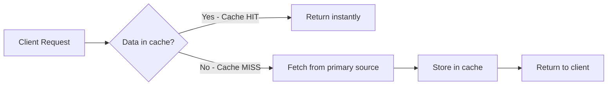
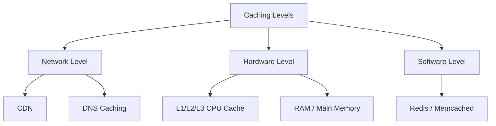
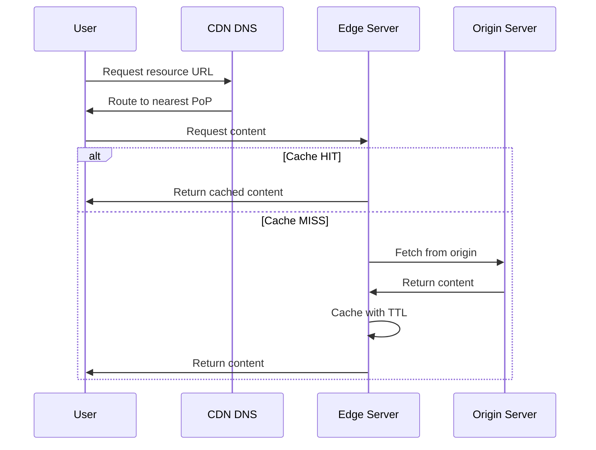
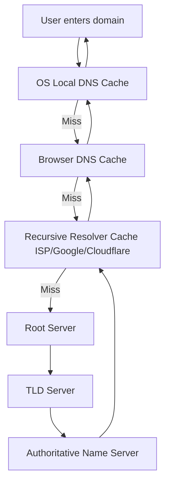
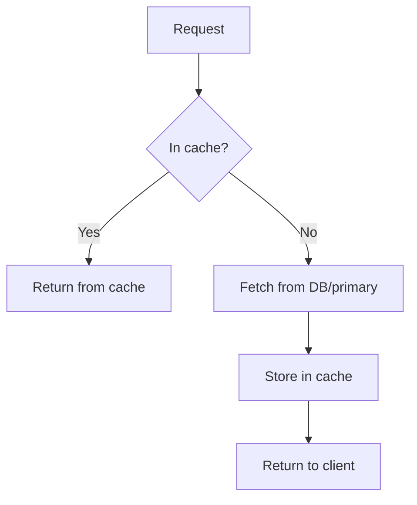
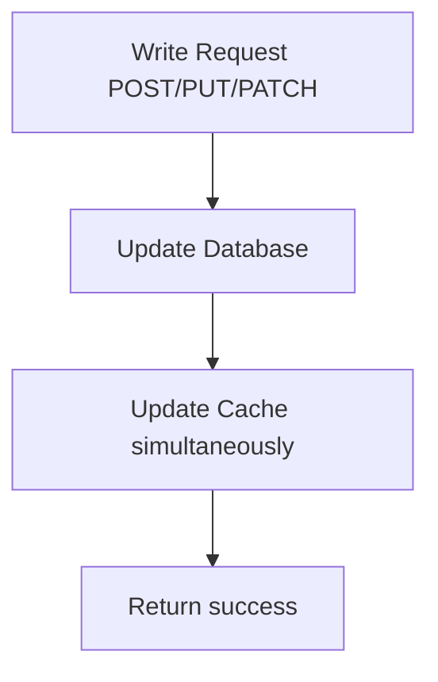
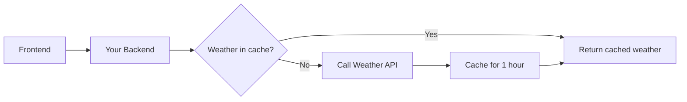
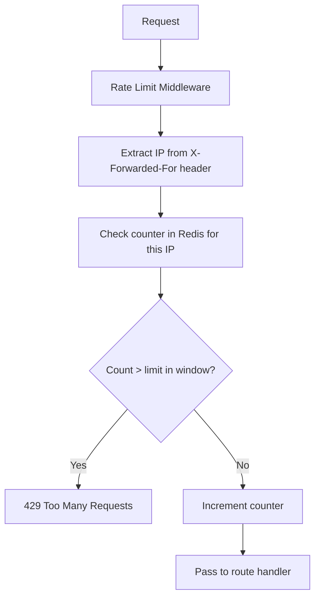

> **Motivation:** Caching is the single biggest lever for latency and load reduction in high-performance backends — skip repeated expensive work by keeping hot data close and fast.

---

## 1. What Is Caching?

**One-liner:** A mechanism to decrease the time and effort required to perform work.

**Technical definition:** Keep a **subset** of primary data in a **faster-to-access location**, chosen based on usage frequency, access patterns, and probability of next access.



---

## 2. Real-World Examples

### 2.1 Google Search
- Query processing (crawling, indexing, ranking billions of pages) is computationally expensive
- Queries like "weather today" searched millions of times daily
- **Without cache:** Recompute every time → high latency, server overload
- **With cache:** Distributed in-memory cache stores results → instant return on cache hit

### 2.2 Netflix (CDN)
- Terabytes of video content across multiple resolutions (1080p, 720p, 480p)
- **Origin servers** in US data centers
- **Edge locations** worldwide cache content subsets close to users
- User in India served from nearby edge, not US origin → minimal buffering

### 2.3 Twitter/X Trending Topics
- Analyzing millions of tweets in real-time = expensive (ML, GPUs, terabytes of data)
- Trends change over hours/days, not seconds
- **Solution:** Compute trends every few minutes, cache in Redis, serve instantly on request

### Pattern Recognition

Caching applies when you want to avoid:
1. **Heavy repeated computation**
2. **Sending large amounts of data repeatedly**

---

## 3. Three Levels of Caching (Backend Focus)



---

## 4. Network-Level Caching

### 4.1 CDN (Content Delivery Network)

**Goal:** Cache content on servers geographically close to users (edge nodes / points of presence).

**How CDN works:**



| Concept | Meaning |
|---------|---------|
| **PoP (Point of Presence)** | Regional cluster of edge servers |
| **Origin Server** | Primary server holding all content |
| **TTL (Time To Live)** | How long cached content remains valid before refresh |
| **Cache HIT** | Requested data found in cache |
| **Cache MISS** | Not in cache → fetch from origin, then cache |

Routing considers: geographic location, network conditions (may route to lower-quality PoP for bad connections).

**Used by:** Netflix, Vercel edge network, any static asset delivery.

### 4.2 DNS Caching

DNS resolution is expensive (recursive queries through root → TLD → authoritative name servers).

**Caching layers (hierarchy):**



Each layer caches results to avoid repeating the full recursive lookup chain.

---

## 5. Hardware-Level Caching

### CPU Cache Hierarchy

```
CPU → L1 Cache → L2 Cache → L3 Cache (shared) → RAM → Hard Disk → Network
     (fastest, smallest)                              (slowest, largest)
```

- **L1/L2/L3:** CPU keeps frequently accessed data close for fast retrieval
- **Predictive algorithms:** Sequential array traversal prefetches entire memory blocks into cache

### RAM (Random Access Memory / Main Memory)

| Property | Detail |
|----------|--------|
| **Speed** | Direct electrical access to any memory address — constant time |
| **Capacity** | Limited |
| **Volatility** | Clears on power off |
| **Trade-off** | Speed over persistence and capacity |

**Hard disk:** Mechanical head movement (HDD) or slower electrical access (SSD) — persistent but slower.

This RAM vs disk trade-off is exactly why in-memory caches exist.

---

## 6. Software-Level Caching (Backend Focus)

### In-Memory Key-Value NoSQL Databases

| Property | Detail |
|----------|--------|
| **In-memory** | Data stored in RAM, not disk |
| **Key-value** | Simple key → value (string, JSON, list, etc.) |
| **NoSQL** | No strict schema like relational DBs |
| **Persistence** | Optional — load from disk on startup, persist periodically |

**Technologies:** Redis, Memcached, AWS ElastiCache

**Why fast:** Data access operations happen in primary memory, not disk.

---

## 7. Caching Strategies

### 7.1 Lazy Caching (Cache-Aside)



- Don't proactively cache — only cache on actual request
- Most common pattern in backend development
- Used by: Google search, Twitter trends

### 7.2 Write-Through Caching



- Every write updates both DB and cache in same execution flow
- **Pros:** Cache always fresh, never serves stale data
- **Cons:** Write operations have more overhead

---

## 8. Eviction Policies

When cache memory is full, old data must be removed to make room.

| Policy | Behavior |
|--------|----------|
| **No eviction** | Insert fails with "memory full" error |
| **LRU (Least Recently Used)** | Evict data accessed longest ago |
| **LFU (Least Frequently Used)** | Evict data with lowest access count |
| **TTL-based** | Evict keys closest to expiration |

> **Think:** Cache is always a **subset** of primary storage. You cannot cache everything — it's more expensive than disk.

---

## 9. Backend Use Cases for Redis

### 9.1 Database Query Caching

- Expensive SQL queries (many JOINs, aggregations) called frequently
- Cache result with TTL (e.g., 1 hour)
- On cache hit: serve from Redis, skip DB load
- **Examples:** Amazon product details/prices, dashboard aggregations

### 9.2 Session Storage

- After authentication, session token stored in Redis (not DB)
- Every API call fetches session from Redis — much faster than DB lookup
- Tied directly to stateful authentication patterns

### 9.3 External API Caching



- Avoid hitting external API rate limits and billing
- Weather data safe to cache (doesn't change every second)
- Use TTL (e.g., 1 hour)

### 9.4 Rate Limiting



- Store request counters per IP in Redis (key-value)
- Example: 50 requests per minute per IP
- **Why Redis over DB:** 20-30ms difference matters at scale; avoids flooding DB with rate-limit lookups

---

## 10. When NOT to Cache

- Data changes frequently and staleness causes bugs
- Cache size would need to be nearly as large as primary storage (defeats purpose)
- Query is rarely called (index maintenance overhead not worth it)
- Strong consistency required on every read

---

## Key Takeaways

1. **Caching = subset of data in faster storage** — decreases time and effort for repeated work.
2. **Three backend-relevant levels:** Network (CDN, DNS), Hardware (RAM), Software (Redis).
3. **Cache-Aside (lazy)** is the default read pattern; **Write-Through** keeps cache fresh on writes.
4. **Eviction policies** (LRU, LFU, TTL) manage limited cache capacity.
5. **Redis use cases:** DB query results, sessions, external API responses, rate limiting counters.
6. **Cache HIT = fast path; Cache MISS = fetch, store, return.**
7. **CDN + edge caching** is how global platforms (Netflix, Vercel) minimize latency.
8. **Don't cache everything** — it's expensive; cache what's frequently accessed and safe to be slightly stale.
9. **Redis is simple** (key → value) but understanding eviction, TTL, and strategies helps you make better architecture decisions.

---

## Glossary

| Term | Definition |
|------|------------|
| **Cache** | Subset of data stored in faster-access location |
| **Cache HIT** | Requested data found in cache |
| **Cache MISS** | Data not in cache; must fetch from primary source |
| **CDN** | Content Delivery Network — geographically distributed edge caching |
| **Edge Location / PoP** | Regional server cluster serving cached content |
| **Origin Server** | Primary server holding authoritative content |
| **TTL** | Time To Live — duration before cached entry expires |
| **Cache-Aside / Lazy Caching** | Cache populated only on request after miss |
| **Write-Through** | Updates written to both DB and cache simultaneously |
| **Eviction Policy** | Strategy for removing old cache entries when full |
| **LRU** | Least Recently Used eviction |
| **LFU** | Least Frequently Used eviction |
| **In-Memory Database** | DB storing data in RAM (Redis, Memcached) |
| **Key-Value Store** | Data model with simple key → value pairs |
| **Primary Memory / RAM** | Fast, volatile memory used by caches |
| **Secondary Storage** | Persistent disk storage (Postgres, etc.) |
| **Recursive Resolver** | DNS server that traverses DNS hierarchy to resolve domains |
| **Rate Limiting** | Restricting request frequency per client/IP |
| **429 Too Many Requests** | HTTP status for rate limit exceeded |
| **X-Forwarded-For** | Header containing client's public IP (added by reverse proxy) |

---
