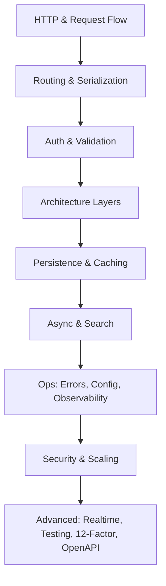

# Roadmap: Backend Engineering from First Principles
> Backend is far more than CRUD APIs — this roadmap orders the concepts required to build reliable, scalable, fault-tolerant, maintainable systems without drowning in 1,000 disconnected tutorials.

## Why This Roadmap Exists

Most engineers learn through college/bootcamp CRUD, then **trial and error** over years. Starting from a single framework (Express, Spring Boot, Rails) creates **blind spots** when switching languages or debugging production failures.

This playlist synthesizes books, open-source codebases, and industry practice into a **conceptual sequence** — how ideas connect, not just what they are.

## Foundation Layer

| Topic | Core focus |
|-------|------------|
| **Backend anatomy** | DNS → firewall → reverse proxy → app; client vs server execution |
| **HTTP** | Methods, headers, status codes, CORS, caching, compression, TLS |
| **Routing** | URL → handler mapping; path/query params; versioning; catch-all |
| **Serialization** | JSON/XML/Protobuf; interoperability; validation at boundaries |

## Application Layer

| Topic | Core focus |
|-------|------------|
| **Authentication & authorization** | Sessions, JWT, OAuth/OIDC, API keys, MFA, hashing, RBAC/ABAC, security practices |
| **Validation & transformation** | Syntactic/semantic/type validation; normalization; sanitization; fail-fast |
| **Middleware** | Chaining, ordering, auth, rate limit, parsing, compression, security headers |
| **Request context** | Request-scoped state, trace IDs, user injection, timeouts, cleanup |
| **Handlers / controllers / services / repositories** | Presentation vs business vs data access; separation of concerns |
| **REST API design** | Resources, HTTP semantics, pagination, filtering, versioning, OpenAPI mindset |

## Data & Performance Layer

| Topic | Core focus |
|-------|------------|
| **Databases (Postgres focus)** | SQL vs NoSQL, ACID, CAP, schema design, indexes, pooling, migrations, ORMs |
| **Caching** | Cache-aside, write-through/behind, eviction (LRU/LFU/TTL), invalidation, L1/L2 |
| **Task queues** | Producer/consumer/broker; retries; prioritization; background jobs |
| **Elasticsearch** | Inverted index, TF-IDF, shards, full-text search, analyzers |

## Production Layer

| Topic | Core focus |
|-------|------------|
| **Error handling** | Fail-fast vs fail-safe; custom errors; global handlers; user-facing messages |
| **Configuration** | Env vars, secrets, feature flags; static vs dynamic config |
| **Logging, monitoring, observability** | Structured logs; metrics; traces; Prometheus/Grafana; alert fatigue |
| **Graceful shutdown** | SIGTERM handling; drain in-flight; close connections |
| **Security** | Injection, XSS, CSRF, rate limits, least privilege, defense in depth |
| **Scaling & performance** | Bottlenecks, N+1 queries, batching, compression, profiling |
| **Concurrency** | IO-bound vs CPU-bound; parallelism vs concurrency |

## Extended Topics (Roadmap Tail)

- Object storage (S3), large file streaming, multipart uploads
- Realtime: WebSockets, SSE, pub/sub
- Testing: unit/integration/e2e, TDD, load testing, code quality metrics
- **12-Factor App** principles
- **OpenAPI** / API-first development
- **Webhooks** vs polling APIs
- **DevOps awareness**: CI/CD, Docker, Kubernetes, deployment strategies (blue-green, rolling)

> ⚠️ Watch out: Treating this as a checklist to binge-watch misses the point — each topic assumes the previous ones when debugging real systems.

> 💭 Think: If you could only master five topics before joining a production team, which five from this roadmap would cover the most incident types?

## Key Takeaways

- Backend engineering = **reliable + scalable + fault-tolerant + maintainable** systems, not just endpoints.
- Framework-first learning transfers poorly; **concept-first** learning transfers everywhere.
- The roadmap spans ~30–40 videos from HTTP fundamentals through DevOps literacy.
- Postgres, HTTP/JSON, and REST are the **default teaching stack** — other tools are compared in context.

## Glossary

| Term | Meaning |
|------|---------|
| **ACID** | Atomicity, Consistency, Isolation, Durability — relational DB transaction guarantees |
| **CAP theorem** | Trade-off between Consistency, Availability, Partition tolerance in distributed systems |
| **12-Factor App** | Methodology for building portable, scalable SaaS applications |
| **Cache-aside** | App reads cache first; on miss, reads DB and populates cache |
