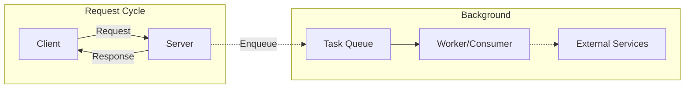
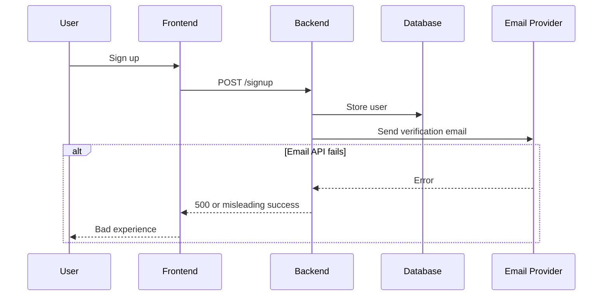
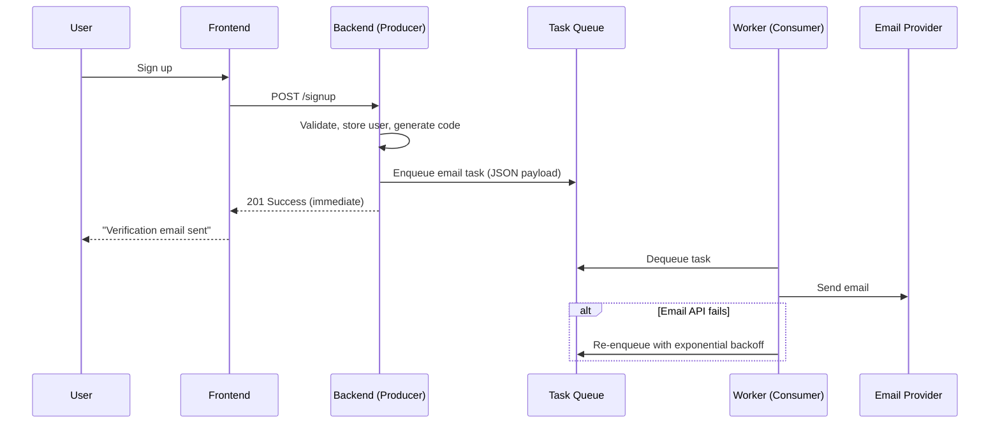
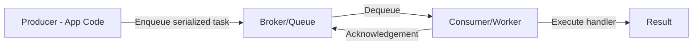
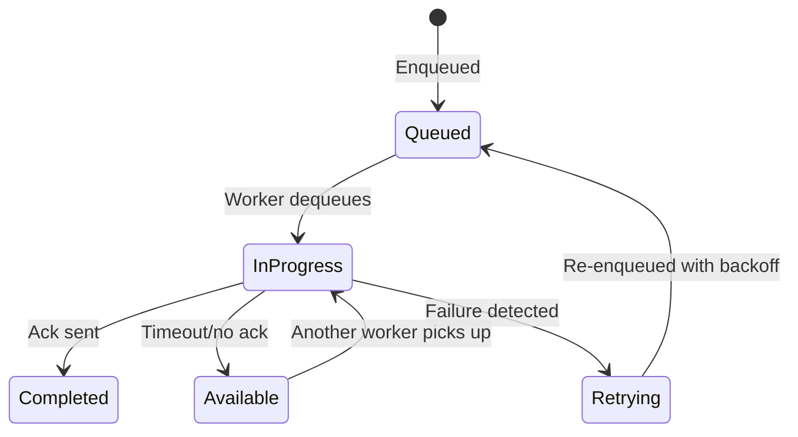
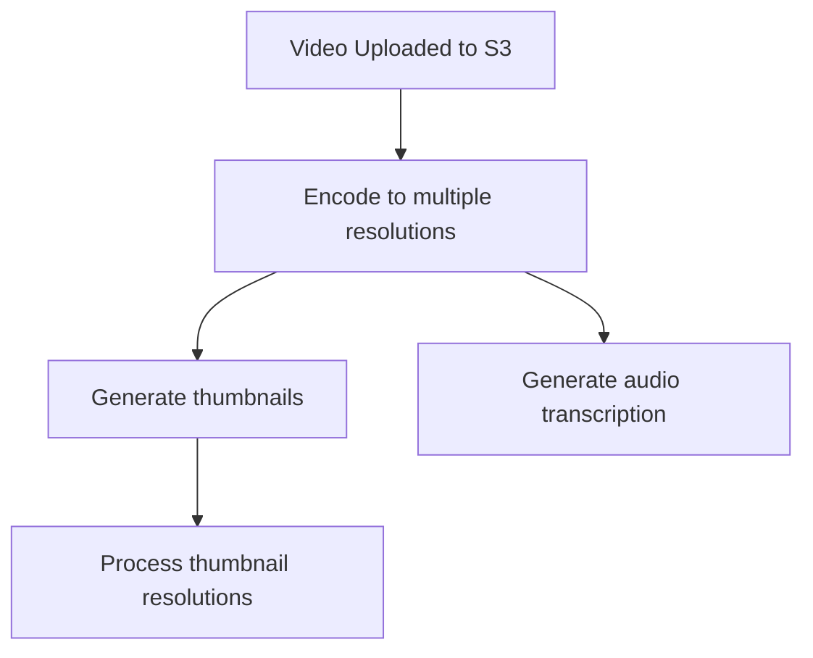

> **Motivation:** Not every operation belongs in the request-response cycle — offloading slow, non-critical, or failure-prone work to background jobs keeps your APIs fast, resilient, and user-friendly.

---

## 1. What Is a Background Task?

**Definition:** Any piece of code that runs **outside** the request-response lifecycle.

**Characteristics:**
- Does NOT need to happen immediately
- Not mission-critical to the synchronous response
- Can run in a separate process
- Can be retried on failure

---

## 2. Why Background Jobs? — The Email Example

### Synchronous (Bad) Flow

**Problems:**
1. Email provider downtime → signup API fails entirely (with bad error handling)
2. Even with good error handling → user told "email sent" but it wasn't
3. User must manually retry "resend email"
4. External service latency blocks your API response

### Asynchronous (Good) Flow

**Benefits:**
- User gets instant response
- Email sending happens in background (milliseconds to seconds later)
- Automatic retry with exponential backoff if email provider is down
- Signup succeeds regardless of email provider status

---

## 3. Task Queue Architecture

| Component | Role |
|-----------|------|
| **Producer** | Application code that creates tasks, serializes data (JSON), pushes to queue |
| **Broker/Queue** | Temporary holding area storing tasks until workers are ready |
| **Consumer/Worker** | Separate process that monitors queue, dequeues tasks, executes registered handlers |
| **Enqueue** | Adding a task to the queue |
| **Dequeue** | Removing a task from the queue for processing |
| **Acknowledgement** | Worker signals successful completion → queue removes task |

**Analogy:** A to-do list for your backend. App adds tasks; workers pick them off one by one.

### Underlying Technologies

| Technology | Type |
|------------|------|
| **Redis Pub/Sub** | In-memory message broker |
| **RabbitMQ** | Message broker |
| **AWS SQS** | Managed queuing (multi-region, scalable) |

### Frameworks by Language

| Language | Framework |
|----------|-----------|
| Python | Celery |
| Node.js | BullMQ |
| Go | Asynq |

---

## 4. Task Lifecycle Details

### Serialization
- Producer serializes task data to JSON (or framework-specific format)
- Consumer deserializes to native format (Python dict, JS object, Go struct)

### Acknowledgement & Visibility Timeout

- Worker dequeues task → task enters **visibility timeout** (in-progress period)
- If worker crashes or external service hangs → no acknowledgement within timeout
- Queue makes task **available again** for other workers
- Prevents task loss in the pipeline

### Retry with Exponential Backoff

| Attempt | Wait Before Retry |
|---------|-------------------|
| 1st failure | 1 minute |
| 2nd failure | 2 minutes |
| 3rd failure | 4 minutes |
| 4th failure | 8 minutes |
| Max retries | 5 (configurable) |

Most external service outages last seconds, not minutes — retries usually succeed.

---

## 5. Types of Background Tasks

### 5.1 One-Off Tasks
Triggered by a specific event; run once.

| Trigger | Task |
|---------|------|
| User registers | Send verification email |
| Verification succeeds | Send welcome email |
| Password reset requested | Send reset link email |
| Someone messages you | Send push notification |

### 5.2 Recurring Tasks (Cron Jobs)
Executed periodically on a schedule.

| Example | Schedule |
|---------|----------|
| Daily/weekly/monthly reports | Midnight, Sunday, end of month |
| Orphan session cleanup | Every 2-3 months |
| Database maintenance | End/start of month |

Frameworks (Celery, BullMQ) support scheduled task configuration.

### 5.3 Chain Tasks (Parent-Child)
Tasks with dependencies — child runs only after parent completes.

**LMS video upload example:**

- Thumbnail generation + transcription can run **in parallel** (both depend on encoding)
- Thumbnail processing depends on thumbnail generation
- Each step is a separate task with parent-child relationship

### 5.4 Batch Tasks
Single trigger spawns many sub-tasks or processes large workloads.

**Account deletion example:**
1. User clicks "Delete Account"
2. API immediately returns 200 + logs user out
3. Background worker: delete projects, assets, profile, send confirmation email
4. Optional grace period (3-7 days to cancel)

**Why not synchronous?** User may have data across shards/regions — deletion could take 40-60+ seconds. Can't block API that long.

**Batch report generation:** Midnight trigger → thousands of report tasks for all users.

---

## 6. Common Background Task Use Cases

| Use Case | Why Background |
|----------|----------------|
| **Sending emails** | External SMTP provider (Resend, Mailgun, Brevo) — unreliable latency |
| **Image/video processing** | Resize, encode multiple resolutions — CPU-intensive |
| **Report generation** | PDF/HTML reports with complex data aggregation |
| **Push notifications** | Requires API call to Google/Apple push services |
| **Account deletion** | Multi-table, multi-region data cleanup |
| **Data exports** | Large dataset processing |

---

## 7. Design Considerations at Scale

### 7.1 Idempotency
Tasks must be safely executable **multiple times** without side effects.

**Example:** Delete account task fails midway → retry starts from scratch. Use **transactions** with manual rollback so partial deletions don't corrupt state.

### 7.2 Error Handling
- Robust error handling in separate processes (easy to miss edge cases)
- Log errors comprehensively for debugging
- Enable queue retry mechanisms

### 7.3 Monitoring
Track at all times:
- Queue length (pending tasks)
- Successful vs failed task counts
- Primary failure reasons (external vs internal)

**Tools:** Prometheus, Grafana, metrics instrumentation.

Set alerts when queue length exceeds thresholds or workers go down.

### 7.4 Horizontal Scaling
Design so you can add more consumer nodes when user base spikes.

### 7.5 Ordered Delivery
If task order matters, ensure your queue framework supports ordered delivery.

### 7.6 Rate Limiting on External Services
Background tasks calling external APIs must respect those services' rate limits and billing.

---

## 8. Best Practices

| Practice | Detail |
|----------|--------|
| **Keep tasks small and focused** | One task = one processing unit. Divide responsibilities. |
| **Use chain tasks for dependencies** | Don't cram dependent operations into one task |
| **Avoid long-running tasks** | Break into smaller chunks |
| **Proper error handling + logging** | Essential for debugging in separate processes |
| **Monitor queue length + worker health** | Alerting when queue backs up or workers crash |
| **Idempotent design** | Safe retries without duplicate side effects |

> **Watch out:** Putting too much into a single task means one failure retries everything, wasting CPU. If step 3 fails after steps 1-2 succeed, you redo all of it.

---

## Key Takeaways

1. **Background tasks run outside request-response** — for non-immediate, non-critical, or external-dependency work.
2. **Task queue = producer → broker → consumer** — the engine enabling reliable background processing.
3. **Email sending is the canonical example** — never block signup on external SMTP latency/failures.
4. **Retry with exponential backoff** makes systems resilient to transient external service outages.
5. **Four task types:** one-off, recurring (cron), chain (parent-child), batch (bulk operations).
6. **Idempotency is critical** — design tasks safe for multiple executions.
7. **Visibility timeout** prevents task loss when workers crash mid-processing.
8. **Keep tasks small** — easier to scale, debug, monitor, and retry.
9. **Monitor queue health** — queue length and worker status should always be visible.
10. **Frameworks:** Celery (Python), BullMQ (Node.js), Asynq (Go); brokers: Redis, RabbitMQ, AWS SQS.

---

## Glossary

| Term | Definition |
|------|------------|
| **Background Task/Job** | Code executing outside the request-response cycle |
| **Task Queue** | System for managing and distributing background jobs |
| **Producer** | Application code that creates and enqueues tasks |
| **Consumer/Worker** | Separate process that dequeues and executes tasks |
| **Broker** | Queue storage holding tasks until workers process them |
| **Enqueue** | Adding a task to the queue |
| **Dequeue** | Removing a task from queue for processing |
| **Acknowledgement (Ack)** | Worker signal that task completed successfully |
| **Visibility Timeout** | Period a dequeued task is hidden from other workers |
| **Exponential Backoff** | Retry strategy with increasing wait intervals |
| **Idempotency** | Task safely executable multiple times without side effects |
| **One-Off Task** | Single task triggered by a specific event |
| **Recurring Task / Cron Job** | Task executed on a periodic schedule |
| **Chain Task** | Task with parent-child dependency relationships |
| **Batch Task** | Single trigger spawning many sub-tasks or large workload |
| **Serialization** | Converting task data to transmittable format (JSON) |
| **Deserialization** | Converting serialized data back to native format |
| **Cron Job** | Scheduled task running at fixed intervals |
| **Push Notification** | Mobile notification delivered via OS service (Google/Apple) |
| **Grace Period** | Time window allowing user to cancel destructive operations |
| **M2M Communication** | Machine-to-machine — server calling server without human interaction |
| **SMTP Provider** | Email delivery service (Resend, Mailgun, Brevo) |
| **Horizontal Scaling** | Adding more worker nodes to handle increased load |

[REDACTED]
