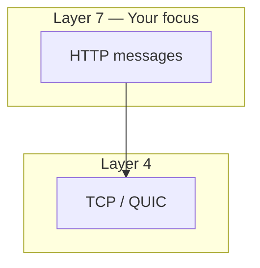
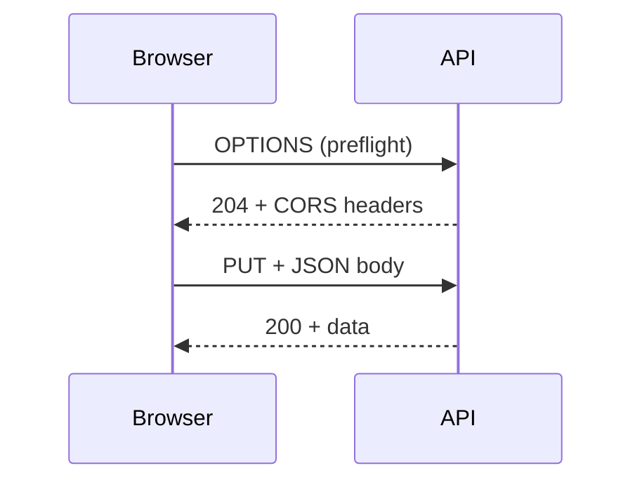

# Understanding HTTP for Backend Engineers
> HTTP is the contract between clients and servers — stateless, client-initiated messages whose methods express intent, headers carry metadata, and status codes report outcomes without parsing bodies.

## Two Core Ideas

### 1. Stateless

Each request is **self-contained**. The server has no memory of prior interactions. Every request must include everything needed: URL, method, headers, auth tokens, body.

**Benefits:**
- **Simplicity** — no server-side session store required
- **Scalability** — any server in a pool can handle any request
- **Resilience** — server crash does not orphan client state on that machine

State is **reintroduced** via cookies, sessions, and JWTs when continuity is needed (login, cart).

### 2. Client-Server Model

The **client always initiates**; the server responds. HTTPS ≈ HTTP + TLS encryption — same application-layer semantics.

HTTP requires a **reliable transport** → typically **TCP** (connection-based, ordered delivery). HTTP/3 uses **QUIC over UDP** for lower latency.



> 💭 Think: Why does statelessness make load balancing easier than sticky sessions?

## HTTP Version Evolution

| Version | Key change |
|---------|------------|
| **HTTP/1.0** | New TCP connection per request — slow |
| **HTTP/1.1** | Persistent connections, chunked transfer, better caching (default today) |
| **HTTP/2** | Multiplexing, binary framing, header compression (HPACK), server push |
| **HTTP/3** | QUIC/UDP, reduced head-of-line blocking vs HTTP/2 |

For backend work: **messages are sent over an established connection** — that is enough until you optimize latency.

## Message Structure

**Request:**
```
GET /path HTTP/1.1
Host: example.com
Header: value

[optional body]
```

**Response:**
```
HTTP/1.1 200 OK
Header: value

[optional body]
```

Blank line separates headers from body.

## HTTP Headers

Headers are **key-value metadata** — like shipping labels on a parcel, not inside the package. Carriers read labels without opening contents.

### Categories

| Type | Purpose | Examples |
|------|---------|----------|
| **Request** | Client context | `User-Agent`, `Authorization`, `Accept` |
| **General** | Message metadata | `Date`, `Cache-Control`, `Connection` |
| **Representation** | Body format | `Content-Type`, `Content-Length`, `Content-Encoding`, `ETag` |
| **Security** | Browser behavior | `Strict-Transport-Security`, `Content-Security-Policy`, `X-Frame-Options` |

### Two Powerful Properties

1. **Extensibility** — new headers without protocol changes (`X-Custom-Header`, HSTS)
2. **Remote control** — client instructs server via `Accept`, `Accept-Language`, `Accept-Encoding`; server instructs client via `Cache-Control`, `Set-Cookie`

## HTTP Methods = Intent

Methods express **what** you want to do (routing expresses **where**).

| Method | Intent | Body? | Idempotent? |
|--------|--------|-------|-------------|
| **GET** | Fetch resource | No | Yes |
| **POST** | Create / non-idempotent action | Yes | No |
| **PUT** | Full replace | Yes | Yes |
| **PATCH** | Partial update | Yes | Often |
| **DELETE** | Remove resource | Optional | Yes |
| **OPTIONS** | Capabilities (CORS preflight) | No | Yes |

> ⚠️ Watch out: Developers often use PUT when PATCH is correct. Default to **PATCH** unless you intentionally replace the entire resource.

**Idempotent** — multiple identical calls yield the same result. POST creating a note twice creates **two notes** → non-idempotent.

## CORS (Cross-Origin Resource Sharing)

Browsers enforce **same-origin policy** — JS on `example.com` cannot read responses from `api.other.com` unless the server allows it.

### Simple Request Flow

1. Browser sends request with `Origin` header
2. Server responds with `Access-Control-Allow-Origin: https://example.com` (or `*`)
3. Browser allows JS to read response; otherwise **blocks** with CORS error

### Preflight Request

Triggered when cross-origin AND any of:
- Method not GET/POST/HEAD (e.g., PUT, DELETE)
- Non-simple headers (e.g., `Authorization`)
- `Content-Type` not `application/x-www-form-urlencoded`, `multipart/form-data`, or `text/plain` (JSON triggers preflight)

**Preflight:** browser sends `OPTIONS` → server responds with allowed origins, methods, headers, `Access-Control-Max-Age` → then actual request.



> 💭 Think: Why does JSON `Content-Type` trigger preflight but form-urlencoded often does not?

## Status Codes

Three-digit codes; first digit = class:

| Class | Meaning | Common codes |
|-------|---------|--------------|
| **1xx** | Informational | 100 Continue, 101 Switching Protocols |
| **2xx** | Success | 200 OK, 201 Created, 204 No Content |
| **3xx** | Redirection | 301 Moved Permanently, 302 Temporary, 304 Not Modified |
| **4xx** | Client error | 400 Bad Request, 401 Unauthorized, 403 Forbidden, 404 Not Found, 409 Conflict, 429 Too Many Requests |
| **5xx** | Server error | 500 Internal Server Error, 502 Bad Gateway, 503 Service Unavailable, 504 Gateway Timeout |

- **401** — not authenticated (missing/expired token)
- **403** — authenticated but not permitted
- **502/504** — proxy/load balancer could not get valid/timely response from upstream

## HTTP Caching

Server labels responses with `Cache-Control: max-age=10`, `ETag`, `Last-Modified`. Client revalidates with `If-None-Match` / `If-Modified-Since`. Unchanged → **304 Not Modified** (use cached copy).

> ⚠️ Watch out: Stale ETags cause clients to serve outdated data — critical for mutable resources.

Modern SPAs often use **client-side caches** (React Query) with explicit invalidation instead of browser HTTP cache alone.

## Content Negotiation

Client preferences via headers; server responds accordingly:

- `Accept: application/json` vs `application/xml`
- `Accept-Language: es`
- `Accept-Encoding: gzip` → server sets `Content-Encoding: gzip` (3.8MB → ~26MB uncompressed example shows why compression matters)

## Large Payloads

**Upload (client → server):** `multipart/form-data` with **boundary** delimiters between parts; binary sent in chunks.

**Download (server → client):** **chunked transfer** / `text/event-stream` with `Connection: keep-alive` — stream chunks instead of buffering entire file in memory.

## TLS / HTTPS (Brief)

- **SSL** — legacy, deprecated
- **TLS** — modern encryption in transit (use TLS 1.2+)
- **HTTPS** — HTTP over TLS; certificates authenticate server, encrypt credentials and payloads

Backend engineers rarely configure TLS directly (Nginx/Certbot/cloud LB handle it) but must understand **why** plaintext HTTP is unacceptable in production.

## Key Takeaways

- HTTP is **stateless** and **client-driven** — design APIs accordingly.
- Headers are **extensible metadata** controlling caching, security, and format.
- Methods carry **semantic intent**; respect idempotency.
- CORS is a **browser enforcement** — server must emit correct `Access-Control-*` headers.
- Status codes are a **universal outcome language** — use them precisely.

## Glossary

| Term | Meaning |
|------|---------|
| **Idempotent** | Repeating the request does not change outcome beyond the first application |
| **Preflight** | OPTIONS request browsers send before certain cross-origin requests |
| **ETag** | Opaque validator for conditional requests and caching |
| **HSTS** | Header forcing HTTPS-only communication |
| **Keep-alive** | Reusing TCP connection for multiple HTTP messages |
