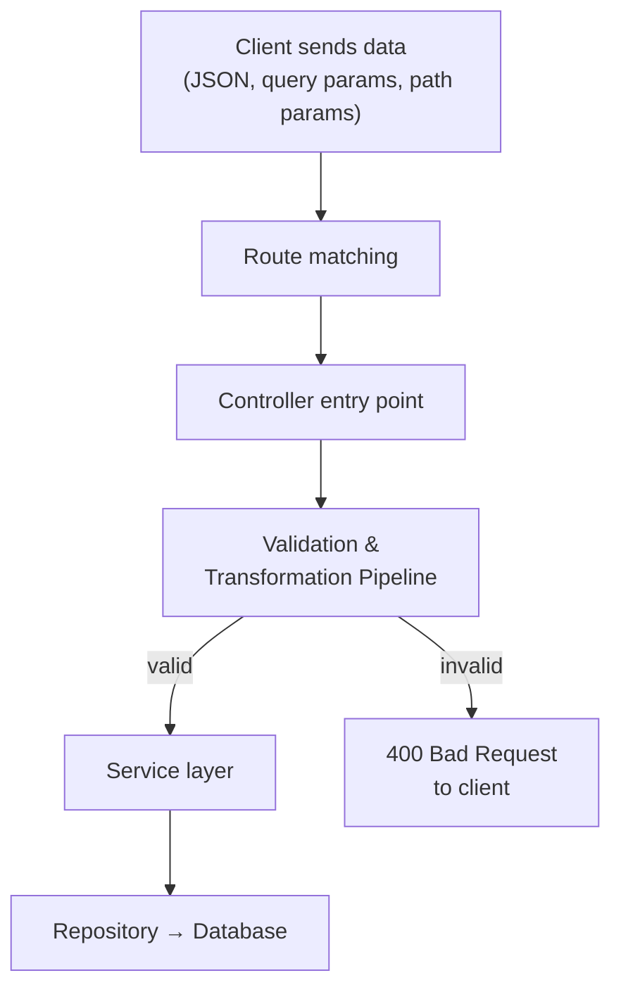
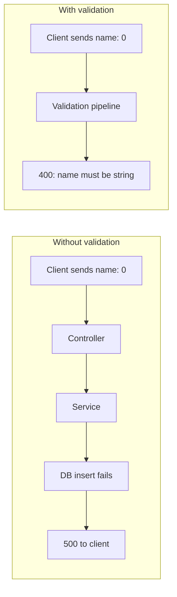
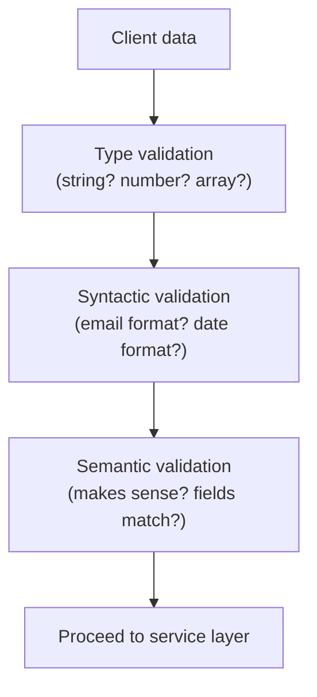
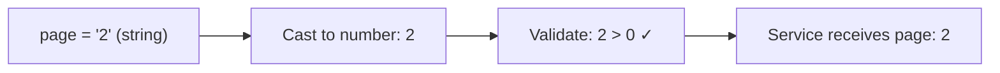
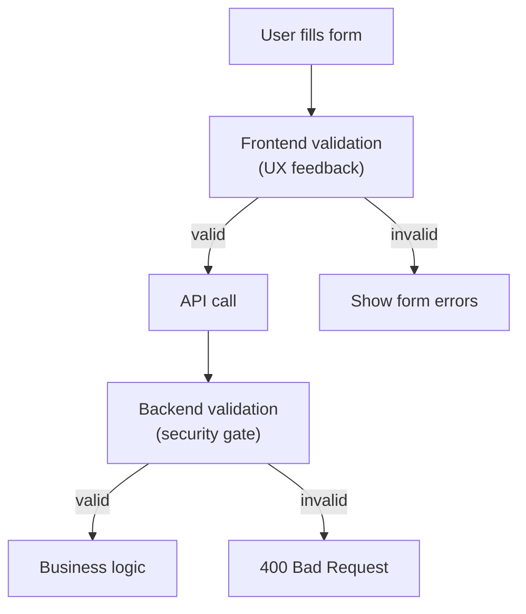

# Validations and Transformations
> Every byte from an external client is untrusted — validate and transform at the server entry point so bad data never reaches your business logic or database.

## Where Validation Happens

In a typical layered backend, validation and transformation run in the **controller layer**, after routing matches a request to a handler but **before** any business logic or service calls execute.



The pipeline acts as a gatekeeper: only data in the expected format proceeds downstream.

## Why Validate at the Entry Point

Without validation, malformed client data propagates through controller → service → repository → database. The database rejects the bad data (e.g., inserting a number into a TEXT column), the error bubbles up as a **500 Internal Server Error**, and the client gets a confusing, unhelpful response.

With validation at the entry point, the same bad data is caught immediately and the client receives a **400 Bad Request** with a specific error message: `"name must be a string, received number"`.



> 💭 Think: A 400 says "you sent bad data." A 500 says "our server broke." Always prefer 400 for client mistakes.

## What to Validate

Validate **everything** from external clients:
- Request body (JSON payload)
- Path parameters
- Query parameters
- Headers (where relevant)

Be as specific as possible. If an API expects a `name` field that is a string between 5–100 characters, the validation pipeline checks: field exists → type is string → length is within range.

Validation errors double as informal API documentation — an empty payload returns all required fields and their constraints, helping integrators discover the API shape without reading docs.

## Three Types of Validation

### 1. Type Validation

Confirms the data type matches expectations: is the field a string, number, boolean, array, or nested object? Can enforce element types inside arrays (e.g., each array element must be a string).

```
Expected: numberField → number
Received: "10" (string) → ERROR: expected number, received string
```

### 2. Syntactic Validation

Confirms a string follows a required structural pattern:
- **Email**: `user@domain.com` (local-part @ domain . TLD)
- **Phone**: country code + digit count per locale
- **Date**: `YYYY-MM-DD` format

Syntactic validation checks shape, not meaning.

### 3. Semantic Validation

Confirms the value makes logical sense in the real world:
- Date of birth cannot be in the future
- Age must be between 1 and 120
- Password and password confirmation must match
- If `married: true`, then `partner` field is required (conditional/complex validation)



> ⚠️ Watch out: Type, syntactic, and semantic checks are not rigid categories — they overlap. The point is to be progressively more specific: type → structure → meaning.

## Complex (Conditional) Validation

Real-world forms have interdependent fields:
- `password` and `passwordConfirmation` must be equal
- `married: true` requires a `partner` field; `married: false` makes `partner` optional
- `password` must be at least 8 characters

These cross-field rules are defined in the validation pipeline based on service layer requirements.

## Transformation

Transformation modifies validated data into a format convenient for downstream layers. It runs in the same pipeline as validation — either before validation (to enable type checking) or after (to normalize clean data).

### Common Transformation Operations

| Operation | Example |
|---|---|
| **Type casting** | Query param `"2"` (string) → `2` (number) before validating `page > 0` |
| **Default values** | Client omits `sort` query param → set `sort = "date"` |
| **Normalization** | Email `Test@Gmail.COM` → `test@gmail.com` (lowercase) |
| **Formatting** | Phone `919876543210` → `+919876543210` (add country code prefix) |
| **Date conversion** | `"2025-11-05"` → ISO 8601 datetime for DB storage |

### The Query Parameter Type Problem

Query parameters are **always strings** when they reach the server. If your validation schema expects `page` to be a number, validation fails on the raw string `"2"`. The transformation step casts `"2"` → `2` first, then validation checks `page > 0 && page < 500`.



> 💭 Think: Transformation order matters. Cast types *before* validating numeric constraints on query parameters.

## Validation + Transformation Pipeline

Pair both in a single pipeline so all input data logic lives in one place:

```
Raw client data
  → Transform (cast types, set defaults)
  → Validate (type, syntactic, semantic)
  → Transform (normalize, format)  [optional post-validation step]
  → Clean data to service layer
```

This keeps requirements discoverable — one file/module defines all rules for an endpoint's input.

## Frontend Validation ≠ Backend Validation

Both are required. They serve different purposes:

| | Frontend Validation | Backend Validation |
|---|---|---|
| **Purpose** | User experience | Security & data integrity |
| **When** | Before API call (instant feedback) | At server entry point (mandatory) |
| **Can be bypassed?** | Yes (curl, Postman, modified requests) | No |
| **Required?** | Recommended for UX | **Mandatory** always |

A server may have many clients: a web app with form validation, a mobile app, a CLI tool, or a direct API client (Insomnia/Postman) with zero frontend validation. Backend validation must stand alone.

> ⚠️ Watch out: Never assume frontend validation protects your data. Design backend validation as if no client-side checks exist.



## Key Takeaways

- Validate **everything** from external clients at the controller entry point, before business logic runs.
- Bad data should return **400 Bad Request** with specific error messages — never let it reach the database and become a 500.
- Three validation layers: **type** (is it a string?), **syntactic** (is it a valid email format?), **semantic** (does the date make sense?).
- **Transformation** casts, defaults, and normalizes data so downstream layers receive clean, typed input.
- Query parameters arrive as strings — **cast before validating** numeric constraints.
- Keep validation and transformation in a **single pipeline** per endpoint for discoverability.
- **Frontend validation** is for UX; **backend validation** is for security. Never substitute one for the other.
- Validation error messages serve as informal API documentation for integrators.

## Glossary

| Term | Definition |
|---|---|
| **Validation** | Checking that incoming data matches expected structure, types, and constraints |
| **Transformation** | Modifying validated data into a format convenient for downstream processing |
| **Type validation** | Verifying a field's data type (string, number, boolean, array) |
| **Syntactic validation** | Verifying a string follows a required format (email, phone, date pattern) |
| **Semantic validation** | Verifying a value makes logical sense (age ≤ 120, date not in future) |
| **Complex validation** | Cross-field rules with conditional requirements (if married, partner required) |
| **Schema** | A declarative definition of expected fields, types, and constraints for an endpoint |
| **Type casting** | Converting one data type to another (string `"2"` → number `2`) |
| **Normalization** | Standardizing data format (lowercasing emails, adding phone prefixes) |
| **Sane defaults** | Server-set fallback values when optional fields are omitted |
| **400 Bad Request** | HTTP status for client-sent data that fails validation |
| **500 Internal Server Error** | HTTP status for unexpected server failures — should not be caused by bad client input |
| **Pipeline** | A sequential processing chain combining transformation and validation steps |

[REDACTED]
