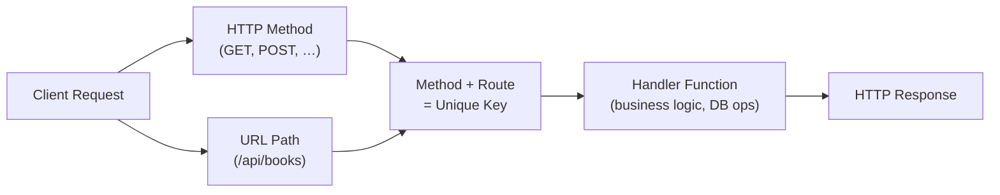
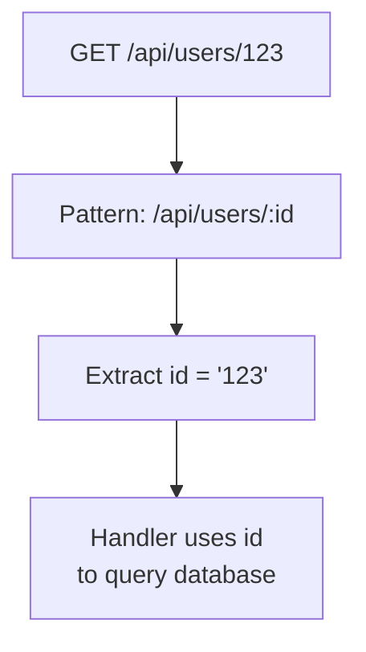
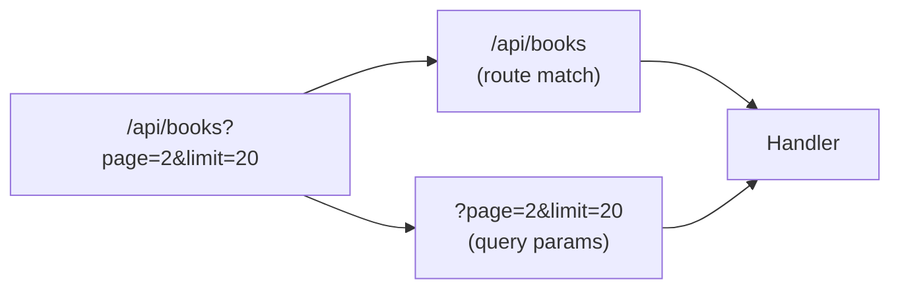
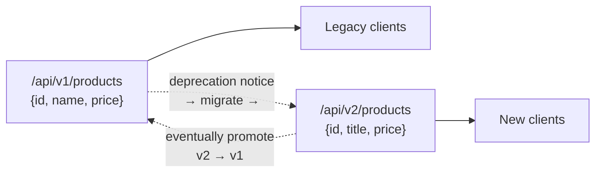

# Routing in Backend
> HTTP methods express *what* you want to do; routing expresses *where* you want to do it — together they map a request to the right server-side logic.

## HTTP Method + Route = Handler Key

Routing is the process of mapping URL paths (and their parameters) to server-side handler functions. HTTP methods describe intent — GET fetches, POST creates, PATCH/PUT update, DELETE removes. The route describes the target resource — `/api/books`, `/api/users/123`. The server concatenates **method + route** to form a unique routing key that selects exactly one handler.



A GET to `/api/books` and a POST to `/api/books` share the same path but route to different handlers because the method differs. This is the fundamental dispatch mechanism in every backend framework.

> 💭 Think: Before writing handler code, ask — what is the client's intent (method) and what resource are they targeting (route)?

## Static Routes

Static routes have no variable segments — the path string is constant on every request. Example: `GET /api/books` always targets the books collection handler. The path never changes; the response type is predictable (list of books, create confirmation, etc.).

```
Static:  GET  /api/books        → list all books
         POST /api/books        → create a book
```

Static routes are the simplest form of routing and form the backbone of CRUD endpoints.

## Dynamic Routes (Path Parameters)

Dynamic routes embed variable segments in the path to identify a specific resource. `GET /api/users/123` fetches the user whose ID is `123`. The server matches against a pattern like `/api/users/:id`, where `:id` captures any string in that position.



The `:param` convention (colon prefix) is industry-standard across Node.js, Go, Python, Rust, and Java frameworks. All path segments are strings at the routing layer — even numeric IDs like `123` arrive as `"123"`.

> ⚠️ Watch out: Do not confuse path parameters with query parameters. Path params identify *which* resource; query params modify *how* you fetch or filter.

## Query Parameters

Query parameters are key-value pairs appended after `?` in the URL: `/api/search?query=some+value`. They appear after the route-matching portion and are **not** part of the handler dispatch key (method + path still determine the handler).

GET requests have no body, so query parameters are the primary way to send optional metadata with a read request — pagination (`?page=2&limit=20`), filtering (`?status=active`), and sorting (`?sortBy=name&sortOrder=asc`).

Path parameters carry semantic meaning (`/users/123` = "user 123"). Query parameters carry operational metadata (`?page=2` = "give me page 2"). Putting search terms in the path (`/api/search/somevalue`) is technically possible but defeats REST's readable URL design.



> 💭 Think: Use path params for resource identity, query params for filtering/pagination/sorting.

## Nested Routes

Nested routes express hierarchical relationships between resources through path depth. Each `/` segment implies a parent-child relationship.

```
GET /api/users/123/posts/456
     │        │    │     │
     │        │    │     └── specific post (456)
     │        │    └── posts of user 123
     │        └── user 123
     └── users collection
```

Each nesting level is its own valid route with its own handler:
- `GET /api/users` → all users
- `GET /api/users/123` → one user
- `GET /api/users/123/posts` → all posts by user 123
- `GET /api/users/123/posts/456` → one specific post

Nested routing is a REST convention for semantic, human-readable URLs — not a separate routing *type*, but a design practice you will see everywhere in medium-complexity APIs.

## Route Versioning and Deprecation

API versioning embeds a version identifier in the path: `/api/v1/products` vs `/api/v2/products`. This lets you ship breaking response changes (e.g., renaming `name` → `title`) without disrupting existing clients.



The workflow: release v2 alongside v1, notify consumers, give them a migration window, then deprecate and remove v1. Versioning avoids inventing entirely new route names (`/api/new-products`) when the resource identity hasn't changed — only the response shape has.

## Catch-All Routes

After all specific routes are registered, a catch-all handler matches any unmatched request — typically written as `/*` or `*`. Instead of returning a null/empty response, the server sends a user-friendly 404: "This route does not exist."

```
Request flow:
  /api/v1/products  → matched ✓
  /api/v2/products  → matched ✓
  /api/v3/products  → no match → catch-all → 404 Not Found
```

Catch-all routes are always registered last, after every specific route and method combination.

## Key Takeaways

- Routing maps **URL path + HTTP method** to a server-side handler — that pair is the dispatch key.
- **Static routes** have fixed paths; **dynamic routes** use `:param` placeholders to capture variable segments.
- **Path parameters** identify resources (`/users/123`); **query parameters** pass metadata (`?page=2&limit=20`).
- **Nested routes** express parent-child resource hierarchies through path depth.
- **Route versioning** (`/v1/`, `/v2/`) enables breaking changes with a safe migration path.
- **Catch-all routes** provide friendly 404 responses for unmatched paths.

## Glossary

| Term | Definition |
|---|---|
| **Route** | The URL path segment(s) that identify where a request should be handled |
| **Handler** | The server-side function executed when a method + route combination matches |
| **Static route** | A route with no variable segments — the path string never changes |
| **Dynamic route** | A route with one or more variable segments (path parameters) |
| **Path parameter** | A variable segment in the URL path (e.g., `:id` in `/users/:id`) |
| **Query parameter** | Key-value pairs after `?` in the URL, used for filtering, pagination, sorting |
| **Nested route** | A route with multiple path segments expressing resource hierarchy |
| **Route versioning** | Embedding a version identifier (`/v1/`) in the path to manage API evolution |
| **Catch-all route** | A fallback handler that matches any unmatched request, typically returning 404 |
| **Resource** | The entity a route represents (e.g., `books`, `users`) |

---
