# Redis — Exhaustive API & Concepts Notes

> Redis is an **in-memory data structure server**. Clients talk to it over TCP using a simple request/reply protocol. You do not “query tables” — you call **commands** against **keys** that hold typed values (strings, hashes, lists, sets, sorted sets, streams, …).

These notes cover the important commands (APIs), the mental models behind them, and when to use each.

---

## Table of Contents

1. [Mental Model](#1-mental-model)
2. [Connecting & Talking to Redis](#2-connecting--talking-to-redis)
3. [Keys — Universal Commands](#3-keys--universal-commands)
4. [Strings](#4-strings)
5. [Hashes](#5-hashes)
6. [Lists](#6-lists)
7. [Sets](#7-sets)
8. [Sorted Sets (ZSET)](#8-sorted-sets-zset)
9. [Bitmaps & Bitfields](#9-bitmaps--bitfields)
10. [HyperLogLog](#10-hyperloglog)
11. [Geospatial](#11-geospatial)
12. [Streams](#12-streams)
13. [Pub/Sub](#13-pubsub)
14. [Transactions](#14-transactions)
15. [Pipelining](#15-pipelining)
16. [Lua Scripts](#16-lua-scripts)
17. [JSON, Search, Modules (overview)](#17-json-search-modules-overview)
18. [Persistence, Replication, Cluster](#18-persistence-replication-cluster)
19. [Memory, Eviction, TTL Strategies](#19-memory-eviction-ttl-strategies)
20. [Security & ACL](#20-security--acl)
21. [Common Backend Patterns](#21-common-backend-patterns)
22. [Client Libraries (Node / Python / Go)](#22-client-libraries-node--python--go)
23. [Command Cheat Sheet](#23-command-cheat-sheet)

---

## 1. Mental Model

### 1.1 What Redis is

| Layer | Reality |
|-------|---------|
| Storage | Primarily **RAM** (optional disk persistence) |
| Interface | **Commands** over RESP (Redis Serialization Protocol) |
| Addressing | Everything is a **key** → typed value |
| Single-threaded core | One command at a time on the main thread (I/O can be threaded in newer versions) |

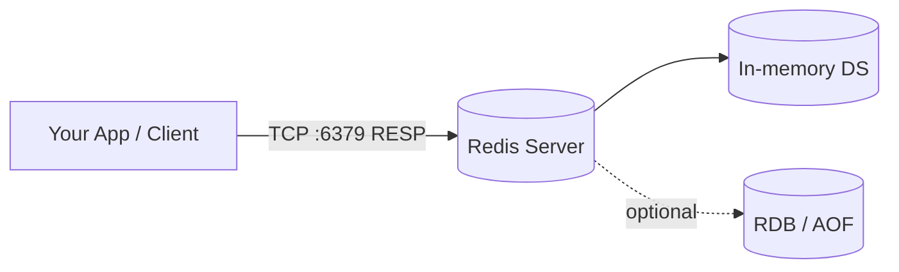

### 1.2 Data types at a glance

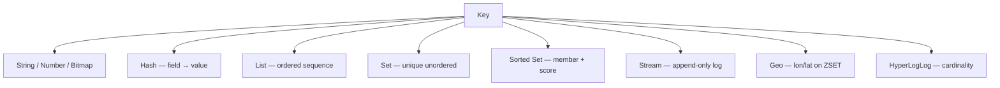

### 1.3 Naming keys (convention)

Use colon-separated namespaces:

```
user:1001:profile
session:abc123
cache:product:42
ratelimit:ip:1.2.3.4
queue:emails
```

---

## 2. Connecting & Talking to Redis

### 2.1 CLI

```bash
redis-cli
redis-cli -h 127.0.0.1 -p 6379 -a 'password'
redis-cli --tls -h redis.example.com

# One-shot
redis-cli SET hello world
redis-cli GET hello
```

### 2.2 Useful introspection

```redis
PING                          # PONG
INFO                          # server stats
INFO memory
INFO replication
INFO keyspace
DBSIZE                        # number of keys
CLIENT LIST                   # connected clients
CLIENT KILL IP 127.0.0.1
SELECT 0                      # logical DB 0–15 (standalone only; avoid in cluster)
FLUSHDB                       # wipe current DB (danger)
FLUSHALL                      # wipe all DBs (danger)
MONITOR                       # stream every command (debug only)
SLOWLOG GET 10                # slow commands
CONFIG GET maxmemory*
CONFIG SET maxmemory-policy allkeys-lru
```

### 2.3 Request / reply flow

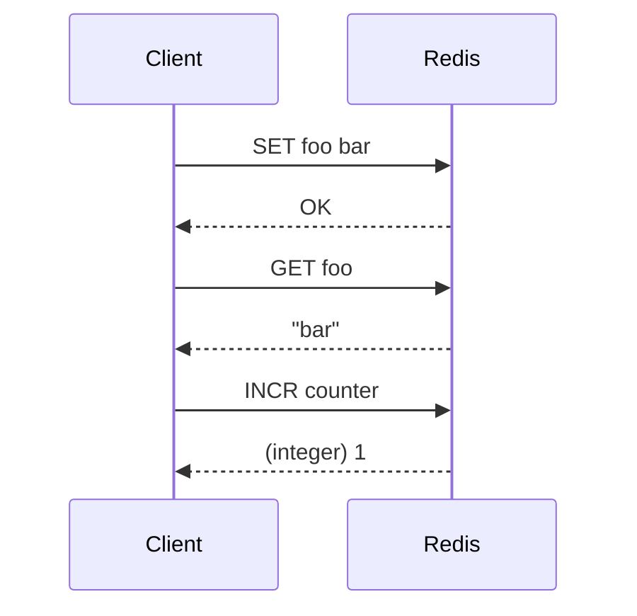

---

## 3. Keys — Universal Commands

These work on **any** key type (with a few exceptions noted).

### 3.1 Existence, type, delete

```redis
EXISTS user:1                 # 1 or 0 (can pass multiple keys)
TYPE user:1                   # string | list | set | zset | hash | stream | none
DEL user:1 session:abc        # delete; returns count deleted
UNLINK big:key                # async delete (preferred for large values)
RENAME old new
RENAMENX old new              # rename only if `new` does not exist
COPY src dest                 # Redis 6.2+
RANDOMKEY                     # random existing key
```

### 3.2 TTL & expiration

```redis
EXPIRE session:abc 3600       # expire in 3600 seconds
PEXPIRE session:abc 1500      # expire in ms
EXPIREAT session:abc 1735689600
TTL session:abc               # seconds left; -1 = no expiry; -2 = missing
PTTL session:abc              # ms left
PERSIST session:abc           # remove expiry
EXPIRE session:abc 60 NX      # set TTL only if no TTL yet (Redis 7+)
EXPIRE session:abc 60 XX      # set TTL only if already has TTL
EXPIRE session:abc 60 GT      # only if new TTL is greater
EXPIRE session:abc 60 LT      # only if new TTL is less
```

**Mental model:** TTL is on the **key**, not on individual hash fields (unless you use RedisJSON / separate keys).

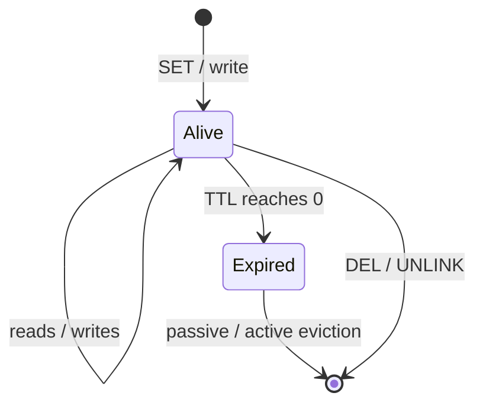

### 3.3 Scanning (never use KEYS in production)

```redis
# BAD in prod — blocks, O(N)
KEYS user:*

# GOOD — cursor-based iteration
SCAN 0 MATCH user:* COUNT 100
# → 1) "42"   (next cursor)
# → 2) 1) "user:1" 2) "user:2"
# Repeat until cursor is 0
```

```redis
HSCAN myhash 0 MATCH email* COUNT 50
SSCAN myset 0 MATCH prefix:* COUNT 50
ZSCAN myzset 0 MATCH * COUNT 50
```

### 3.4 Dump / migrate / touch

```redis
DUMP key                      # serialize value
RESTORE key 0 <serialized>    # restore (TTL ms = 0 means no expire)
TOUCH key1 key2               # update last-access time (LFU/LRU)
OBJECT IDLETIME key           # seconds since last access
OBJECT FREQ key               # LFU counter (if policy uses it)
OBJECT ENCODING key           # internal encoding
```

### 3.5 Move between DBs (standalone)

```redis
MOVE key 1                    # move key to DB 1
```

---

## 4. Strings

The simplest type: a key holds a **blob of bytes** (often text or an integer). Max size ~512 MB.

### 4.1 Set / get

```redis
SET name "Ada"
GET name                      # "Ada"
GETRANGE name 0 2             # "Ada"
SETRANGE name 0 "Eve"         # overwrite from offset
STRLEN name
APPEND name " Lovelace"
GETDEL name                  # get then delete (6.2+)
GETEX name EX 60             # get and set TTL
GETSET name "Bob"            # deprecated alias; prefer SET … GET
```

### 4.2 Set options (very important)

```redis
SET cache:x 1 EX 60           # expire in 60s
SET cache:x 1 PX 500          # expire in 500ms
SET cache:x 1 EXAT 1735689600
SET cache:x 1 NX              # only if Not eXists (lock / create)
SET cache:x 1 XX              # only if eXists (update)
SET cache:x 1 KEEPTTL         # keep existing TTL
SET cache:x 1 GET             # set and return old value (6.2+)

# Classic lock pattern
SET lock:resource uuid NX EX 30
```

### 4.3 Multi-key string ops

```redis
MSET a 1 b 2 c 3
MGET a b c                    # 1) "1" 2) "2" 3) "3"
MSETNX a 1 d 4                # all-or-nothing if none exist
```

### 4.4 Counters (atomic integers)

```redis
SET views 0
INCR views                    # 1
INCRBY views 10               # 11
DECR views
DECRBY views 2
INCRBYFLOAT price 0.5
```

**Use cases:** rate limits, view counts, sequence IDs, feature flags (as `0`/`1`).

### 4.5 Binary-safe / cache blobs

```redis
SET user:1:json '{"id":1,"name":"Ada"}'
SET img:logo <binary bytes>
```

---

## 5. Hashes

A hash is a **map of field → value** under one key. Ideal for objects.

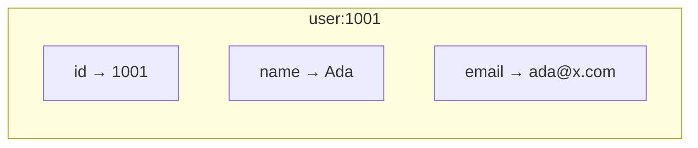

### 5.1 Field ops

```redis
HSET user:1001 name Ada email ada@x.com age 30
HGET user:1001 name           # "Ada"
HMGET user:1001 name email    # multi get
HGETALL user:1001             # all fields (careful on huge hashes)
HEXISTS user:1001 email
HDEL user:1001 age
HKEYS user:1001
HVALS user:1001
HLEN user:1001                # field count
HRANDFIELD user:1001 2        # random fields (6.2+)
HSETNX user:1001 role admin   # set field only if missing
```

### 5.2 Numeric fields

```redis
HINCRBY user:1001 login_count 1
HINCRBYFLOAT user:1001 score 1.5
```

### 5.3 Partial updates vs full JSON blob

| Approach | Pros | Cons |
|----------|------|------|
| One string JSON blob | Simple | Rewrite whole object; no field TTL |
| Hash fields | Update one field; `HINCRBY` | Nested objects awkward |
| RedisJSON module | Path queries, nested | Extra module |

```redis
# Update only email — no need to rewrite whole profile
HSET user:1001 email new@x.com
```

---

## 6. Lists

Ordered sequence of strings. Implemented as linked list / quicklist. **O(1)** push/pop at ends; indexing in the middle is slower.

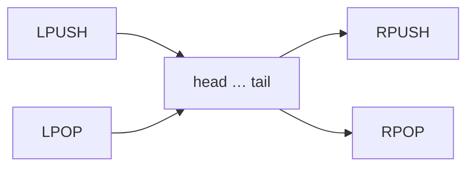

### 6.1 Push / pop

```redis
LPUSH queue:jobs job1         # push left (head)
RPUSH queue:jobs job2 job3    # push right (tail)
LPOP queue:jobs               # pop head
RPOP queue:jobs               # pop tail
LPOP queue:jobs 3             # pop up to 3 (6.2+)
RPOPLPUSH src dest            # deprecated; use LMOVE
LMOVE src dest LEFT RIGHT     # atomic move between lists
BLPOP queue:jobs 5            # blocking pop; timeout seconds (0 = forever)
BRPOP queue:jobs 0
BLMOVE src dest LEFT RIGHT 5
```

### 6.2 Read / mutate by index

```redis
LLEN queue:jobs
LRANGE queue:jobs 0 -1        # all elements (0 = start, -1 = end)
LINDEX queue:jobs 0
LSET queue:jobs 0 "new"
LTRIM queue:jobs 0 99         # keep only indices 0..99 (capped feed)
LINSERT queue:jobs BEFORE pivot value
LREM queue:jobs 2 "spam"      # remove 2 occurrences of "spam"
LPOS queue:jobs "job2"        # find position
```

### 6.3 Classic patterns

**FIFO queue:** `LPUSH` + `BRPOP` (or `RPUSH` + `BLPOP`).

**Capped recent list (activity feed):**

```redis
LPUSH feed:user:1 "liked post 9"
LTRIM feed:user:1 0 99
```

---

## 7. Sets

Unordered collection of **unique** strings. Great for tags, membership, relations.

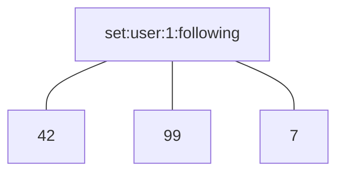

### 7.1 Membership

```redis
SADD tags:post:1 redis cache backend
SREM tags:post:1 cache
SISMEMBER tags:post:1 redis    # 1 or 0
SMISMEMBER tags:post:1 redis sql   # multi (6.2+)
SCARD tags:post:1              # cardinality
SMEMBERS tags:post:1           # all (avoid on huge sets)
SRANDMEMBER tags:post:1 2
SPOP tags:post:1               # remove + return random
```

### 7.2 Set algebra (very powerful)

```redis
SADD a 1 2 3
SADD b 2 3 4

SINTER a b                     # {2, 3}
SUNION a b                     # {1, 2, 3, 4}
SDIFF a b                      # {1}
SINTERSTORE dest a b           # store intersection in dest
SUNIONSTORE dest a b
SDIFFSTORE dest a b
SMOVE a b 1                    # move member from a → b
```

**Use cases:** mutual friends (`SINTER`), “who I follow that you don’t” (`SDIFF`), unique visitors per day (set of user IDs), tag intersection search.

---

## 8. Sorted Sets (ZSET)

Like a set, but each member has a **score** (float). Ordered by score, then lexicographically. Backed by skiplist + hash → **O(log N)** ops.

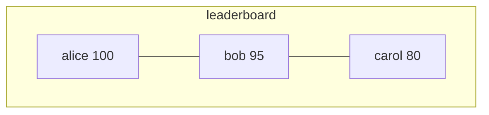

### 8.1 Add / update / remove

```redis
ZADD lb 100 alice 95 bob 80 carol
ZADD lb NX 120 dave            # add only if new
ZADD lb XX 105 alice           # update only if exists
ZADD lb GT 110 alice           # update only if new score > old
ZADD lb LT 90 bob
ZADD lb CH 100 alice           # return count of changed elements
ZADD lb INCR 5 alice           # increment score (like ZINCRBY)

ZREM lb carol
ZINCRBY lb 10 alice            # alice score += 10
ZSCORE lb alice
ZCARD lb
ZCOUNT lb 90 100               # how many with score in [90,100]
ZRANK lb alice                 # 0-based rank low→high
ZREVRANK lb alice              # high→low
ZMSCORE lb alice bob           # multi scores (6.2+)
```

### 8.2 Range queries

```redis
# By rank
ZRANGE lb 0 2                  # lowest 3
ZRANGE lb 0 2 WITHSCORES
ZREVRANGE lb 0 9 WITHSCORES    # top 10
ZRANGE lb 0 -1 BYSCORE         # Redis 6.2+ unified API
ZRANGE lb 90 100 BYSCORE WITHSCORES
ZRANGE lb -inf 100 BYSCORE
ZRANGE lb 100 -inf BYSCORE REV   # reverse by score
ZRANGEBYLEX myzset [a [c       # lex range when scores equal

# Remove by range
ZREMRANGEBYRANK lb 0 2
ZREMRANGEBYSCORE lb -inf 50
```

### 8.3 Set ops on sorted sets

```redis
ZUNIONSTORE out 2 z1 z2 WEIGHTS 1 2 AGGREGATE SUM
ZINTERSTORE out 2 z1 z2
ZDIFFSTORE out 2 z1 z2         # 6.2+
ZINTERCARD 2 z1 z2             # cardinality of intersection
```

**Use cases:** leaderboards, time-ordered indexes (`score = timestamp`), delay queues, rate-limit sliding windows, autocomplete with lex scores.

---

## 9. Bitmaps & Bitfields

Strings used as bit arrays. Extremely memory-efficient for flags / daily active users.

### 9.1 Bitmaps

```redis
SETBIT dau:2026-07-22 1001 1   # user 1001 active
GETBIT dau:2026-07-22 1001     # 1
BITCOUNT dau:2026-07-22        # number of set bits
BITOP AND result day1 day2     # AND / OR / XOR / NOT
BITPOS dau:2026-07-22 1        # first bit set to 1
```

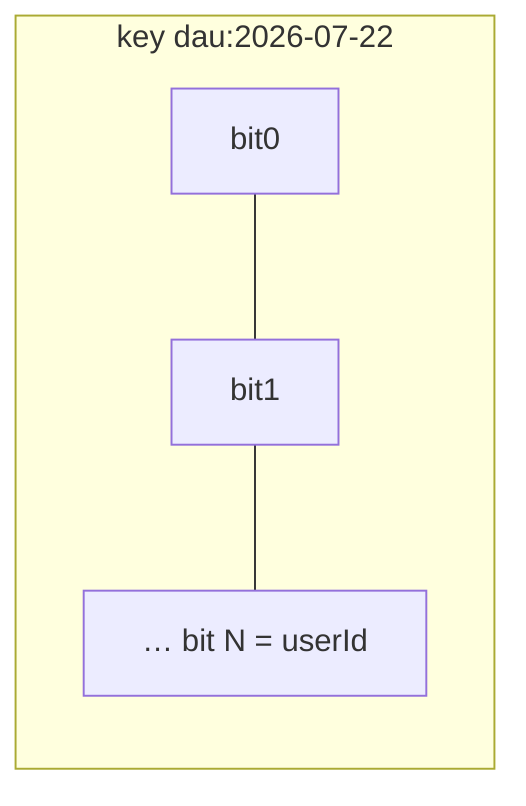

**Example:** 1 bit per user id → ~1.25 MB for 10M users for one day’s DAU.

### 9.2 Bitfield (structured integers in a string)

```redis
BITFIELD metrics INIT BY 1 OVERFLOW SAT INCRBY u8 0 1 GET u8 0
# packed unsigned/signed integers at bit offsets
```

---

## 10. HyperLogLog

Probabilistic structure for **approximate unique counts** (~0.81% error) using ~12 KB.

```redis
PFADD uniques:page:home user1 user2 user3
PFCOUNT uniques:page:home      # ≈ distinct count
PFMERGE uniques:all uniques:page:home uniques:page:about
```

**When:** unique visitors, distinct IPs — when exact sets would be too large.

| Need | Structure |
|------|-----------|
| Exact unique set | SET |
| Approximate cardinality | HyperLogLog |
| Exact with scores / rank | ZSET |

---

## 11. Geospatial

Geo is built on sorted sets (Geohash-encoded scores).

```redis
GEOADD places 13.361389 38.115556 "Palermo" 15.087269 37.502669 "Catania"
GEOPOS places Palermo
GEODIST places Palermo Catania km
GEOSEARCH places FROMLONLAT 15 37 BYRADIUS 200 km ASC WITHDIST
# older API (still works):
GEORADIUS places 15 37 200 km WITHDIST
GEOHASH places Palermo
ZREM places Palermo            # geo members are zset members
```

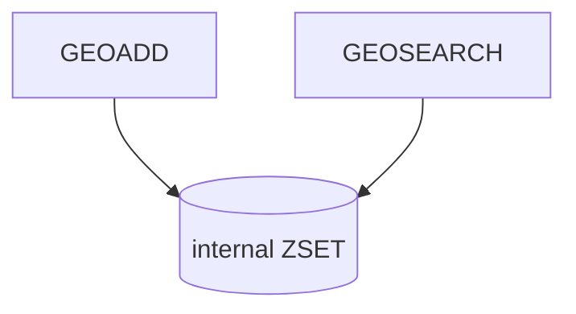

**Use cases:** “drivers near me”, store locators, geofencing indexes.

---

## 12. Streams

Append-only log with consumer groups — Redis’s answer to lightweight Kafka-like messaging.

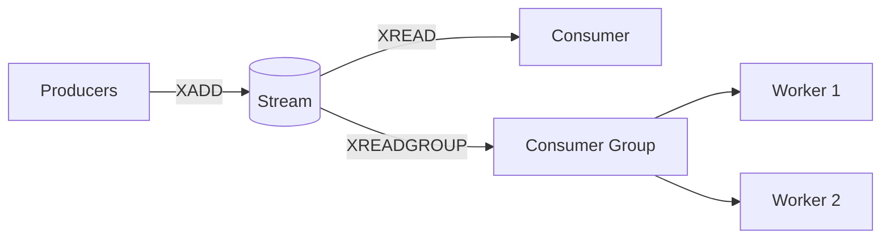

### 12.1 Write / read

```redis
XADD orders * customer_id 7 amount 99.5
# → "1735689600000-0"  (id)

XADD orders 0-1 field value    # explicit id (rare)
XADD orders MAXLEN ~ 10000 * f v   # approx cap length

XLEN orders
XRANGE orders - + COUNT 10     # from oldest
XREVRANGE orders + - COUNT 10
XREAD COUNT 2 STREAMS orders 0           # from start
XREAD BLOCK 5000 STREAMS orders $        # block for new ($ = only new)
```

### 12.2 Consumer groups

```redis
XGROUP CREATE orders inventory $ MKSTREAM
# $ = only new messages after group creation; 0 = from start

XREADGROUP GROUP inventory worker1 COUNT 1 BLOCK 2000 STREAMS orders >
# > = never-delivered messages

XACK orders inventory 1735689600000-0
XPENDING orders inventory
XCLAIM orders inventory worker2 60000 1735689600000-0   # reclaim idle
XAUTOCLAIM orders inventory worker2 60000 0-0 COUNT 10

XGROUP DESTROY orders inventory
XGROUP DELCONSUMER orders inventory worker1
XINFO STREAM orders
XINFO GROUPS orders
XINFO CONSUMERS orders inventory
```

### 12.3 Streams vs lists vs pub/sub

| Feature | List queue | Pub/Sub | Streams |
|---------|------------|---------|---------|
| Persistence of messages | Until popped | No | Yes (until trimmed) |
| Multiple consumers compete | Manual | Broadcast | Consumer groups |
| Replay history | No | No | Yes (`XRANGE`) |
| Ack / retry | DIY | No | `XACK` / pending |
| Blocking | `BLPOP` | subscribe | `XREAD` / `XREADGROUP` |

---

## 13. Pub/Sub

Fire-and-forget messaging. **Subscribers must be online** or the message is lost.

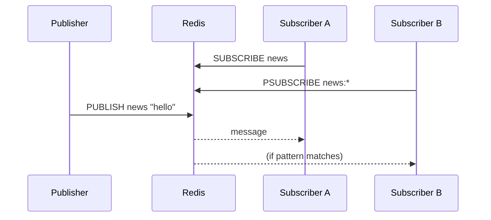

```redis
SUBSCRIBE channel1 channel2
PSUBSCRIBE news.*
PUBLISH channel1 "hello"       # returns # of subscribers that received it
UNSUBSCRIBE channel1
PUNSUBSCRIBE news.*
PUBSUB CHANNELS
PUBSUB NUMSUB channel1
```

**Caveats:**
- No durability, no backlog
- A client in subscribe mode cannot run normal commands on that connection
- Prefer **Streams** when you need reliability

**Sharded Pub/Sub (Redis Cluster 7+):** `SSUBSCRIBE`, `SPUBLISH` — channel ownership tied to hash slot.

---

## 14. Transactions

Redis transactions are **not** SQL ACID isolation. They are: queue commands, then execute **atomically and sequentially** with `EXEC`.

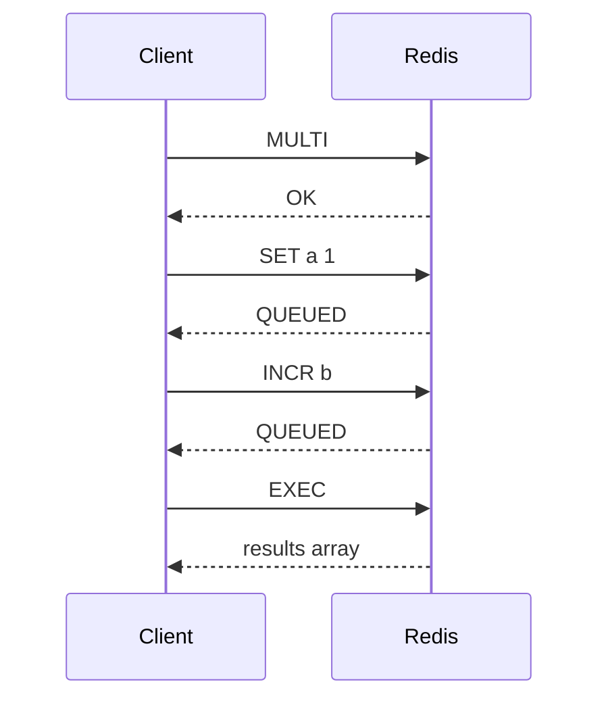

```redis
MULTI
SET from:bal 90
SET to:bal 110
EXEC

DISCARD                       # abort queued transaction

# Optimistic locking with WATCH
WATCH account:1
GET account:1                 # read 100
MULTI
DECRBY account:1 10
EXEC                          # nil if account:1 changed since WATCH
UNWATCH
```

**Important nuances:**
- Commands inside `MULTI` are not rolled back individually on error of another (mostly all-or-nothing execution, but runtime errors still apply per command)
- For true conditional atomic logic, prefer **Lua scripts** or `SET NX` patterns
- `WATCH` = optimistic concurrency control

---

## 15. Pipelining

Batch many commands in one network round-trip **without** atomicity guarantees (unlike `MULTI/EXEC`).

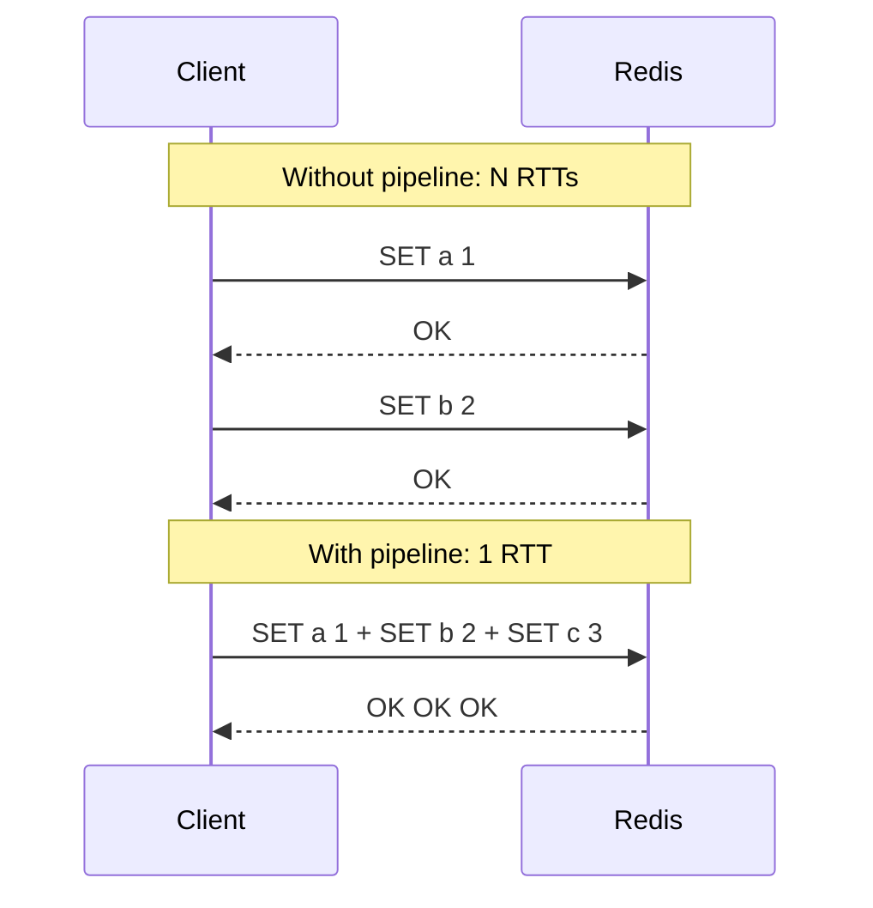

```bash
# redis-cli
redis-cli --pipe < commands.txt
```

```javascript
// node-redis style
const pipe = client.multi(); // or .pipeline() depending on client
pipe.set('a', 1);
pipe.set('b', 2);
await pipe.exec();
```

**Use when:** bulk warm-up, many independent writes/reads, reducing latency under load.

---

## 16. Lua Scripts

Server-side scripts run **atomically** (no other command interleaves). Best for multi-key invariants.

```redis
EVAL "return redis.call('SET', KEYS[1], ARGV[1])" 1 mykey hello

# Cache script body
SCRIPT LOAD "return redis.call('GET', KEYS[1])"
# → sha1
EVALSHA <sha1> 1 mykey

SCRIPT EXISTS <sha1>
SCRIPT FLUSH
SCRIPT KILL                   # only if not writing
```

### 16.1 Classic: safe distributed unlock

```lua
-- KEYS[1] = lock key, ARGV[1] = token
if redis.call("GET", KEYS[1]) == ARGV[1] then
  return redis.call("DEL", KEYS[1])
else
  return 0
end
```

```redis
EVAL "…" 1 lock:resource <uuid>
```

### 16.2 Functions (Redis 7+)

```redis
FUNCTION LOAD "#!lua name=mylib\nredis.register_function('myget', function(keys, args) return redis.call('GET', keys[1]) end)"
FCALL myget 1 mykey
```

**Rules of thumb:**
- Declare all keys in `KEYS[]` (required for Cluster)
- Keep scripts short; long scripts block the server
- Prefer idempotent designs

---

## 17. JSON, Search, Modules (overview)

Redis Stack / Redis with modules adds richer APIs:

| Module | Purpose | Example APIs |
|--------|---------|--------------|
| **RedisJSON** | Nested JSON documents | `JSON.SET`, `JSON.GET`, `JSON.ARRAPPEND` |
| **RediSearch** | Secondary indexes / full-text | `FT.CREATE`, `FT.SEARCH` |
| **RedisTimeSeries** | Metrics | `TS.ADD`, `TS.RANGE` |
| **RedisBloom** | Bloom / Cuckoo filters | `BF.ADD`, `BF.EXISTS` |

```redis
JSON.SET user:1 $ '{"name":"Ada","scores":[10,20]}'
JSON.GET user:1 $.name
JSON.NUMINCRBY user:1 $.scores[0] 5
```

(Requires Redis Stack / module-enabled build — not in vanilla Redis OSS alone.)

---

## 18. Persistence, Replication, Cluster

### 18.1 Persistence

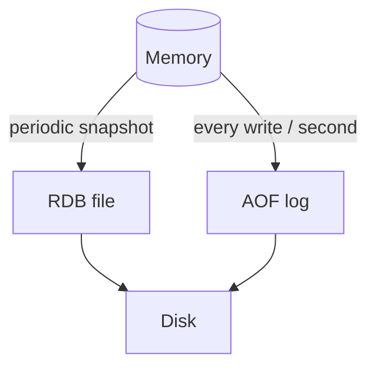

| Mode | What | Trade-off |
|------|------|-----------|
| **RDB** | Point-in-time binary snapshot | Fast restart; can lose last minutes |
| **AOF** | Append-only command log | Durability; larger, slightly slower |
| **RDB + AOF** | Common production combo | Balanced |

```redis
BGSAVE                          # background RDB
LASTSAVE
BGREWRITEAOF
```

### 18.2 Replication

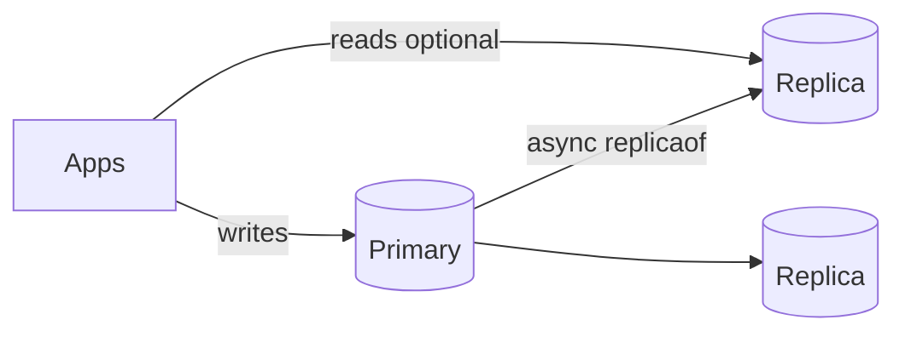

```redis
REPLICAOF host port             # on replica
REPLICAOF NO ONE                # promote
ROLE
INFO replication
```

### 18.3 Sentinel vs Cluster

| | **Sentinel** | **Cluster** |
|--|--------------|-------------|
| Goal | HA failover for one logical DB | Horizontal sharding + HA |
| Data split | No | Hash slots 0–16383 |
| Key limit | Multi-key ops OK in one instance | Multi-key must share **hash tag** `{user1001}:…` |

```redis
CLUSTER NODES
CLUSTER KEYSLOT user:1
# hash tag example — both keys same slot:
# {user:1001}.profile  and  {user:1001}.sessions
```

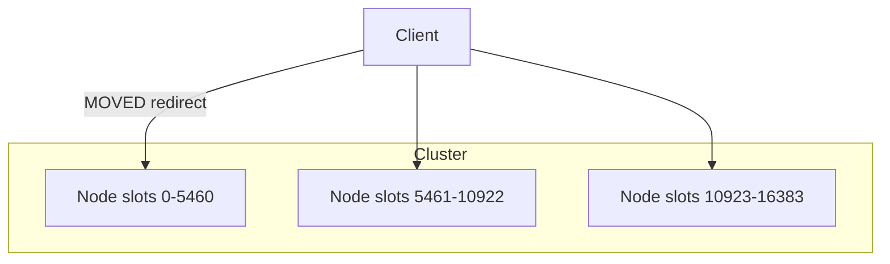

---

## 19. Memory, Eviction, TTL Strategies

### 19.1 Maxmemory policies

```redis
CONFIG GET maxmemory
CONFIG GET maxmemory-policy
```

| Policy | Behavior |
|--------|----------|
| `noeviction` | Writes fail when full |
| `allkeys-lru` | Evict least recently used (any key) |
| `volatile-lru` | LRU among keys **with TTL** |
| `allkeys-lfu` | Least frequently used |
| `volatile-lfu` | LFU among keys with TTL |
| `allkeys-random` / `volatile-random` | Random eviction |
| `volatile-ttl` | Evict soonest-expiring first |

### 19.2 Caching strategies

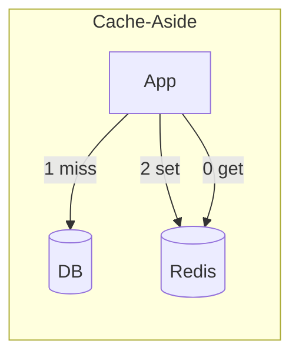

| Strategy | Flow |
|----------|------|
| **Cache-aside** | App reads Redis → on miss load DB → `SET` |
| **Read-through** | Cache library loads DB for you |
| **Write-through** | Write DB + cache together |
| **Write-behind** | Write cache first, flush DB async |
| **Refresh-ahead** | Proactively refresh before TTL |

### 19.3 TTL patterns

```redis
SET session:abc data EX 1800
SET cache:product:9 payload EX 300
# Sliding session: refresh TTL on activity
EXPIRE session:abc 1800
```

---

## 20. Security & ACL

```redis
AUTH password                   # legacy
AUTH username password          # ACL (Redis 6+)

ACL LIST
ACL SETUSER app on >secret ~cache:* +get +set +del -@dangerous
ACL DELUSER app
ACL WHOAMI
ACL LOG

# Bind / protected mode in redis.conf
# requirepass / aclfile
# TLS: tls-port, tls-cert-file, …
```

**Least privilege:** give app users only the commands + key patterns they need.

---

## 21. Common Backend Patterns

### 21.1 Cache-aside

```redis
GET cache:user:42
# miss → query DB →
SET cache:user:42 '<json>' EX 600
```

### 21.2 Session store

```redis
HSET session:tok123 userId 42 role admin
EXPIRE session:tok123 86400
HGETALL session:tok123
DEL session:tok123              # logout
```

### 21.3 Rate limiting (fixed window)

```redis
INCR ratelimit:ip:1.2.3.4
EXPIRE ratelimit:ip:1.2.3.4 60 NX
# if count > threshold → reject
```

### 21.4 Distributed lock

```redis
SET lock:order:99 <uuid> NX EX 30
# … do work …
# unlock via Lua comparing uuid (see §16)
```

### 21.5 Leaderboard

```redis
ZINCRBY game:scores 10 alice
ZREVRANGE game:scores 0 9 WITHSCORES
```

### 21.6 Job queue (simple)

```redis
LPUSH jobs '{"type":"email","to":"a@x.com"}'
BRPOP jobs 5
```

### 21.7 Reliable job queue (streams)

```redis
XADD jobs * type email to a@x.com
XGROUP CREATE jobs workers $ MKSTREAM
XREADGROUP GROUP workers w1 COUNT 1 BLOCK 5000 STREAMS jobs >
XACK jobs workers <id>
```

### 21.8 Unique daily actives

```redis
SETBIT dau:2026-07-22 42 1
BITCOUNT dau:2026-07-22
```

### 21.9 Pub/sub live notifications

```redis
PUBLISH user:42:notify '{"event":"mention"}'
```

---

## 22. Client Libraries (Node / Python / Go)

APIs mirror Redis commands 1:1; differences are connection pooling and async.

### 22.1 Node.js (`redis` / `ioredis`)

```javascript
import { createClient } from 'redis';
const client = createClient({ url: 'redis://127.0.0.1:6379' });
await client.connect();

await client.set('key', 'value', { EX: 60, NX: true });
const v = await client.get('key');
await client.hSet('user:1', { name: 'Ada', age: '30' });
await client.zAdd('lb', [{ score: 100, value: 'alice' }]);
await client.disconnect();
```

### 22.2 Python (`redis-py`)

```python
import redis
r = redis.Redis(host='localhost', port=6379, decode_responses=True)

r.set('key', 'value', ex=60, nx=True)
r.get('key')
r.hset('user:1', mapping={'name': 'Ada', 'age': 30})
r.zadd('lb', {'alice': 100})
pipe = r.pipeline()
pipe.set('a', 1)
pipe.incr('b')
pipe.execute()
```

### 22.3 Go (`go-redis`)

```go
rdb := redis.NewClient(&redis.Options{Addr: "localhost:6379"})
ctx := context.Background()

rdb.Set(ctx, "key", "value", time.Minute)
rdb.Get(ctx, "key").Result()
rdb.HSet(ctx, "user:1", "name", "Ada")
rdb.ZAdd(ctx, "lb", redis.Z{Score: 100, Member: "alice"})
```

---

## 23. Command Cheat Sheet

| Goal | Commands |
|------|----------|
| KV cache | `SET`, `GET`, `MGET`, `DEL`, `EXPIRE` |
| Object fields | `HSET`, `HGET`, `HMGET`, `HGETALL`, `HINCRBY` |
| Queue / stack | `LPUSH`/`RPUSH`, `LPOP`/`RPOP`, `BLPOP`, `LTRIM` |
| Membership / tags | `SADD`, `SISMEMBER`, `SINTER`, `SUNION`, `SDIFF` |
| Rankings / time index | `ZADD`, `ZRANGE`, `ZREVRANGE`, `ZINCRBY`, `ZRANK` |
| Counters | `INCR`, `INCRBY`, `HINCRBY` |
| Approx uniques | `PFADD`, `PFCOUNT` |
| Bit flags / DAU | `SETBIT`, `GETBIT`, `BITCOUNT`, `BITOP` |
| Geo | `GEOADD`, `GEOSEARCH`, `GEODIST` |
| Event log / jobs | `XADD`, `XREAD`, `XGROUP`, `XREADGROUP`, `XACK` |
| Live fanout | `PUBLISH`, `SUBSCRIBE` |
| Atomic multi-step | `MULTI`/`EXEC`, `WATCH`, `EVAL` |
| Iterate keys safely | `SCAN`, `HSCAN`, `SSCAN`, `ZSCAN` |
| Ops / health | `PING`, `INFO`, `SLOWLOG`, `CLIENT LIST` |

---

## Quick Decision Guide

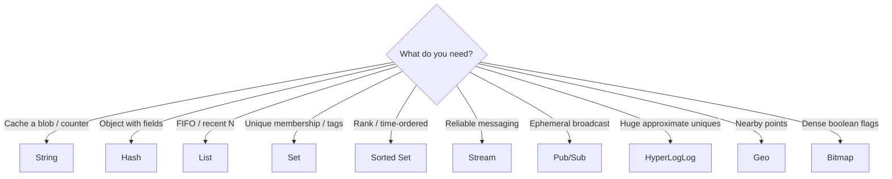

---

## Mental Checklist for Production

1. Prefer `SCAN` over `KEYS`. Prefer `UNLINK` over `DEL` for large keys.
2. Always set **TTLs** on cache keys; choose an **eviction policy**.
3. Use **hash tags** `{…}` for multi-key ops in Cluster.
4. Use **Streams + consumer groups** (not Pub/Sub) when messages must not be lost.
5. Use **Lua** or `SET NX` for locks; never unlock a lock you do not own.
6. Pipeline bulk work; keep Lua short.
7. Monitor `INFO`, `SLOWLOG`, memory fragmentation, and hit rate.
8. Restrict with **ACL**; enable TLS in transit for shared networks.

---

*Commands shown target Redis 6–7 behavior; a few (`GETEX`, `LMOVE`, `ZRANGE` unification, `FUNCTION`, sharded pub/sub) need 6.2 / 7+. Check `INFO server` for your version.*
