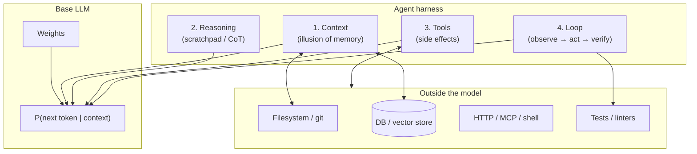
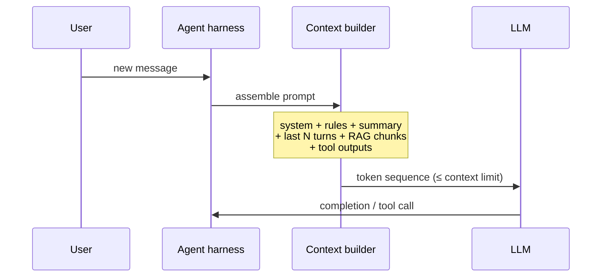
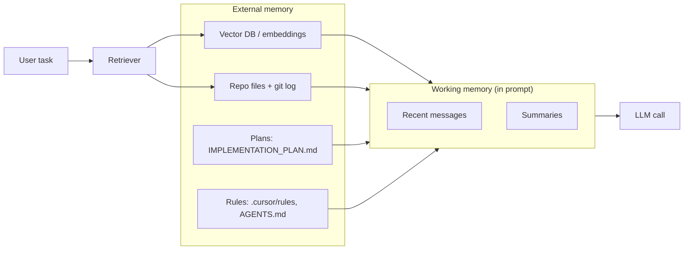
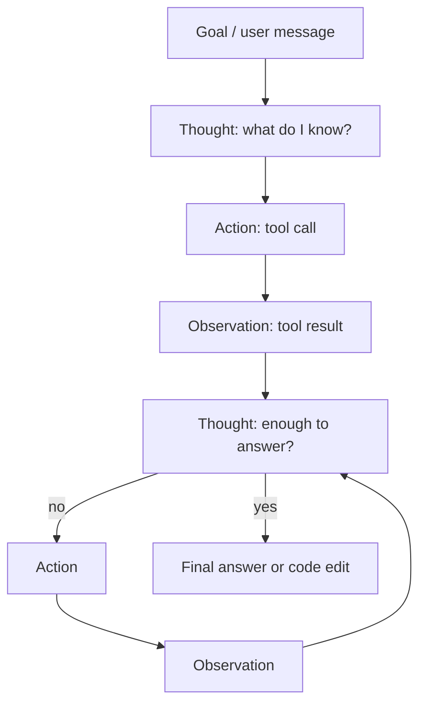
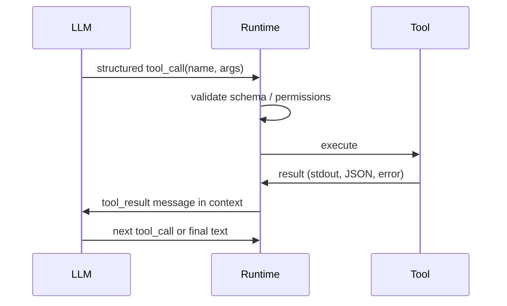
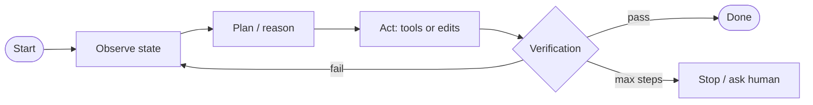
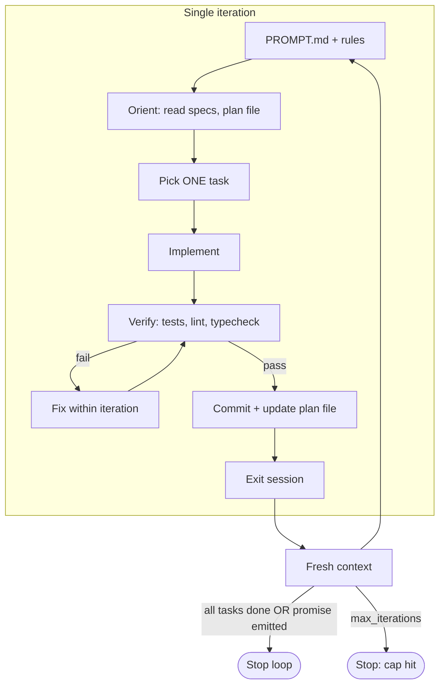
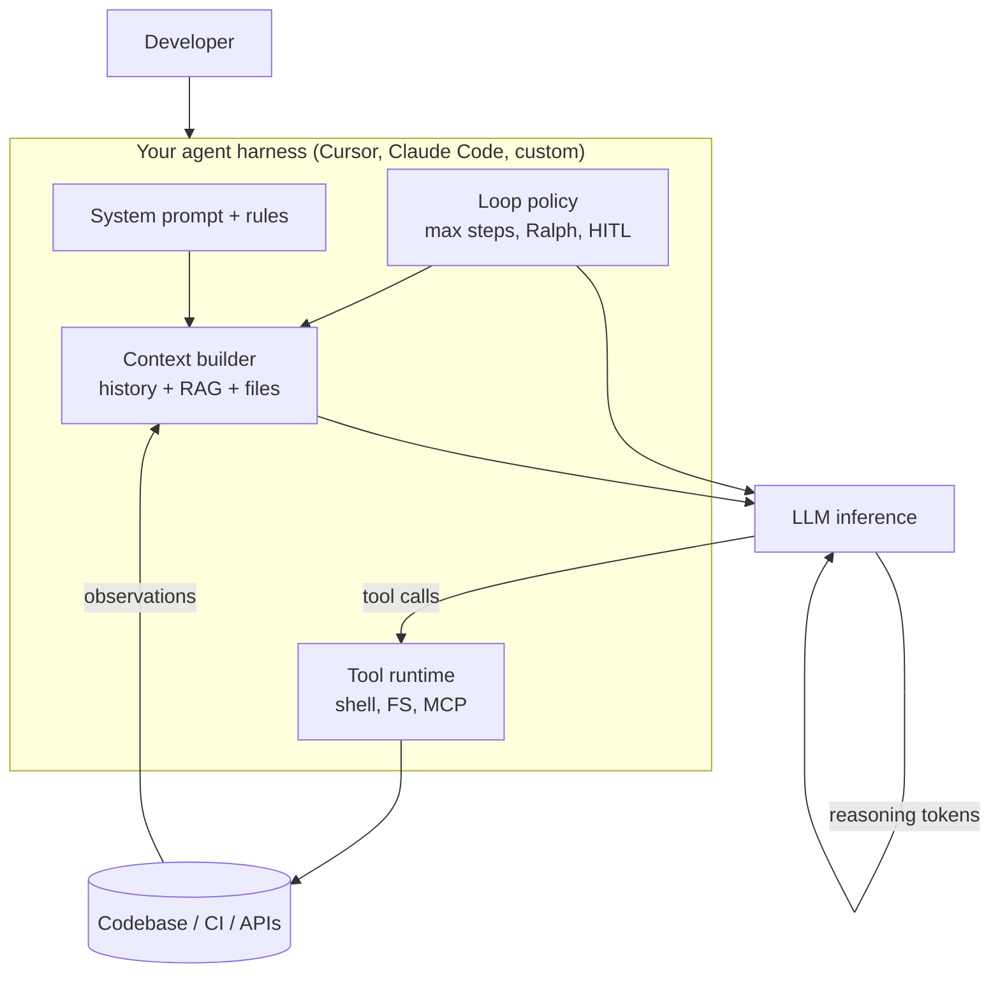
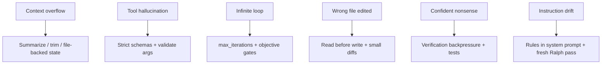

# Four Tricks That Make LLMs Act Like Agents

> A base LLM is a **stateless next-token predictor** over a fixed context window. It has no persistent memory, no hands, and no retry button. The four tricks below — context, reasoning, tools, and loops — are the engineering patterns that wrap that core into something that can plan, code, debug, and ship.

These are not magic. They are **interfaces** between the model and everything outside its weights: chat history, scratchpad text, filesystem, shell, APIs, and iteration harnesses.

---

## Mental Model: From Predictor to Agent



**Reading:** intelligence-like behavior emerges when the harness repeatedly (loop) feeds the model rich state (context), lets it think in text (reasoning), and lets it change the world (tools) — then checks whether the world changed correctly.

---

## 1. Context — The Illusion of Memory

### What the model actually has

A transformer does **not** remember past chats. Each forward pass is:

```
P(token_t | token_1 … token_{t-1})
```

"Memory" is whatever tokens you **re-inject** into the prompt on this call:

| Source | What gets injected | Persistence |
|--------|-------------------|-------------|
| Chat history | Prior user/assistant/tool messages | Session / stored transcript |
| System prompt | Rules, persona, tool schemas | Per-request or cached |
| RAG retrieval | Chunks from docs, codebase, issues | External index |
| Tool results | stdout, file contents, API JSON | Appended to messages |
| Files on disk | `AGENTS.md`, `IMPLEMENTATION_PLAN.md` | Git + filesystem |



### Context window constraints

- **Hard limit:** e.g. 128k–200k tokens. Everything competes for the same attention budget.
- **KV cache:** within one generation, past tokens are cached; across **separate API calls**, you must resend history (or a compressed summary).
- **Context rot:** long transcripts dilute attention; models repeat, contradict, or "forget" early instructions. Mitigations: summarization, sliding window, file-backed state, fresh sessions per task.

### External memory patterns (agentic coding)



> **Key insight:** for coding agents, **the repo is often the real memory**. Chat is ephemeral; committed code, tests, and plan files survive context clears.

---

## 2. Reasoning — Thinking in Tokens Before Acting

Reasoning means allocating context to **intermediate computation** the model writes for itself before producing the final answer or tool call.

### Techniques

| Technique | Mechanism | Typical use |
|-----------|-----------|-------------|
| **CoT** (chain-of-thought) | Model emits explicit steps before answer | Math, logic, multi-step bugs |
| **Zero-shot CoT** | Append *"Let's think step by step"* | Cheap reasoning boost |
| **ReAct** | Alternate `Thought` → `Action` → `Observation` | Tool-using agents |
| **Plan-and-execute** | Planner outputs task list; worker executes one step | Large refactors |
| **Extended thinking** | Hidden/long scratchpad (reasoning models) | Hard design decisions |
| **Self-consistency** | Sample N reasoning paths; majority vote | Higher reliability, N× cost |

### ReAct loop (reasoning + tools)



Example trace (conceptual):

```
Thought: I need to find where auth middleware is registered.
Action: grep "authMiddleware" in src/
Observation: src/app.ts:42, src/routes/user.ts:8
Thought: app.ts is the global mount point. I'll read that file.
Action: read_file src/app.ts
...
```

### When reasoning helps vs hurts

- **Helps:** ambiguous requirements, debugging, API design, security review, multi-file changes.
- **Hurts:** trivial edits, strict latency budgets, over-long scratchpads that eat the context window.
- **Trade-off:** more thinking tokens = higher cost + latency; use harness policies (max thinking budget, stop when tool result is conclusive).

---

## 3. Tools — Side Effects on the Real World

Tools turn text completion into **actions**: read files, run tests, open PRs, query DBs. The runtime — not the model — executes them.

### Function-calling protocol



1. **Declare** tools in the prompt (name, description, JSON Schema parameters).
2. Model outputs a **tool call** (not arbitrary code — structured JSON).
3. Host **executes** in a sandbox with auth boundaries.
4. Result is appended as a `tool` / `function` role message.
5. Model continues until it stops calling tools.

### Tool categories for coding agents

| Category | Examples | Risk |
|----------|----------|------|
| **Read** | `read_file`, `grep`, `git diff`, LSP | Low |
| **Write** | `write`, `search_replace`, apply_patch | Medium — needs review |
| **Execute** | `shell`, `npm test`, docker | High — sandbox + allowlists |
| **Integrate** | GitHub API, Linear, MCP servers | High — tokens + blast radius |
| **Meta** | `Task` subagent, browser, web fetch | Medium — cost + scope creep |

### MCP (Model Context Protocol)

MCP standardizes how agents discover and call tools hosted by external servers (DB, Slack, custom APIs). Same loop as function calling; tools are **dynamically listed** from MCP tool descriptors instead of hard-coded in the app.

> **Design rule:** tools should be **small, composable, and idempotent where possible**. Prefer `grep` + `read_file` over one giant "analyze repo" tool — the model composes primitives; you keep observability and permissions granular.

---

## 4. Loop — Iteration Until Verified

A single LLM call is a **one-shot**. Agents wrap calls in a **control loop** with stopping conditions, budgets, and verification.

### Generic agent loop



**Stopping conditions:**

- Model emits end-of-turn without tool calls
- Explicit completion signal (e.g. `<promise>COMPLETE</promise>`)
- All tests green / linter clean (objective gate)
- `max_iterations` or token budget exhausted
- Human approval (HITL)

### Ralph loop (fresh context per iteration)

Named after Ralph Wiggum — *try again until it works*. Popular pattern for **long autonomous coding** (Geoffrey Huntley, Claude Code plugin).

**Core idea:** don't grow one infinite chat. **Restart with a clean context** each iteration; persistence lives on **disk + git**, not in the transcript.



**Ralph loop invariants:**

| Invariant | Why |
|-----------|-----|
| **One atomic task per iteration** | Verifiable, bisectable commits; avoids context rot |
| **Same prompt every pass** | `PROMPT.md` re-orients an amnesiac agent |
| **Filesystem as memory** | `IMPLEMENTATION_PLAN.md`, `AGENTS.md`, specs |
| **Backpressure** | Tests/linters must pass before commit — objective truth |
| **Completion promise** | Model outputs `COMPLETE` (or tagged promise) when done |
| **max_iterations** | Prevents runaway cost and infinite loops |

Minimal bash shape:

```bash
# Conceptual — always set a max iteration cap in production
for i in $(seq 1 "$MAX_ITER"); do
  agent -p "$(cat PROMPT.md)" || continue
  npm test && break
done
```

### Shared-context loop vs fresh-context loop

| Mode | Context | Best for |
|------|---------|----------|
| **Shared** | One long session; model sees full trace | Interactive debugging, pair programming |
| **Fresh (Ralph)** | New session each pass; reads disk | Greenfield builds, task queues, overnight runs |

> **Context rot** is why Ralph works: iteration 15 doesn't re-read iterations 1–14 in the prompt — it reads **git and plan files** instead.

---

## How the Four Tricks Compose (Coding Agent Stack)



Typical **one turn** inside the loop:

1. **Context:** system rules + open files + grep results + last tool outputs.
2. **Reasoning:** model plans edit strategy in prose (or hidden thinking).
3. **Tools:** `read_file` → `search_replace` → `shell npm test`.
4. **Loop:** test fails → observation back in context → another tool round until pass or cap.

---

## Adjacent Pieces (Often Missing from the "Big Four")

These aren't separate tricks but **production requirements** for agentic coding:

| Piece | Role |
|-------|------|
| **System prompt / rules** | Static behavior contract (style, safety, "don't commit secrets") |
| **Structured output** | JSON schema, XML tags — parseable machine output |
| **RAG / codebase index** | Semantic search over repo when grep isn't enough |
| **Subagents** | Delegate explore / test / review with isolated context |
| **Observability** | Log every tool call, token use, latency (debug loops) |
| **Sandboxes** | Container, network policy, secret scanning on shell |
| **Human-in-the-loop** | Approve destructive ops, merge PRs, clarify specs |

---

## Failure Modes to Expect



---

## Cheat Sheet

| Trick | One-line | Coding agent example |
|-------|----------|----------------------|
| **Context** | Resend state as tokens | `@file`, chat history, `AGENTS.md` |
| **Reasoning** | Think in text before acting | CoT in chat; plan in `IMPLEMENTATION_PLAN.md` |
| **Tools** | Model requests, runtime executes | `grep`, `edit`, `npm test`, MCP |
| **Loop** | Repeat until verified | ReAct turns; Ralph `while` with test gate |

**Bottom line:** the model only ever **predicts tokens**. Memory is **injected context**, intelligence-like behavior is **reasoning tokens + tool side effects + a loop with verification**. Design the harness — not just the prompt.
