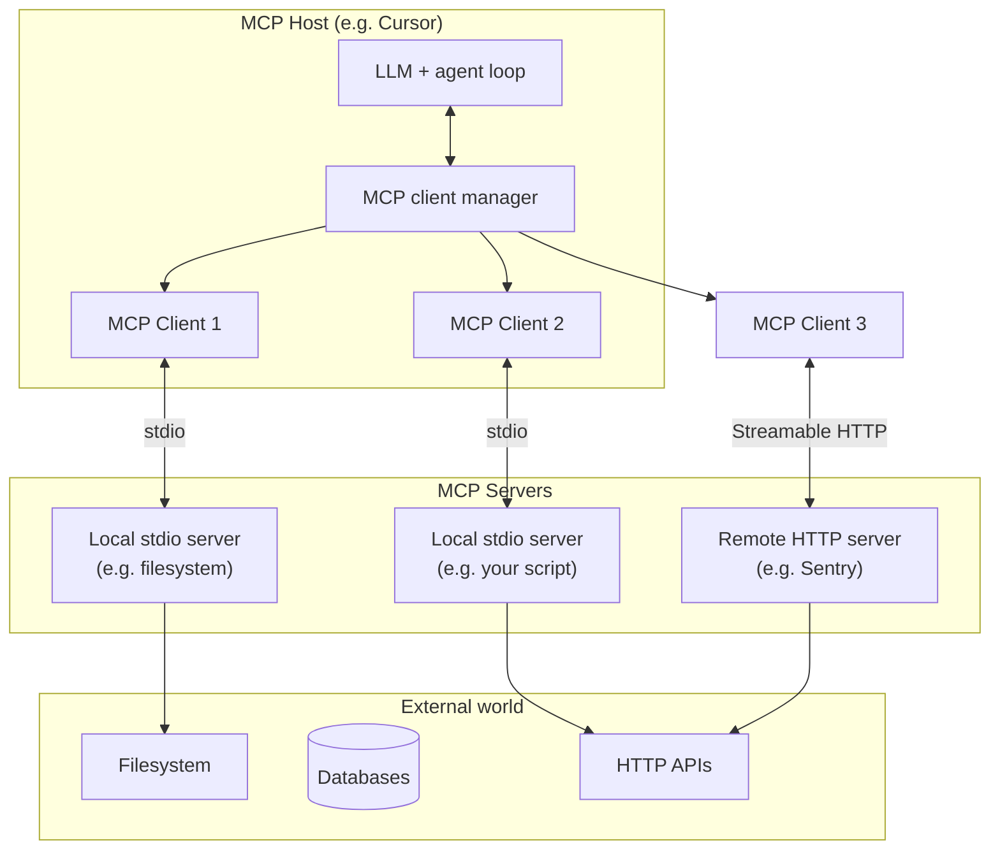
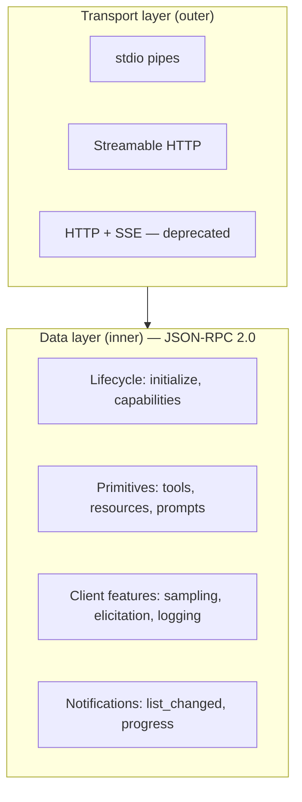
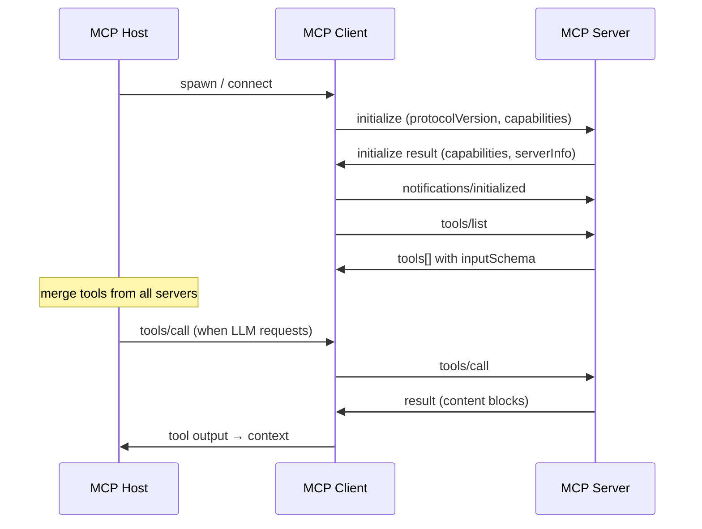

# Model Context Protocol (MCP) — Deep Notes

> MCP is a **standardized plug-in layer** between AI hosts and external capabilities. One command can add browsing, databases, git, issue trackers, or custom APIs to an agent — without the host app hard-coding each integration.

MCP does **not** tell hosts how to run LLMs or manage context. It only defines how a host's internal client talks to a server that exposes **tools**, **resources**, and **prompts** over a shared JSON-RPC protocol.

---

## TL;DR (from the basics)

| Piece | What it is | Example |
|-------|-----------|---------|
| **MCP Host** | The AI application you use | Cursor, Claude Desktop, VS Code |
| **MCP Client** | Host-internal connector (one per server) | Cursor runtime spawning & talking to a server process |
| **MCP Server** | The program that exposes capabilities | Filesystem server, Sentry server, your custom API wrapper |

**How you use it:** Add a server config (usually a command or URL). The host spawns or connects to the server, discovers tools, and the model can call them.

**Key value:** Standardization + simplicity. Same server works across multiple hosts. Adding a capability is config, not a product release.

---

## Mental Model: Where MCP Sits



**Reading:** The host owns the LLM and the agent loop. Each MCP server is a separate process (local) or service (remote) that the host's clients talk to. The model sees a **merged tool list** from all connected servers.

---

## The Three Participants (granular)

### MCP Host

The user-facing AI application. Responsibilities:

- Spawn or connect to configured MCP servers
- Create one **MCP client** per server connection
- Run the agent loop: pass tool schemas to the LLM, execute `tools/call` on the right server, inject results back into context
- Enforce user approval for sensitive tools (host-dependent)

Examples: Cursor, Claude Desktop, VS Code Copilot, ChatGPT (with MCP support), Claude Code.

### MCP Client

Not something you usually build unless you're making a host. It is **library code inside the host** that:

1. Opens a transport (stdio pipe or HTTP)
2. Sends `initialize` and negotiates capabilities
3. Calls `tools/list`, `resources/list`, `prompts/list`
4. Forwards `tools/call` and returns structured results to the host

**Rule:** One client ↔ one server connection. Connect to three servers → three clients inside the host.

### MCP Server

The piece you most often **build or install**. A server:

- Implements the MCP JSON-RPC protocol
- Advertises **primitives** (tools, resources, prompts)
- Executes tool calls and returns `content` blocks (text, images, etc.)

A server can run **locally** (child process on your machine) or **remotely** (cloud URL). The word "local" describes **where the server process runs**, not whether it touches the internet.

---

## Local vs Remote Servers

| | Local (stdio) | Remote (Streamable HTTP) |
|---|--------------|--------------------------|
| **Process** | Host spawns child on your machine | Independent server; host connects over network |
| **Typical transport** | stdio | Streamable HTTP (`POST` + optional SSE on `GET`) |
| **Connections** | Usually 1 client per server instance | Many clients per server |
| **Config** | `command` + `args` in host config | `url` + auth headers / OAuth |
| **Internet** | Often still calls online APIs | Always network-based |

### Common confusions (important)

1. **Local ≠ offline.** A "local" MCP server is still real MCP. Most local servers wrap online APIs (weather, stocks, search). "Local" only means the MCP process runs on your machine.
2. **Local ≠ unofficial.** Local servers usually come from shared GitHub repos or package registries — same ecosystem as remote servers.
3. **Remote ≠ more powerful.** Local stdio is often lower latency for filesystem/shell/git; remote is better for multi-user SaaS integrations.

---

## Protocol Layers

MCP has two layers. SDKs hide most of this, but understanding it explains failures.



### Data layer — what actually gets exchanged

All transports carry the same JSON-RPC messages:

| Phase | Methods | Purpose |
|-------|---------|---------|
| **Lifecycle** | `initialize`, `notifications/initialized`, `ping` | Version + capability handshake |
| **Tools** | `tools/list`, `tools/call` | Discover and execute functions |
| **Resources** | `resources/list`, `resources/read`, `resources/subscribe` | Read-only context (files, schemas, API snapshots) |
| **Prompts** | `prompts/list`, `prompts/get` | Reusable prompt templates |
| **Client → server** | `sampling/createMessage`, `elicitation/create` | Server asks host for LLM completion or user input |
| **Notifications** | `notifications/tools/list_changed`, etc. | Push updates without request/response |

### Transport layer — how bytes move

| Transport | Status | When to use |
|-----------|--------|-------------|
| **stdio** | Current, recommended for local | Host spawns server as subprocess; messages on stdin/stdout |
| **Streamable HTTP** | Current, recommended for remote | Single `/mcp` endpoint; `POST` for requests; optional SSE stream |
| **HTTP + SSE** (old) | Deprecated (2024-11-05) | Legacy clients only; separate SSE + message endpoints |

#### Streamable HTTP (remote) — mechanics

- Server exposes one path (e.g. `https://example.com/mcp`) supporting `POST` and `GET`
- Client sends each JSON-RPC message as an HTTP `POST`
- Server responds with `application/json` **or** `text/event-stream` (SSE) for streaming
- Client may open `GET` on the same path for server-initiated SSE
- **Sessions:** Server may return `Mcp-Session-Id` header; client must echo it on later requests
- **Security:** Validate `Origin` header; use OAuth/bearer tokens for auth

---

## Lifecycle: What Happens When You Connect



### Initialize exchange (simplified)

Client sends:

```json
{
  "jsonrpc": "2.0",
  "id": 1,
  "method": "initialize",
  "params": {
    "protocolVersion": "2025-06-18",
    "capabilities": { "elicitation": {} },
    "clientInfo": { "name": "cursor", "version": "1.0.0" }
  }
}
```

Server responds with its capabilities (`tools`, `resources`, `prompts`, `listChanged` support, etc.). If protocol versions are incompatible, the connection should fail early — not mid-session.

---

## Primitives — The Core of MCP

### Server primitives (what you expose)

| Primitive | Analogy | Discovery | Use |
|-----------|---------|-----------|-----|
| **Tools** | Functions / APIs | `tools/list` | LLM calls `tools/call` to *do* something |
| **Resources** | Files / read-only data | `resources/list`, `resources/read` | Inject context without execution |
| **Prompts** | Slash commands / templates | `prompts/list`, `prompts/get` | Structured user workflows |

**Tools** are what most agents use day-to-day. Each tool has:

- `name` — stable identifier (e.g. `git_status`)
- `description` — when the model should use it
- `inputSchema` — JSON Schema for arguments (same idea as OpenAI function calling)

Example tool descriptor (what the model sees after `tools/list`):

```json
{
  "name": "git_status",
  "description": "Show the working tree status.",
  "inputSchema": {
    "type": "object",
    "properties": {
      "directory": { "type": "string", "description": "Path of the working directory." }
    },
    "required": ["directory"]
  }
}
```

### Client primitives (what the host can offer back)

Servers can call into the host:

- **Sampling** — `sampling/createMessage`: server requests an LLM completion without bundling an SDK
- **Elicitation** — `elicitation/create`: server asks the user a question or confirmation
- **Logging** — send debug logs to the host UI

Useful when building rich servers that need model judgment or user consent mid-flow.

---

## How a Host Uses MCP (end-to-end)

1. **Load config** — list of servers (`command` or `url`)
2. **Connect** — spawn stdio subprocess or open HTTP session per server
3. **Initialize** — negotiate protocol version and capabilities
4. **Discover** — `tools/list` (and resources/prompts if needed)
5. **Register** — merge all tools into one registry for the LLM
6. **Agent loop** — model emits tool call → host routes to correct server → `tools/call` → result appended to messages
7. **Dynamic updates** — if server supports `tools/list_changed`, host refreshes tool list

Pseudo-code:

```python
# Conceptual — not a full implementation
available_tools = []
for server in configured_servers:
    session = await connect(server)           # stdio or HTTP
    await session.initialize()
    tools = await session.list_tools()
    available_tools.extend(tools)

# Later, when LLM picks a tool:
result = await session_for_that_server.call_tool(name, arguments)
conversation.append_tool_result(result)
```

---

## Configuring Servers in a Host

Hosts store MCP config as JSON. Pattern is the same across Claude Desktop, Cursor, etc.; paths differ.

### Local server (stdio)

```json
{
  "mcpServers": {
    "weather": {
      "command": "uv",
      "args": [
        "--directory",
        "/absolute/path/to/weather",
        "run",
        "weather.py"
      ],
      "env": {
        "API_KEY": "optional-if-needed"
      }
    }
  }
}
```

The host runs: `uv --directory /absolute/path/to/weather run weather.py` and speaks JSON-RPC over stdin/stdout.

**Cursor:** Project-level `.cursor/mcp.json` or user settings. Always use **absolute paths** for `command`/`args`.

### Remote server (HTTP)

```json
{
  "mcpServers": {
    "sentry": {
      "url": "https://mcp.sentry.dev/mcp",
      "headers": {
        "Authorization": "Bearer <token>"
      }
    }
  }
}
```

Exact schema varies by host; some use `transport: { type: "http", url: "..." }`.

---

## Discovering MCP Servers

There is **no single canonical marketplace**. Discovery is fragmented — verify before installing.

| Source | Notes |
|--------|-------|
| [Official MCP registry](https://registry.modelcontextprotocol.io/) | Canonical direction; less active than GitHub |
| GitHub (`modelcontextprotocol/servers`, org repos) | Reference + community servers; best for trust signals |
| [mcp.so](https://mcp.so), Glamour.ai, etc. | Aggregators; useful but noisy — duplicates and low-quality listings |
| Vendor docs | Sentry, Stripe, etc. ship first-party remote servers |

### How to verify quality

Before adding a server to your machine:

1. **Find the GitHub repo** — not just the marketplace listing
2. **Check activity** — recent commits, issue responses, release cadence
3. **Check stars and maintainers** — e.g. Upstash maintaining Context7 is a strong signal
4. **Read permissions** — what env vars does it need? Does it execute shell? Read filesystem?
5. **Prefer official or reference implementations** for sensitive data
6. **Run in isolation first** — MCP Inspector or a test host config before production use

Red flags: no source repo, stale dependencies, broad filesystem/shell access without justification, requests unrelated API keys.

---

## Implementing an MCP Server

### Choose your stack

| Language | SDK | Good for |
|----------|-----|----------|
| Python | `mcp` (FastMCP) | Fastest path; scripts and APIs |
| TypeScript | `@modelcontextprotocol/sdk` | Node ecosystem, npm distribution |
| Others | [Official SDKs](https://modelcontextprotocol.io/docs/sdk) | Go, Java, Kotlin, C#, Ruby, Rust, PHP |

### Choose transport

| Goal | Transport |
|------|-----------|
| Personal / IDE integration | **stdio** |
| Shared team or SaaS | **Streamable HTTP** |
| Supporting old clients only | HTTP + SSE (avoid for new work) |

### Critical rule: stdio and logging

For **stdio** servers, **never write to stdout** except MCP JSON-RPC messages. `print()` / `console.log()` corrupts the protocol.

```python
# Python — stdio-safe
import sys
print("debug", file=sys.stderr)
```

```typescript
// TypeScript — stdio-safe
console.error("debug");
```

HTTP servers can log to stdout normally.

---

## Implementation Walkthrough: Python (FastMCP)

Minimal pattern from the official weather tutorial — a local server that still calls the public NWS API.

### Setup

```bash
uv init my-mcp-server && cd my-mcp-server
uv venv && source .venv/bin/activate
uv add "mcp[cli]" httpx
```

### Server code

```python
from typing import Any
import httpx
from mcp.server.fastmcp import FastMCP

mcp = FastMCP("weather")

@mcp.tool()
async def get_alerts(state: str) -> str:
    """Get weather alerts for a US state (two-letter code, e.g. CA)."""
    url = f"https://api.weather.gov/alerts/active/area/{state}"
    async with httpx.AsyncClient() as client:
        r = await client.get(url, headers={"User-Agent": "my-app/1.0"})
        r.raise_for_status()
        data = r.json()
    features = data.get("features") or []
    if not features:
        return "No active alerts."
    return "\n---\n".join(
        f"{f['properties'].get('event')}: {f['properties'].get('areaDesc')}"
        for f in features
    )

def main():
    mcp.run(transport="stdio")

if __name__ == "__main__":
    main()
```

FastMCP uses **type hints + docstrings** to generate `inputSchema` automatically.

### Test locally

```bash
# Official inspector — interactive JSON-RPC debugging
npx @modelcontextprotocol/inspector uv run weather.py
```

### Wire into host

Add to `mcpServers` with absolute path to `uv run weather.py` (see config section above).

---

## Implementation Walkthrough: TypeScript

### Setup

```bash
mkdir my-mcp-server && cd my-mcp-server
npm init -y
npm install @modelcontextprotocol/sdk zod
```

### stdio server (local)

```typescript
import { McpServer } from "@modelcontextprotocol/sdk/server/mcp.js";
import { StdioServerTransport } from "@modelcontextprotocol/sdk/server/stdio.js";
import { z } from "zod";

const server = new McpServer({ name: "demo", version: "1.0.0" });

server.tool(
  "echo",
  "Echo text back",
  { text: z.string().describe("Text to echo") },
  async ({ text }) => ({
    content: [{ type: "text", text }],
  })
);

const transport = new StdioServerTransport();
await server.connect(transport);
```

### Streamable HTTP server (remote)

```typescript
import { createServer } from "node:http";
import { randomUUID } from "node:crypto";
import { McpServer } from "@modelcontextprotocol/sdk/server/mcp.js";
import { NodeStreamableHTTPServerTransport } from "@modelcontextprotocol/sdk/server/streamableHttp.js";

const mcp = new McpServer({ name: "demo", version: "1.0.0" });
// register tools...

const transport = new NodeStreamableHTTPServerTransport({
  sessionIdGenerator: () => randomUUID(),
});

await mcp.connect(transport);

createServer((req, res) => {
  transport.handleRequest(req, res).catch((err) => {
    console.error(err);
    res.writeHead(500).end();
  });
}).listen(3000);
```

Use **stateless** mode (`sessionIdGenerator: undefined`) only when you do not need session stickiness.

---

## Design Guidelines for Good MCP Servers

### Tools

- **One clear action per tool** — prefer `create_issue` + `list_issues` over one mega-tool
- **Tight schemas** — enums, required fields, examples in descriptions
- **Descriptions are prompts** — the model chooses tools from text; say when *not* to use it
- **Idempotent when possible** — agents retry
- **Structured errors** — return `isError: true` with actionable messages, not stack traces to the model

### Resources

- Expose stable, read-only context: OpenAPI specs, DB schemas, config snapshots
- Use URIs like `db://schema/users` for predictable `resources/read`

### Prompts

- Package multi-step workflows ("review this PR", "onboard new service")
- Parameterize with `prompts/get` arguments

### Security

- Minimize scope: only the directories/APIs needed
- Never log secrets to stderr in shared environments
- For HTTP: OAuth, bearer tokens, rate limits, validate `Origin`
- Document required env vars in README

---

## MCP vs Other "Tool" Patterns

| Approach | Pros | Cons |
|----------|------|------|
| **MCP** | Standard across hosts; community servers; discovery protocol | Extra process; config per host |
| **Host-native tools** (built into Cursor, etc.) | Tighter integration | Not portable |
| **OpenAI function calling** | Simple in one API | No standard server process; per-vendor |
| **Custom REST plugin** | Full control | You own protocol, discovery, auth |

MCP is essentially **standardized function calling + a server process + discovery**, portable across hosts.

---

## Debugging Checklist

| Symptom | Likely cause |
|---------|----------------|
| Server starts but no tools in UI | Initialize failed; check host MCP logs |
| Garbled / instant disconnect (stdio) | `print()` to stdout; fix logging to stderr |
| `404` on HTTP | Wrong URL path; session ID missing or stale |
| Tools listed but calls fail | Schema mismatch; required args missing |
| Permission errors | Env vars not passed in host config |
| Old client won't connect | Try HTTP+SSE compatibility mode or upgrade client |

**Tools:**

- [MCP Inspector](https://github.com/modelcontextprotocol/inspector) — `npx @modelcontextprotocol/inspector <command>`
- Host MCP logs (Cursor: Output → MCP)
- Server stderr logging

---

## Key Ideas to Remember

1. **Three roles:** Host (app) → Client (connector inside app) → Server (your tools).
2. **One command, new capabilities** — that's the adoption driver.
3. **Local server** = process on your machine; it can still hit the internet.
4. **stdio** for local, **Streamable HTTP** for remote; old SSE transport is deprecated.
5. **Protocol is JSON-RPC** with `initialize` → discover primitives → `tools/call`.
6. **Verify servers** via GitHub (stars, maintainers, activity), not marketplace hype.
7. **Implementing** = pick SDK → define tools → choose transport → add to host config → test with Inspector.

---

## References

- [Architecture overview](https://modelcontextprotocol.io/docs/learn/architecture)
- [Build a server (Python / TypeScript)](https://modelcontextprotocol.io/docs/develop/build-server)
- [Transports spec (Streamable HTTP)](https://modelcontextprotocol.io/specification/2025-06-18/basic/transports)
- [Reference servers (GitHub)](https://github.com/modelcontextprotocol/servers)
- [MCP SDK docs index](https://modelcontextprotocol.io/llms.txt)
