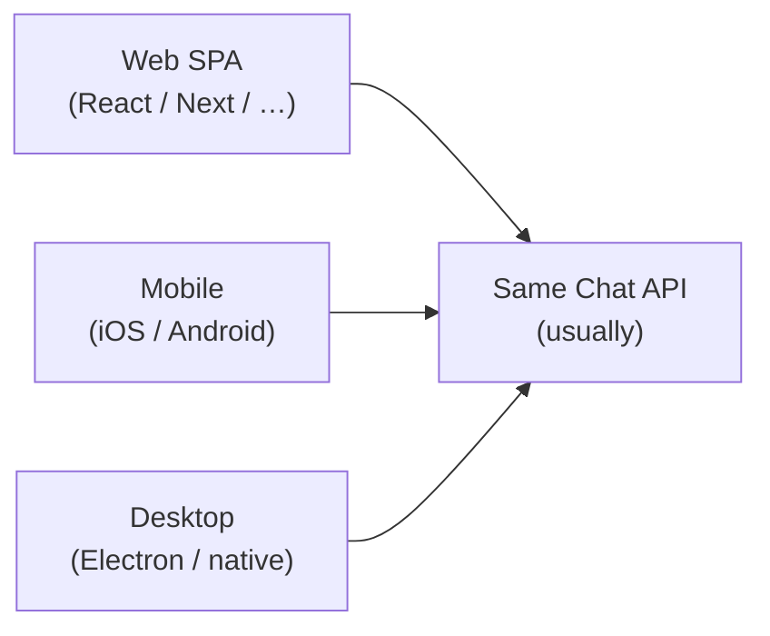
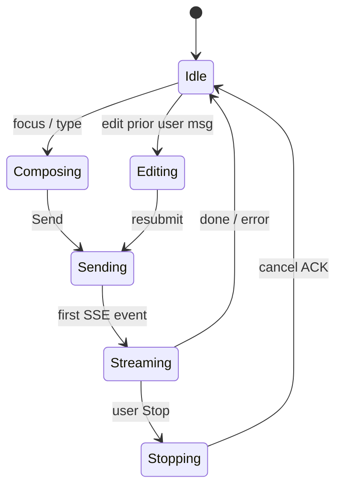
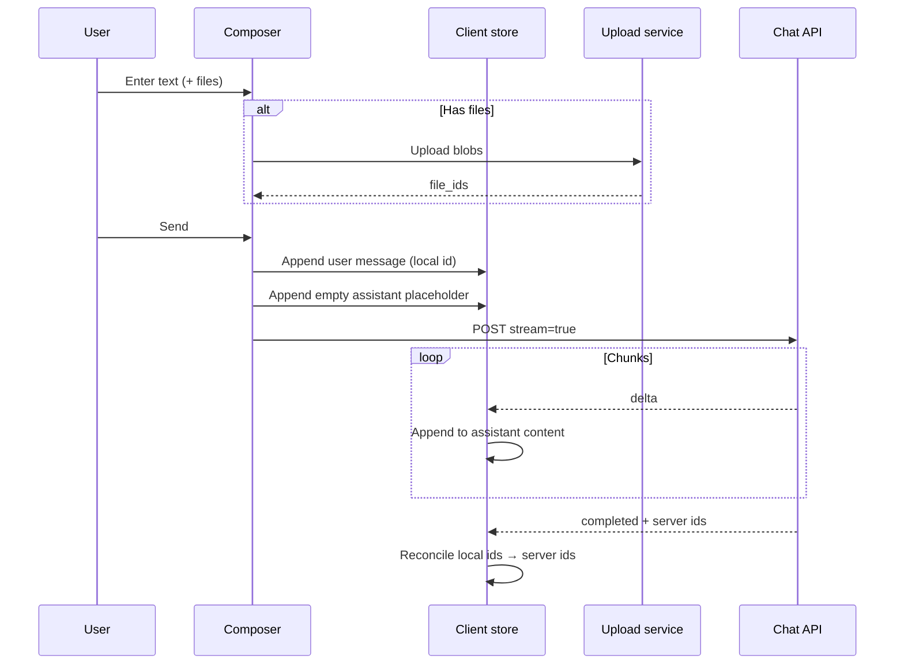
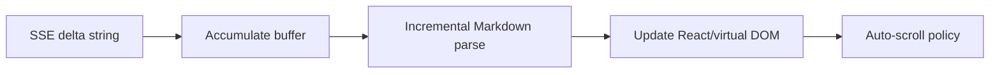
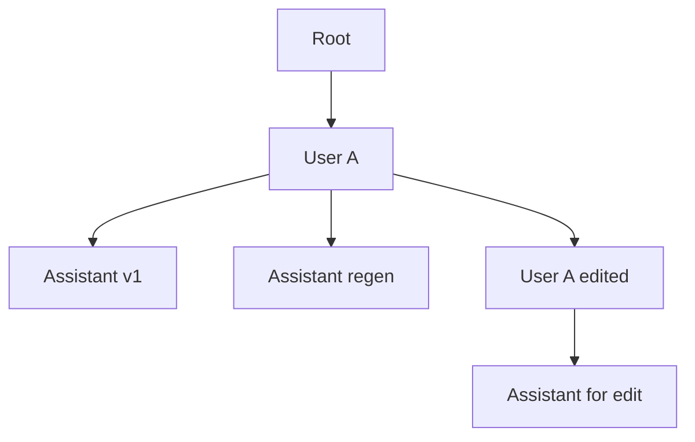

# 01 — Frontend / Client

The client is not “just a text box.” It owns capture, optimistic UX, stream rendering, and user actions that map back to server turns.

---

## 1. Surfaces

Shared concerns across surfaces:

- Composer (text, paste, @-mentions, slash commands)
- Attachment picker (images, PDFs, code)
- Voice input (ASR → text before or during send)
- Thread list + search
- Streaming assistant bubble
- Stop / regenerate / edit & resubmit / branch

---

## 2. Local state model

Typical client-held state:

| State | Notes |
|-------|-------|
| `conversations[]` | Sidebar cache; server is source of truth |
| `activeConversationId` | Current thread |
| `messages[]` | Render list (may lag server during stream) |
| `streamingMessageId` | Which bubble is receiving deltas |
| `draft` | Unsent composer text (often localStorage) |
| `pendingAttachments` | Uploaded file IDs waiting to send |
| `uiFlags` | sidebar open, model picker, etc. |

---

## 3. Send path (client)

**Optimistic UI:** show the user bubble immediately; reconcile IDs when the server ACKs. If the request fails, mark the bubble errored and offer retry.

---

## 4. Rendering the stream

Streaming text is usually **Markdown**, possibly with:

- Fenced code blocks (highlight once fence closes or incrementally)
- Tables, lists, Math (KaTeX/MathJax)
- Citations / footnotes (product-specific)
- “Thinking” / reasoning blocks (collapsed UI)
- Tool-call cards (“Searching the web…”, “Running code…”)

Auto-scroll policy matters: stick to bottom only if the user was already near the bottom.

---

## 5. Client → server actions beyond Send

| Action | Typical API effect |
|--------|--------------------|
| Stop | Cancel generation; persist partial or discard |
| Regenerate | New assistant child under same user message |
| Edit user message | Branch: new user message + new generation |
| Thumbs up/down | Feedback event for eval / RLHF datasets |
| Continue | Another generation with “continue” hint |
| Switch model | Next turn uses different model id |

Branching creates a **tree** of messages, not a flat list — the UI often still shows one linear path (selected branch).

---

## 6. Transport choices on the client

| Transport | Used for |
|-----------|----------|
| HTTPS REST | CRUD: list chats, rename, delete |
| SSE (EventSource or fetch stream) | Token streaming (common on web) |
| WebSocket | Bidirectional; some mobile / realtime products |
| Multipart / resumable upload | Large files |

Web clients often use `fetch` + `ReadableStream` rather than raw `EventSource` so they can send `Authorization` headers and POST bodies.

---

## 7. Security & privacy on the client

- Prefer **httpOnly** cookies or short-lived tokens; avoid long-lived secrets in JS.
- Strip secrets from client logs.
- Do not treat local message cache as secure storage.
- CSP, dependency hygiene, and XSS matter — assistant Markdown can contain hostile content (sanitize / careful rendering).

---

## 8. What to watch in DevTools

When studying ChatGPT/Claude in the browser:

1. Network → the streaming request (type `eventsource` or `fetch`).
2. Response payload: `data: {...}` lines.
3. Parallel calls: file upload, title generation, memory updates, telemetry.
4. Cancel: AbortController when clicking Stop.

Next: [02-edge-api-gateway.md](./02-edge-api-gateway.md).
