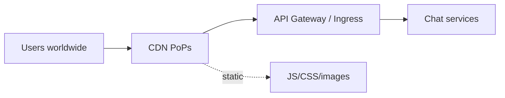
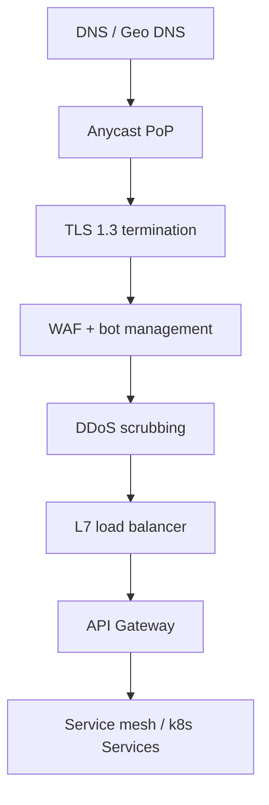
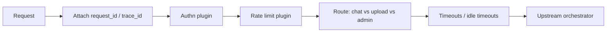
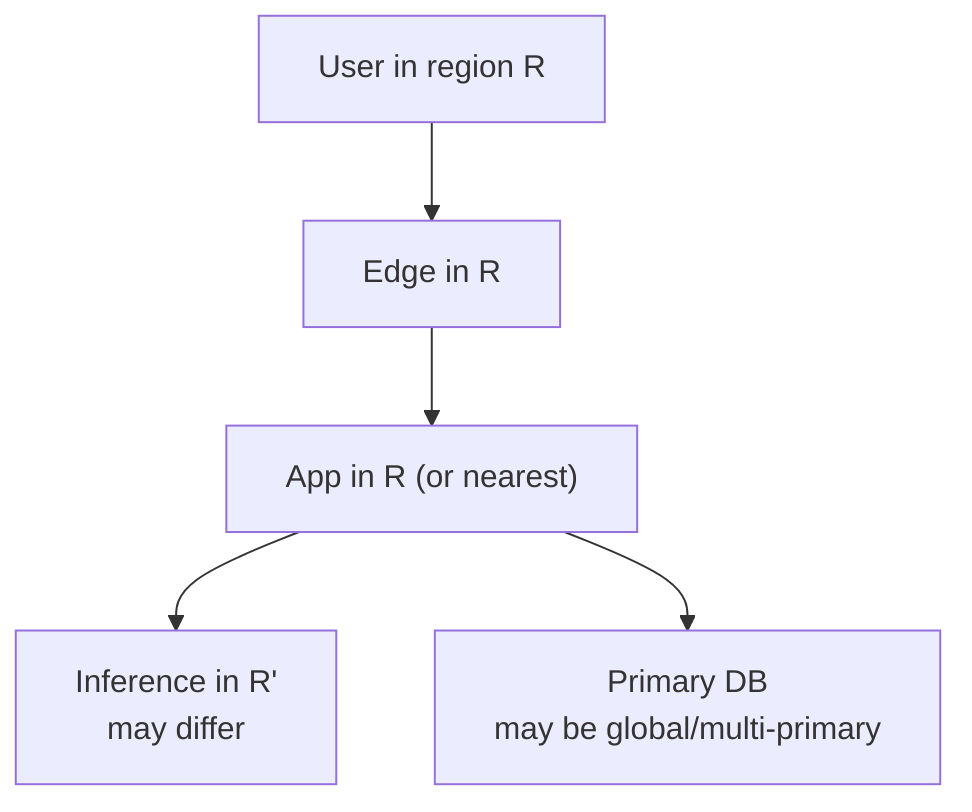

# 02 — Edge, CDN & API Gateway

Everything between the user’s device and the chat application services.

---

## 1. Why this layer exists

Chat traffic is:

- **Bursty** (launches, news events, viral moments)
- **Long-lived** (streams lasting tens of seconds)
- **Sensitive** (auth + personal content)
- **Global** (latency to first token matters)

So products put a hardened edge in front of app servers.



---

## 2. CDN vs API path

| Path | Examples | Behavior |
|------|----------|----------|
| Static | App bundle, fonts, marketing | Cached at PoP; long TTL + fingerprinting |
| API | `/backend-api/conversation` | Rarely cached; sticky or any-instance; streaming |

Streaming responses must **not** be buffered by intermediaries that wait for `Content-Length`. Gateways need “stream mode” / disabled response buffering.

---

## 3. Ingress stack



Responsibilities:

- **TLS** — certificates, HTTP/2 or HTTP/3
- **WAF** — SQLi/XSS patterns, known bad bots (coarse)
- **DDoS** — volumetric + application-layer
- **LB** — health checks, connection draining
- **Gateway** — auth hooks, rate-limit hooks, routing by path/version, request IDs

---

## 4. API Gateway concerns specific to chat



Critical settings for streams:

| Setting | Why |
|---------|-----|
| Long read idle timeout | Tokens may pause during tool calls |
| No full-body buffering | TTFT (time to first token) |
| Max request body | Prompt + base64 images can be huge — prefer upload-then-reference |
| Retry policy | **Do not** blindly retry non-idempotent sends |
| CORS | Web app origins only |

---

## 5. API surface (typical product)

```text
POST   /v1/conversations                    # create thread
GET    /v1/conversations                    # list
GET    /v1/conversations/{id}               # fetch messages
POST   /v1/conversations/{id}/messages      # send turn (stream)
POST   /v1/files                            # upload
DELETE /v1/conversations/{id}
POST   /v1/messages/{id}/feedback
GET    /v1/models
```

Public **developer** APIs (OpenAI/Anthropic style) are often a separate gateway with API keys, stricter contracts, and different SLAs than the consumer chat app backend — but they share inference capacity.

---

## 6. Regionality



Data residency requirements may force conversation storage and sometimes inference into specific regions. Model weights are large — not every region has every model.

---

## 7. Health, draining, deploys

During deploys, in-flight streams must drain:

1. LB marks instance `draining`
2. No new streams assigned
3. Existing SSE connections finish or hit max drain time
4. Instance killed

If drain is too aggressive, users see truncated answers mid-sentence.

---

## 8. Observability at the edge

Emit:

- Request rate, error rate, latency (TTFB / TTFT)
- Active stream count
- WAF block rate
- Origin shield cache hit ratio (for static)

Trace IDs created here should propagate to orchestrator and inference (`traceparent` / internal headers).

Next: [03-auth-sessions-quotas.md](./03-auth-sessions-quotas.md).
