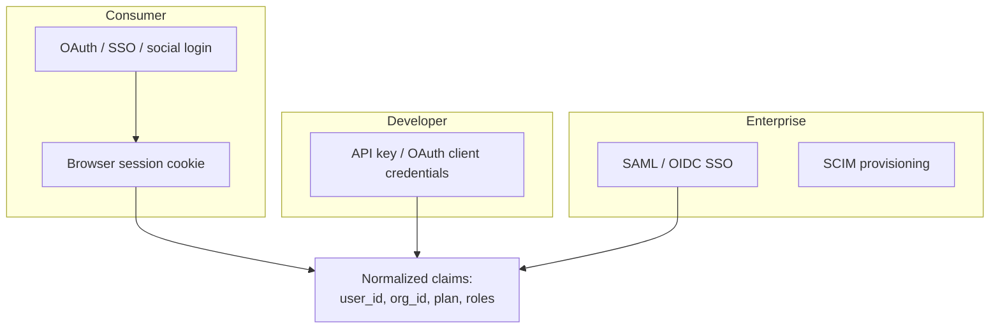
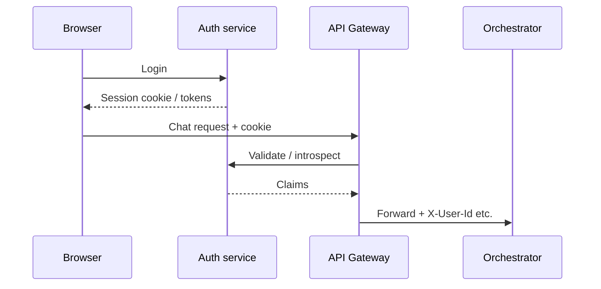
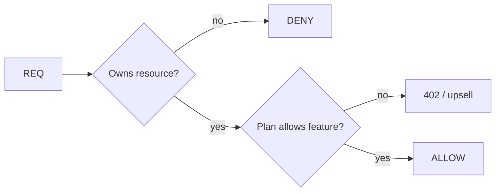
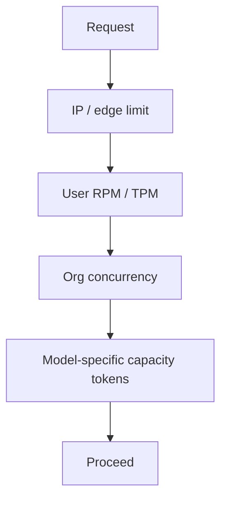
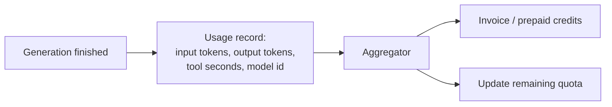

# 03 — Auth, Sessions, Quotas & Billing Gates

Before a single token is generated, the platform answers: *who are you, what are you allowed to do, and can you afford this turn?*

---

## 1. Identity modes

Claims used downstream:

| Claim | Used for |
|-------|----------|
| `user_id` | Ownership of threads |
| `org_id` / `workspace_id` | Team sharing, admin |
| `plan` | Free / Plus / Pro / Team / Enterprise |
| `roles` | Admin vs member |
| `geo` / `data_region` | Residency routing |

---

## 2. Session lifecycle

Patterns:

- **Cookie session** for first-party web apps
- **Short-lived access token + refresh** for mobile
- **API keys** for programmatic access (hashed at rest, prefix shown once)

---

## 3. Authorization (beyond login)

Authn ≠ authz.

Examples of authz checks:

- Can this user open `conversation_id`?
- Is this model enabled on their plan?
- Are tools (browser, code interpreter) allowed?
- Is the org under legal hold / retention policy?
- Is the user banned or under abuse probation?

---

## 4. Rate limiting & quotas

Chat must protect GPUs and prevent abuse.

| Dimension | Example |
|-----------|---------|
| Requests per minute | 20 RPM free tier |
| Tokens per day | Soft cap with slowdown |
| Concurrent streams | Max 3 generations |
| File uploads / day | Abuse control |
| Tool invocations | Cap expensive tools |

Implementation usually: **Redis / DynamoDB counters** with sliding or token-bucket windows. Return `429` + `Retry-After`.

---

## 5. Billing & metering

Consumer chat may meter “messages” coarsely; developer APIs meter tokens precisely. Both need **idempotent usage writes** keyed by `request_id` so retries do not double-bill.

---

## 6. Abuse & fraud signals

Layered with safety (see [10](./10-safety-moderation.md)):

- Credential stuffing / stolen cookies
- Automated account farms
- Prompt scraping / model extraction patterns
- Crypto-mining style infinite generations
- Payment fraud on paid plans

Actions: CAPTCHA, step-up auth, shadow bans, hard bans, tool disablement.

---

## 7. Failure UX

| Condition | User-visible |
|-----------|--------------|
| Expired session | Re-login modal |
| Hit rate limit | “You’re sending too fast” |
| Out of credits | Paywall |
| Model not on plan | Upsell or auto-downgrade model |
| Region blocked | Compliance message |

Next: [04-conversation-orchestration.md](./04-conversation-orchestration.md).
