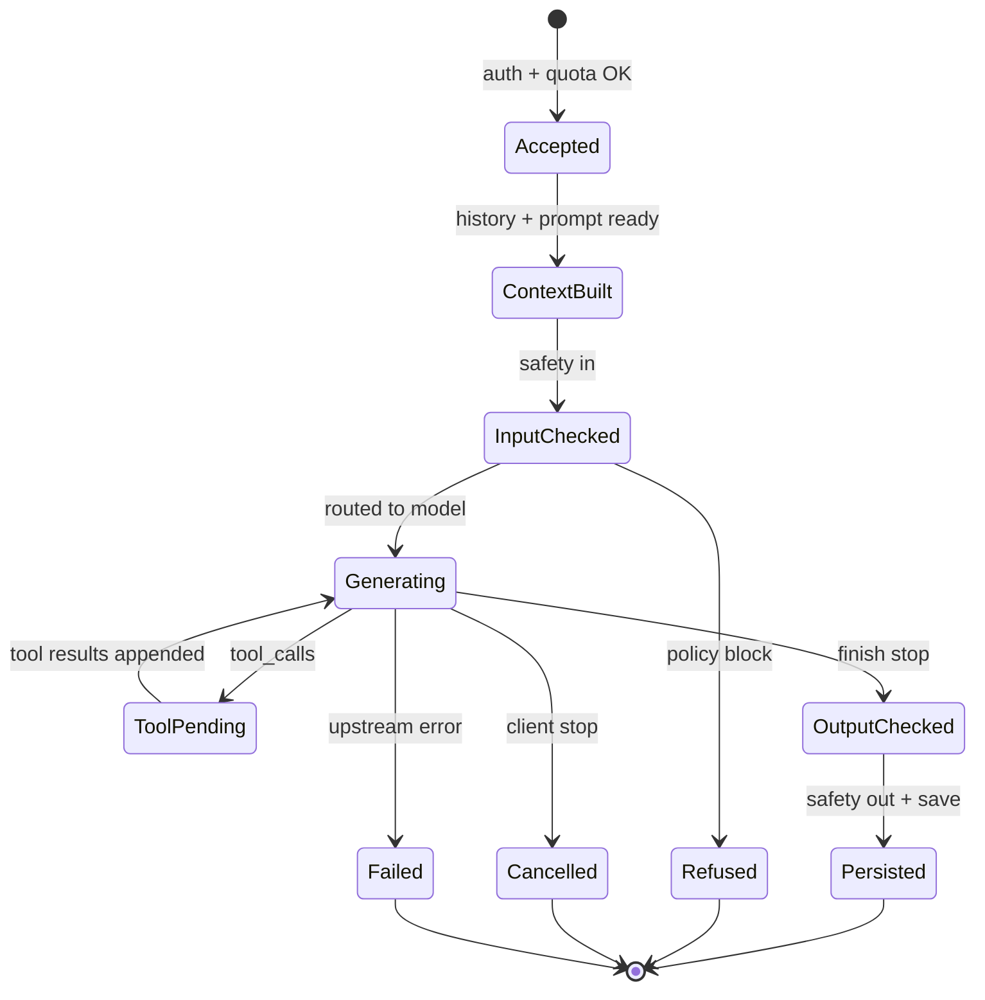
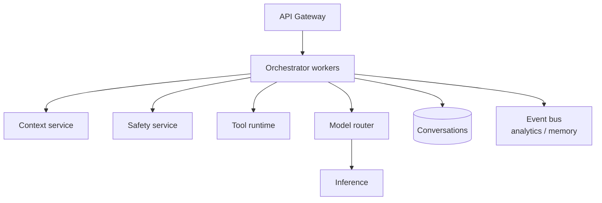
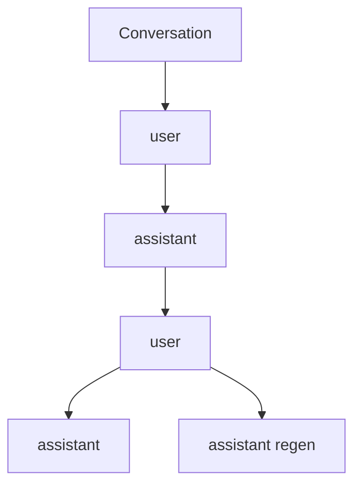
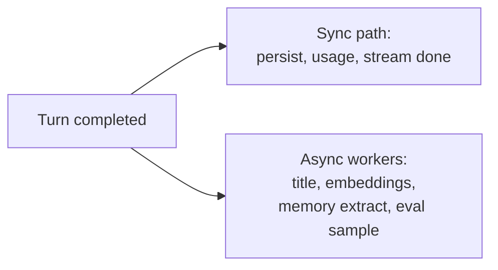

# 04 — Conversation Orchestration

The **orchestrator** (chat service) owns a single “turn”: from accepted user message to persisted assistant output, including tool loops, cancellations, and errors.

This is the application brain. Inference is a dependency.

---

## 1. Turn state machine



---

## 2. Orchestrator responsibilities

| Responsibility | Detail |
|----------------|--------|
| Idempotency | `client_request_id` prevents double user messages |
| Message graph | Parent/child ids for regen/edit branches |
| Prompt build | Delegate to context assembler |
| Tool loop | Cap iterations; timeouts; sandboxing |
| Streaming fan-in | Inference deltas → client events |
| Cancellation | Propagate abort to GPU workers |
| Persistence | Write user msg early; assistant on completion/partial |
| Title generation | Often async side call after first turn |
| Memory updates | Async extract facts (product-dependent) |

---

## 3. Component diagram



Scale-out: many orchestrator replicas behind the LB. Sticky sessions are **not** required if stream state lives in-memory on the worker that accepted the request (common) — cancellation then must hit that worker (connection-local abort) or a shared cancel flag in Redis.

---

## 4. Message data model (conceptual)

```text
Conversation {
  id, user_id, title, created_at, default_model, settings
}

Message {
  id, conversation_id, parent_id,
  role: user | assistant | system | tool,
  content: Part[],          # text | image_ref | file_ref | tool_use | tool_result
  status: complete | partial | error | cancelled,
  model, usage, created_at,
  metadata: { finish_reason, safety, … }
}
```



Linear UI path = walk preferred child pointers from root.

---

## 5. Pseudocode for one streamed turn

```text
function handleChatTurn(req):
  assertAuthorized(req)
  msgUser = db.insertUserMessage(req)        # early persist
  emit(client, message.ack(msgUser.id))

  prompt = context.build(conversation_id, msgUser)
  safety = safety.checkInput(prompt)
  if safety.block: return refuse(safety)

  assistantId = db.reserveAssistantMessage(...)
  emit(client, message.created(assistantId))

  for attempt in toolLoop(max=N):
    stream = router.generate(prompt, tools)
    for event in stream:
      if client.aborted: cancel(stream); finalize(partial); return
      emit(client, event)
      accumulate(assistantId, event)

    if stream.finish == tool_calls:
      results = tools.execute(stream.tool_calls)
      prompt = prompt + tool_calls + results
      continue
    else:
      break

  safety.checkOutput(assistantId)
  db.finalize(assistantId, usage)
  emit(client, done)
  bus.publish(TurnCompleted)
```

---

## 6. Sync vs async side effects



Keep the user-visible path thin. Title generation should not block the first token.

---

## 7. Multi-tenant isolation

Orchestrators must enforce:

- Query filters always include `user_id` / `org_id`
- Tool credentials scoped to workspace connectors
- No cross-tenant cache keys for prompts containing private data

---

## 8. Comparison: “thin proxy” vs “fat orchestrator”

| Style | Pros | Cons |
|-------|------|------|
| Thin proxy to inference | Simple | Tools/safety/history duplicated in client or missing |
| Fat orchestrator | Product features centralized | More moving parts |

ChatGPT/Claude-style apps are **fat orchestrators**.

Next: [05-prompt-context-assembly.md](./05-prompt-context-assembly.md).
