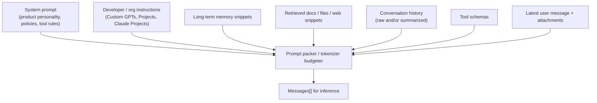
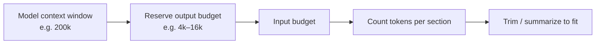
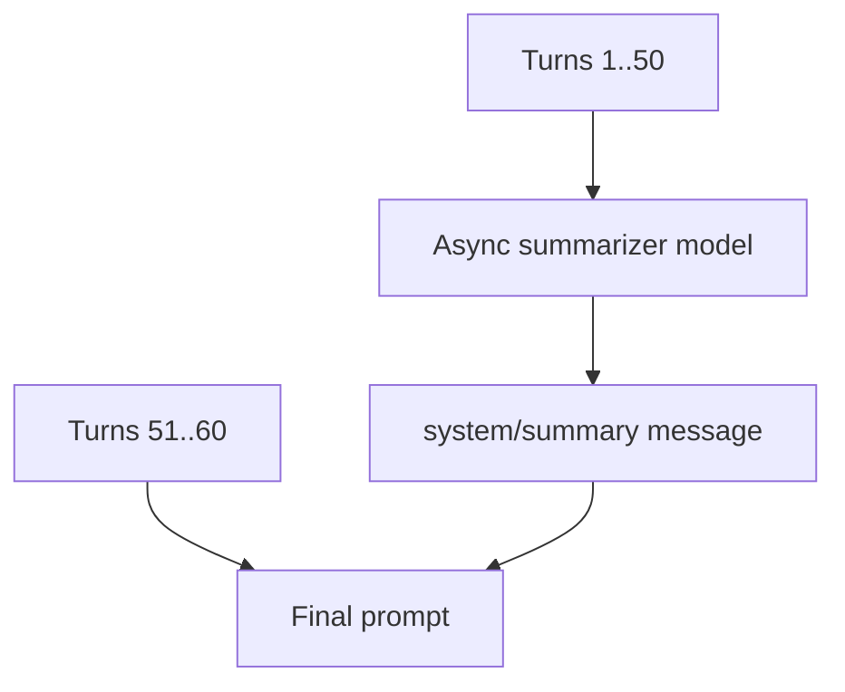
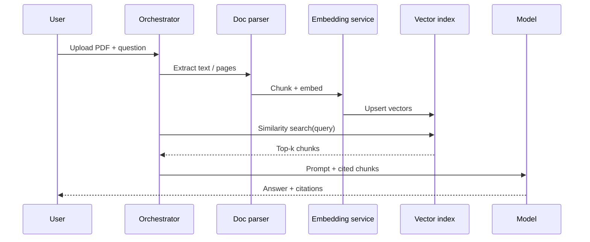
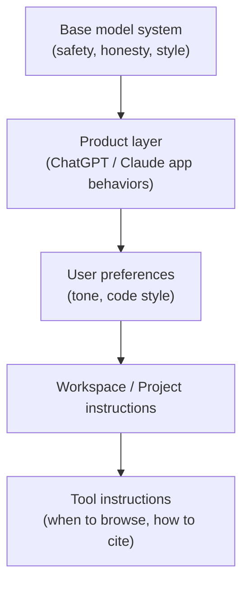

# 05 — Prompt & Context Assembly

The model never sees your UI. It sees a **structured prompt**: system instructions, history, retrieved knowledge, tool schemas, and the latest user message — all fitted into a context window.

---

## 1. What gets assembled



Priority when the window is full (typical policy):

1. Keep system + latest user message  
2. Keep recent turns  
3. Keep high-relevance RAG  
4. Compress or drop old turns  
5. Drop low-value memory  

---

## 2. Token budgeting



Token counting must match the **model’s tokenizer**. Products often:

- Estimate with a fast tokenizer approximation
- Hard-check before send
- Or let inference reject and then retry with trim

---

## 3. History strategies

| Strategy | When used |
|----------|-----------|
| Full raw history | Short threads |
| Sliding window | Keep last N turns |
| Hierarchical summary | Older turns → running summary message |
| Message importance scoring | Drop chit-chat; keep decisions/code |
| Branch-aware path | Only messages on selected branch |



Summaries are lossy — products sometimes store **both** raw history (for UI) and a summary used for the model.

---

## 4. RAG / files / “chat with docs”



Chunking quality dominates retrieval quality. Citations need stable chunk IDs mapped back to page/section.

---

## 5. Multimodal parts

User content is often not a string:

```json
{
  "role": "user",
  "content": [
    { "type": "text", "text": "What’s in this screenshot?" },
    { "type": "image", "file_id": "file_..." }
  ]
}
```

Assembler resolves `file_id` → URL / bytes / vision encoding policy (resize, max images, PDF page rasterization).

---

## 6. System prompt layers (product reality)



Conflicts are resolved by explicit precedence rules in the packer.

---

## 7. Memory (personalization)

Distinct from RAG over user files:

- Extract durable facts (“User prefers Rust”, “Lives in IST”)
- Store in user memory DB
- Retrieve a small set each turn
- Allow user to view/delete (compliance)

Must avoid leaking memory across workspaces and respect “temporary chat” modes that disable writes.

---

## 8. Output contract hints

Assembler may also add:

- Structured output schemas (JSON mode)
- Citation format requirements
- Language matching the user
- “Think step by step” style scaffolding (product-dependent; sometimes hidden)

Next: [06-model-routing.md](./06-model-routing.md).
