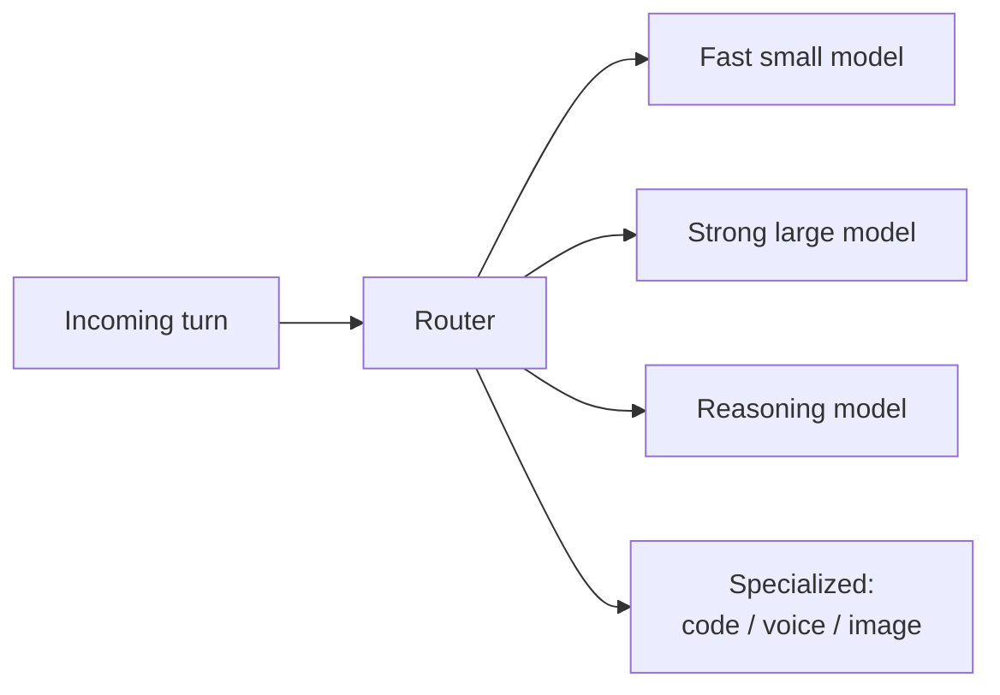
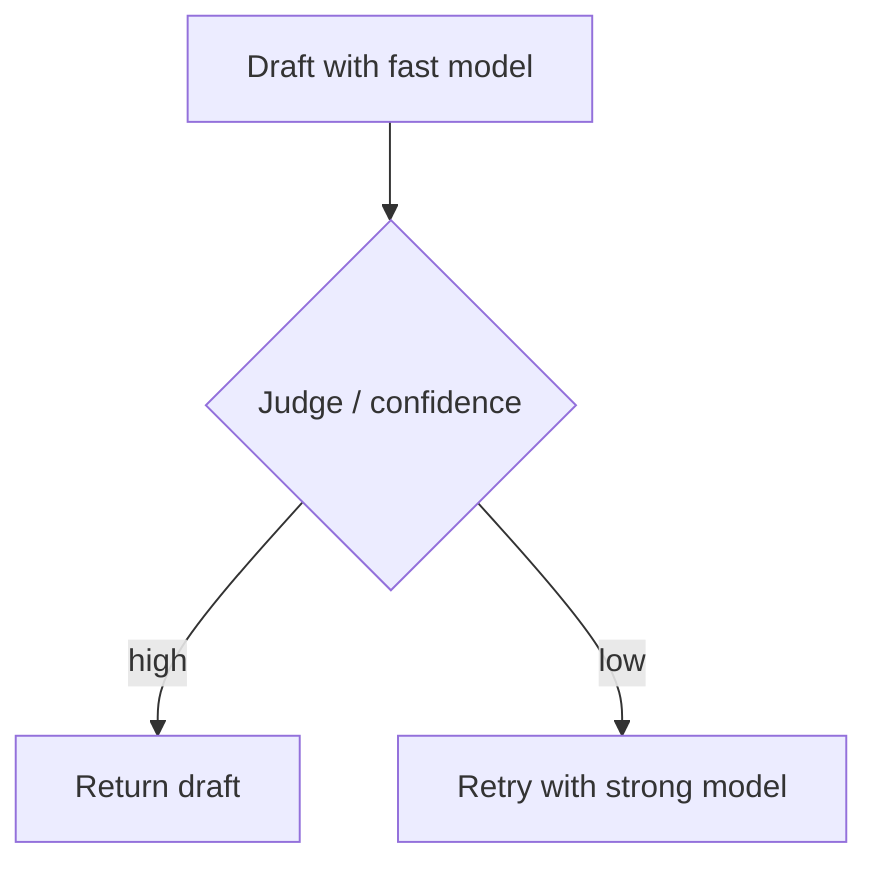
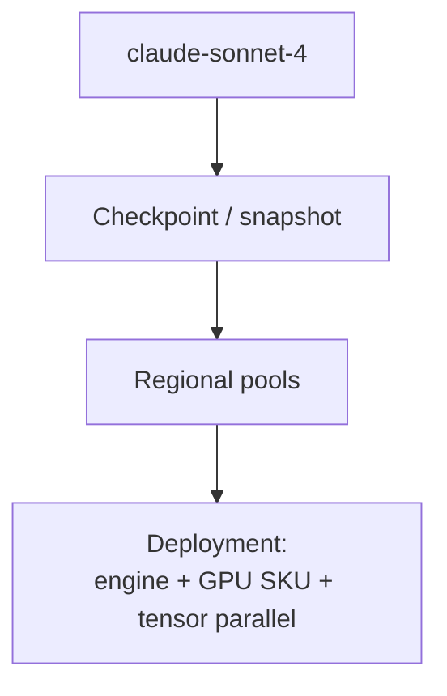
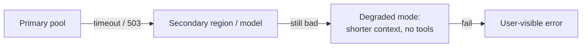
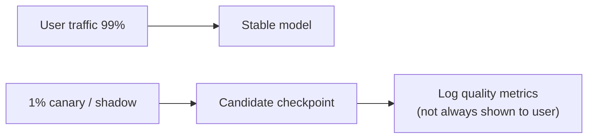

# 06 — Model Routing

Users pick “Auto”, “GPT-x”, “Claude y”, “o-series”, etc. Under the hood a **router** chooses a concrete model deployment (and sometimes a cascade of models).

---

## 1. Why route?



Goals:

- Cost control (don’t burn frontier model on “hi”)
- Latency (TTFT / tokens per second)
- Quality (hard prompts → stronger models)
- Capacity (shed load to alternate pools)
- Experiments (A/B new checkpoints)
- Compliance (region-locked weights)

---

## 2. Routing inputs

| Signal | Example |
|--------|---------|
| Explicit user choice | `model=claude-opus` |
| Plan entitlements | Free tier → limited set |
| Prompt features | Code blocks, long docs, images |
| Classifier score | “Needs deep reasoning?” |
| Current load | Queue depth on GPU pools |
| Org policy | “Only approved models” |
| Conversation state | Prior model sticky vs switch |

---

## 3. Router architectures

### A. Rules + heuristics

```text
if has_image -> multimodal_model
elif user_selected -> that_model
elif short_and_simple -> flash_model
else -> default_strong
```

### B. Learned router

Small classifier / LLM predicts which model will satisfy quality with least cost; trained on offline evals + human prefs.

### C. Cascade / speculative



### D. Ensemble (rare in consumer chat)

Multiple models vote — expensive; more common in eval harnesses than interactive chat.

---

## 4. Mapping to deployments

“Model name” ≠ single box.



Router returns something like:

```text
{
  model_id: "…",
  endpoint: "inference-pool-eu-3",
  max_tokens: 8192,
  extras: { thinking: true }
}
```

---

## 5. Failover



Idempotency keys matter if failover might otherwise double-charge or double-write assistant messages.

---

## 6. Sticky sessions & “model identity”

Products sometimes keep the same model for a thread so style stays consistent; others allow mid-thread switches. Router policy + UI must agree.

When switching, context assembly may inject a note: “Model changed to X.”

---

## 7. Shadow traffic & canaries



Shadow = run candidate in parallel without showing output; canary = small % of real users.

Next: [07-inference-serving.md](./07-inference-serving.md).
