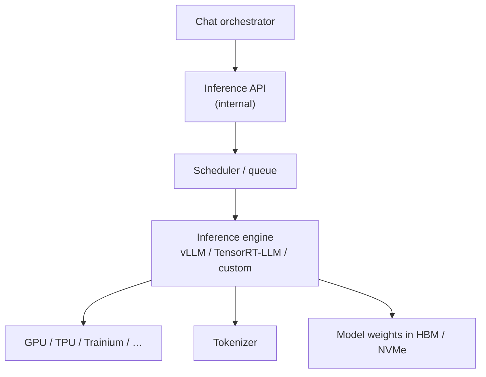
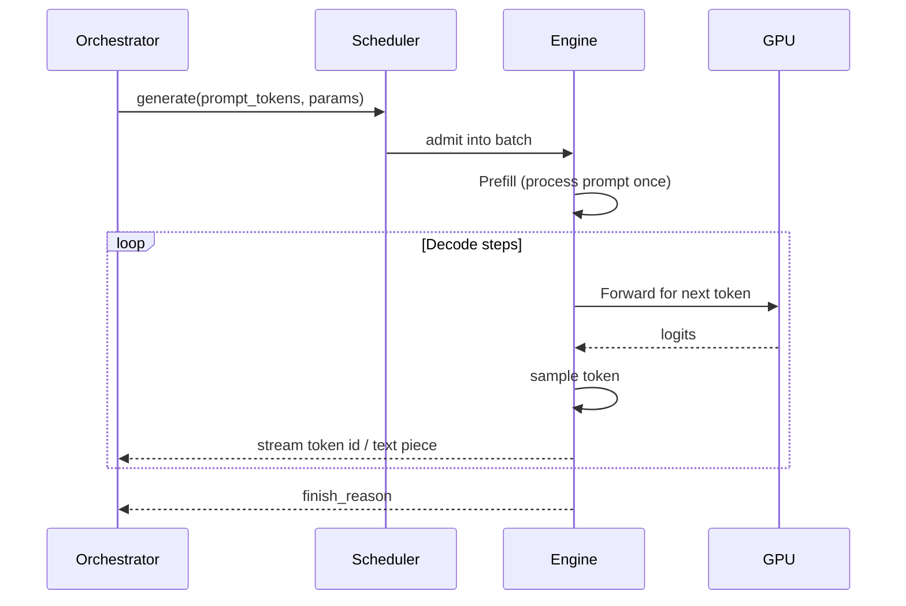
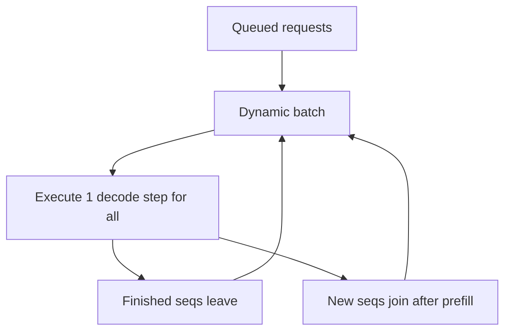
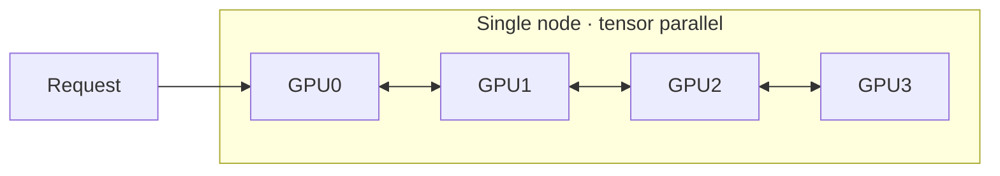
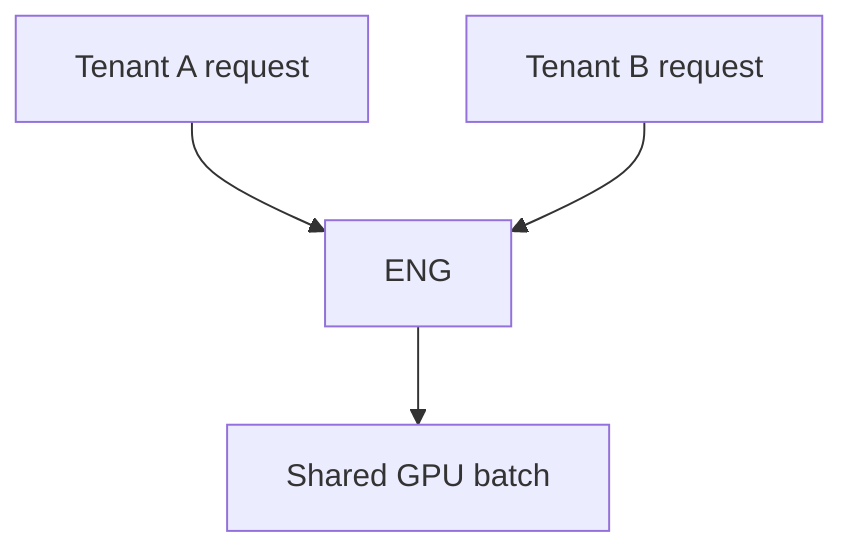

# 07 — Inference Serving

Where tokens are actually produced. This is the expensive, GPU-bound plane.

For how attention works inside the network, see also `concepts/ai/machine-learning/attention/transformer_attention_notes.md`.

---

## 1. High-level serving stack



---

## 2. Lifecycle of one generation



Two phases:

| Phase | Work | Characteristics |
|-------|------|-----------------|
| **Prefill** | Run model over all prompt tokens | Compute-heavy, parallel over sequence |
| **Decode** | One (or few) tokens at a time | Memory-bandwidth heavy; uses **KV cache** |

TTFT ≈ queue wait + prefill time. After that, tokens stream at decode rate.

---

## 3. KV cache (why long chats get expensive)

For each layer/head, transformers cache Keys/Values for past tokens so decode does not recompute the whole prompt.


Memory scales with: `layers × heads × dim × seq_len × batch × precision`.

**PagedAttention** (vLLM-style) allocates KV in blocks like virtual memory so fragmentation drops and many sequences share a GPU.

---

## 4. Continuous batching

Naive: one request per GPU. Reality: **continuous / in-flight batching**.



This keeps GPUs utilized when users type at different times and stop at different lengths.

---

## 5. Parallelism strategies

Large models do not fit on one GPU.

| Strategy | Splits |
|----------|--------|
| Tensor parallel | Matrices across GPUs in a node |
| Pipeline parallel | Layers across GPUs |
| Expert parallel | MoE experts across devices |
| Data parallel | Copies of model for throughput (separate requests) |



Interconnect: NVLink / InfiniBand across GPUs in the node.
---

## 6. Sampling & decoding parameters

From logits → next token:

| Param | Effect |
|-------|--------|
| temperature | Sharpness of distribution |
| top-p / top-k | Truncate tail |
| presence/frequency penalty | Reduce repetition |
| stop sequences | End early |
| max tokens | Hard cap |
| seed | Reproducibility (best-effort) |
| grammar / JSON schema | Constrain tokens (tools, structured out) |

Speculative decoding: a small draft model proposes tokens; large model verifies in parallel → higher tokens/sec.

---

## 7. Engines & optimizations (typical toolkit)

- **vLLM**, **TensorRT-LLM**, **Hugging Face TGI**, **llama.cpp** (edge), custom stacks at big labs
- Quantization: FP8 / INT4 / INT8 weights (and sometimes KV)
- FlashAttention / fused kernels
- Prefix caching: reuse KV for shared system prompts across users (privacy-safe only for non-unique prefixes)
- Prompt caching products expose this as a billable feature

---

## 8. Isolation & multi-tenancy



Risks: noisy neighbor, side channels, prompt cache leakage. Mitigations: per-org pools for enterprise, cache keying by tenant, strict memory zeroing policies.

---

## 9. What the orchestrator receives

Internal stream often looks like:

```text
{ token_id: 1234, text: "Hel", logprob: -0.2 }
{ token_id: 5678, text: "lo", … }
…
{ finish_reason: "stop", usage: { input: 902, output: 140 } }
```

Orchestrator translates this into client SSE events and usage billing.

---

## 10. Capacity planning (intuition)

Bottlenecks shift:

- Short prompts, high QPS → prefill / scheduler
- Long conversations → KV memory
- Huge generations → decode bandwidth
- MoE models → expert routing load imbalance

Next: [08-streaming-protocol.md](./08-streaming-protocol.md).
