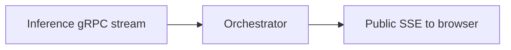
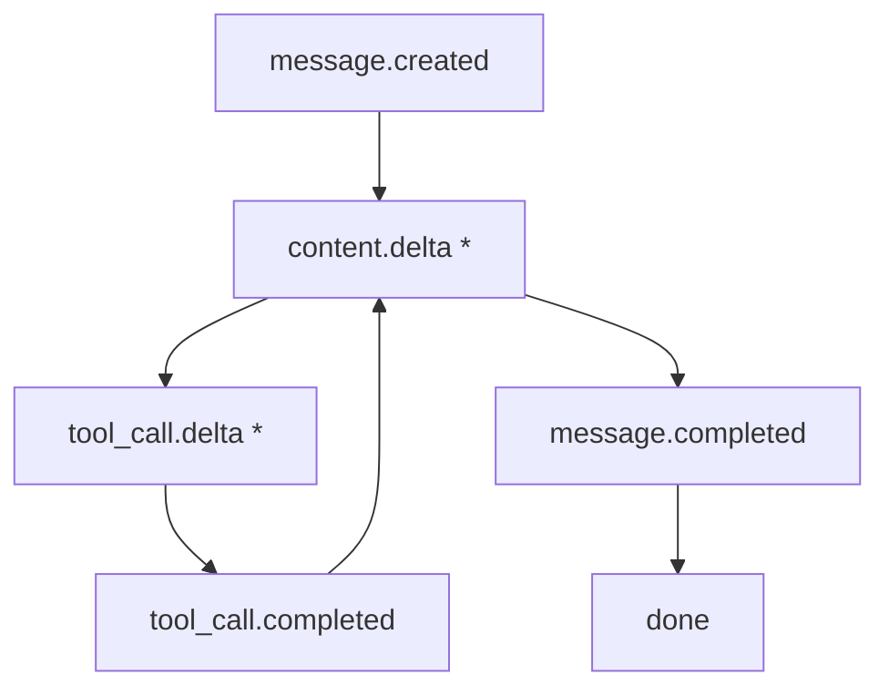
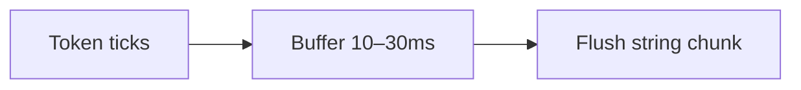
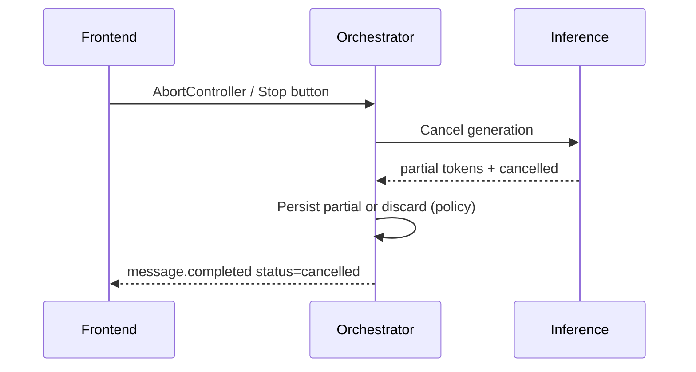

# 08 — Streaming Protocol

Chat UX depends on **partial delivery**. Users should see tokens as they are generated, not after the full answer.

---

## 1. Why stream?

| Metric | Meaning |
|--------|---------|
| TTFT | Time to first token — perceived snappiness |
| ITL | Inter-token latency — smoothness |
| Total latency | Time to last token |

Streaming improves *perceived* latency even when total time is unchanged.

---

## 2. Common wire formats

### Server-Sent Events (SSE)

HTTP response with:

```http
HTTP/1.1 200 OK
Content-Type: text/event-stream
Cache-Control: no-cache
Connection: keep-alive
```

Body:

```text
data: {"type":"content.delta","delta":"Hello"}

data: {"type":"content.delta","delta":" world"}

data: {"type":"message.completed","usage":{"input":120,"output":40}}

data: [DONE]
```

### WebSocket

Binary or text frames both ways — useful for cancel, typing indicators, collaborative features.

### gRPC / HTTP/2 streaming

Common **internally** between orchestrator and inference; converted to SSE at the public edge.



---

## 3. Event taxonomy (product-grade)



Other events: `error`, `safety.warning`, `reasoning.delta` (if exposed), `citation.add`, `progress` (“Searching…”).

OpenAI’s public API historically used `data: {"choices":[{"delta":{"content":"..."}}]}` — consumer apps often use richer internal schemas.

---

## 4. Coalescing & batching deltas

Sending every token as its own TCP/SSE event can be wasteful.



Tradeoff: larger chunks → fewer events, slightly less “typewriter” smoothness.

---

## 5. Cancellation



Must free KV cache promptly — cancelled jobs still occupy GPU until aborted.

---

## 6. Reconnect & resume

Hard problem. Options:

| Approach | Behavior |
|----------|----------|
| No resume | Client shows error; user regenerates |
| Replay from DB | If assistant text was checkpointed periodically |
| Resume token | Inference supports continuing from last token id (rare externally) |

Most consumer apps favor **reliability via regenerate** over true stream resume.

---

## 7. Backpressure

If the client is slow (mobile network):

- TCP backpressure may pause orchestrator reads
- Orchestrator should pause consuming inference or buffer with a cap
- If buffer overflows → disconnect or drop to “finish silently + full fetch”

---

## 8. Security on the stream

- Auth validated **before** headers flush
- Do not leak stack traces in error events
- Mid-stream safety may emit a revision event that **replaces** content in the UI
- Heartbeats / comments (`: ping`) keep proxies from closing idle connections during tool calls

```text
: ping

data: {"type":"progress","message":"Running tool…"}
```

Next: [09-tools-agents.md](./09-tools-agents.md).
