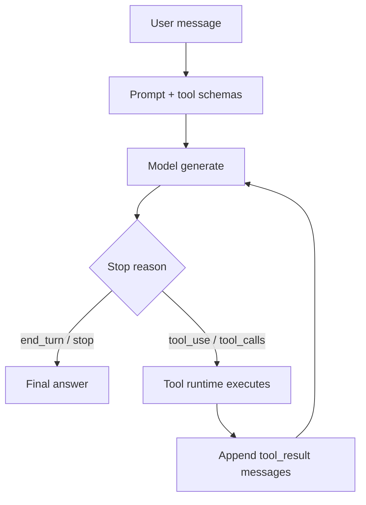
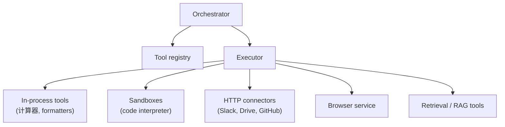
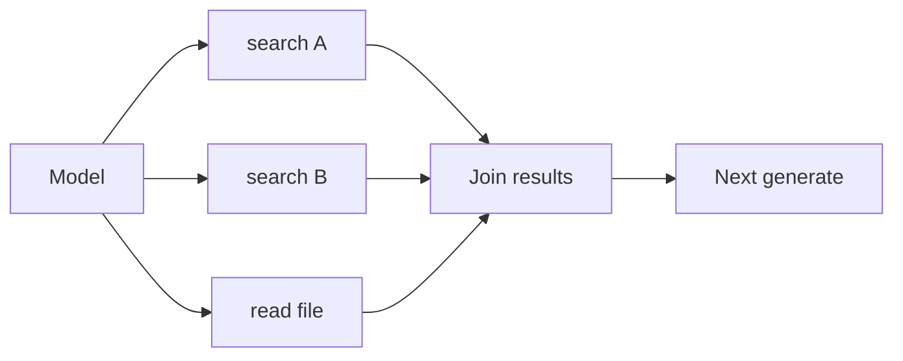
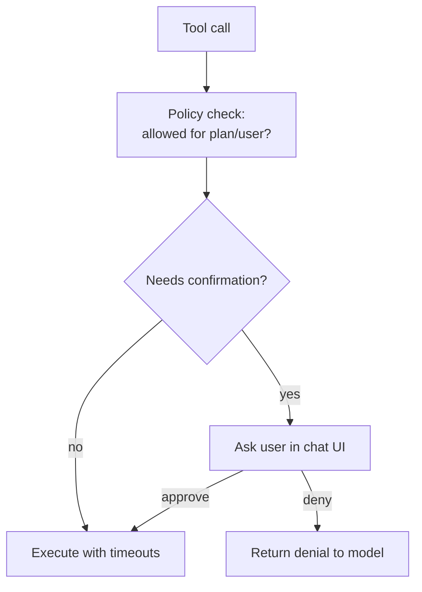
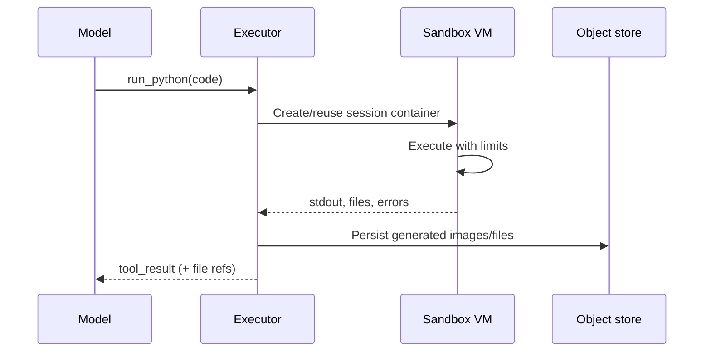
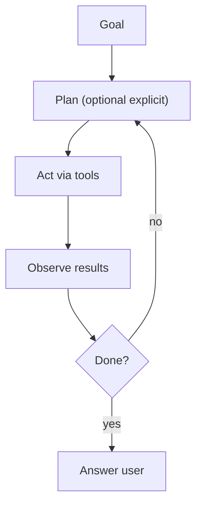

# 09 — Tools, Function Calling & Agents

Modern chat apps are not only next-token predictors. The model can **request actions**; the platform executes them and feeds results back. That loop is how browsing, code execution, connectors, and “agents” work.

---

## 1. Core loop



One user Send may equal **many** model calls.

---

## 2. Tool schema (what the model sees)

Conceptual JSON-schema style:

```json
{
  "name": "web_search",
  "description": "Search the public web",
  "parameters": {
    "type": "object",
    "properties": {
      "query": { "type": "string" }
    },
    "required": ["query"]
  }
}
```

The model emits a structured call, e.g.:

```json
{ "name": "web_search", "arguments": { "query": "KV cache vLLM" } }
```

Arguments may stream as partial JSON (`tool_call.delta`) before execution.

---

## 3. Tool runtime architecture



| Tool class | Examples | Risk |
|------------|----------|------|
| Read-only retrieval | Search, file read | Data exfil if mis-scoped |
| Code interpreter | Python in VM | Escape, crypto mining |
| Browser | Headless Chromium | SSRF, malware sites |
| Write connectors | Send email, create issue | Irreversible side effects |
| Soft UI tools | Render chart, ask user | Low |

---

## 4. Parallel tool calls

Models may emit multiple calls in one step:



Executor runs independent calls concurrently with a concurrency cap.

---

## 5. Safety around tools



Hardening:

- Allowlists of domains / APIs
- Secrets injected by runtime (model never sees raw API keys ideally)
- SSRF protection for browser/fetch
- CPU/memory/time quotas for sandboxes
- Audit logs for enterprise connectors

---

## 6. Code interpreter path



Session state (variables, installed wheels) may persist across calls in the same chat for UX (“continue in the same notebook”).

---

## 7. Agents vs single-turn tools

| Pattern | Behavior |
|---------|----------|
| Tool-augmented chat | Short loops, user-visible final answer |
| Autonomous agent | Long horizon, planning, many tools, background jobs |
| Human-in-the-loop | Pauses for approval on risky actions |

Products brand these differently (“Deep research”, “Computer use”, “Agent mode”) but share the same substrate: schemas + runtime + loop limits.



Guardrails: max steps, max wall time, max spend, deadlock detection.

---

## 8. MCP-style external tools

Platforms increasingly load tools from external **Model Context Protocol** (or similar) servers: standardized discovery + invoke. The orchestrator still owns auth, policy, and the chat loop; MCP is a plug shape for enterprise systems.

Next: [10-safety-moderation.md](./10-safety-moderation.md).
