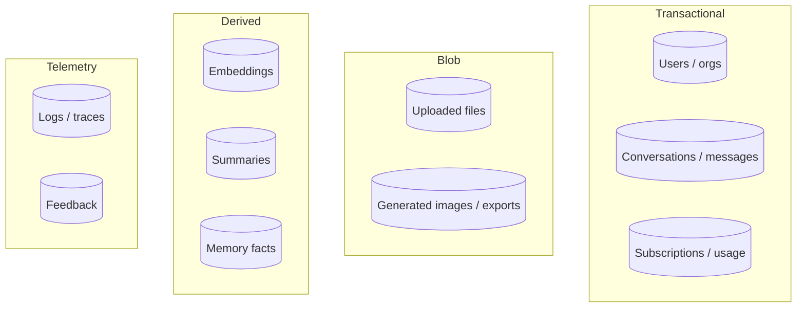
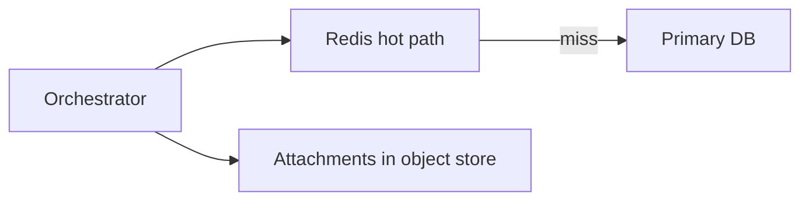
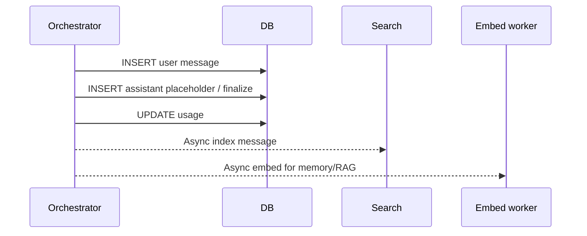
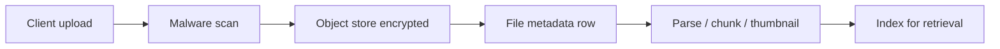
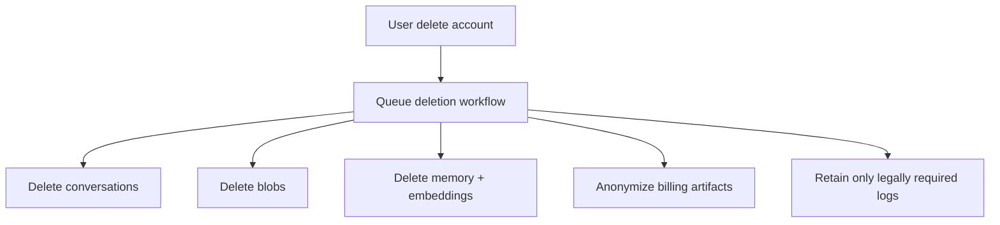

# 11 — Storage & Persistence

What remains after tokens finish streaming: threads, files, search indexes, and billing records.

---

## 1. Data domains

---

## 2. Conversation store

Requirements:

- Low-latency fetch of recent messages for prompt build
- Branching parent pointers
- Pagination for long threads
- Soft delete / retention jobs
- Strong tenancy isolation

Common design:

| Store | Role |
|-------|------|
| Primary SQL / document DB | Metadata + messages |
| Redis | Hot thread cache |
| Object storage | Large message parts / transcripts |
| Search engine | Title + full-text find |

---

## 3. Write path for a turn

Use **outbox / event bus** so search/embeddings stay eventually consistent without slowing TTFT.

---

## 4. File pipeline

Store hashes for dedupe; never trust client-provided content types.

---

## 5. Temporary / private modes

Products offer “temporary chat” that:

- Skips memory writes
- Skips training datasets
- Applies shorter retention TTL
- May still keep safety logs for a legal minimum window

---

## 6. Export & deletion (GDPR-style)

Hard problem: replicas, backups, derived datasets, and partner subprocessors.

---

## 7. Consistency model

Chat UIs tolerate:

- **Strong** consistency for “did my send persist?”
- **Eventual** for search, titles, memory

After send, read-your-writes is usually achieved by returning server IDs in the stream completion and updating client cache directly (skip re-fetch).

Next: [12-observability-reliability.md](./12-observability-reliability.md).
