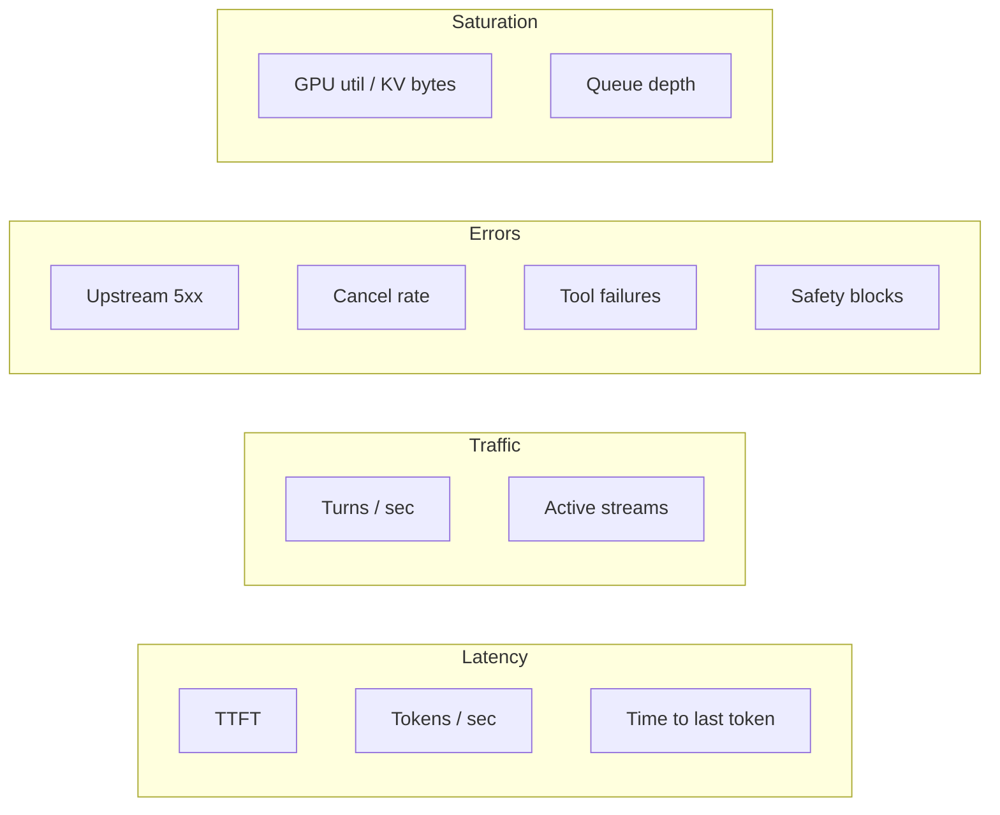
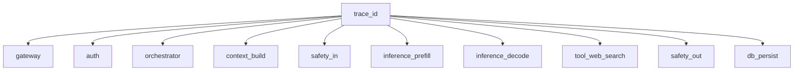
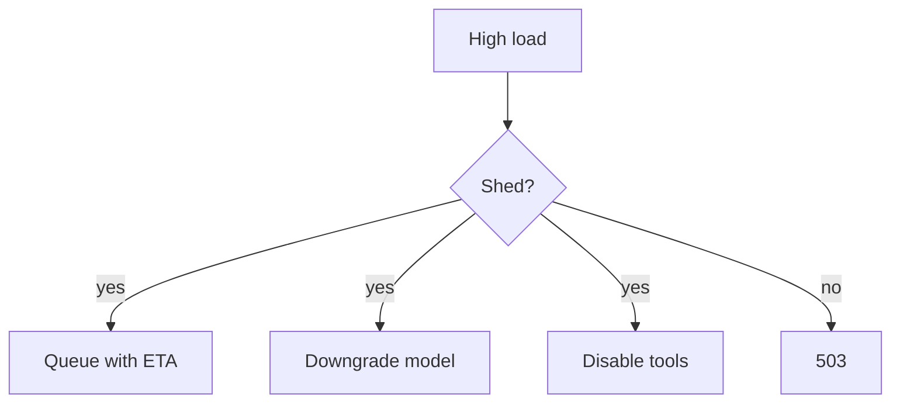
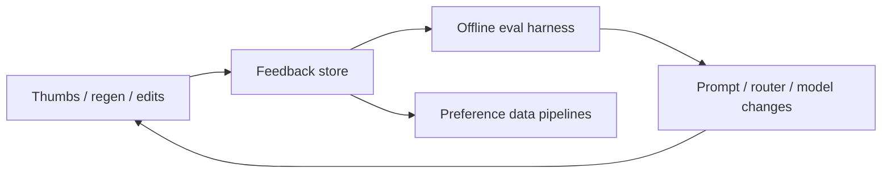

# 12 — Observability, Reliability & Feedback Loops

If you cannot see TTFT, tool error rates, and refusal rates, you cannot operate a chat product.

---

## 1. Golden signals for chat

SLOs often target: availability of send, TTFT percentiles, and incomplete-stream rate.

---

## 2. Tracing one turn

Propagate context through SSE → orchestrator → gRPC inference → tools.

**Privacy:** traces must redact prompt bodies in production or sample carefully under policy.

---

## 3. Structured logs (events, not novels)

Example event types:

- `turn_started`, `turn_completed`, `turn_cancelled`
- `model_routed`
- `tool_invoked`, `tool_succeeded`, `tool_failed`
- `safety_decision`
- `usage_recorded`

Correlate with `conversation_id`, `message_id`, `user_id` (hashed if needed), `model_id`.

---

## 4. Reliability patterns

| Pattern | Chat-specific note |
|---------|--------------------|
| Timeouts | Separate prefill vs tool vs total wall clock |
| Retries | Only idempotent segments; never double-send user msg |
| Circuit breakers | Trip bad tool providers |
| Load shedding | Reject or queue when GPU saturated |
| Graceful degradation | Drop tools / switch to smaller model |
| Chaos tests | Kill inference pods mid-stream |

---

## 5. Quality feedback loop

Also: arena-style A/Bs, canary models ([06](./06-model-routing.md)), red-team suites for safety regressions.

---

## 6. Online evals (lightweight)

On a sample of traffic:

- Auto-rate helpfulness with a judge model
- Check citation faithfulness for RAG answers
- Detect empty / truncated / repetitive outputs
- Track “user regenerated within 30s” as a dissatisfaction proxy

---

## 7. Incident playbooks (examples)

| Symptom | Likely layer |
|---------|--------------|
| High TTFT, GPUs busy | Inference capacity / KV |
| Fast TTFT then stalls | Tool hangs / gateway idle timeout |
| Empty replies | Safety overblock / sampler bug |
| Wrong user’s chat | Authz / cache key bug (SEV0) |
| Billing mismatch | Non-idempotent usage writes |

---

## 8. Putting it all together

Operate the product as **three planes**:

1. **Control** — auth, quotas, config, feature flags  
2. **Application** — orchestration, tools, safety, storage  
3. **Inference** — schedulers, engines, GPUs  

Observability must span all three with one `trace_id`.

---

Back to the overview: [ChatInterfaceWorkflow.md](./ChatInterfaceWorkflow.md).
