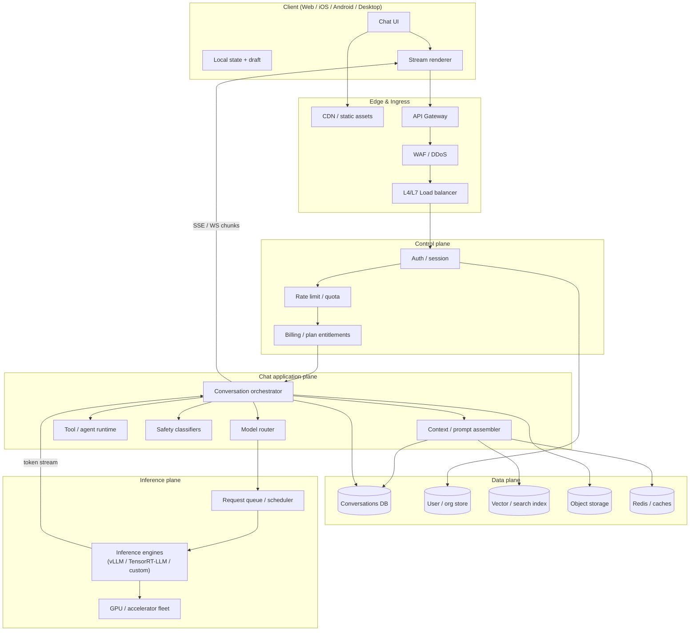
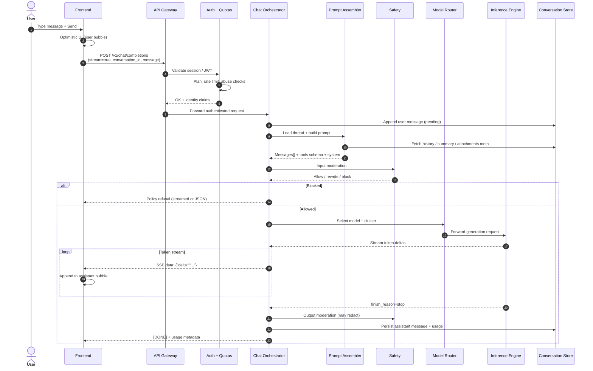
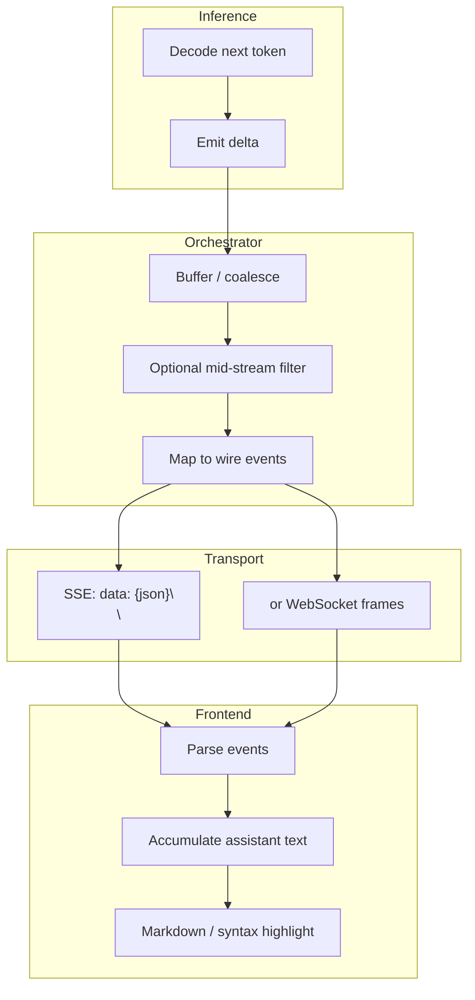
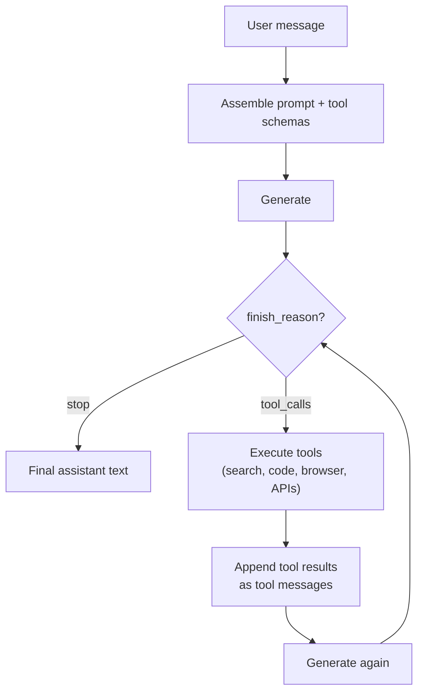
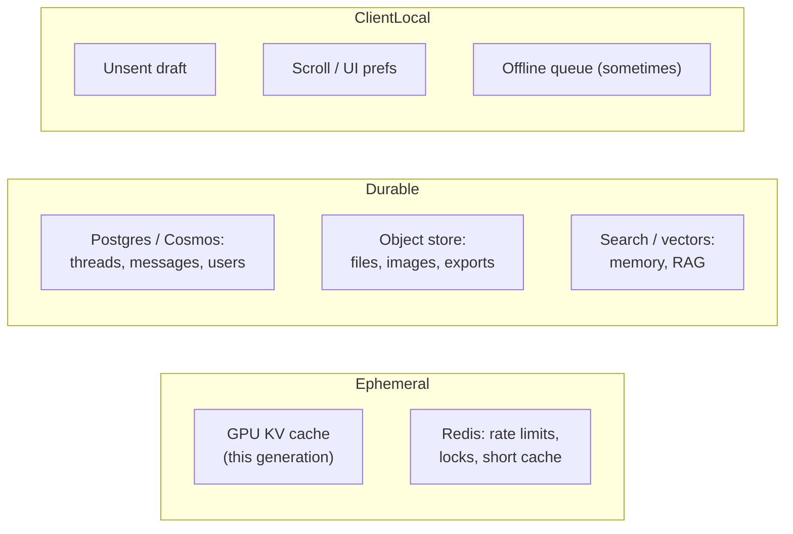
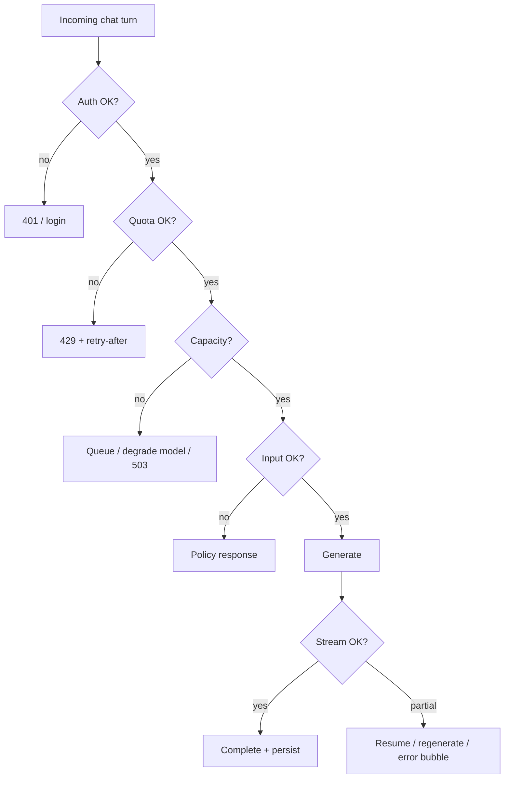
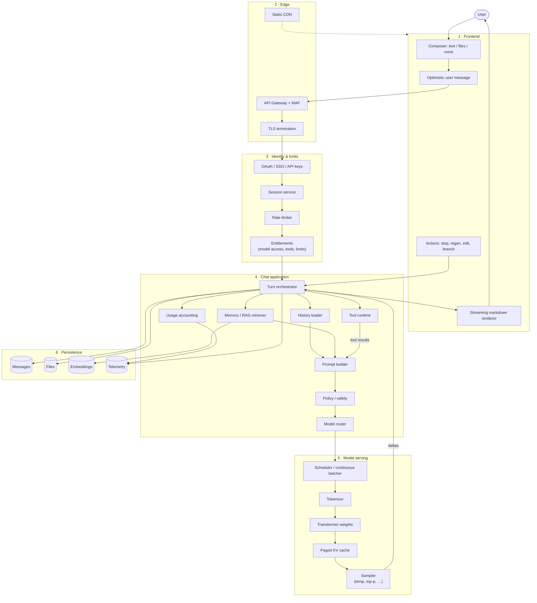

# Chat Interface Workflow — End-to-End System Design

How a typical ChatGPT / Claude-style chat product turns a user message into a streamed reply — every major component, in order.

Companion notes in this folder dig into each layer:

| File | Covers |
|------|--------|
| [01-frontend-client.md](./01-frontend-client.md) | App UI, input, local state, streaming render |
| [02-edge-api-gateway.md](./02-edge-api-gateway.md) | CDN, TLS, load balancing, API gateway |
| [03-auth-sessions-quotas.md](./03-auth-sessions-quotas.md) | Auth, sessions, rate limits, billing gates |
| [04-conversation-orchestration.md](./04-conversation-orchestration.md) | Chat service, thread state, request orchestration |
| [05-prompt-context-assembly.md](./05-prompt-context-assembly.md) | System prompt, history, RAG, compression |
| [06-model-routing.md](./06-model-routing.md) | Model picker, routers, A/B, failover |
| [07-inference-serving.md](./07-inference-serving.md) | GPU clusters, batching, KV cache, decoding |
| [08-streaming-protocol.md](./08-streaming-protocol.md) | SSE/WebSocket, token chunks, reconnect |
| [09-tools-agents.md](./09-tools-agents.md) | Function calling, tool loop, MCP-style tools |
| [10-safety-moderation.md](./10-safety-moderation.md) | Input/output filters, policy models |
| [11-storage-persistence.md](./11-storage-persistence.md) | Conversations DB, blobs, search |
| [12-observability-reliability.md](./12-observability-reliability.md) | Logs, traces, evals, SLOs |

---

## 0. Mental model (one sentence)

**Client → Edge/API → Auth & quotas → Chat orchestrator → Prompt assembler → (optional tools/RAG) → Safety → Model router → Inference → Stream tokens back → Persist → Show UI.**

Most of the “magic” is not the model alone — it is orchestration around the model.

---

## 1. Bird’s-eye component map



---

## 2. Happy-path timeline (user sends one message)

What happens **after** the user hits Send, before the first token appears, and until the reply finishes.



---

## 3. Layers in order (detailed pipeline)

```mermaid
flowchart LR
  A["1. Capture input"] --> B["2. Transport"]
  B --> C["3. Authenticate"]
  C --> D["4. Authorize & meter"]
  D --> E["5. Orchestrate turn"]
  E --> F["6. Assemble context"]
  F --> G["7. Safety in"]
  G --> H["8. Route model"]
  H --> I["9. Generate tokens"]
  I --> J["10. Stream out"]
  J --> K["11. Safety out"]
  K --> L["12. Persist & index"]
  L --> M["13. Render & feedback"]
```



| Step | Component | Job |
|------|-----------|-----|
| 1 | Frontend | Capture text, files, voice; show optimistic UI |
| 2 | Edge / Gateway | TLS, routing, versioning (`/v1/...`) |
| 3 | Auth | Who is calling? Session / OAuth / API key |
| 4 | Quotas | Rate limits, token budgets, plan features |
| 5 | Orchestrator | Own the “turn”: IDs, retries, tool loops |
| 6 | Prompt assembler | System + history + RAG + tools + memory |
| 7 | Safety (in) | Jailbreak / toxicity / PII / policy |
| 8 | Router | Which model, region, capacity pool |
| 9 | Inference | Autoregressive decode on accelerators |
| 10 | Streaming | Push partial tokens to client |
| 11 | Safety (out) | Filter / rewrite final or mid-stream |
| 12 | Storage | Save messages, usage, embeddings |
| 13 | UI | Markdown, code, citations; thumbs / regen |

---

## 4. Request shape (what the client actually sends)

Conceptual OpenAI-compatible shape (Claude, Gemini, etc. are similar ideas with different field names):

```json
{
  "conversation_id": "conv_abc",
  "parent_message_id": "msg_user_prev",
  "model": "auto",
  "stream": true,
  "messages": [
    { "role": "user", "content": [{ "type": "text", "text": "Explain KV cache" }] }
  ],
  "tools": [],
  "attachments": [],
  "client_metadata": { "timezone": "Asia/Kolkata", "ui_version": "…" }
}
```

Important product details:

- **`conversation_id`** ties the turn to a thread (server often owns canonical history; client may send only the new message).
- **`stream: true`** is the default UX for chat apps.
- **`model: "auto"`** often means “server decides” via a router.
- Multimodal content is an array of parts (text, image, file refs), not a single string.

---

## 5. Response path (streaming)



Typical event types products emit:

| Event | Meaning |
|-------|---------|
| `message.created` | Assistant message id reserved |
| `content.delta` | New text / token chunk |
| `tool_call.delta` | Partial tool JSON arguments |
| `tool_call.completed` | Ready to execute a tool |
| `message.completed` | Final text + finish reason |
| `error` | Recoverable / fatal error |
| `done` | Stream closed |

See [08-streaming-protocol.md](./08-streaming-protocol.md).

---

## 6. Tool / agent turn (when the model calls tools)

Chat products are rarely “one shot.” A single user message can expand into multiple model calls.



Details: [09-tools-agents.md](./09-tools-agents.md).

---

## 7. Where state lives



Rule of thumb: **canonical conversation state is server-side**; the client is a cache + renderer.

---

## 8. Failure & control-flow variants



Products often **degrade gracefully**: smaller model, shorter context, disable tools, or queue with ETA.

---

## 9. Multi-diagram index (what to read next)

1. Start here for the full path: this file (sections 1–8).
2. UI & wire format: [01](./01-frontend-client.md) + [08](./08-streaming-protocol.md).
3. Backend “turn owner”: [04](./04-conversation-orchestration.md) + [05](./05-prompt-context-assembly.md).
4. How tokens are produced: [06](./06-model-routing.md) + [07](./07-inference-serving.md).
5. Productized intelligence: [09](./09-tools-agents.md) + [10](./10-safety-moderation.md).
6. What remains after the chat: [11](./11-storage-persistence.md) + [12](./12-observability-reliability.md).

---

## 10. End-to-end “everything” diagram (annotated)



---

## 11. What ChatGPT/Claude add on top of “raw LLM API”

A raw completions API is: *messages in → tokens out*.

A chat product adds:

- Persistent **threads** and branching edits
- **Streaming** UX with stop / regenerate
- **Model routing** and capacity management
- **Tools** (web, code, files, connectors)
- **Memory** and personalization
- **Safety** and compliance
- **Billing**, quotas, team workspaces
- **Multimodal** upload pipeline
- **Eval / feedback** loops into training & product

Those layers are why the architecture looks like a distributed system, not a single `model.generate()` call.

---

## 12. Suggested study order

1. Walk section 2’s sequence diagram once with a real product open (watch Network tab → EventStream).
2. Read [07-inference-serving.md](./07-inference-serving.md) to connect tokens ↔ GPUs.
3. Read [09-tools-agents.md](./09-tools-agents.md) to see multi-step turns.
4. Skim [12-observability-reliability.md](./12-observability-reliability.md) so failure modes feel concrete.
