# Transformer Attention — Complete Notes

## 0. Big Picture — How an LLM Computes

End-to-end path from raw text to the next predicted token:

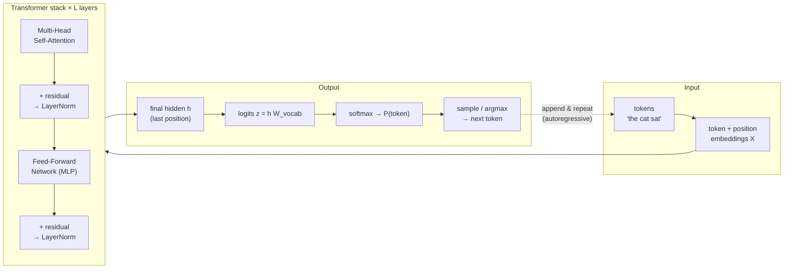

One transformer **block** in more detail (decoder-style LLM):

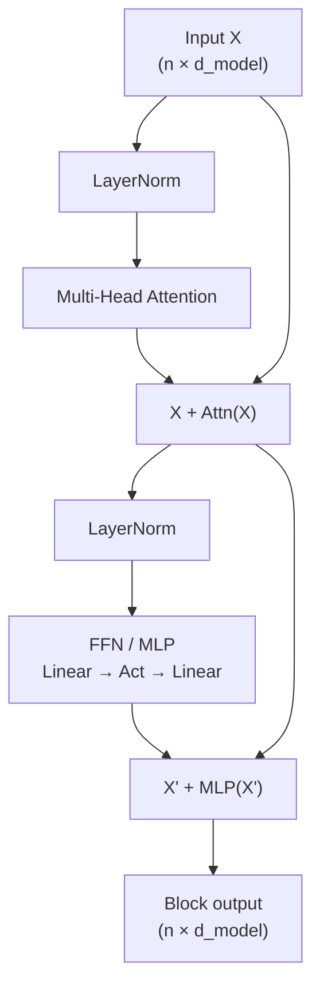

---

## 1. What is an Attention Head?

An **attention head** is one instance of the self-attention mechanism. Transformers run several heads in parallel — this is **multi-head attention**.

Each head learns three projections of the input embeddings:

- **Query (Q)** — what this token is "looking for"
- **Key (K)** — what this token "offers" to be matched against
- **Value (V)** — the actual content passed along if attended to

Each token gets a new representation that's a weighted blend of other tokens' Values, based on Query–Key similarity.

**Why multiple heads instead of one big head:** each head can specialize — one might track syntax (subject-verb agreement), another coreference (pronoun → noun), another positional patterns. Outputs are combined at the end.

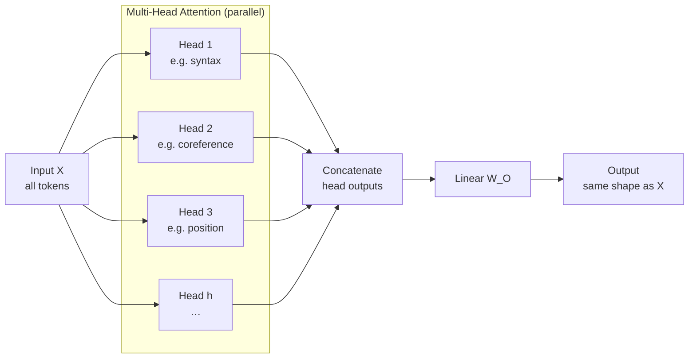

How Q / K / V relate for one token attending to others:

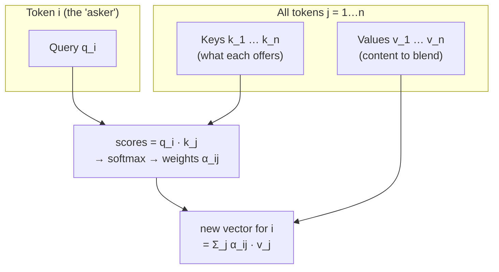

---

## 2. Is the Value Constant Per Head?

**No** — each head has its own separate, independently-learned Value projection matrix $W_V^i$.

Three levels to keep straight:

1. **Across heads (same layer):** each head has a different $W_V^i$ → different "lens" on the same input.
2. **Across tokens (same head):** $V = XW_V$ depends on input $X$, so different tokens → different value vectors even within one head.
3. **Across forward passes:** $W_V$ (the weights) is fixed after training; the $V$ vectors it produces still vary per input sequence.

So: **weights are fixed per head after training, but the actual Value vectors are dynamic**, computed fresh from input each time.

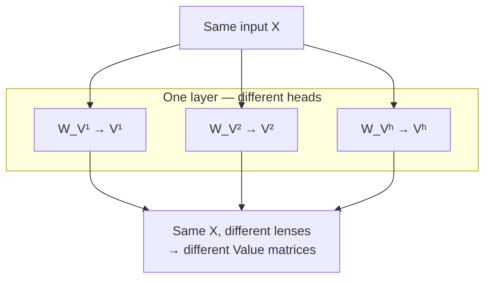

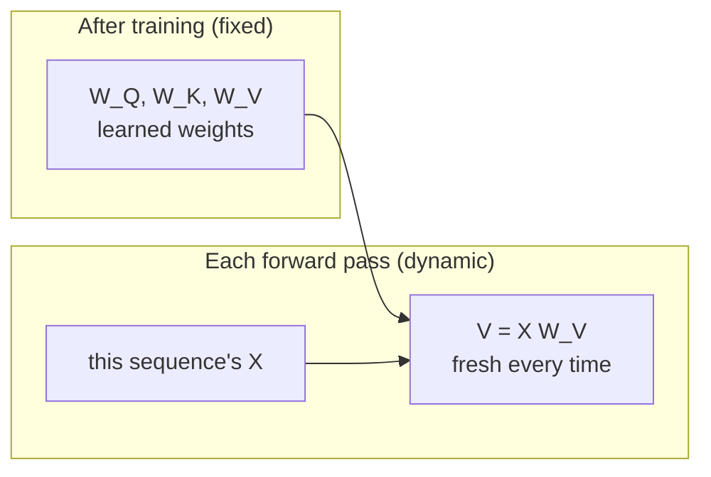

---

## 3. Equations Inside a Single Attention Head

**Setup:** Input sequence $X \in \mathbb{R}^{n \times d_{model}}$ ($n$ tokens).

### Computation flow (one head)

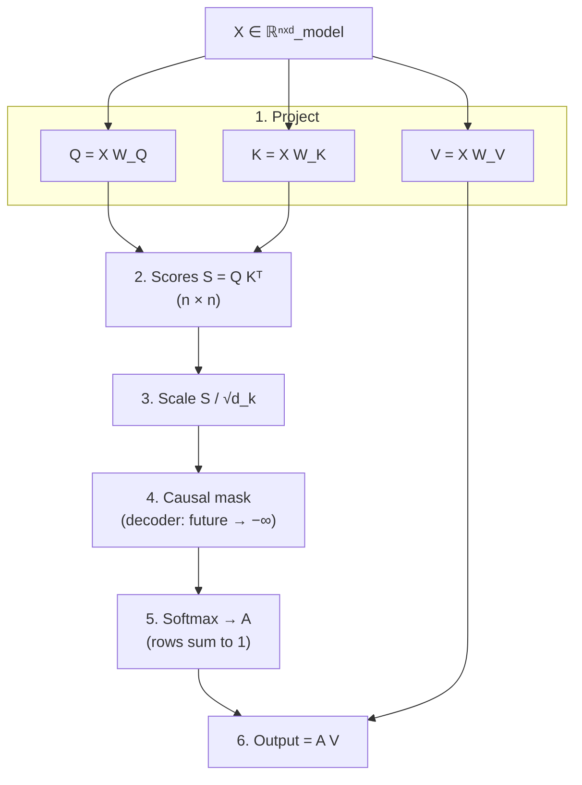

Causal mask intuition (token $i$ may only look at positions $j \le i$):

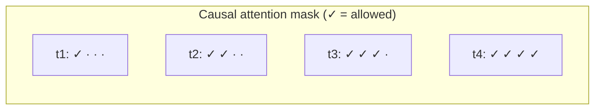

### Step 1 — Project into Q, K, V
$$
Q = XW_Q \qquad K = XW_K \qquad V = XW_V
$$
$W_Q, W_K \in \mathbb{R}^{d_{model}\times d_k}$, $W_V \in \mathbb{R}^{d_{model}\times d_v}$

### Step 2 — Raw attention scores
$$
S = QK^T \in \mathbb{R}^{n\times n}
$$
$S_{ij}$ = relevance of token $j$ to token $i$'s query.

### Step 3 — Scale
$$
S_{scaled} = \frac{QK^T}{\sqrt{d_k}}
$$
Prevents large dot products from saturating softmax.

### Step 4 — Mask (decoder only)
$$
S_{masked,ij} = \begin{cases} S_{scaled,ij} & j \le i \\ -\infty & j > i \end{cases}
$$
Blocks attending to future tokens (causal attention). Skipped in bidirectional/encoder attention.

### Step 5 — Softmax (row-wise)
$$
A_{ij} = \text{softmax}(S_{masked})_{ij} = \frac{\exp(S_{masked,ij})}{\sum_k \exp(S_{masked,ik})}
$$
Each row of $A$ sums to 1 — the attention weights.

### Step 6 — Weighted sum of Values
$$
\text{head}_{output} = AV
$$

### Compact formula
$$
\text{Attention}(Q,K,V) = \text{softmax}\left(\frac{QK^T}{\sqrt{d_k}}\right)V
$$

### Multi-head assembly
$$
\text{head}_i = \text{Attention}(XW_Q^i, XW_K^i, XW_V^i)
$$
$$
\text{MultiHead}(X) = \text{Concat}(\text{head}_1,\dots,\text{head}_h)\,W_O
$$
$W_O \in \mathbb{R}^{(h\cdot d_v)\times d_{model}}$ projects concatenated heads back to model dimension.

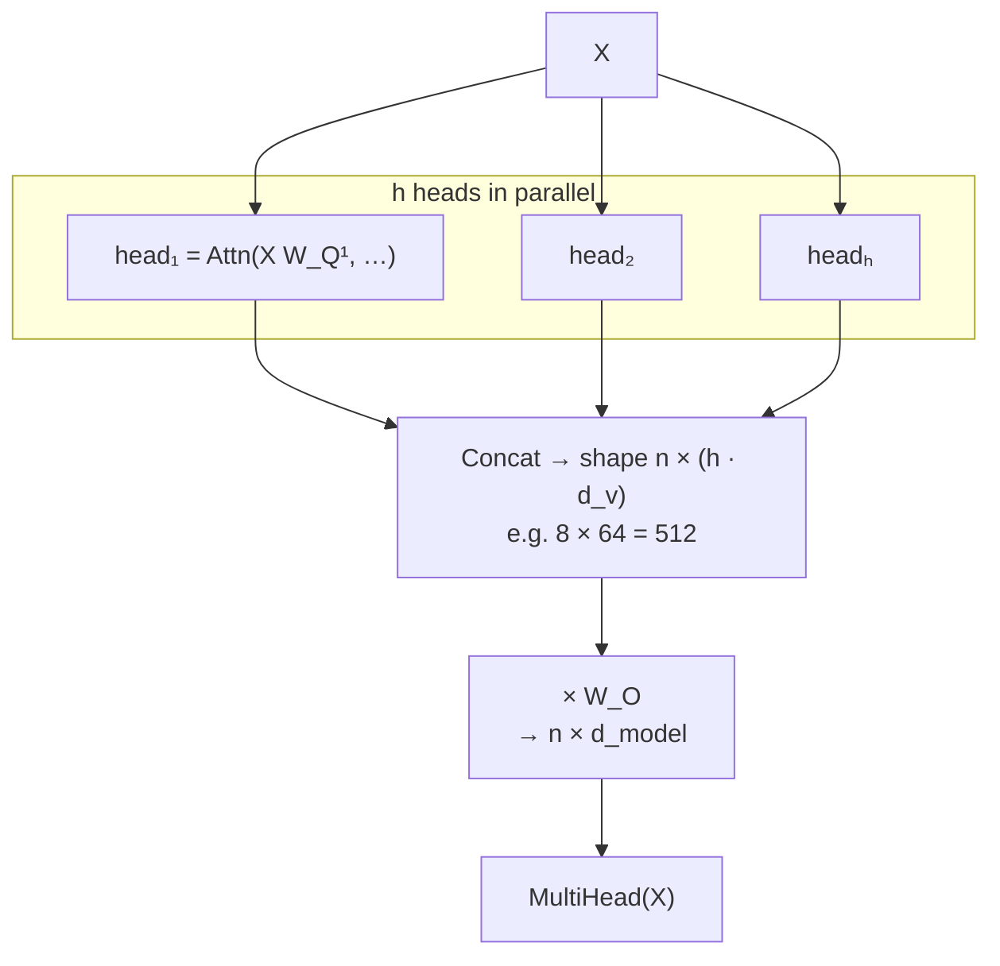

---

## 4. Rationale Behind Each Equation (History & Motivation)

| Step | Problem it solves | Origin / Alternative |
|---|---|---|
| **Separate Q/K/V** | Earlier attention (Bahdanau 2014) reused the same hidden state for both "matching" and "retrieving" — conflated two jobs | Borrowed from information-retrieval framing: query vs. key vs. document content are different roles |
| **Dot product for scores** | Cheap, maps to a single matmul — GPU/TPU-friendly | Bahdanau used additive attention (small feedforward net) — better for small $d_k$ but doesn't parallelize as well |
| **Scale by $\sqrt{d_k}$** | Dot product variance grows with $d_k$ → softmax saturates → vanishing gradients | Derived analytically: if $q,k$ components have mean 0, variance 1, then $q\cdot k$ has variance $d_k$; dividing by $\sqrt{d_k}$ renormalizes to variance 1 (same spirit as Xavier/He init) |
| **Masking** | Autoregressive models must not see future tokens | RNNs get causality "for free" from sequential structure; transformers must enforce it explicitly since they see the whole sequence at once |
| **Softmax** | Need non-negative, sums-to-1, differentiable weights | Standard from classification output layers; novelty was applying it to attention weights, not softmax itself |
| **Weighted sum (not hard lookup)** | Need a differentiable "soft" retrieval so backprop works | Traces to Bahdanau 2014 and Graves' Neural Turing Machines (2014) — soft/differentiable memory addressing |
| **Multi-head split** | One attention op over full dimension can only learn one relationship type per layer | Analogous to multiple filters in a CNN — each head specializes (empirically confirmed later, e.g. Clark et al. 2019 "What Does BERT Look At?") |
| **Concat + $W_O$** | Heads need a way to combine/mix what they each learned | Without this, heads stay informationally siloed |

**Big picture:** most individual equations predate the 2017 "Attention Is All You Need" paper. The real contribution was showing recurrence could be **removed entirely**, giving a fully parallelizable architecture built purely from attention + feedforward layers.

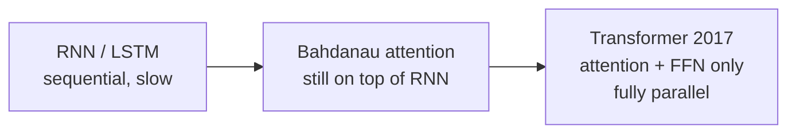

---

## 5. What Does Concatenation of Heads Mean?

Concatenation = **lining up each head's output vector side by side**, not blending/averaging them.

If each head outputs a vector of size $d_v$ (e.g. 64) and there are $h$ heads (e.g. 8):
$$
\text{Concat}(\text{head}_1,\dots,\text{head}_8) = [\underbrace{h_1}_{64}, \underbrace{h_2}_{64}, \dots, \underbrace{h_8}_{64}] \quad \to \text{512 numbers total}
$$

**Why not average instead?** Averaging would blend/mush different heads' distinct discoveries together, losing the specialization. Concatenation keeps each head's output fully intact; the subsequent linear layer $W_O$ is responsible for actually mixing the information across heads.

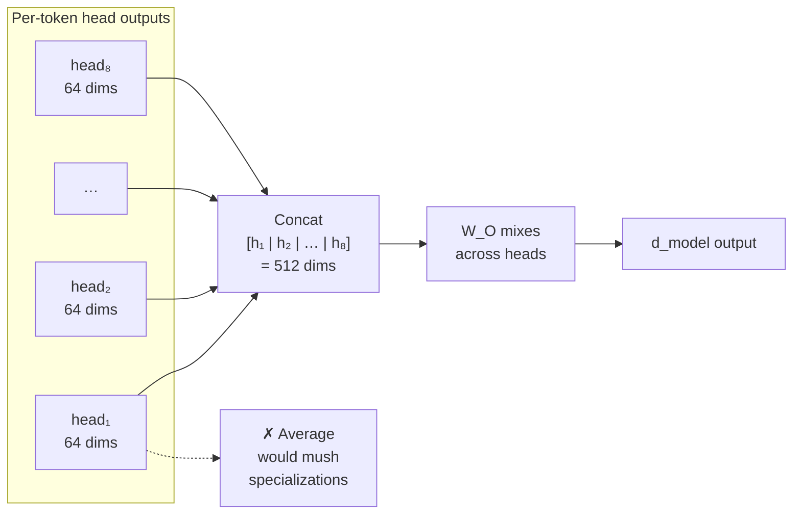

---

## 6. Predicting the Next Word (Output Stage)

After all transformer blocks, each token position has a final hidden vector $h \in \mathbb{R}^{d_{model}}$.

### Step 1 — Project to vocabulary size (unembedding)
$$
z = hW_{vocab} \in \mathbb{R}^{|V|}
$$
$|V|$ = vocabulary size. $z$ = raw logits, one score per possible token.

> Note: $W_{vocab}$ is often the *same* matrix used for input embeddings, transposed and reused — called **weight tying**.

### Step 2 — Softmax → probabilities
$$
P(\text{token}=i \mid \text{context}) = \frac{\exp(z_i)}{\sum_j \exp(z_j)}
$$

### Step 3 — Pick the next word
- **Greedy decoding:** take $\arg\max$ — simple but can be repetitive
- **Sampling:** randomly draw according to probabilities — more variety
- **Top-k / top-p (nucleus) sampling:** restrict sampling pool to most likely tokens first
- **Temperature ($T$):** $\text{softmax}(z/T)$ — low $T$ → sharper/greedier, high $T$ → flatter/more random

### Step 4 — Repeat (autoregressive)
Append the chosen token, reprocess the whole sequence through all layers again, predict the next token. Repeat until a stop condition (EOS token / max length).

### Full pipeline
$$
\text{tokens} \to \text{embeddings} \to \text{transformer blocks} \to h \to z=hW_{vocab} \to \text{softmax}(z) \to \text{sample/argmax} \to \text{next token}
$$

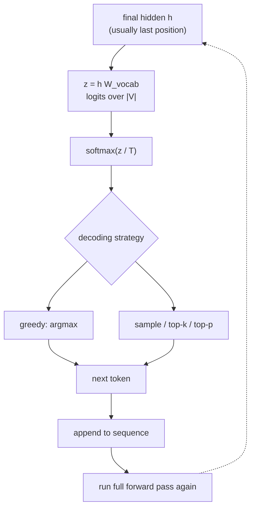

Autoregressive generation over time:

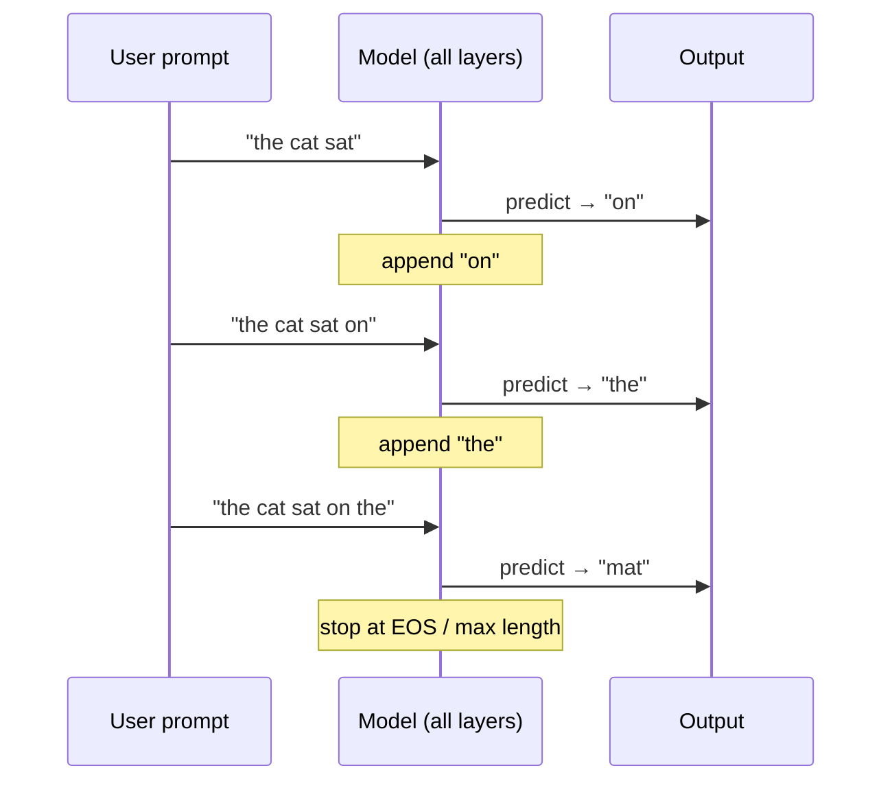

---

## 7. Backpropagation Through the Whole Pipeline

### Loss function — Cross-entropy
$$
L = -\sum_i y_i \log P_i = -\log P_c
$$
($c$ = index of correct token, $y$ = one-hot true label)

### Backward flow (overview)

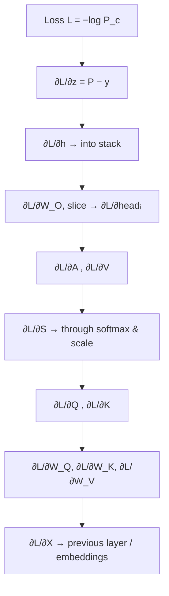

### Step A — Gradient through softmax + cross-entropy
$$
\frac{\partial L}{\partial z_i} = P_i - y_i
$$
Clean result: push correct token's logit up, all others down proportional to their (wrong) probability mass.

*Derivation:* using softmax Jacobian $\frac{\partial P_i}{\partial z_k}=P_i(\delta_{ik}-P_k)$ and $\frac{\partial L}{\partial P_c}=-\frac{1}{P_c}$, chain rule collapses to $P_k - y_k$.

### Step B — Gradient into unembedding matrix
$$
\frac{\partial L}{\partial W_{vocab}} = h^T\frac{\partial L}{\partial z}, \qquad
\frac{\partial L}{\partial h} = \frac{\partial L}{\partial z}\,W_{vocab}^T
$$
$\frac{\partial L}{\partial h}$ seeds the backward pass into the transformer stack.

### Step C — Gradient through concat + $W_O$
Let $C = \text{Concat}(\text{head}_1,\dots,\text{head}_h)$, output $=CW_O$:
$$
\frac{\partial L}{\partial W_O} = C^T \frac{\partial L}{\partial \text{output}}, \qquad
\frac{\partial L}{\partial C} = \frac{\partial L}{\partial \text{output}}\,W_O^T
$$
Backward through concatenation = **slice the gradient back into per-head chunks**:
$$
\frac{\partial L}{\partial \text{head}_i} = \left[\frac{\partial L}{\partial C}\right]_{\text{columns of head } i}
$$

### Step D — Gradient through $\text{head}=AV$
$$
\frac{\partial L}{\partial V} = A^T \frac{\partial L}{\partial \text{head}}, \qquad
\frac{\partial L}{\partial A} = \frac{\partial L}{\partial \text{head}}\,V^T
$$

### Step E — Gradient through attention softmax (per row $i$)
$$
\frac{\partial L}{\partial S_{i,:}} = A_{i,:} \odot \left(\frac{\partial L}{\partial A_{i,:}} - \left(\frac{\partial L}{\partial A_{i,:}}\cdot A_{i,:}^T\right)\mathbf{1}\right)
$$
Same softmax backward pattern as Step A, applied per row (no cross-entropy pairing here, so it doesn't collapse as cleanly).

### Step F — Gradient through masking
Masked positions had $A_{ij}=0$ and contributed nothing forward → they get **zero gradient** backward too.

### Step G — Gradient through scaling
$$
\frac{\partial L}{\partial(QK^T)} = \frac{1}{\sqrt{d_k}}\cdot\frac{\partial L}{\partial S_{scaled}}
$$

### Step H — Gradient through $QK^T$
$$
\frac{\partial L}{\partial Q} = \frac{\partial L}{\partial M}\,K, \qquad
\frac{\partial L}{\partial K} = \left(\frac{\partial L}{\partial M}\right)^T Q
$$
(where $M=QK^T$)

### Step I — Gradient into projection weights
$$
\frac{\partial L}{\partial W_Q} = X^T\frac{\partial L}{\partial Q}, \qquad
\frac{\partial L}{\partial W_K} = X^T\frac{\partial L}{\partial K}, \qquad
\frac{\partial L}{\partial W_V} = X^T\frac{\partial L}{\partial V}
$$
These drive the weight update, e.g. $W_Q \leftarrow W_Q - \eta\frac{\partial L}{\partial W_Q}$ (SGD/Adam).

### Step J — Gradient back into input $X$
Since $X$ feeds Q, K, and V independently, gradients **sum** across all three paths:
$$
\frac{\partial L}{\partial X} = \frac{\partial L}{\partial Q}W_Q^T + \frac{\partial L}{\partial K}W_K^T + \frac{\partial L}{\partial V}W_V^T
$$
This flows into the previous layer (or the embedding table, if first layer).

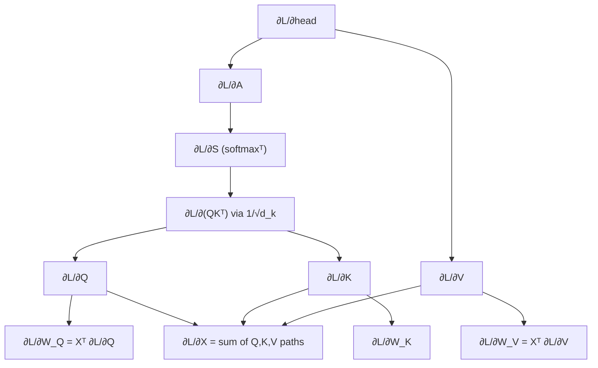

### Full backward chain summary
$$
\frac{\partial L}{\partial z}=P-y \;\to\; \frac{\partial L}{\partial h} \;\to\; \frac{\partial L}{\partial \text{head}_i} \;\to\; \frac{\partial L}{\partial A},\frac{\partial L}{\partial V} \;\to\; \frac{\partial L}{\partial S} \;\to\; \frac{\partial L}{\partial Q},\frac{\partial L}{\partial K} \;\to\; \frac{\partial L}{\partial W_Q},\frac{\partial L}{\partial W_K},\frac{\partial L}{\partial W_V} \;\to\; \frac{\partial L}{\partial X}
$$

> **Not yet covered:** backprop through LayerNorm and the feedforward (MLP) sublayer — needed for the complete picture of one full transformer block's backward pass.

---

## Quick-Reference Analogy (Birthday Party 🎂)

- **Query** = your sign ("I like dinosaurs!")
- **Key** = every kid's name tag describing themselves
- **Value** = what's inside each kid's backpack
- **Attention score → softmax** = handing out gold stars, then converting to percentages (pizza slices) that sum to 100%
- **Weighted sum with V** = taking a little/a lot from each kid's backpack based on their percentage, mixing into one final present
- **Multi-head** = playing the game again with different signs (dinosaurs, colors, games), each time getting a different present
- **Concatenation** = taping all the separate presents together in a row (not blending them)
- **$W_O$** = a grown-up who looks at the whole taped-together present and decides how to combine it sensibly
- **Backprop** = complaining backward from "I didn't like the final present" all the way down to "kids, rewrite your signs and tags next time"

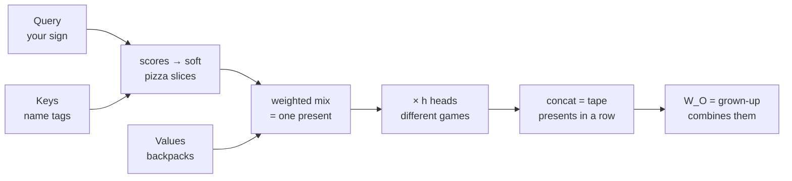
