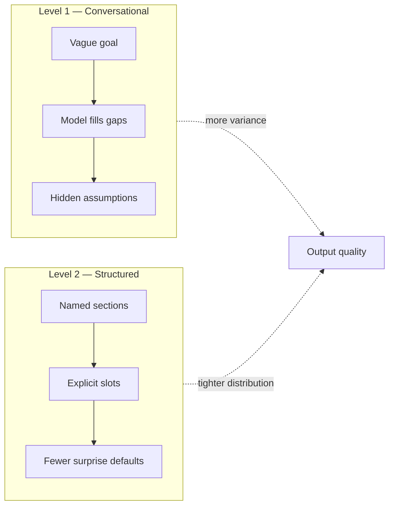
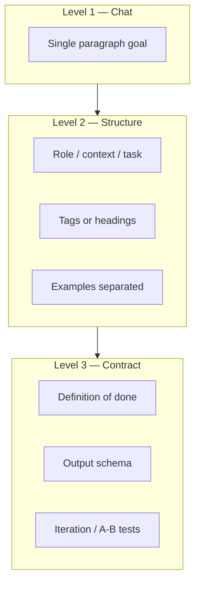
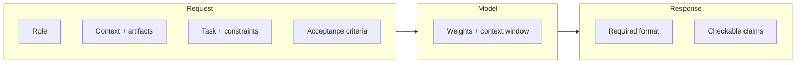
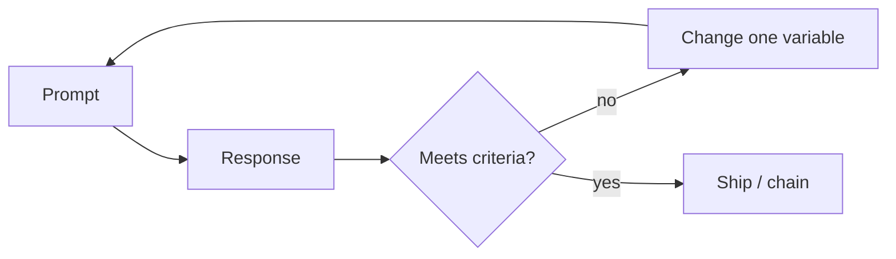

# Diagrams: three levels of prompting

Visual companions to `prompt-post.md` / `prompt-post-v2.md`. Render Mermaid in any Markdown viewer that supports it.

---

## 1. Where precision leaks (conversational vs structured)



**Reading:** unstructured prompts force the model to invent structure; structured prompts reserve the creative work for the task, not for guessing your unstated rules.

---

## 2. Stack of specificity (levels as layers)



**Reading:** each layer adds something the next layer can rely on—structure first, then verifiable “correct,” then machine-checkable shape.

---

## 3. Prompt as API (Level 3 mental model)



**Reading:** downstream consumers (you, tests, another agent) shouldn’t parse natural language soup; they should validate against declared format and criteria.

---

## 4. Iteration loop (same as any system component)



**Reading:** change role, constraints, examples, or output format **one at a time** so you know what moved the needle.

---

## 5. ASCII: single paragraph vs sections (the “one concrete thing”)

**Single blob (harder to attend consistently):**

```text
+----------------------------------------------------------+
|  everything in one paragraph — role, task, and hope      |
+----------------------------------------------------------+
```

**Sectioned (even without fancy tags):**

```text
+-------------+  +-------------+  +-------------+  +-------------+
|    Role     |  |  Context    |  |    Task     |  | Constraints |
+-------------+  +-------------+  +-------------+  +-------------+
```

**Reading:** boundaries help both humans and models route attention; tags or headings are just visible boundaries.
