# Caching Strategies - Simple Examples

This folder contains minimal Python examples for the most used caching strategies.

Run:

`python3 example.py`

Invalidation demos:

`python3 invalidation_example.py`

## Strategies included

- `cache_aside()` - app checks cache first, then DB on miss
- `read_through()` - app reads from cache layer, cache fetches DB on miss
- `write_through()` - writes go to DB and cache at the same time
- `write_back()` - writes go to cache first, DB updated later (flush)
- `write_around()` - writes go to DB only, cache updates on future reads
- `refresh_ahead()` - refresh cache before TTL expires
- `ttl_expiration()` - key automatically expires after configured time
- `negative_caching()` - cache "not found" to avoid repeated DB misses
- `request_coalescing()` - collapse concurrent cache misses into one DB call
- `two_level_cache()` - L1 in-memory + L2 shared/distributed cache

## Diagrams: Caching Strategies

### 1) Cache Aside
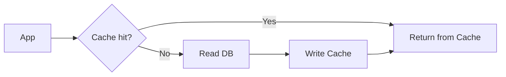

### 2) Read Through
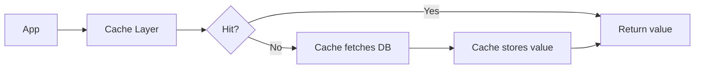

### 3) Write Through
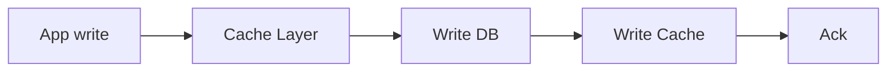

### 4) Write Back
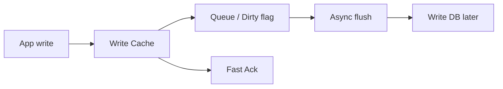

### 5) Write Around

### 6) Refresh Ahead
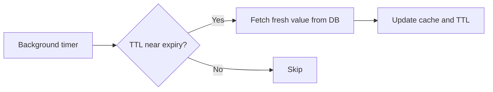

### 7) TTL Expiration
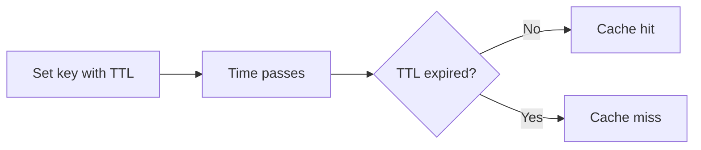

### 8) Negative Caching
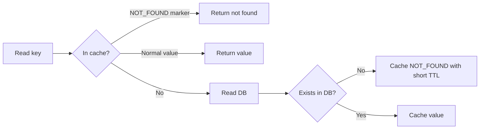

### 9) Request Coalescing (SingleFlight)
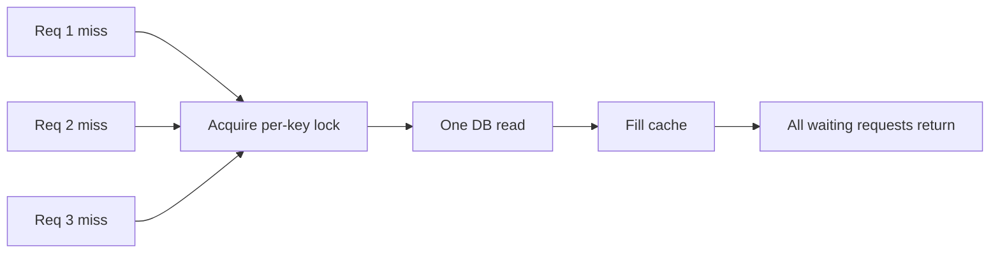

### 10) Two-Level Cache (L1 + L2)
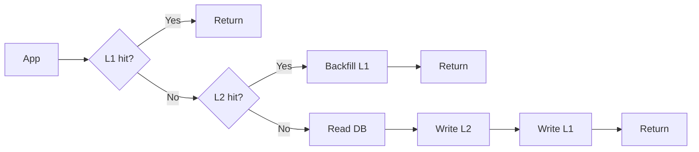

## Can these strategies be used together?

Yes. In most real systems, these patterns are combined along *orthogonal dimensions*:

1. Read orchestration: `cache_aside()` vs `read_through()` (and often “two-level” on top)
2. Write propagation: `write_through()` vs `write_back()` vs `write_around()`
3. Freshness management: `ttl_expiration()` plus optionally `refresh_ahead()`
4. Miss amplification controls: `negative_caching()` and `request_coalescing()`
5. Cache topology: `two_level_cache()` (and in general, more than one cache layer)

So the space of possible combinations is effectively a cartesian product of choices from these dimensions. Enumerating every exact product is usually not useful, so the README focuses on the *distinct families* of combinations you’ll actually see.

## Combination families (common, “sensible” ways to combine)

### Read-heavy systems (typical backend workloads)
- `cache_aside()` + `ttl_expiration()` + `request_coalescing()`
  - Minimizes DB load on misses; prevents cache stampedes for the same key.
- `cache_aside()` + `ttl_expiration()` + `negative_caching()` + `request_coalescing()`
  - Helps when many keys are absent (sparse IDs, optional resources).
- `cache_aside()` + `ttl_expiration()` + `refresh_ahead()` + `request_coalescing()`
  - Keeps hot keys fresh by refreshing before expiration instead of waiting for misses.

### Strong read-after-write behavior
- `cache_aside()` (read) + `write_through()` (write) + `ttl_expiration()`
  - Reads see updates quickly because writes update cache immediately.
- `read_through()` (read) + `write_through()` (write) + `ttl_expiration()`
  - Both read and write logic are centralized in the “cache layer”.

### Lower write cost / eventual consistency trade-offs
- `cache_aside()` (read) + `write_back()` (write) + `ttl_expiration()`
  - Writes are fast; the DB lags until async flush. Requires careful correctness thinking.
- `cache_aside()` (read) + `write_around()` (write) + `ttl_expiration()`
  - Often implemented as “write DB, then invalidate/expire cache” so future reads refill.

### Multi-level caches
- `two_level_cache()` + `ttl_expiration()` + `request_coalescing()`
  - L1 (fast) misses fall back to L2; coalescing prevents “everyone hits L2/DB” at once.
- `two_level_cache()` + `ttl_expiration()` + `refresh_ahead()`
  - Refresh hot keys in L1 (or L2) before they expire to keep p99 latency stable.
- `two_level_cache()` + `negative_caching()` (often on L2)
  - Avoids repeatedly checking the DB for missing keys across many app instances.

## Gotchas when combining patterns

- `write_back()` + `refresh_ahead()` can serve stale values unless you account for “not-yet-flushed” updates (refresh reads old DB state before the flush finishes).
- `negative_caching()` must handle the moment a previously-missing key becomes present (you typically use a TTL and/or explicit invalidation on writes).
- `request_coalescing()` is usually safe to add anywhere, but make sure the coalescing scope is correct (per-key, across the relevant cache layer).

## Cache Invalidation Strategies

Invalidation is how you ensure cache entries don’t become “wrong” after an update. Invalidation can be explicit (delete/expire) or implicit (versioning/conditional reads).

This folder already demonstrates `ttl_expiration()`. The additional common invalidation strategies below are usually layered on top of your read/write policies.

- Delete on write (a.k.a. “update DB then invalidate cache”)
  - Typical with `cache_aside()`-style reads: after the write, you delete the stale entry so the next read refills it.
- Versioned keys / generation counters (“bust” old entries by key name)
  - Typical when you want to avoid deleting lots of keys: you change the cache key format (or generation) so old values naturally stop being used.
- Tag/namespace invalidation (invalidate a group)
  - Example: “invalidate all `product:123:*` when product changes”.
  - Trade-off: you need to maintain mappings from tags to keys.
- Revalidate on read using an ETag/version
  - Store `(value, version)` in cache; on read, compare with the DB’s current version.
  - Trade-off: you still do a lightweight version check on reads.
- Active invalidation across nodes (pub/sub)
  - When one instance writes, it publishes an invalidation event so other instances drop stale cache.
  - Trade-off: you add operational complexity (a bus, ordering, delivery guarantees).

See `invalidation_example.py` for minimal runnable examples of each strategy.

## Diagrams: Cache Invalidation Strategies

### 1) Delete on Write
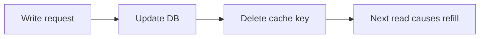

### 2) Versioned Keys / Generation Counters
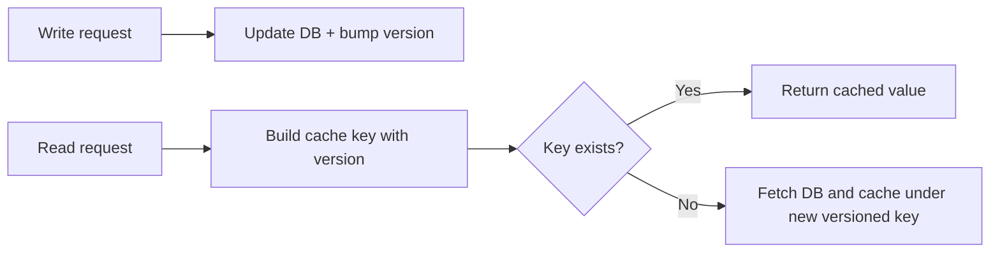

### 3) Tag/Namespace Invalidation
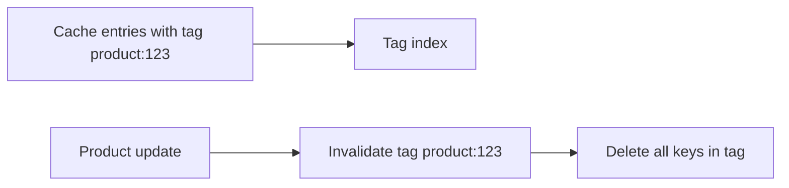

### 4) Revalidate on Read (ETag/Version)
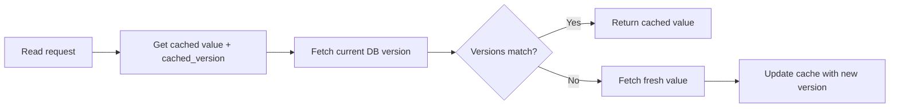

### 5) Active Invalidation Across Nodes (Pub/Sub)
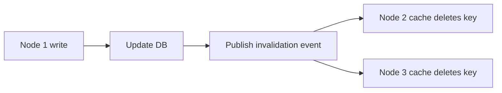

## Why this set?

"All caching strategies" can be interpreted very broadly. This set covers the
core patterns used in most backend systems and interviews.

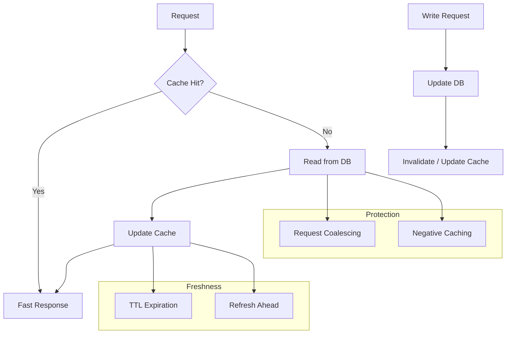