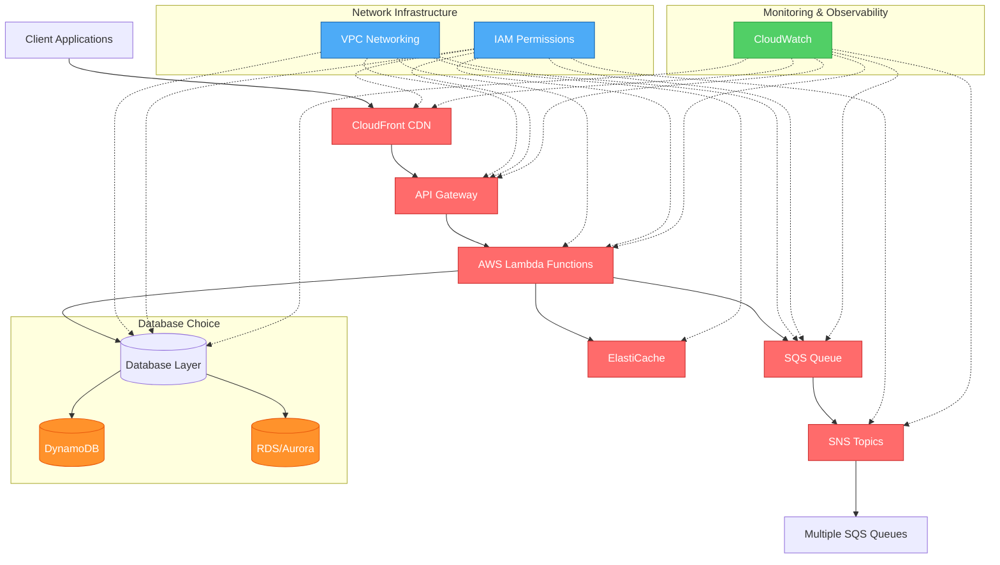

<post>
Out of AWS's 200+ services, maybe 12 actually show up in the work. Lambda, S3, DynamoDB, RDS/Aurora, SQS, SNS, VPC, API Gateway, CloudFront, IAM, ElastiCache, CloudWatch. That's it. The rest are either niche, situational, or just the same problem with a different name.

This isn't a hot take, it's just what happens when you look at what gets used across most backend and full-stack systems. An event-driven API? Lambda behind API Gateway, DynamoDB or Aurora depending on your query complexity, SQS if you need decoupling, CloudFront if you're caching at the edge. Add IAM to tie permissions together and CloudWatch so you know when things break. That covers an enormous amount of ground.

The services people spend the most time agonizing over — EKS, Kinesis, Redshift, Glue — they matter, but they matter in context. You reach for Kinesis when you genuinely need ordered, high-volume streaming with replay. You reach for EKS when your team already knows Kubernetes and the complexity tradeoff is worth it. Most of the time, those conditions don't apply.

What actually takes time isn't learning the services, it's learning the decision layer underneath them. When does DynamoDB make you pay later for choices you made on day one? When does Lambda's 15-minute ceiling become a real constraint versus a theoretical one? When is the SNS-to-multiple-SQS fan-out pattern the right call versus just wiring things directly?

That part doesn't compress into a list. But starting with the 12 services that actually matter gets you 80% of the way to being useful in a system design conversation, and that's a reasonable place to start.

## AWS Core Services Architecture Diagram

</post>