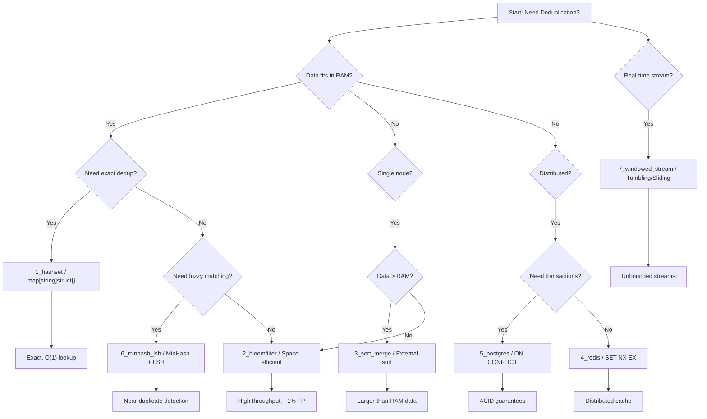
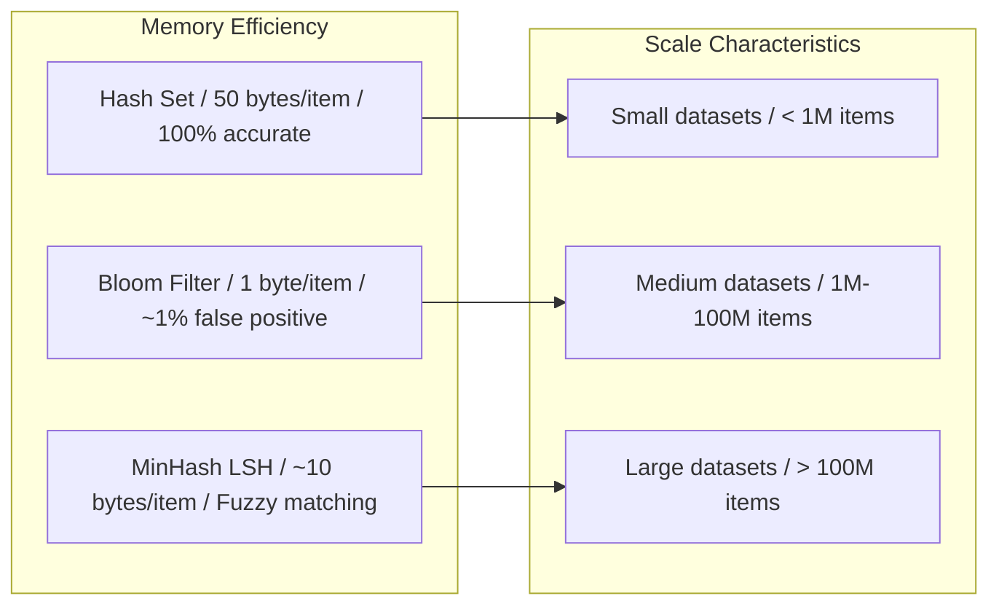
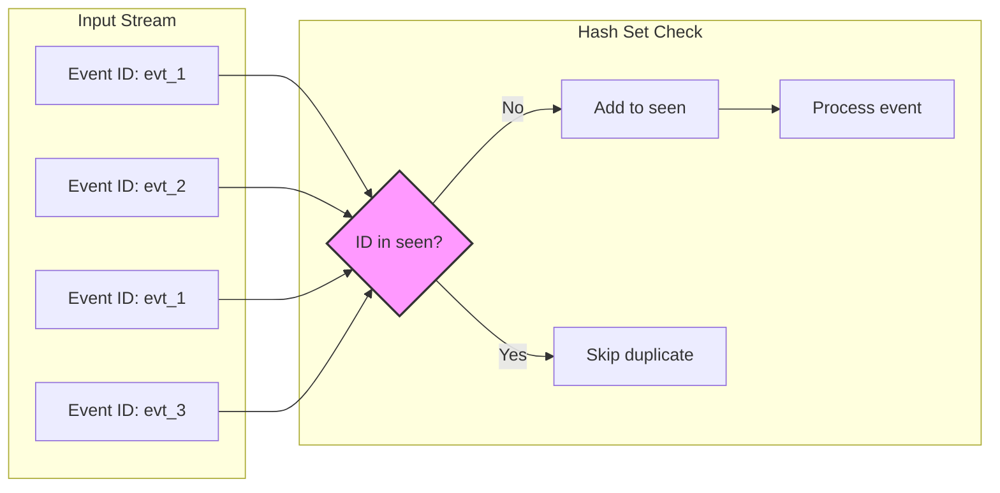
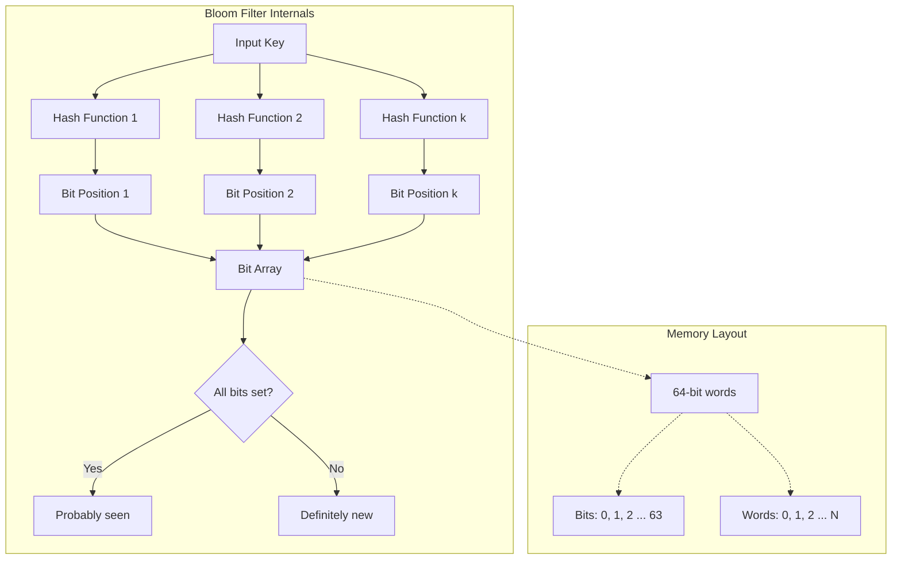
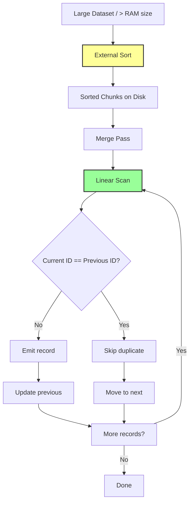
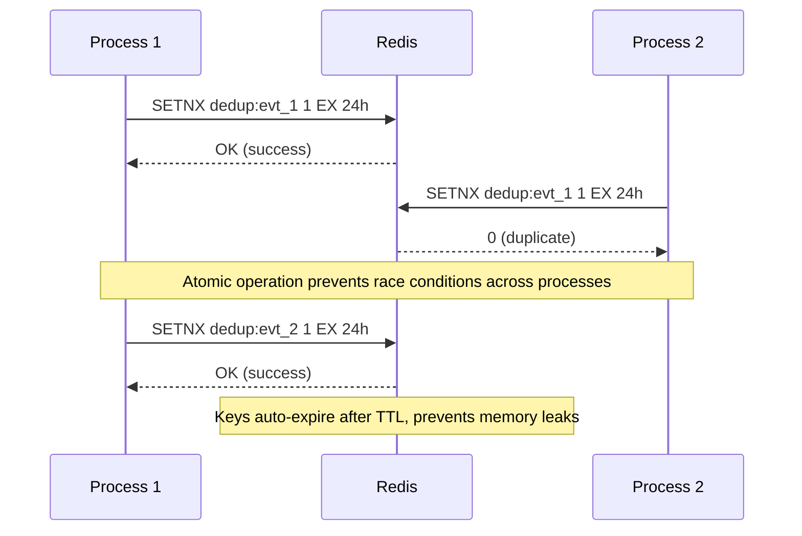
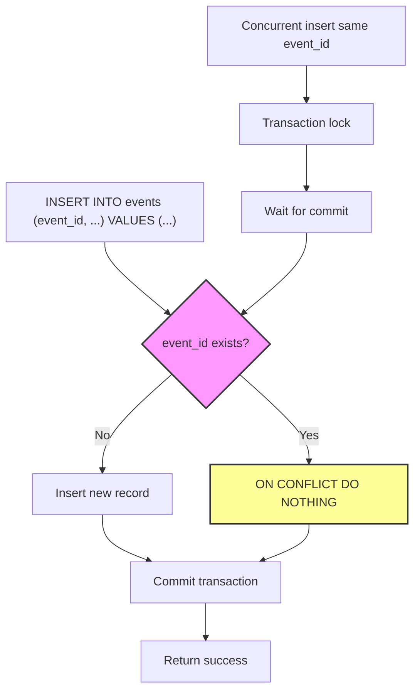
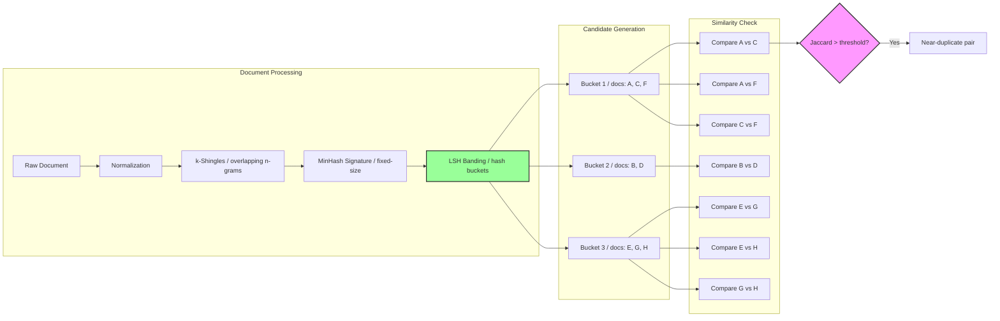
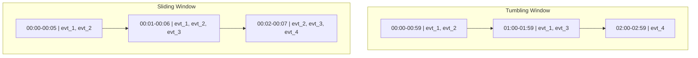

# Deduplication — Working Code at Every Scale

## What is Deduplication?

Deduplication is the process of identifying and eliminating duplicate items from a dataset or stream. It's a fundamental problem in computer science that appears in many contexts:

- **Data processing pipelines**: Preventing duplicate records from being processed multiple times
- **Event streaming**: Ensuring idempotency when handling events that may be retried
- **Content management**: Identifying duplicate files, documents, or media
- **Caching**: Avoiding redundant computations or network requests
- **Analytics**: Ensuring accurate metrics by counting unique items only once

The challenge lies in choosing the right strategy based on your specific requirements:
- **Scale**: Small in-memory datasets vs. massive distributed systems
- **Accuracy**: Exact matching vs. fuzzy/near-duplicate detection
- **Performance**: Throughput requirements and latency constraints
- **Memory**: Available RAM and storage constraints
- **Persistence**: Whether deduplication state needs to survive restarts

## Overview of Strategies

This repository demonstrates 7 different deduplication strategies, each optimized for specific scenarios:

### 1. Hash Set (`1_hashset/`)
**Use case**: In-memory deduplication for small datasets that fit in RAM
**Approach**: Uses Go's `map[string]struct{}` for O(1) exact duplicate detection
**Tradeoffs**: Fast and 100% accurate, but memory-intensive (~50 bytes per item)

### 2. Bloom Filter (`2_bloomfilter/`)
**Use case**: High-throughput scenarios where occasional false positives are acceptable
**Approach**: Probabilistic data structure using bit arrays and multiple hash functions
**Tradeoffs**: Extremely memory-efficient (~1 byte per item) with ~1% false positive rate

### 3. Sort-Merge (`3_sort_merge/`)
**Use case**: Single-node processing of datasets larger than available RAM
**Approach**: External sort followed by linear scan to identify duplicates
**Tradeoffs**: Handles arbitrarily large data but requires disk I/O and sorting time

### 4. Redis (`4_redis/`)
**Use case**: Distributed deduplication across multiple processes or servers
**Approach**: Uses Redis `SETNX` with TTL for atomic, distributed duplicate checking
**Tradeoffs**: Network latency overhead but provides horizontal scalability

### 5. PostgreSQL (`5_postgres/`)
**Use case**: Transactional deduplication with ACID guarantees
**Approach**: Database constraints with `ON CONFLICT DO NOTHING` for idempotent inserts
**Tradeoffs**: Persistent and reliable but slower than in-memory solutions

### 6. MinHash LSH (`6_minhash_lsh/`)
**Use case**: Fuzzy/near-duplicate detection for similar but not identical content
**Approach**: Locality-sensitive hashing with MinHash signatures for similarity detection
**Tradeoffs**: Finds near-duplicates but requires tuning and has computational overhead

### 7. Windowed Stream (`7_windowed_stream/`)
**Use case**: Real-time deduplication of unbounded data streams
**Approach**: Time-based windows (tumbling, sliding, count) for bounded duplicate detection
**Tradeoffs**: Handles infinite streams but only deduplicates within window boundaries

---

All files are self-contained Go programs. Run any with: `go run main.go`

---

## File Map

| File | Scenario | Key Pattern |
|------|----------|-------------|
| `1_hashset/` | In-memory, small data | `map[string]struct{}` |
| `2_bloomfilter/` | In-memory, large data, high throughput | Bit array + double hashing |
| `3_sort_merge/` | Single node, larger-than-RAM | Sort → linear scan |
| `4_redis/` | Distributed, multi-process | `SET key NX EX ttl` |
| `5_postgres/` | Transactional, persistent | `ON CONFLICT DO NOTHING` |
| `6_minhash_lsh/` | Fuzzy/near-duplicate detection | Shingling → MinHash → LSH banding |
| `7_windowed_stream/` | Unbounded streams | Tumbling / sliding / count windows |

---

## Visual Overview

### Deduplication Strategy Decision Flow



### Memory vs Accuracy Tradeoffs



---

## Choosing the right approach

```
Is the data bounded and small enough for RAM?
  └─ Yes → 1_hashset (exact) or 6_minhash_lsh (fuzzy)
  └─ No, but single node → 3_sort_merge or 2_bloomfilter
  └─ No, distributed → 4_redis (TTL-based) or 5_postgres (transactional)

Is it a real-time stream?
  └─ Yes → 7_windowed_stream (choose window type by your boundary tolerance)

Do you need near-duplicate detection (not exact)?
  └─ Yes → 6_minhash_lsh (adjust similarity threshold 0.5–0.9)

Do you need financial/idempotency guarantees?
  └─ Yes → 5_postgres (ON CONFLICT + idempotency key table)

High throughput, can tolerate rare false positives?
  └─ Yes → 2_bloomfilter or 7_windowed_stream Approach 4 (two-stage)
```

---

## Quick cheat sheet

```go
// 1. Exact, in-memory
seen := make(map[string]struct{})
if _, exists := seen[id]; !exists { seen[id] = struct{}{}; process() }

// 2. Bloom filter (space-efficient, ~1% FP rate)
bf := NewBloomFilter(1_000_000, 0.01)
if !bf.Contains(key) { bf.Add(key); process() }

// 3. Sort-merge (external)
sort.Slice(records, func(i,j int) bool { return records[i].ID < records[j].ID })
// then linear scan, emit first of each group

// 4. Redis distributed
ok, _ := redis.SetNX(ctx, "dedup:"+id, 1, 24*time.Hour)
if ok { process() }

// 5. PostgreSQL
INSERT INTO events (event_id, ...) VALUES ($1, ...)
ON CONFLICT (event_id) DO NOTHING;

// 6. MinHash LSH (fuzzy)
sig := hasher.Signature(wordShingles(text, 3))
index.Add(docID, sig)
candidates := index.CandidatePairs()  // O(n) instead of O(n²)

// 7. Windowed stream
dedup := NewSlidingWindowDedup(5 * time.Minute)
if !dedup.IsDuplicate(event) { process() }
```

---

## Detailed Algorithm Diagrams

### 1. Hash Set Deduplication



### 2. Bloom Filter Architecture



### 3. Sort-Merge External Deduplication



### 4. Redis Distributed Deduplication



### 5. PostgreSQL Transactional Deduplication



### 6. MinHash + LSH Pipeline



### 7. Windowed Stream Deduplication



---

## Production Notes

**Bloom filter observed FP rate** may differ from theoretical if hash functions lack
uniformity. In production use murmur3 or xxhash: `github.com/spaolacci/murmur3`

**Redis** (`4_redis`): replace MockRedis with `github.com/redis/go-redis/v9`

**PostgreSQL** (`5_postgres`): replace MockDB with:
```go
db, _ := sql.Open("postgres", "host=localhost dbname=mydb sslmode=disable")
// then use db.Exec("INSERT ... ON CONFLICT DO NOTHING", args...)
```

**MinHash accuracy** improves with more hash functions (100–200 is typical for production).
Tune bands/rows to adjust the similarity threshold (see `6_minhash_lsh` threshold table).