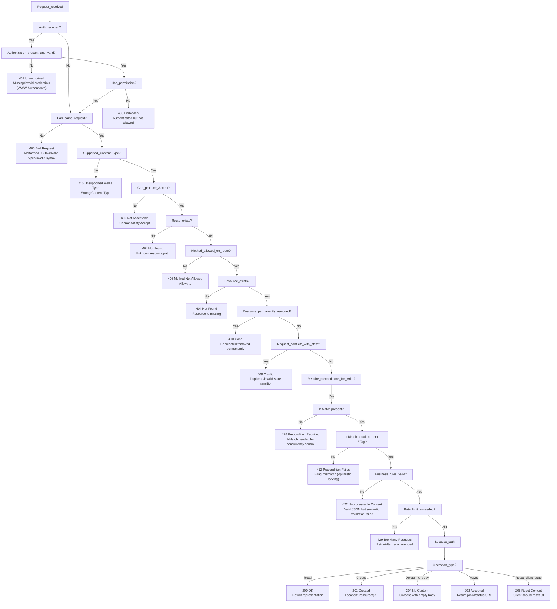
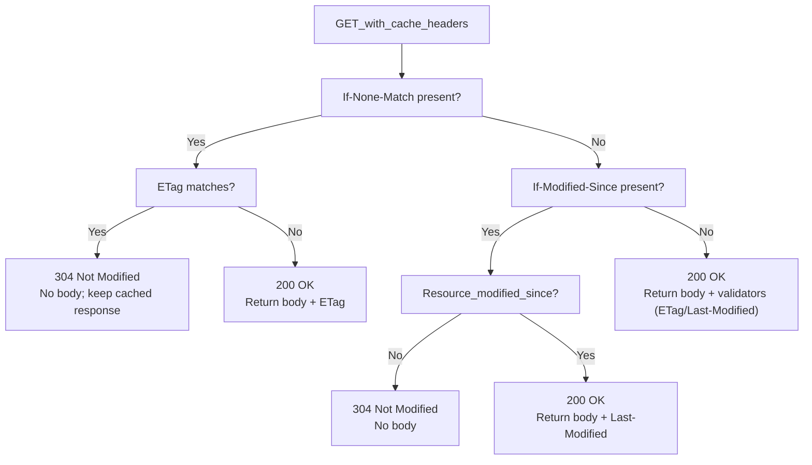
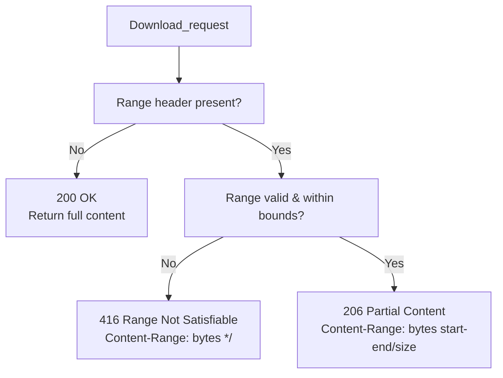
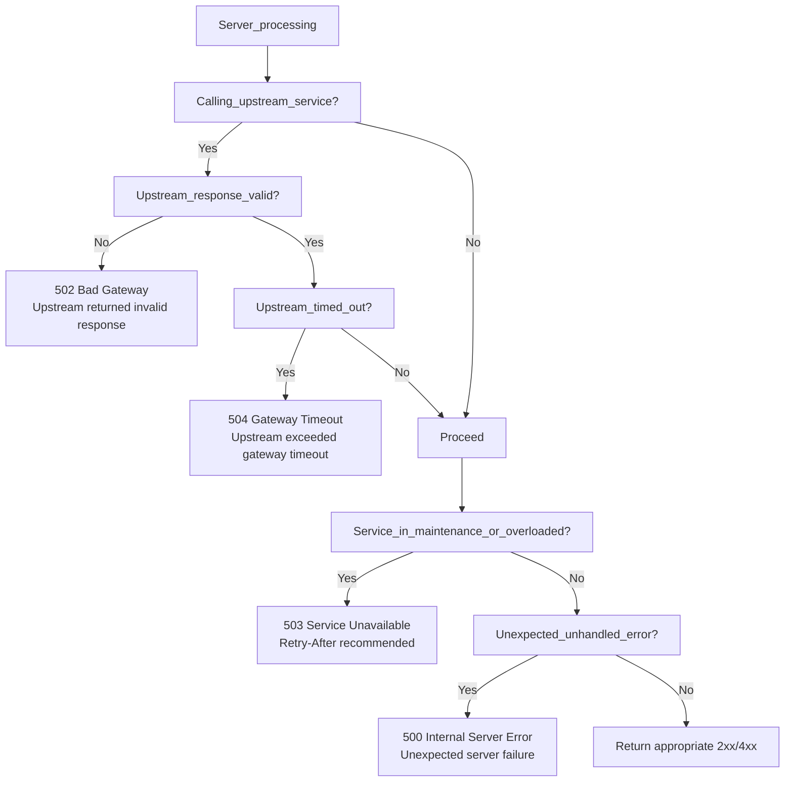
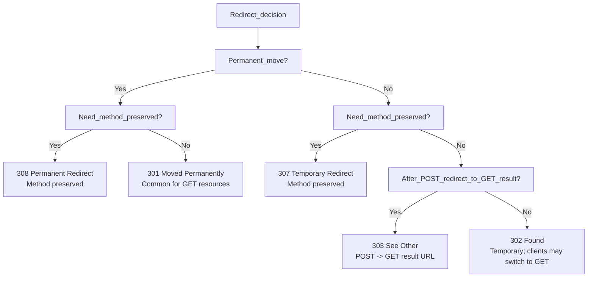

# REST Response Code Journey (Decision Guides)

This doc is meant to help you pick **which HTTP status code to return** during API development.

Reference: [`ResponseCodes.md`](./ResponseCodes.md)

## Journey 1: End-to-end request decision flow (most common REST cases)

## Journey 2: Caching / conditional GET (304 vs 200)

## Journey 3: Downloads / streaming (206 vs 416 vs 200)

## Journey 4: Server-side / gateway failures (5xx selection)

## Journey 5: Redirect choice (301/302/303/307/308)

