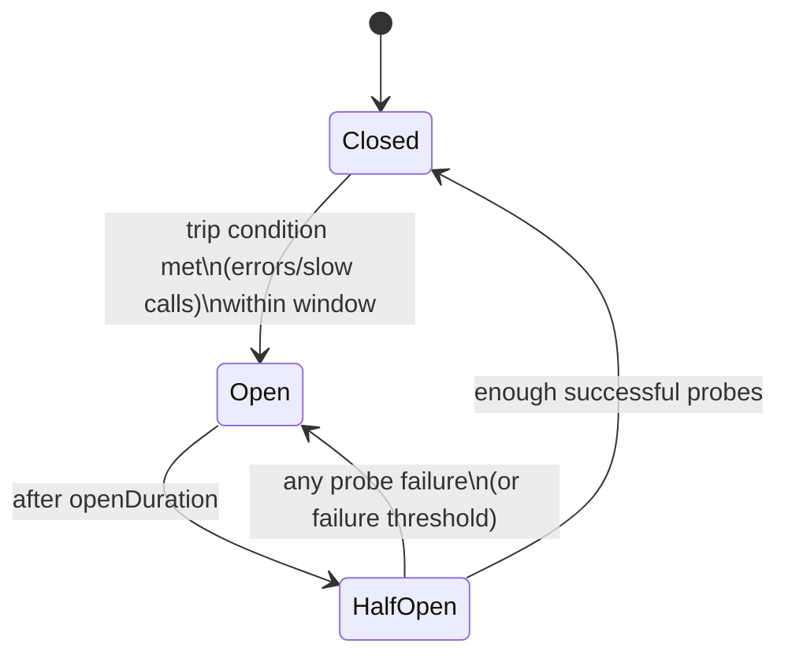
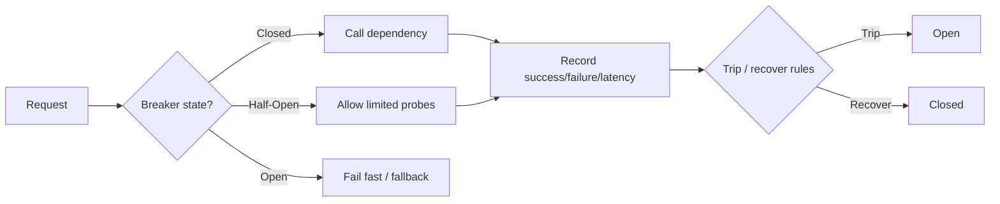
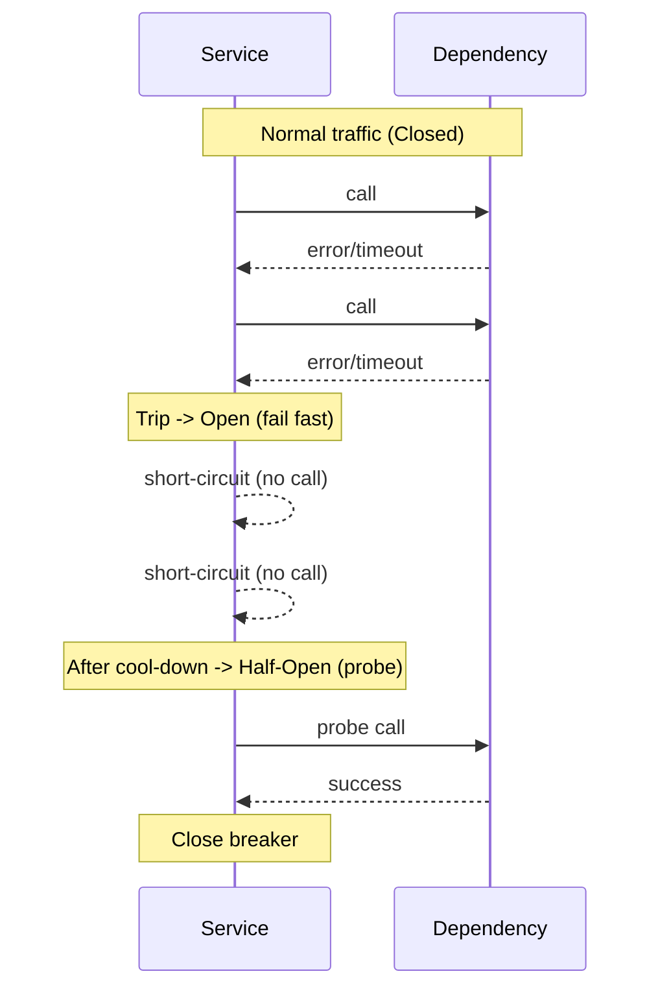

# Circuit Breaker Pattern (System Design)

The **Circuit Breaker** pattern protects a system from repeatedly calling a **failing** or **degraded** dependency (DB, downstream service, third-party API). Instead of letting latency/errors cascade, it **fails fast** for a period of time, then **probes** recovery.

---

## Why it exists

When a dependency is unhealthy, continuing to call it can:
- Exhaust threads/connection pools
- Increase tail latencies (queueing effects)
- Cause retries to amplify load (retry storms)
- Spread failure across otherwise healthy services

Circuit breaker turns “slow failure” into **bounded failure**.

---

## Core model (states)

- **Closed**: calls flow normally; failures are monitored.
- **Open**: calls are short-circuited (fail fast) for a cool-down period.
- **Half-Open**: allow limited probe traffic; if probes succeed, close; if they fail, open again.

State machine:



Request flow (simplified):



Timeline intuition:



---

## What a circuit breaker measures

You choose signals that reflect “dependency is unhealthy”:
- **Errors**: exceptions, HTTP 5xx, certain 4xx (e.g., 429 can be treated specially), socket errors
- **Timeouts**: requests exceeding an SLA
- **Slow calls**: high latency even if successful (often a precursor to full failure)

---

## “All possible strategies” (practical strategy catalog)

Below are the common strategies you’ll see in production libraries (Resilience4j, Polly, Envoy, Istio, Hystrix-era implementations). Mix-and-match based on your dependency and workload.

### 1) Tripping strategies (when to Open)

- **Consecutive failures threshold**
  - Trip when \(N\) failures happen back-to-back.
  - Good for: dependencies that fail “hard” (e.g., connection refused).
  - Risk: noisy on flaky networks; may trip too easily for bursty traffic.

- **Count-based within a window**
  - Trip if failures in last \(W\) calls exceed \(N\).
  - Example: last 20 calls, if >= 10 failed.

- **Error-rate within a rolling time window**
  - Trip if error rate \(>\) \(p\%\) over last \(T\) seconds and at least `minRequests` observed.
  - Example: in last 10s, error rate > 50% with >= 20 requests.

- **Slow-call-rate (latency-based)**
  - Define “slow” as \(latency > L\).
  - Trip if slow call rate \(>\) \(p\%\) over a window.
  - Great for catching saturation before total failure.

- **Hybrid**
  - Trip if either error-rate OR slow-call-rate breaches threshold.

### 2) Windowing strategies (how you compute rates)

- **Rolling (sliding) window**
  - Keep last \(N\) calls or last \(T\) seconds.
  - More responsive; slightly more bookkeeping.

- **Fixed window**
  - Aggregate in buckets (e.g., 10s buckets).
  - Simpler but can cause “edge effects” at bucket boundaries.

### 3) Open-state strategies (how long to stay Open)

- **Fixed cool-down**
  - Stay open for `openDuration` (e.g., 30s), then probe.

- **Exponential backoff**
  - If Half-Open probes fail, reopen with increasing duration:
    - 30s → 60s → 120s … (bounded)
  - Useful when dependency takes time to recover.

- **Jitter**
  - Randomize cool-down slightly to avoid synchronized probe storms across instances.

### 4) Half-Open strategies (probing / recovery)

- **Single probe**
  - After openDuration, allow 1 request; if success, close.
  - Risk: false recovery if dependency is “sometimes” OK.

- **Limited probe concurrency**
  - Allow up to `maxHalfOpenCalls` in flight.
  - Common for high-QPS systems.

- **Success threshold to close**
  - Require \(K\) consecutive successes (or success rate threshold) in Half-Open before closing.

### 5) Exception classification strategies

- **Failure predicates**
  - Count only certain exceptions/status codes as failures.
  - Example: treat 400 as caller bug (don’t trip), count 5xx/timeouts, optionally treat 429 separately.

- **Ignore list**
  - Exceptions you explicitly do not count.

### 6) Fallback strategies (what to do when Open)

- **Fail fast (propagate)**
  - Return an error immediately with a clear message/metric tag.

- **Static fallback**
  - Return cached/stale value, default response, or “degraded mode”.

- **Dynamic fallback**
  - Use another region/provider, read replica, or alternative endpoint.

- **Queue for later**
  - For non-interactive flows, enqueue and retry asynchronously (with backpressure).

### 7) Isolation scope strategies

- **Per-endpoint breaker**
  - Separate breaker for `GET /price` vs `POST /checkout`.
  - Best practice when endpoints have different failure modes.

- **Per-tenant / per-customer**
  - Avoid one bad tenant tripping everyone (but watch cardinality explosions).

- **Shared dependency breaker**
  - One breaker for the whole downstream service.

- **Instance-local vs distributed breaker**
  - Local breaker: simplest, each instance learns independently.
  - Distributed breaker: shared state (e.g., via Redis); can reduce “learning delay” but adds complexity and failure modes.

### 8) Interactions with retry/timeouts

- **Always timebox calls**
  - Circuit breaker is not a substitute for a timeout. Use both.

- **Retry with caution**
  - Retries can inflate load; prefer:
    - small retry budget
    - exponential backoff + jitter
    - retry only on safe/idempotent operations
    - respect `Retry-After` for 429/503

Recommended layering:
- **timeout** (per attempt) + **limited retries** (optional) + **circuit breaker** + **bulkheads** (thread/connection pool isolation).

---

## Example code (Python)

This folder includes a small reference implementation:
- `circuit_breaker.py`: minimal circuit breaker with consecutive-failure tripping and Half-Open probing.
- `example_usage.py`: demonstrates success, trip-to-open, fail-fast behavior, and recovery.

### Run the example

```bash
python3 concepts/system-design/circuit-breaker/example_usage.py
```

---

## Implementation notes (what to customize)

If you adapt the reference code, the knobs you usually tune first:
- **timeout**: keep it low and aligned to your SLO
- **trip threshold**: consecutive failures or error-rate
- **open duration**: initial cool-down; add backoff + jitter for real systems
- **half-open probes**: require multiple successes before closing in flaky environments
- **exception classification**: avoid tripping on caller errors (e.g., validation failures)

---

## Quick checklist (production readiness)

- **Metrics**: breaker state, trips, short-circuits, success/failure/latency distribution
- **Logs**: state transitions with reason (threshold exceeded, probe failed)
- **Dashboards**: correlated with downstream health + saturation
- **Alerting**: sustained Open state, rising short-circuit rate
- **Config**: dynamic knobs (feature flags / runtime config)

