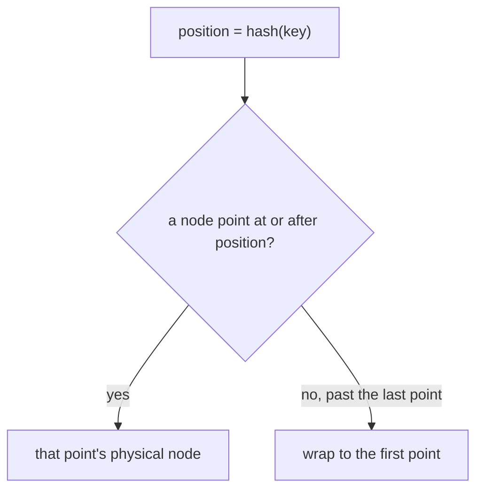

# Consistent Hashing

Consistent hashing places both **nodes** and **keys** on a circle and assigns each key to the next node clockwise. When the set of nodes changes, a key moves only if the arc it sits on changes owner. That is the whole idea.

It shows up wherever clients must pick a shard, cache, or replica without a central lookup on every request: the Dynamo paper, Cassandra and Riak token rings, Ketama (memcached clients), and Envoy's ring-hash load balancer.

---

## The problem modulo hashing creates

The obvious partition is:

```text
owner = nodes[hash(key) % N]
```

`N` is part of the formula. Change `N` and almost every key is divided by a new number.

Going from `N` nodes to `N + 1`, a key keeps the same owner only when `hash(key) % N` and `hash(key) % (N + 1)` land on the same slot. `N` and `N + 1` are coprime, so that happens for `1/(N + 1)` of the keys. The other `N/(N + 1)` move.

| Cluster change | Keys that move under modulo |
| --- | --- |
| 3 → 4 nodes | 3/4 (75%) |
| 9 → 10 nodes | 9/10 (90%) |
| 99 → 100 nodes | 99/100 (99%) |

Adding one cache to a cluster of 100 remaps nearly the entire working set. Those keys miss, stampede the database, and the new node does not even receive most of them — they scatter onto the old nodes under the new modulus.

Consistent hashing changes the expected move on that same join to about `1/(N + 1)`. For 3 → 4, that is ~25%, and those keys all land on the node that joined.

---

## The ring

Treat the hash output as a position on a circle. A 32-bit hash gives positions `0 … 2^32 - 1`. The circle joins the ends: just past the last position is position 0.

Each node is placed by hashing its identity. Each key is placed by hashing the key. The key's owner is the first node at or clockwise from the key. If the key sits past every node, it wraps to the first node on the circle.

Unrolled picture. Nodes A, B, C sit at 2, 7, and 12 on a tiny ring of size 16:

```text
position:  0  1  2  3  4  5  6  7  8  9  10 11 12 13 14 15
                 A              B              C
keys:      k1          k2             k3               k4
           (0)         (4)            (9)              (14)
owner:     A           B              C                A
```

- `k1` at 0 wraps, so A at 2 owns it.
- `k2` at 4 walks forward to B at 7.
- `k3` at 9 walks forward to C at 12.
- `k4` at 14 walks off the end and wraps to A at 2.
- A key that hashes to **exactly** a node's position is owned by that node. The point belongs to the arc that ends there.

The same rule, as a lookup:



---

## What moves when membership changes

**Add D at position 5**, between A (2) and B (7).

D takes the arc `(2, 5]` that used to belong to B. `k2` at 4 moves from B to D. `k1`, `k3`, and `k4` stay. Nothing is reshuffled onto A or C.

**Remove B at position 7.**

B's arc `(2, 7]` merges into the next clockwise node, C. Every key that B owned moves to C. Keys on other arcs stay.

That is the movement bound:

- **Join.** Expected fraction of keys that move is `1/(N + 1)`. They move onto the new node.
- **Leave.** Expected fraction is `1/N` (whatever that node owned). With one point per node they all pile onto a single clockwise neighbor.

"Expected" matters. One random point per node makes arc lengths uneven, so a single join can move much more or much less than `1/(N + 1)`. Virtual nodes pull a given join toward that average.

---

## Virtual nodes

Give each physical node `V` points, at `hash(node + "#" + i)` for `i` in `0 … V-1`. The ring now has `N * V` points, and a physical node's load is the sum of its `V` arcs.

Two effects:

1. **Steady-state balance.** One point per node leaves arc lengths with a long tail: the busiest node often holds several times the average. Summing many small arcs tightens the spread. Ketama uses 160 points per server. Cassandra's common `num_tokens` settings are 16 and 256. More points cost memory on every client that stores the ring, and they cost a slightly deeper binary search.
2. **Removal spread.** With one point, the departing node's keys all hit one successor. With many points, each of its arcs has its own successor, so the load falls across many neighbors.

A bigger machine gets more points, proportional to capacity. That is how Ketama weights servers. The lookup rule does not change; only the number of points does.

Virtual nodes do **not** split a single hot key. `user:42` still hashes to one position and one primary, however large `V` is.

---

## Basic implementation

The data structure is a sorted map from ring position to physical node. The toy in [toy.py](toy.py) uses a sorted list and `bisect`. A balanced tree is the same algorithm with a cheaper insert.

```text
add_node(node):
    for i in 0 .. V-1:
        ring[hash(node + "#" + i)] = node      # keep the map sorted

remove_node(node):
    delete every point whose owner is node     # neighbors absorb the arcs

get_node(key):
    p = hash(key)
    point = ring.successor(p)                  # first position >= p
    if point is missing:                        # p is past the last point
        point = ring.first()                    # wrap
    return point.owner
```

Lookup is `O(log(N * V))`. Memory is `O(N * V)` entries. Inserting one node hashes `V` names and inserts `V` points.

The hash has to be **uniform** and **stable**:

- The same key and the same membership must produce the same owner in every process and after a restart.
- CPython's `hash()` is salted per process (`PYTHONHASHSEED`), so it is the wrong function for a ring. The toy uses the first 4 bytes of MD5, which is a fixed 32-bit position. Production rings more often use MurmurHash or xxHash for speed. Secrecy is irrelevant; agreement and spread are the requirements.
- The virtual-node string (`cache-a#0`, `cache-a#1`, …) is part of the contract. A client that hashes `cache-a-0` instead has built a different ring.

Replicas are a second walk, not a second hash. From the primary, step clockwise and skip further points of a physical node already chosen:

```text
get_replicas(key, R):
    start at get_node(key)
    walk clockwise
    emit a node only the first time it is seen
    stop after R distinct physical nodes
```

That list is the Dynamo preference list. The first entry is the primary. The next entries are the failover and replica targets. A quorum read or write then talks to `R` or `W` of those `N` owners. While membership is changing, two clients can briefly disagree on the list; hinted handoff and read repair exist to clean up the keys that landed on the wrong replica during that window.

Run the toy to see the fractions on 10,000 keys:

```bash
python3 concepts/system-design/consistent-hashing/toy.py
```

What the demo checks:

- Modulo, 3 → 4 nodes, moves about 75% of keys.
- The ring, 3 → 4 nodes, moves about 25%, and every moved key belongs to the node that joined.
- `V = 1` vs `V = 64`: the higher `V` keeps per-node load closer together.
- Removing one node with `V = 1` sends all of its keys to one neighbor. With `V = 64` those keys split across the survivors.
- The preference list for a key starts with `get_node` and contains distinct physical nodes.

---

## What the ring does not do

- **Hot keys.** One key, one position, one primary. A celebrity key melts that node. The usual escapes sit in front of the ring: a cache, collapsing identical in-flight reads, or salting the key (`user:42#0` … `user:42#15`) so the hot key becomes many keys. Salting changes the data model, because a read must now fan out.
- **Multi-key atomicity.** Keys that hash to different arcs live on different nodes. A transaction across them is a different problem.
- **Membership agreement.** The ring only answers "who should own this, given this membership?" Gossip, a coordinator, or a config push has to get that membership to every client. During the push, owners overlap on purpose.

---

## Other ways to get the same movement bound

| Scheme | Lookup | State | Keys that move when one node joins `N` | Constraint |
| --- | --- | --- | --- | --- |
| Modulo `hash % N` | O(1) | the node list | `N/(N+1)` | even balance, almost total remap |
| Consistent hash, `V` points | O(log NV) | the ring | ~`1/(N+1)`, onto the new node | balance improves with `V` |
| Rendezvous (HRW) | O(N) hashes | the node list | ~`1/(N+1)`, onto the new node | very even with no virtual nodes |
| Jump consistent hash | O(log N) | the integer `N` | ~`1/(N+1)`, onto the new last bucket | buckets are `0 … N-1`; you only grow or shrink the end |
| Maglev | O(1) | a lookup table | about `1/N` of table slots | builds a big table; used for L4 load balancing |

**Rendezvous hashing** (highest random weight) scores `hash(key, node)` for every live node and picks the maximum. There is no ring and no virtual-node table. A new node takes a key only when it scores higher than the previous winner, which is `1/(N+1)` of keys. The cost is hashing against every node on every lookup, so it fits small fleets better than tens of thousands of shards. Weights fall out of the score (`-weight / log(hash)` is the usual trick).

**Jump consistent hash** (Lamping and Veach, 2014) also moves about `1/(N+1)` keys, stores nothing, and is extremely well balanced. It only knows how to number buckets `0 … N-1`. Removing an arbitrary middle node means renumbering, which brings the modulo problem back. It fits shard counts that only grow at the end.

**Maglev** (Google, 2016) fills a large lookup table so each connection is O(1) and backends stay evenly loaded. When one backend leaves, about `1/N` of the table entries change. Envoy ships both Maglev and ring hash; the ring is the algorithm in this note, Maglev is the table-driven cousin.

---

## Numbers worth remembering

- Modulo join `N → N+1`: fraction that **stays** is `1/(N+1)`. Fraction that **moves** is `N/(N+1)`.
- Consistent-hash join: fraction that **moves** is about `1/(N+1)`, and the destination is the new node.
- Consistent-hash leave: fraction that moves is about `1/N`.
- One point per node: correct movement, poor balance, removal hits one neighbor.
- Virtual nodes: same movement expectation, tighter balance, removal spreads out. A few hundred points per node is the usual range.
- Lookup: binary search over `N * V` points.
- The hash and the vnode naming scheme must be identical on every client. The ring is a pure function of membership plus that hash.
