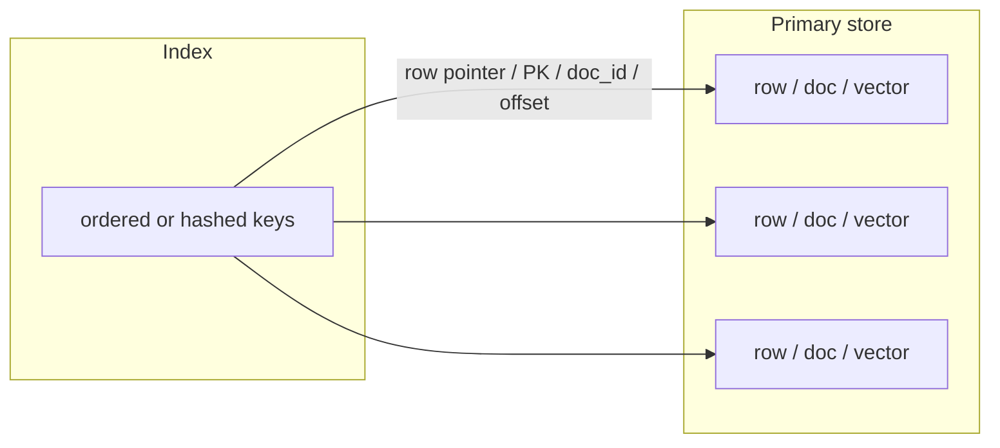
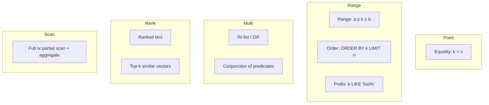
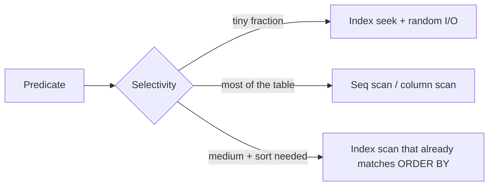
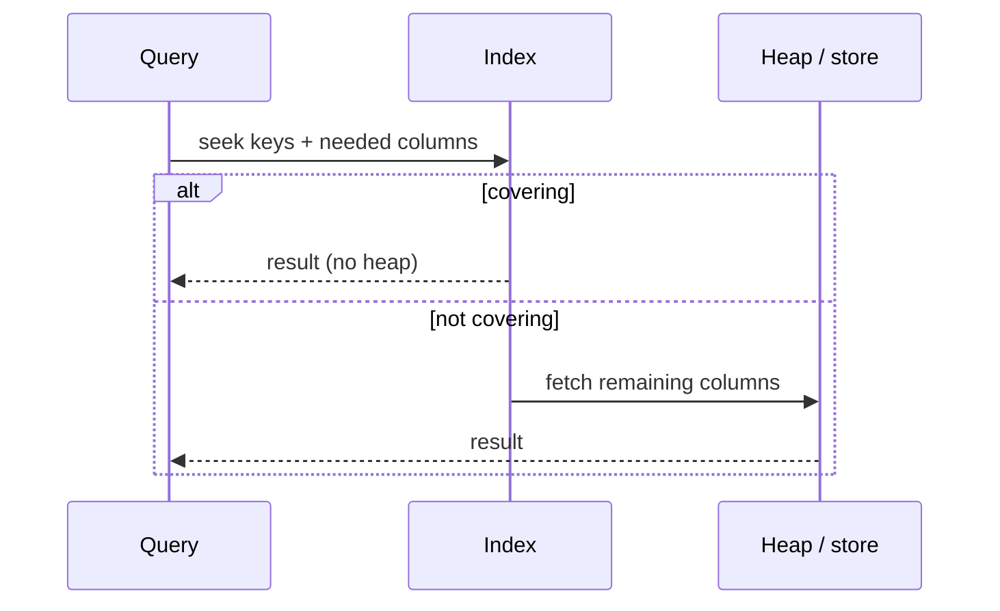
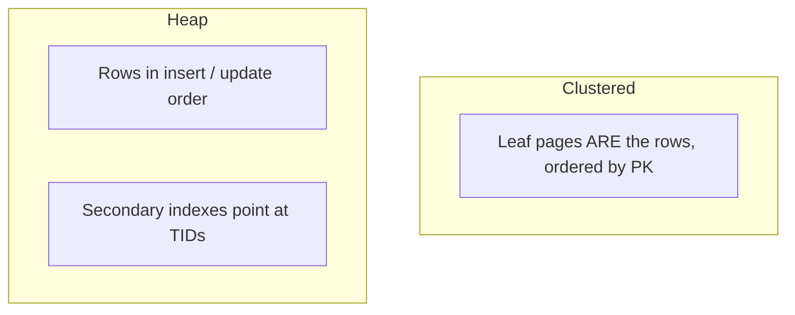
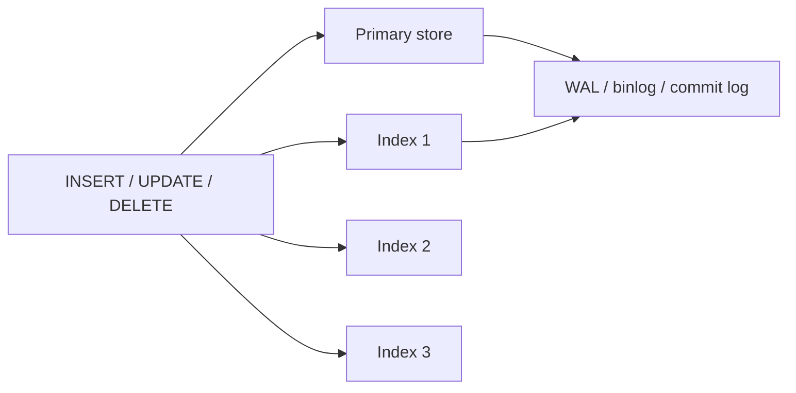
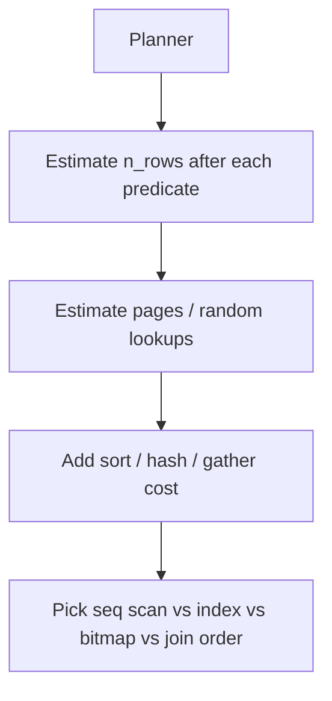

# 01 — Indexing Fundamentals

This note is the shared vocabulary for every later area. Engines differ; the **cost model** does not.

---

## 1. What an index actually is

A table (or collection, or corpus) is stored in some **primary layout** optimized for writes or for the primary access path. An index is a **second layout** of keys that points back to records.



**Row pointer** flavors:

| Pointer | Used by | Implication |
|---------|---------|-------------|
| Heap TID `(page, slot)` | Postgres heap tables | Update that moves the row needs index maintenance or HOT optimizations |
| Clustered PK value | InnoDB, SQL Server clustered, Yugabyte | Secondary index lookup is often **two hops** (index → PK → row) |
| Document `_id` | MongoDB | Same two-hop pattern |
| Posting `doc_id` + positions | Lucene | Index *is* the retrieval structure; store is optional |
| Vector id | FAISS / pgvector / Pinecone | Neighbor search returns ids; payload fetched separately |

---

## 2. Query shapes (map indexes to these)



- **Point** → hash index or B-tree (B-tree also does range).
- **Range / sort / prefix** → ordered tree, skip list, or sparse min/max (BRIN) if data is clustered.
- **Multi-predicate** → composite index, bitmap AND/OR, or filter-after-retrieve.
- **Ranked text** → inverted index + scoring, not a B-tree on a `TEXT` column.
- **NN** → ANN graph/quantization, not a B-tree on embedding floats.
- **Scan/aggregate** → columnar layout + skip indexes; row indexes often lose.

---

## 3. Selectivity and why “index everything” fails

**Selectivity** ≈ fraction of rows matching a predicate.

- High selectivity (`user_id = 42` in a billion-row events table) → index wins.
- Low selectivity (`status = 'active'` at 80%) → sequential scan + filter is often cheaper than millions of random index lookups.



Random I/O vs sequential I/O still matters on SSDs for **CPU, cache, and amplification**, not only disks.

**Cardinality** of a column is the number of distinct values. The planner also needs **correlation** (is `created_at` physically ordered like the index?).

---

## 4. Covering / index-only access

If the index contains **every column the query needs**, the engine can skip the heap.



Patterns:

- Postgres `INCLUDE (col)` — non-key columns in a B-tree leaf.
- InnoDB secondary index always includes the PK (clustered key).
- Lucene stored fields vs doc values vs `_source`.
- Vector indexes often **do not** store the full document; they store ids + optional metadata.

---

## 5. Composite keys and leftmost prefix

A B-tree on `(a, b, c)` is ordered as a single concatenated key.

```text
(a1, b1, c1) < (a1, b1, c2) < (a1, b2, c1) < (a2, ...)
```

| Predicate | Can use `(a,b,c)`? |
|-----------|--------------------|
| `a = ?` | Yes (range on the rest) |
| `a = ? AND b = ?` | Yes |
| `a = ? AND b = ? AND c = ?` | Yes (point) |
| `b = ?` only | No (unless skip-scan / bitmap, engine-specific) |
| `a = ? AND c = ?` | Partial: seek `a`, filter `c` |
| `ORDER BY a, b` | Yes, if equality prefix matches |

**Rule of thumb for OLTP composites:** equality columns first (most selective among equals), then range/sort column last.

---

## 6. Clustered vs non-clustered (physical order)



| Layout | Strength | Weakness |
|--------|----------|----------|
| Clustered on PK (InnoDB) | PK lookups + PK-range scans are sequential | Secondary indexes are wider; PK updates are catastrophic |
| Heap + indexes (Postgres default) | Flexible; HOT updates can avoid index churn | PK range may jump around the heap |
| Index-organized / clustered on a non-PK | Time-series “query by time” becomes sequential | Inserts in the middle split pages |

**Correlation:** BRIN, zone maps, and parquet row-group min/max only work well if physical order matches the indexed dimension (time, id ranges).

---

## 7. Unique, partial, expression, and filtered indexes

| Kind | Idea | Typical use |
|------|------|-------------|
| Unique | Index enforces uniqueness | Email, `(tenant_id, slug)` |
| Partial / filtered | Index only rows matching `WHERE` | `WHERE deleted_at IS NULL` |
| Expression / functional | Index `LOWER(email)`, `CAST(json->>'x')` | Case-insensitive login, JSON fields |
| Hash of payload | Index `md5(body)` | Dedup without huge keys |
| Covering INCLUDE | Extra columns at leaf, not in sort order | Index-only `SELECT id, status` |

Partial indexes are one of the highest-ROI OLTP tricks: small index, high selectivity, cheaper writes for excluded rows.

---

## 8. Write path: every index is a hidden table



Costs:

- **B-tree:** page splits, random writes, fragmentation.
- **LSM:** extra memtable + compaction write amp; indexes are often more SSTables.
- **Inverted / vector:** often **async** indexing; queryable lag is a product decision.
- **Bitmap (OLAP):** cheap for bulk load, painful for single-row updates (hence warehouses rebuild or use delta stores).

**Update-in-place vs delete+insert:** many secondary structures cannot update a key in place; they tombstone the old posting/vector and insert a new one.

---

## 9. Read path cost model (interview-grade)

Think in **I/O + CPU**, not “O(log n)” only.



A B-tree height of 3–4 is almost irrelevant compared to:

- How many **leaf pages** you walk
- How many **heap fetches** (random)
- Whether the result is **already sorted**
- Whether you can **skip the heap** (visibility map / covering)

---

## 10. Maintenance concepts that show up everywhere

| Concept | OLTP B-tree | Search | Vector | LSM |
|---------|-------------|--------|--------|-----|
| Fragmentation / bloat | Page splits, dead tuples | Deleted postings, segment merges | Tombstones, graph repair | Tombstones, compaction |
| Rebuild / reindex | `REINDEX`, online rebuild | Force merge | Rebuild HNSW (expensive) | Compact to one level |
| Statistics | Histograms, MCVs | Term DF, field norms | None / recall metrics | Bloom FPR |
| Concurrent readers | MVCC snapshots | Near-real-time refresh | Often eventual | Snapshot isolation per SST set |

---

## 11. Anti-patterns

1. Indexing low-selectivity columns “because WHERE uses them”.
2. Duplicate indexes (`(a)` and `(a,b)` — the latter can serve `a` equality; keep `(a)` only if it is much smaller and hot).
3. Functions on columns in `WHERE` that **don’t** match an expression index: `WHERE DATE(ts) = ...` kills a `ts` B-tree.
4. Leading wildcards: `LIKE '%foo'` cannot use a B-tree; use trigram / inverted / suffix structures.
5. Wide indexes that copy huge `TEXT`/`JSONB` — you pay it on every write.
6. Treating a vector index like a unique key: ANN is **approximate**; recall is a SLO, not a constraint.
7. Global secondary indexes without a query budget: scatter-gather across all shards.

---

## 12. How later notes specialize this model

- **Relational OLTP** — B+ tree as the workhorse; planner + MVCC details.
- **Document stores** — multikey (array) indexes, wildcard JSON paths.
- **LSM / KV** — the “index” is often the **sorted run** itself plus bloom/sparse indexes.
- **Search** — inverted lists + compression + BM25.
- **RAG** — chunk identity + dense ANN + sparse + metadata filtering.
- **OLAP** — skip/zone/bitmap; indexes for **not reading** data.
- **Graph** — adjacency is the index; property indexes are secondary.
- **Time/space** — partitioning *is* indexing; trees on remaining dimensions.
- **Distributed** — locality of the index vs fan-out of the query.
