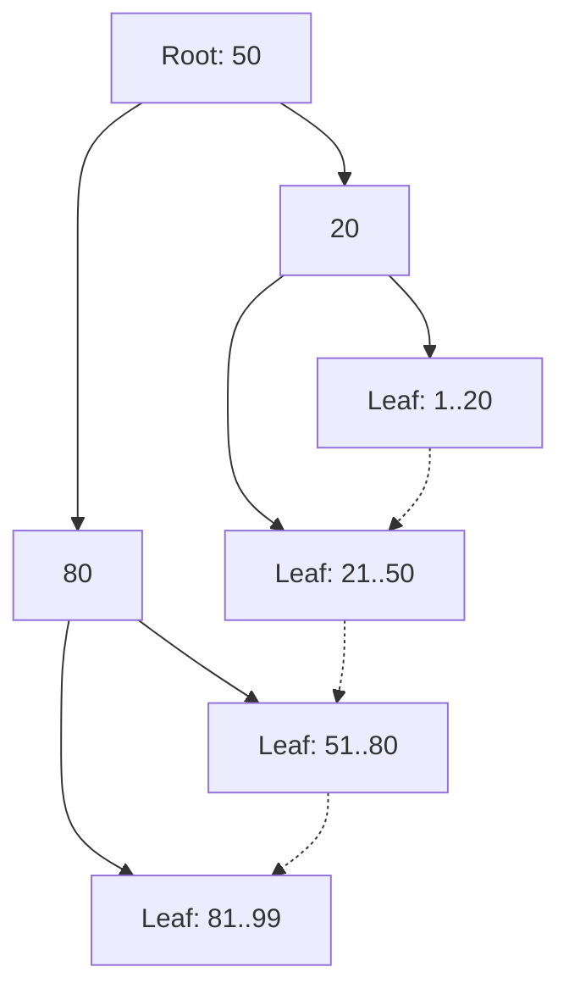
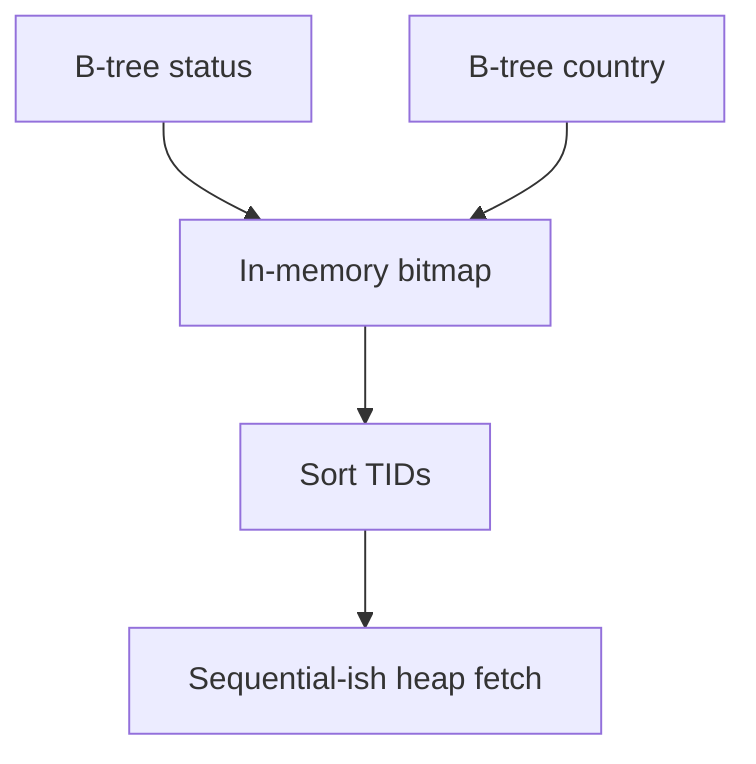
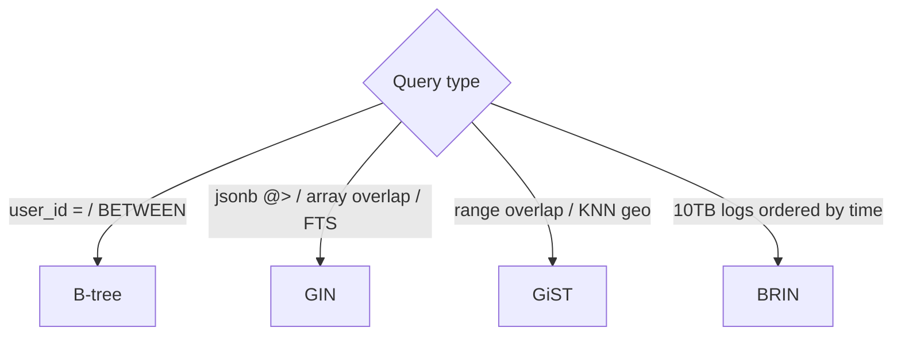
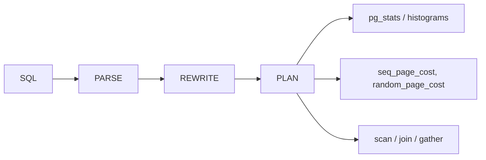
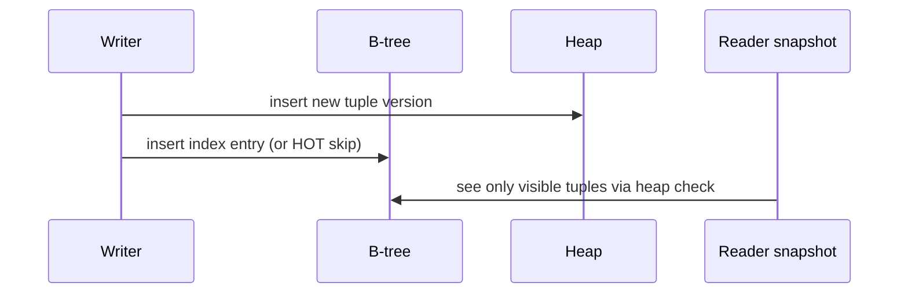
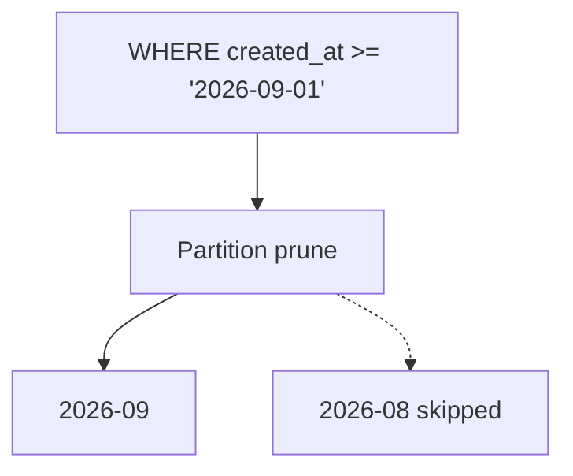

# 02 — Relational OLTP Indexes

Workhorse of Postgres, MySQL/InnoDB, SQL Server, Oracle, Cockroach, Yugabyte. Goal: **point lookups, short ranges, joins, uniqueness**, under concurrent transactions.

---

## 1. B+ tree (the default)

Internal nodes hold **separator keys + child pointers**. All row pointers live in **leaf pages**, which are **doubly linked** for range scans.



**Why B+ not binary trees:** high fanout (hundreds of keys/page) → height 3–4 even at billions of rows; cache-friendly pages.

**Operations:**

| Op | Behavior |
|----|----------|
| Seek | Descend root → leaf |
| Range | Seek start, walk leaf linked list |
| Insert | Find leaf; split if full; may split ancestors |
| Delete | Mark/remove key; may merge or leave underfilled (bloat) |

**Fillfactor:** leave slack on leaves to reduce splits for right-hand growing indexes (`created_at`, serial PKs). Serial PKs insert at the **right edge** (hot page) — great for cache, bad for contention (`btree` leaf lock).

---

## 2. Clustered primary key vs heap (InnoDB vs Postgres)

### InnoDB (clustered)


- Table **is** a B+ tree on the primary key.
- Secondary index stores `(secondary key → PK)`.
- Lookup: secondary seek + PK seek (**index join**).
- Choose a **short, immutable PK**. UUIDv4 as PK randomizes inserts → page splits everywhere. UUIDv7 / ULID / `BIGINT` identity are kinder.

### Postgres (heap + indexes)


- Indexes point at heap tuples.
- **HOT updates:** if the new version fits on the same page and **indexed columns didn’t change**, secondary indexes can keep the old TID (points at a chain). Huge win.
- **Index-only scan:** if all columns are in the index **and** the visibility map says the page is all-visible, skip heap.

### SQL Server

You pick clustered index (often PK) vs heap. Nonclustered indexes use clustering key as row locator, similar to InnoDB.

---

## 3. Hash indexes

Hash maps `key → bucket → rows`. **O(1)** equality, **no ranges**, **no ORDER BY**.


| Engine | Notes |
|--------|--------|
| Postgres `USING HASH` | Equality only; WAL-logged since PG10; still rarely better than B-tree |
| SQL Server hash indexes | Memory-optimized tables |
| InnoDB adaptive hash | Cache on top of B-tree, not a user-defined index |

**Use:** almost never as the first choice in disk OLTP. Use B-tree unless you have a measured equality-only, huge, non-range workload and the engine’s hash is proven faster.

---

## 4. Bitmap indexes (OLTP vs warehouse)

A bitmap index: for each distinct value, a bit vector over row ids.

```text
status=open   1 0 1 1 0 0 1 ...
status=closed 0 1 0 0 1 1 0 ...
```

AND/OR of bitmaps is extremely fast for **low-cardinality** columns and **complex filters**.

- **Oracle:** classic bitmap indexes — dangerous under concurrent row updates (bitmap lock granularity).
- **Postgres:** no persistent bitmap indexes on tables; the executor builds **in-memory bitmap index scans** combining several B-trees, then visits the heap in physical order (great for reducing random I/O).
- **Warehouses:** persistent bitmaps are normal (see [07-columnar-olap.md](./07-columnar-olap.md)).



---

## 5. Index design patterns that matter in production

### 5.1 Composite + covering

```sql
-- OLTP: load a user's recent orders
CREATE INDEX ON orders (user_id, created_at DESC) INCLUDE (status, total);

SELECT status, total
FROM orders
WHERE user_id = $1
ORDER BY created_at DESC
LIMIT 20;
```

Matches **equality + sort + covering**.

### 5.2 Partial

```sql
CREATE INDEX ON jobs (scheduled_at)
WHERE state = 'queued';
```

Tiny index; workers never scan completed jobs.

### 5.3 Expression

```sql
CREATE UNIQUE INDEX ON users (LOWER(email));
```

Queries must use `LOWER(email)` (or a matching generated column).

### 5.4 JSON / JSONB (relational)

- Postgres: GIN on `jsonb` (see specialized access methods below), or expression B-tree on `(data->>'tenant_id')`.
- MySQL: multi-valued indexes on JSON arrays; functional indexes.

### 5.5 Join indexes / foreign keys

FK **does not** automatically index the referencing column in all engines (Postgres does **not**). Index `orders.user_id` if you `JOIN` or `ON DELETE`.

---

## 6. Postgres access methods beyond B-tree (OLTP-relevant)

These are still “relational indexes”; details overlap search/spatial notes.

| Method | Good for | Bad for |
|--------|----------|---------|
| **B-tree** | Scalar equality/range/sort | Full-text, arrays, huge JSON |
| **Hash** | Equality | Range |
| **GIN** | Arrays, `tsvector`, jsonb contains, trigram | Single-row heavy updates (entry posting lists) |
| **GiST** | Ranges, geometry, `tsvector` ranking, exclusion constraints | Equality-only scalars |
| **SP-GiST** | Non-balanced (quadtrees, k-d, radix) | Generic OLTP scalars |
| **BRIN** | Huge append-only time/id correlated tables | Random updates, uncorrelated heap |
| **Bloom** | Lossy multi-column equality (`AND` of several cols) | Range, false positives need heap check |



**GIN vs GiST for FTS:** GIN faster search, slower update; GiST opposite. Most FTS use GIN.

**pg_trgm:** GIN/GiST on trigrams enables `LIKE '%foo%'` and similarity — the OLTP answer to leading-wildcard searches without a search cluster.

---

## 7. MySQL / InnoDB specifics

- **One clustered index** per table.
- Secondary indexes include PK columns implicitly — a 16-byte PK makes every secondary index 16 bytes wider per row.
- **Invisible indexes** (8.0) for rollout.
- **Descending indexes** (8.0) for mixed `ORDER BY a ASC, b DESC`.
- **Fulltext** is a separate inverted index (InnoDB ngram/parser) — not a B-tree.
- **Prefix indexes** `INDEX (varchar_col(20))` save space, can break covering and uniqueness.

**ICP (Index Condition Pushdown):** storage engine checks extra conditions while reading the index, fewer base-row reads.

---

## 8. Planner, statistics, and “the index exists but isn’t used”



Common causes:

- Stale `ANALYZE`.
- Wrong correlation (random heap, planner thinks index-ordered scan is cheap).
- `random_page_cost` too high/low vs SSD.
- Implicit casts (`varchar` vs `text`, `date` vs `timestamptz`).
- `OR` across columns → often bitmap or seq scan unless rewritten as `UNION`.
- `OFFSET` deep pagination: index walk still O(offset). Use **keyset pagination** (`WHERE (created_at, id) < (?, ?)`).

---

## 9. Concurrency, MVCC, and index maintenance



- Readers don’t take long-lived read locks (MVCC).
- Index entries may point at **dead** tuples until `VACUUM` (Postgres) or purge (InnoDB).
- **Bloat:** dead index tuples → more leaf pages → slower range scans. `autovacuum` / `OPTIMIZE TABLE`.
- **Online DDL:** create index concurrently (`CREATE INDEX CONCURRENTLY`, InnoDB online DDL) still has validation passes and pitfalls (failed CONCURRENTLY leaves invalid index).

---

## 10. Partitioning as an index strategy

Declarative partitions (range/list/hash) are a **coarse index**:



Local indexes per partition stay smaller (cache, rebuild). Unique constraints must include the partition key in Postgres.

---

## 11. Distributed SQL (Cockroach, Yugabyte, Spanner)

- Indexes are **range-sharded** by index key, not necessarily by table PK.
- A secondary index is another set of ranges → **distributed writes** (2PC / Raft per range).
- **Interleaved / colocated** tables keep child rows on the same range as parent for joins.
- Storing columns in the index (`STORING` / `INCLUDE`) avoids extra RPCs.

More on scatter-gather: [10-distributed-indexes.md](./10-distributed-indexes.md).

---

## 12. Operational checklist

1. Enable slow-query log / `pg_stat_statements`.
2. `EXPLAIN (ANALYZE, BUFFERS)` — look at heap fetches, not just “Index Scan”.
3. Drop unused indexes (`pg_stat_user_indexes.idx_scan = 0`).
4. Watch write amplification: extra indexes vs p99 write latency.
5. Prefer **fewer, composite, partial** indexes over one index per column.
6. Rebuild only when bloat is proven (`pgstattuple`, fragmentation metrics).

---

## 13. Mental model for interviews

> “I’ll take the query’s equality filters, range, and ORDER BY, design a composite B-tree that matches leftmost prefix, INCLUDE covering columns, keep the PK short if the engine is clustered, and I won’t index low-selectivity flags unless the query is a tiny partial set.”
