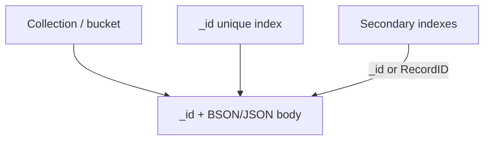
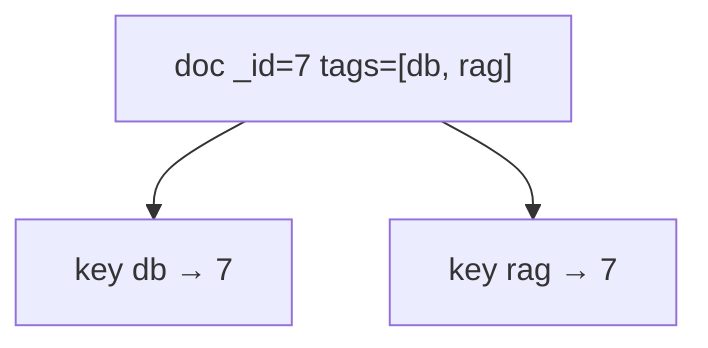
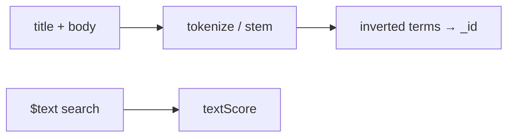
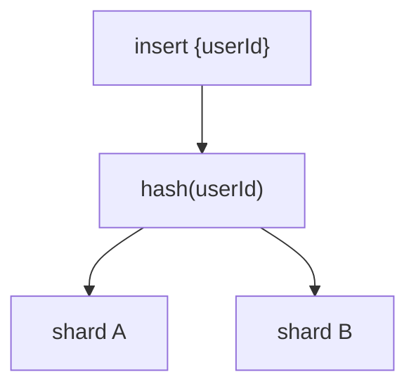
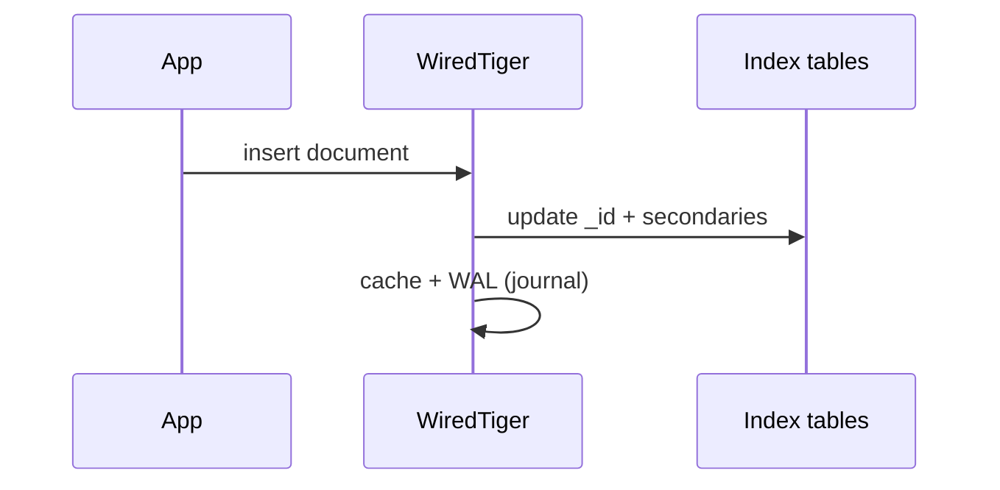
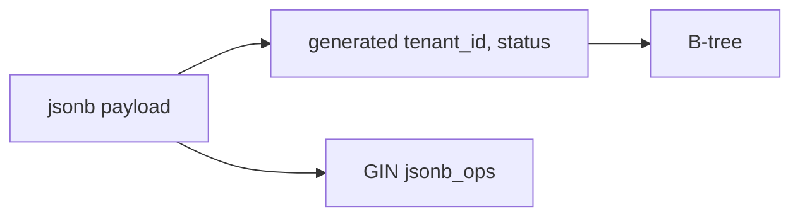

# 03 — Document Store Indexes

MongoDB, Couchbase, DocumentDB, Firestore, Cosmos DB (SQL API), and JSON-in-Postgres. Documents are **hierarchical, sparse, and often arrays**. Indexes must handle **missing fields, nested paths, and multi-value keys**.

---

## 1. Primary layout



- **MongoDB:** `_id` unique primary index. WiredTiger stores documents in a clustered-ish `_id` index (WiredTiger tables) plus secondary WT tables.
- **Firestore:** every document already lives in a hierarchy `(collection path + doc id)`. Most queries require an index because there is **no collection scan product surface** for arbitrary filters (except limited cases).
- **Couchbase:** documents in a KV engine; N1QL / GSI are **separate** index services (often eventual).

---

## 2. Single-field and compound indexes (MongoDB mental model)

Same B-tree rules as SQL, with document paths:

```javascript
{ "userId": 1, "createdAt": -1 }
```


**ESR rule** (MongoDB teaching shorthand): **Equality, Sort, Range** — put equality fields first, then the sort key, then range predicates.

Covered queries: projection only uses indexed fields (+ `_id` unless `_id: 0`). Rare for fat documents; more common for metadata collections.

---

## 3. Multikey indexes (arrays)

If you index `tags: ["db", "rag"]`, the engine inserts **one index key per array element**.



Implications:

- One document can appear **multiple times** in one index (deduped at query time).
- Compound index with **two array fields** is often forbidden or explodes (Cartesian keys).
- Array of objects: index `"items.sku"` for `items: [{sku, qty}, ...]`.
- Writes: updating one tag rewrites those keys; large arrays = heavy indexes.

**Use:** tags, roles, references. **Don’t:** index unbounded arrays (telemetry points inside the document).

---

## 4. Nested documents and wildcard indexes

```javascript
// explicit
{ "profile.city": 1 }

// MongoDB wildcard: index all subpaths
{ "metadata.$**": 1 }
```

Wildcard / dynamic indexes:

| Pros | Cons |
|------|------|
| Schema-on-read, unknown keys | Huge write amp; unexpected huge keys |
| Good for admin/debug filters | Planner statistics per path are weak |
| Firestore automatic indexing of single fields | Composite still needs composite index |

**Firestore:** single-field indexes are auto-created; **composite** indexes must be declared (or the client error tells you the index URL). Collection-group indexes query the same collection name across parents.

---

## 5. Partial, sparse, unique, TTL

| Type | Meaning |
|------|---------|
| Sparse (Mongo) | Skip docs missing the field |
| Partial | Skip docs failing a filter expression (stronger than sparse) |
| Unique | Across documents that have the key (combine with sparse/partial for optional unique email) |
| TTL | Index on a date field; mongod deletes expired docs (index-driven janitor) |

```javascript
{ email: 1 }  // unique + partialFilterExpression: { email: { $type: "string" } }
```

---

## 6. Text indexes (document DB native)

MongoDB `text` index: stemmed terms, per-document, limited language, one text index per collection historically (weights on fields).



This is a **weak cousin** of Lucene (see [05-search-inverted-index.md](./05-search-inverted-index.md)): no great relevance engineering, no first-class aggregations/facets like Elasticsearch.

**When:** light search inside the operational DB. **When not:** product search, log search, RAG lexical retrieval.

Atlas Search / Couchbase FTS: **Lucene beside the documents**, async index, richer queries.

---

## 7. Hashed indexes and shard keys

```javascript
{ userId: "hashed" }
```

- Equality only (like hash indexes).
- Used as **shard key** to scatter writes.
- Range queries on hashed keys **cannot** be targeted → scatter-gather.



Shard key **is** an index strategy: choose high cardinality, avoid monotonic keys unless you want a hot shard (or use hashed).

---

## 8. Geospatial in document DBs

- **2dsphere:** GeoJSON, earth geometry (Mongo).
- **2d:** legacy planar.
- Queries: `$near`, `$geoWithin`.
- Internals: geohash prefixes + B-tree, or S2 (similar to [09-timeseries-spatial.md](./09-timeseries-spatial.md)).

---

## 9. Write and storage engine notes (MongoDB)



- WiredTiger cache holds documents **and** index pages. Too many indexes → cache eviction → write stalls.
- `writeConcern` majority vs index visibility: secondaries apply oplog; indexes built on each node.
- **Build index:** foreground (old) vs rolling replica / cloud rolling. Large builds need disk headroom (2×).

---

## 10. Cosmos DB / DynamoDB-style documents

Some “document” APIs are **partitioned KV + optional secondary indexes**:

- Partition key + sort key = the **only** cheap access path without a GSI.
- GSI is a **projected, eventually consistent** second table (see [10-distributed-indexes.md](./10-distributed-indexes.md)).
- Local secondary indexes: same partition, different sort — strong consistency possible.

Don’t model these as “Mongo with automatic indexes.” **Access patterns first**, then keys/GSIs.

---

## 11. JSON in relational engines (bridge)

| Engine | Pattern |
|--------|---------|
| Postgres `JSONB` + GIN | Containment `@>`, existence, path ops |
| Postgres expression B-tree | Hot extracted fields |
| MySQL JSON + functional/multi-valued | Generated columns indexed |
| SQL Server computed columns | Persist + index |

**Hybrid rule:** extract **hot paths** to real columns + B-tree; leave the blob for rare GIN/containment queries.



---

## 12. Document indexing anti-patterns

1. Unbounded arrays indexed (multikey explosion).
2. Wildcard on the whole document in production write paths.
3. One huge document per user (MB) — index keys still duplicate nested fields; also hits 16MB BSON limit.
4. Relying on collection scans in Mongo (allowed, but they don’t scale).
5. Using `$ne`, `$nin`, `$not` as leading filters — weak index use.
6. Mixing transactional document updates with **search index** freshness without an explicit lag SLO.

---

## 13. Checklist

1. List queries as `(filter, sort, projection, frequency)`.
2. Compound indexes via ESR; avoid redundant prefixes.
3. Cap array sizes or don’t index them.
4. Partial unique for optional identifiers.
5. Offload real search/RAG to Lucene + vectors; keep Mongo indexes operational.
