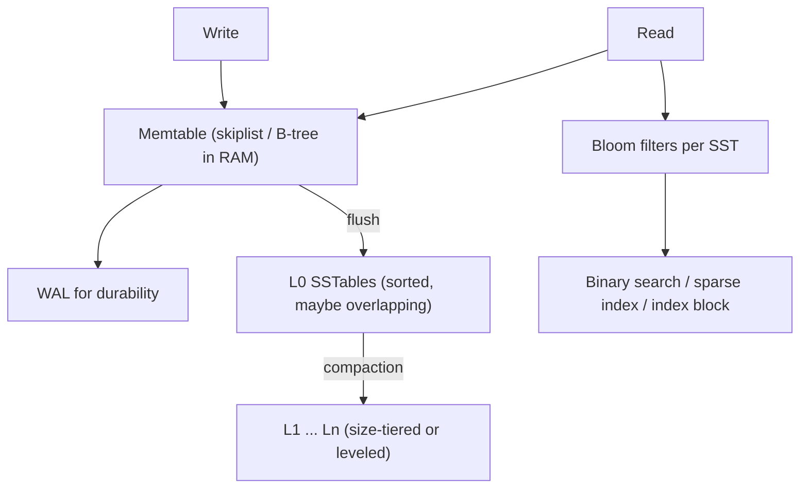
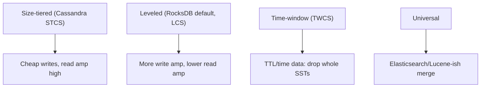
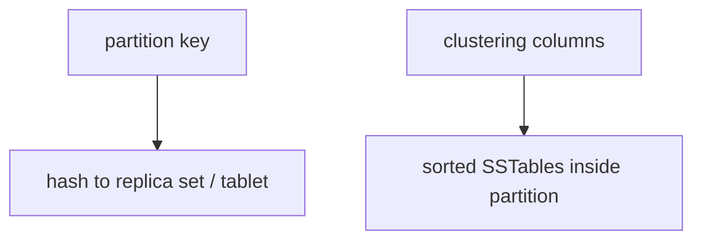
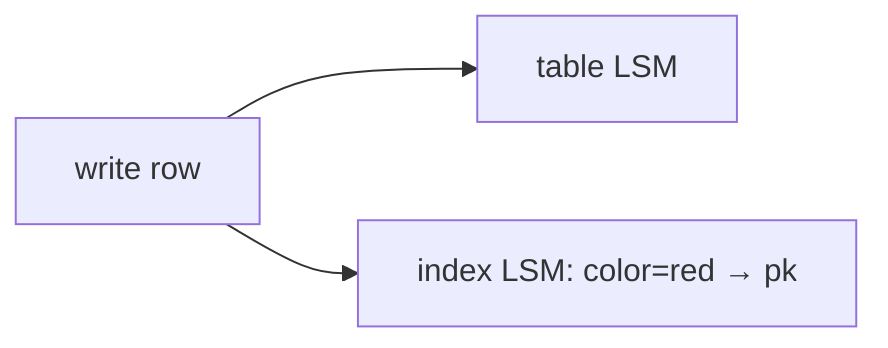
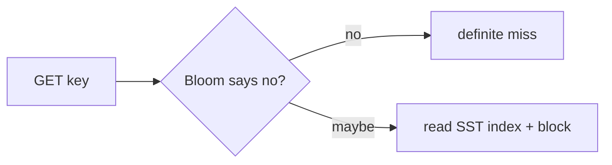
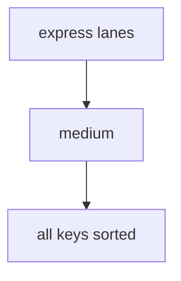
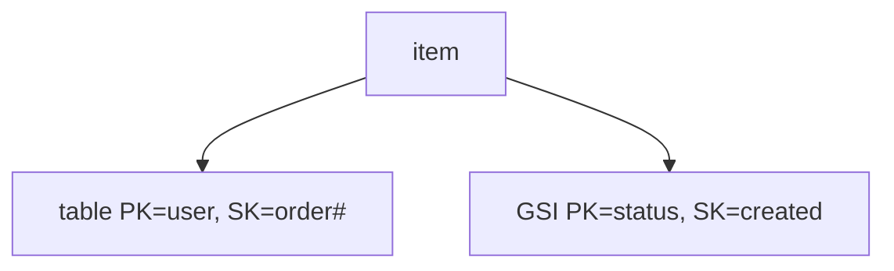

# 04 — LSM, Key-Value, and Wide-Column Indexes

RocksDB, LevelDB, Cassandra, Scylla, HBase, DynamoDB, Cockroach’s Pebble, Lucene’s segments (same family of ideas). The **sorted string table** *is* the index.

---

## 1. LSM-tree in one picture



**Why this exists:** random B-tree writes are expensive on disk. LSM turns writes into **sequential flush + background compaction**.

**Read cost:** a key may live in memtable + many SSTs. Mitigations: bloom filters, compaction that bounds overlap, sparse indexes, block cache, `merge` operators.

---

## 2. Inside an SSTable (the actual “indexes”)

A typical SST:

```text
[ data blocks ][ index block ][ bloom ][ footer ]
```


| Structure | Role |
|-----------|------|
| **Sparse / block index** | Find the data block; not one pointer per key |
| **Bloom filter** | Negative lookups skip the file (high value for `GET` miss) |
| **Prefix compression** | Keys are sorted; share prefixes |
| **Partitioned index** (RocksDB) | Two-level index so huge files don’t load one giant index |
| **Filter block** | Bloom or ribbon filter per SST / per partition |

**Range scans** ignore blooms (false negatives would break scans) or use prefix blooms carefully.

---

## 3. Compaction styles (index health)



Compaction **rebuilds indexes** (blooms, block indexes) as it rewrites files. Tombstones die here.

---

## 4. Primary key design = the only cheap query

In Cassandra / DynamoDB / HBase:

```text
PRIMARY KEY ((partition_key), clustering_col1, clustering_col2)
```



| Query | Cost |
|-------|------|
| Full partition key + clustering range | Single partition, sequential clustering |
| Missing partition key | Full cluster scan (forbidden / expensive) |
| `ALLOW FILTERING` / scan | Operational emergency, not a design |

**Wide rows:** a partition with millions of clustering cells — clustering *is* a local B-tree/skiplist of cells. Hot partitions still melt.

---

## 5. Secondary indexes on LSM (the hard part)

A secondary index is **another LSM** mapping `secondary → primary`.



Problems:

1. **Local vs global** (next section + [10-distributed-indexes.md](./10-distributed-indexes.md)).
2. **Tombstones:** update `color` must delete old index entry.
3. **Too many distinct values vs too few:** cardinality extremes both hurt (hot index partition vs giant posting-like partitions).
4. Cassandra SASI / 2i: historically easy to misuse; many teams use **dedicated tables** (materialized views / manual dual-write) instead.

**Materialized view / projected table:** you choose the new partition key. Same write amp, clearer query model.

```cql
-- query by email: make email the partition key of another table
CREATE TABLE user_by_email (email text PRIMARY KEY, user_id uuid);
```

---

## 6. Bloom filters as an index strategy



Tune **FPR** vs memory. For DBs with huge key cardinality and many SSTs, blooms dominate RAM. Ribbon/blocked blooms are optimizations.

**Not a replacement** for a secondary index: blooms answer “is this PK in this file?”, not “find all red items”.

---

## 7. Skip lists, memtables, and in-memory indexes

Memtables are often **skiplists** (lock-friendly, ordered) or **hash + skiplist**.



Redis is **not** LSM by default: keys live in a hash table; some types have inner skiplists (`ZSET`). RedisSearch / RedisJSON add inverted/vector indexes as modules.

---

## 8. RocksDB / engine-level knobs that *are* indexing

People “add an index” in app DBs by opening another column family:

| Column family | Contents |
|---------------|----------|
| `default` | Primary KV |
| `index_email` | email → pk |
| `index_ts` | inverted or encoded time keys |

RocksDB **prefix extractor + prefix bloom** turns `seek(prefix)` into fewer SST hits — a first-class range-index technique.

**Hash index in block** (RocksDB): data block uses hash of keys for point lookups inside the block.

---

## 9. DynamoDB indexes (KV API, LSM underneath)

| Index | Partitioning | Consistency |
|-------|----------------|-------------|
| Table | You choose PK/SK | Strong or eventual reads |
| **LSI** | Same PK, different SK | Strong possible; 10GB partition limit shared |
| **GSI** | New PK/SK; projected attrs | Eventual; own RCU/WCU; can fail independently |



Sparse GSI: omit the GSI keys on items that shouldn’t appear — **partial index**.

---

## 10. HBase / Bigtable

- Row key **is** the index. Design `reverse_domain + ts` etc.
- Column families separate files (locality groups).
- Coprocessors / Phoenix add secondary indexes as extra tables.

---

## 11. When LSM beats B-tree (and when not)

| LSM wins | B-tree wins |
|----------|-------------|
| High ingest, write-heavy | Update-in-place, small working set |
| SSD sequential write friendliness | Point-read latency with few levels |
| Easy snapshots (immutable files) | Predictable read tail without compaction storms |

**Read-modify-write of secondary indexes** on LSM is where people accidentally rebuild a B-tree’s random I/O plus compaction.

---

## 12. Checklist

1. Design **partition + clustering** (or PK/SK) from queries.
2. Treat secondary indexes as **new tables** with their own hot-key risks.
3. Budget RAM for block cache + blooms + memtables, not just “data size”.
4. Pick compaction for the access pattern (TWCS for time series).
5. Measure read amp (`get` touching N files) and write amp (compaction).
